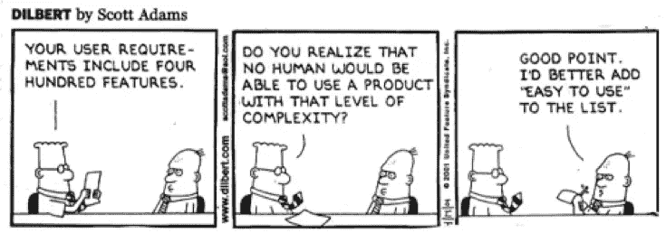
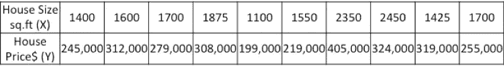
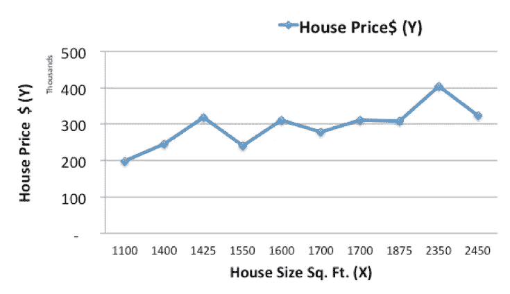
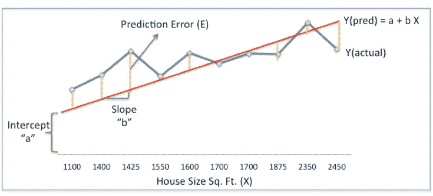
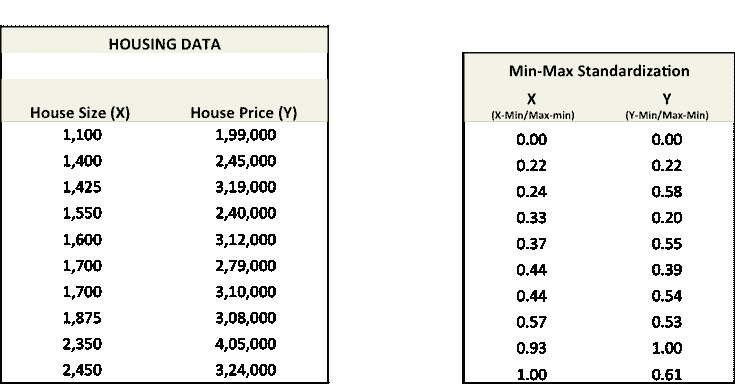
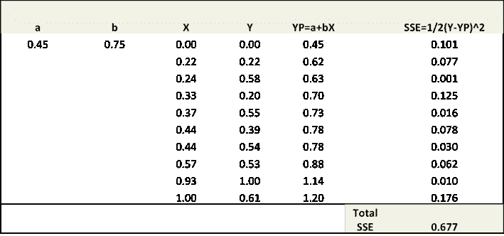
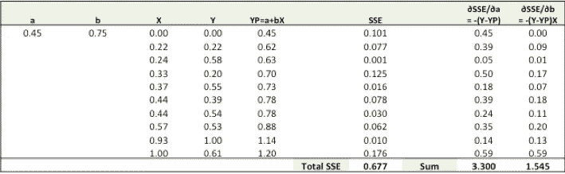
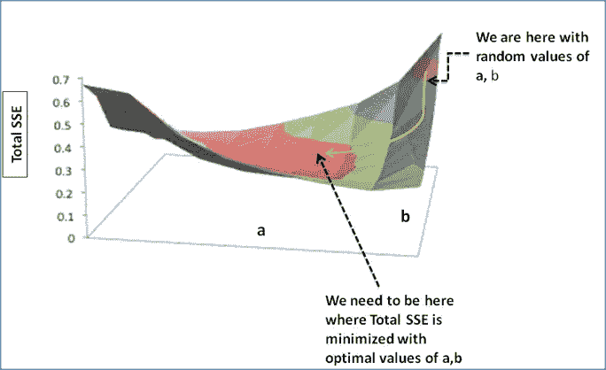
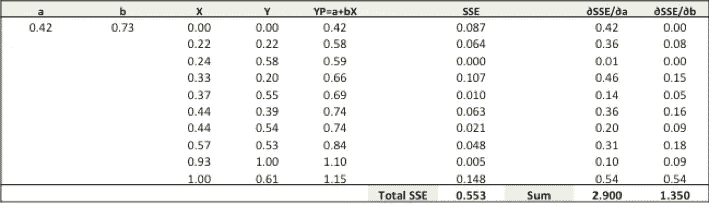

# 保持简单！！—如何简化对梯度下降等算法的理解

> 原文：<https://towardsdatascience.com/keep-it-simple-how-to-simplify-understanding-of-algorithms-like-gradient-descent-19cb418d4276?source=collection_archive---------3----------------------->

Source: dilbert.com

当我第一次开始学习机器学习算法时，获得算法正在做什么的直觉是一项相当艰巨的任务。不仅仅是因为它很难理解所有的数学理论和符号，而且也很无聊。当我转向在线教程寻求答案时，我再次只能看到方程或高级解释，而没有浏览大多数情况下的细节。

就在那时，我的一位数据科学同事向我介绍了在 excel 表格中计算算法的概念。这对我产生了奇迹。任何新的算法，我都试着在 excel 中小规模地学习，相信我，它能奇迹般地增强你的理解，帮助你充分欣赏算法的美。

让我用一个例子来解释以上内容。

大多数数据科学算法都是优化问题，最常用的算法之一是梯度下降算法。

现在，对于初学者来说，梯度下降算法这个名字听起来可能有点吓人，但是，希望在看完这篇文章之后，这种情况会有所改变。

让我们以从住房数据预测新价格的价格为例。

给定**历史住房数据，**任务是创建一个模型，在给定房子大小的情况下预测新房子的价格。

任务——对于一栋新房子，给定它的大小(X ),它的价格(Y)是多少？

让我们从绘制历史住房数据开始:

现在，我们将使用一个简单的线性模型，其中我们在历史数据上拟合一条线，以预测给定其大小(X)的新房子的价格(Ypred)

在上图中，红线给出了给定房屋面积(X)的预测房价(Ypred)。Ypred = a+bX

蓝线给出了历史数据中的实际房价(Yactual)

Yactual 和 Ypred 之间的差异(由黄色虚线给出)是预测误差(E)

因此，我们需要找到一条具有最佳值 a、b(称为权重)的线，通过减少预测误差来最佳拟合历史数据。

因此，我们的目标是找到最优的 **a，b** ，使房价的实际值和预测值之间的误差最小化:

**误差平方和(SSE) = ∑(实际房价-预测房价)**

**= ∑** ( **Y — Ypred)**

(请注意，还有其他测量误差的方法。上交所只是其中之一。)

这就是梯度下降的由来。梯度下降是一种优化算法，它找到减少预测误差的最佳权重(a，b)。

现在让我们一步步来理解**梯度下降算法:**

**步骤 1:用随机值初始化权重(a & b)并计算误差(SSE)**

**步骤 2:计算梯度，即当权重(a & b)从其原始随机初始化值改变一个非常小的值时 SSE 的变化。这有助于我们将 a & b 的值向 SSE 最小化的方向移动。**

**步骤 3:用梯度调整权重，向 SSE 最小的最优值移动**

**步骤 4:使用新的权重进行预测，并计算新的 SSE**

**第 5 步:重复第 2 步和第 3 步，直到对权重的进一步调整没有显著减少误差**

我们现在将详细讨论每个步骤(我已经在 excel 中完成了上面的步骤，粘贴在下面)。但在此之前，我们必须将数据标准化，因为这可以加快优化过程。

**步骤 1:** 拟合直线 Ypred = a + b X，从 a 和 b 的随机值开始，计算预测误差(SSE)

**步骤 2:** 根据权重计算误差梯度

∂SSE/∂a =-(Y-YP)

∂SSE/∂b =-(Y-YP)X

这里，SSE= (Y-YP) = (Y-(a+bX))

这里有一点微积分，但仅此而已！！

∂SSE/∂a 和∂SSE/∂b 是**梯度**，它们给出了 a，b w.r.t 向 SSE 移动的方向。

**步骤 3:** 用梯度调整权重，以达到 SSE 最小的最佳值

我们需要更新 a，b 的随机值，使我们朝着最优 a，b 的方向前进。

更新规则:

①一个-∂SSE/∂a

2)-∂sse/∂b

所以，更新规则:

1.  新的 a = a-r ***∂sse/∂a =**0.45–0.01 * 3.300 = 0.42
2.  新的 b = b-r ***∂sse/∂b****=**0.75–0.01 * 1.545 = 0.73

这里，r 是学习率= 0.01，这是对权重的调整速度。

**步骤 4:** 使用新的 a 和 b 进行预测，并计算新的总 SSE

你可以看到，随着新的预测，总上证指数已经下降(0.677 至 0.553)。这意味着预测的准确性提高了。

**第 5 步:**重复第 3 步和第 4 步，直到对 a、b 的进一步调整不会显著减小误差。这时候，我们已经到达了预测精度最高的最优 a，b。

这是梯度下降算法。这种优化算法及其变体形成了许多机器学习算法的核心，如神经网络甚至深度学习。

喜欢你读的书吗？要以类似的简化方式学习其他算法，请在[www.deeplearningtrack.com](http://www.deeplearningtrack.com)注册为期 8 周的数据科学课程。通过访问 www.deeplearningtrack.com[***注册参加 2017 年 4 月 22 日的免费演示会***](http://www.deeplearningtrack.com)

***Jahnavi*** 是一位机器学习和深度学习的爱好者，在过去的 13 年里，他在美国运通领导了多个机器学习团队。她是 Deeplearningtrack 的联合创始人，这是一个在线讲师指导的数据科学培训平台—[www.deeplearningtrack.com](http://www.deeplearningtrack.com)