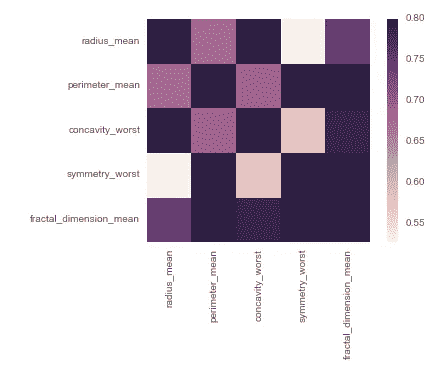

# 保持简单愚蠢:模型选择的教训

> 原文：<https://towardsdatascience.com/keep-it-simple-stupid-lesson-in-model-selection-5fd1193009d?source=collection_archive---------5----------------------->

我在大会上接受了一个项目，在那里我得到了乳房肿瘤的物理数据，并被要求预测肿瘤是恶性还是良性。在这次作业中，我被特别要求比较两种不同的建模技术，并解释为什么我选择了一种而不是另一种。我开始使用的两种技术是逻辑回归和随机森林。在这种情况下，逻辑回归是最终的赢家，因为随机森林最终没有提供任何更多的预测能力，并且向模拟客户端解释推论会更加困难。

**模型创建**

在对数据进行缩放后，我创建了一个热图，它显示了我在逻辑回归的特征选择上几乎没有回旋的余地。几乎所有的东西都是高度相关的，除了几个变量，使用大多数变量会弄乱结果。我最终选择了三个变量(半径平均值、凹度最差和对称性最差)，并添加了一个交互项。结果如下:

***物流培训设置结果***

**准确率:** 96%

**灵敏度:** 94%

**特异性:** 97%

***逻辑测试集结果***

**准确率:** 94%

**灵敏度:** 89%

**特异性:** 97%

我对这些结果非常满意，但是需要根据作业尝试另一个模型。随机森林是我经常使用的算法，我不必担心变量之间的独立性，所以我尝试了一下。训练集的结果稍好，但测试集的结果与逻辑回归的结果相匹配:

***随机森林训练设置结果***

**准确率:** 98%

**灵敏度:** 95%

**特异性:** 99%

***随机森林测试集结果***

**准确率:** 94%

**灵敏度:** 89%

**特异性:** 96%

**型号选择**

在这种情况下，逻辑回归是明显的赢家，因为它在以下方面更简单:

**1。** **逻辑回归是一种更简单的算法**

大多数对数据科学了解有限的人都知道，线性回归就是在数据集上画一条线。那么，解释逻辑回归是相同的事情，除了目标被 0 和 1 限制，结果是记录是您试图预测的目标类的概率，这并不是一个飞跃。

这与随机森林相反，随机森林是一种集合方法。我认为大多数人能够理解单一决策树的概念。但是解释为什么你要创建多棵树来防止过度拟合，以及它们是如何组合的就有点困难了。在这两种算法中，我更愿意向客户解释逻辑回归。

**2。** **逻辑回归提供了更简单的推论**

就像线性回归一样，你可以从逻辑回归中得到系数。我们可以看到，凹度的增加导致肿瘤恶性的可能性更高。

*注意:我知道半径平均值和交互作用项并不显著，但是去掉它们会影响逻辑回归的预测能力。*

这与随机森林不同，在随机森林中，您只能提取重要的特征。你不能说它们是如何与目标相关联的，因为一棵树上的变量分裂可能与另一棵树上的分裂相矛盾。

在如今神经网络和其他复杂算法大行其道的世界里，保持简单愚蠢是需要记住的重要一课。虽然它们可能很强大，但如果用更简单的方法也能达到同样的效果，你可能会得到额外的好处，能够更容易地向客户解释它和它的结果。

如果你想看与这个项目相关的 jupyter 笔记本，请查看我的[作品集页面](https://brendanbailey.github.io/Blog/GABreast_Cancer/GA_Breast_Cancer_Project.html)。