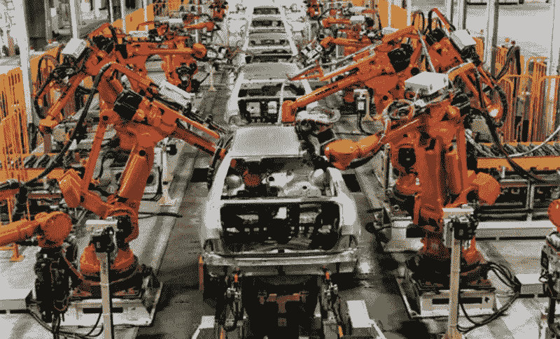

# 保持收益

> 原文：<https://towardsdatascience.com/keeping-the-gains-1249d1a8b1d5?source=collection_archive---------7----------------------->

为了确保您的客户获得您的模型的全部优势，请使用六适马和生产质量保证的常用工具之一来预测问题。

一旦你[让客户相信一个预测模型](/selling-your-data-science-project-7e3e06f91ec6)将解决他们的问题，并且[做出了一个可解释的模型](/dont-get-called-a-charlatan-building-credible-models-4f4709eb760c)让他们相信你已经为他们建立了那个模型，你最不需要的就是糟糕的实施或者环境中不可预见的变化来破坏你的模型的效力。

虽然这个问题在针对数据科学家的文献中可能没有受到足够的关注，但它在其他领域受到了很多关注，特别是制造业，他们已经开发了许多方法来预测和防止不良结果的发生。

困难在于该模型是在有限的数据集上开发的，该数据集具有某些特征。当您实现您的模型并开始使用预测时，您正在做一个隐含的假设，即那些条件继续成立。如果输入开始超出在训练阶段应用的范围，则输出可能是错误的，或者有时根本没有输出(例如，取决于所使用的算法)。请注意，后者可能是更好的情况，因为期望输出的用户会告诉你是否没有输出，但不会意识到输出是否继续但却是错误的。

考虑一个信用风险模型，其中收入是输入变量之一。如果收入普遍提高，或者更糟糕的是，收入的提高不成比例地影响到高收入者或低收入者，那么这个规则就可能被破坏。同样，使用车辆属性作为输入的汽车保险风险模型可能会受到影响，如果发生广泛变化，为了避免这种情况，需要对重要输入及其通常分布有很强的理解，并结合合理的实施后监控水平。为了检测这两种情况中的任何一种，监控传入数据的分布都是必不可少的。

有一种结构化的方法可以解决这个问题，这种方法已经在汽车制造业得到了发展，但是已经扩展到了其他领域，包括软件工程。这被称为 FMEA，代表故障模式和影响分析。FMEA 的目的是识别对良好流程结果的可能威胁，并确定最需要关注的优先级。

在制造环境中，FMEA 可能是为稳态流程(如装配零件)准备的，也可能是为项目准备的。将这一理念应用于生产中的预测模型的概念，该过程将被应用于生产中的预测模型，并且独立于更新现有模型或发布新模型的任务。在每种情况下，都会有特定的风险，尤其是在新模型或更新模型的情况下，不正确的数据流可能会进入评分流，或者可能会应用不正确的数据准备。

FMEA 的过程简单而直观，并且有许多针对制造环境的操作说明。在接下来的内容中，将概述该过程，并提供一些提示，说明如何将其从传统上下文中转换为适合于预测模型的实现和顺利使用的内容。

一群持有不同观点的人集思广益，讨论流程正常运行的可能危害。在预测模型的情况下，这将最小化创建模型的数据分析师和负责实现 ETL 过程的数据工程师或数据仓库人员，该 ETL 过程将数据交付给生产中的模型评分引擎。

小组集体讨论与特定实施或正在进行的过程相关的潜在失败。FMEA 手册通常包括单词列表，作为应用于手边工艺的提示，通常非常面向制造。就输入流是数据的预测模型而言，提示词可能包括“训练范围之外的数据”、“缺失”、“错误类型”(例如，期望整数、获取浮点)、“新记录太多/太少”等。

对于过程的结果方面也有提示词，即“效果”。预测建模特定提示可包括“无预测”、“不可能或无意义的预测”、“预测随机不正确”、“预测向上/向下/偏向特定类别”。

FMEA 进程的下一步是为每一个风险分配一个优先级，这决定了应该采取什么措施来防止负面结果。传统的风险优先级计算考虑了严重性、发生率和检测机会，给每一项打分(满分 10 分)，并将三者相乘得到最终分数，称为风险优先级数(RPN)。这个数字用于指导决定在消除或控制已识别的问题上花费多少努力。

然后，最后一步是针对每种故障模式提出建议采取的措施。根据 RPN 和采取行动的难度或成本，范围可能从完全消除问题到建立预警系统到做出明智的选择不采取行动。

在一些具有相对正式文化的公司——以及维护这种文化的资源——FMEA 的行动被记录在控制计划中。在其他公司，他们可能会被添加到项目的实施过程中。文档的级别需要适合你的组织的文化——但仍然足以确保行动被实际采取。

多年来，FMEA 过程一直是制造业和其他领域质量保证的核心工具之一。它试图预测和减轻实际允许的尽可能多的潜在故障的哲学，显然不仅在数据科学，而且在更广泛的软件工程领域都有广泛的应用。对于一个分析师来说，努力说服客户允许对他们的数据进行分析，与他们一起开发一个合理的模型来解决他们的业务问题，然后由于一个可预见的数据错误或编码事故而在最后一个障碍中失败，当工具存在来阻止这种情况发生时，这将是真正的悲剧。