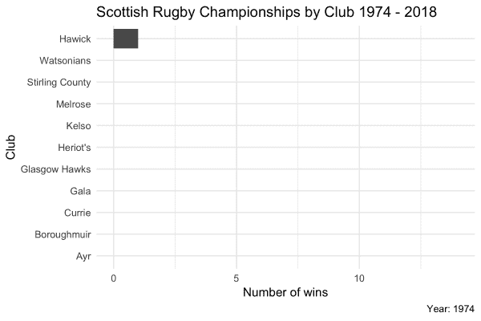

# 保持您的数据科学技能准备就绪并不断提高

> 原文：<https://towardsdatascience.com/keeping-your-data-science-skills-primed-ready-and-growing-dc6977a4f32a?source=collection_archive---------8----------------------->

## 为什么偶尔给自己设置一些随机挑战可以帮助你作为兼职数据科学家的生活——一个使用苏格兰橄榄球冠军和动画条形图的例子…


Photo by [Jordan Sanchez](https://unsplash.com/photos/Vbzx-yy5FoA?utm_source=unsplash&utm_medium=referral&utm_content=creditCopyText) on [Unsplash](https://unsplash.com/search/photos/practice?utm_source=unsplash&utm_medium=referral&utm_content=creditCopyText)

数据科学不像骑自行车。反正对我来说不是。如果我不继续使用它，我就会失去它。我需要在这些小灰色细胞忘记他们花时间学习的重要的 R 函数或语法之前，让它们保持活跃。

我发现这特别困难，因为我研究范围如此之广。我可能会每三到四周建立一个快速的 ML 模型，基本的数据争论，EDA，数据可视化和一些回归一周几次，每两周进行一些无监督的学习，可能每两个月进行一次情感分析或地理绘图项目。我不介意承认我确实忘记了一些事情。

> 想要了解营销与数据科学结合领域的新闻，请关注 Chris 的 [Twitter](https://twitter.com/chrisBowdata)

也有很多天，我根本不花时间使用 R 或做任何可能被称为数据科学的事情。作为一名数字营销人员，我的工作描述涵盖了很多领域，其中大部分不是数据科学。当你每周增加几天休息时间时，掌握一门语言会变得有点棘手。

为了防止人才流失，也为了迫使自己走出舒适区，我时常喜欢给自己设置一个小挑战:让我稍微思考一下如何着手完成 r 中的一些小事。这种技术不时会有用。

## 使用 ggplot2 和 magick 制作动画图

这个周末，我一直在考虑写一篇关于使用 gganimate 包在 R 中制作动画的短文。考虑到我可能想要绘制什么，我开始考虑一个简单的线图，显示随着时间的推移，我的 Heriot 的球队在苏格兰橄榄球联盟中对阵他们的死敌 Watsonians 的比赛中的最终位置。

然而，我越想越觉得这可能太容易了。所有会发生的是，我最终会从一些手动数据挖掘中手动创建一些结束位置的向量，并从其他地方复制和粘贴代码，并修改它以适应我的数据。那有什么好玩的？

因此，挑战变成了动画条形图——按年份，而不是在零和最终值之间插值——显示顶级联赛由赢得它的球队赢得的次数。这是一个稍微不同的挑战，但最终成为了一个很好的实践！

虽然这对于所有的普通用户来说可能看起来过于简单，但是像这样的一两个小时的快速练习对我们这些做兼职编码的人来说是再合适不过了。有趣的是，这个练习最终在代码方面没有挑战性，而是过程。一旦我脑子里有了我想如何完成事情的想法，编码可能只需要 15 分钟左右。我想这一切都要回到 [PPPPPP](https://en.wikipedia.org/wiki/List_of_U.S._government_and_military_acronyms#PPPPPPP)

## 获取数据

第一步是获取数据。这是从维基百科关于苏格兰超级联赛的页面收集来的。虽然我可以手动输入赢家的向量，但这并不是一个真正可扩展的解决方案，也不会强化我以前的 rvest 学习，所以让我们来代替它。非常感谢这里方便的 [SelectorGadget](https://selectorgadget.com/) 的帮助。

```
# scrape Scottish top tier rugby winners from Wikipedia
library(rvest)scot_prem_page <- read_html("[https://en.wikipedia.org/wiki/Scottish_Premiership_(rugby)](https://en.wikipedia.org/wiki/Scottish_Premiership_(rugby))")winners <- scot_prem_page %>%
  html_node(".column-width") %>%
  html_text()
```

这只是给了我们一个恼人的单字符字符串，所以下一步是打破它:

```
# convert single string of text into list of winners
library(stringr)winners_2 <-
  str_split(winners, "\n")winners_3 <- unlist(winners_2)winners_4 <- winners_3[-1]
```

随着获胜团队向量的创建，是时候将它转化为我们需要处理的数据框架了。

## 构建数据框架

我们已经有了赢家的向量，现在我们需要一个年份向量来匹配他们:

```
# create vector of years
year <- 1974:2018
```

现在，我们可以开始用我们的年份、获奖者来构建数据框架，我们将重命名我们的获奖者列，因为它变得有点难看:

```
# build dataframe of winners
winners_df <- data.frame(year, winners_4)# rename winners_4 column as winner
library(dplyr)
winners_df <- rename(winners_df, winner = winners_4)
```

我计划这样做的方式是创建一个数据框架，其中有一列对应于每个赢得冠军的俱乐部，我可以用它来累积获胜总数。首先，我们需要一个冠军俱乐部的载体:

```
# create vector of clubs who have won
winning_clubs <- as.character(unique(winners_df$winner))
```

然后，我们可以使用该向量将列添加到数据帧中。让我们借此机会将它转变为一个新的数据框架，这样，如果我们搞砸了，我们就有机会重新开始:

```
# create new column for each winning club, initialise with 0

winners_df[ ,winning_clubs] <- 0# create new version of dataframe to guard against complete balls up
winners_df2 <- winners_df
```

新创建的列，我想把它转换成一个整齐的格式，这样我就可以利用 tidyverse 的便利功能。为此，我想使用来自`tidyr`的`gather()`函数将我的多个“俱乐部”列转换成一个俱乐部列，展示每年的每个俱乐部:

```
# create long (tidy) version of dataframe
library(tidyr)
winners_df2 <- winners_df2 %>%
  gather(club, win, -year, -winner)
```

构建完成后，当`club`列中的俱乐部与`winner`列中的俱乐部匹配时，我可以使用`mutate`调用在 win 列中添加 1，然后我可以按俱乐部分组，并使用另一个 mutate 调用来构建累积获胜的列:

```
# alter win column to reflect if won that year
winners_df2 <- winners_df2 %>%
  mutate(win = ifelse(club == winner, 1, 0))# create column for cumulutive wins
winners_df2 <-
  winners_df2 %>%
  arrange(year) %>%
  group_by(club) %>%
  mutate(wins = cumsum(win))# change club variable to factor
winners_df2$club <- as.factor(winners_df2$club)
```

## 制作动画

数据帧完成后，是时候构建情节和动画了。非常感谢弗龙肯斯汀[这篇博文](https://fronkonstin.com/2017/03/07/frankenstein/)帮助我制作了这个过程的动画片段。

首先，我使用一年的数据和 ggplot2 创建了一个测试地块，以构建我正在寻找的地块类型。完成后，我准备为数据集中的每一年构建一个图，并将其保存到我的项目文件夹中。如果你不是 for 循环的粉丝，现在把目光移开:

```
# create plot for each year
for (yr in year) {
  filename <- paste0("champion", yr,".jpeg")
  win_plot <-
    winners_df2 %>%
    filter(year == yr) %>%
    ggplot(aes(x = fct_reorder(club, wins), y = wins)) + 
    geom_col() +
    coord_flip() +
    labs(title = "Scottish Rugby Championships by Club 1974 - 2018",
         caption = paste0("Year: ", yr),
         x = "Club",
         y ="Number of wins") +
    ylim(0, 14) + # constrain y limits to prevent scale change over time
    scale_y_continuous(breaks = c(2, 4, 6, 8, 10, 12)) +
    theme_minimal()

  name = paste0("winners_", yr,".jpeg")

  ggsave(filename = name,
         plot = win_plot,
         device = "jpeg",
         width = 6, height = 4, 
         units = "in")
}
```

一个装满情节的文件夹之后，我们可以使用 [magick](https://cran.r-project.org/web/packages/magick/vignettes/intro.html) 包中的`image_animate()`功能将各个图像组合成我们的动画。gif:

```
# create animation   
library(magick)
frames = c()
images = list.files(pattern = "jpeg")

for (i in length(images):1) {
    x = image_read(images[i])
    x = image_scale(x, "300")
    c(x, frames) -> frames
}animation = image_animate(frames, fps = 4)image_write(animation, "championship_winners.gif")
```



## 总结

这是我为这个数据集选择的 dataviz 类型吗？大概不会。我是说，这取决于观众。对于一个注意力跨度有限的社交媒体设置来说，它可能会工作，但标准的条形图会更清楚地显示最终的获胜数字，GitHub commits 风格的热图结合行尾总数可能会更容易看到最终的数字以及何时赢得冠军，但这不是重点。

这个练习的目的是给自己设定一个日常工作中不会出现的挑战，并尝试解决它。而且，虽然还有一些调整我可能会做(颜色编码酒吧的俱乐部颜色也许？)，我觉得一个慵懒的星期天也不算太差。嘿，反正电视上也没什么…

本文使用的代码可以在这里的 GitHub 上找到[。](https://github.com/chrisBow/scottish-rugby-premiership-winners/blob/master/prem_winners.R)