# kegra:基于 Keras 的知识图深度学习

> 原文：<https://towardsdatascience.com/kegra-deep-learning-on-knowledge-graphs-with-keras-98e340488b93?source=collection_archive---------1----------------------->


你好。我在[过去的文章](/machine-learning-use-small-words-5cc8f34a5964)中提到过，我正在紧张地研究企业数据集的认知计算。这是那个。

这篇文章需要对深度学习有所了解，但是你应该能够理解数据科学的最基本知识。

我一直致力于用 GPU 上的深度学习来检测图形中的模式。托马斯·基普夫[写了一个不错的库](https://github.com/tkipf/keras-gcn?files=1)，用 Keras 对图节点进行分类。本文基于他的工作“[图卷积网络半监督分类](https://arxiv.org/abs/1609.02907)”。让我们看一看。

首先，什么是图？

嗯，我在工作中关注知识图表。这些图将“白宫”和“唐纳德·特朗普”这样的实体表示为节点，而“工作地点”这样的关系表示为边。我们如何建立这些图表是另一个时代的故事。在这篇文章中，我正在研究交易数据，以训练一个识别欺诈交易的分类器。如果你更喜欢顶点和弧而不是节点和边，那么[阅读这篇文章](https://math.stackexchange.com/questions/31207/graph-terminology-vertex-node-edge-arc)。

在图形的怪异世界里，我感觉就像在家里一样。我对图形的研究可以追溯到我的硕士论文。在那项工作中，我对在有向无环图中寻找公共元素(凸子图)感兴趣。我正在根据处理器运行的软件来确定向处理器添加什么样的定制指令。我用整数线性规划来解决这个问题。对于大型图形，求解程序可能需要几个小时甚至几天。

该研究领域的链接:

*   [嵌入式人工神经网络软硬件协同设计案例研究](https://link.springer.com/chapter/10.1007/978-3-642-28305-5_18?lipi=urn%3Ali%3Apage%3Ad_flagship3_profile_view_base%3BHLJC%2BSj0TH%2BaHNjsoTOlrw%3D%3D)
*   [可调指令集扩展标识](https://ruor.uottawa.ca/handle/10393/20716?lipi=urn%3Ali%3Apage%3Ad_flagship3_profile_view_base%3BHLJC%2BSj0TH%2BaHNjsoTOlrw%3D%3D)
*   [人工神经网络专用集成电路](http://ieeexplore.ieee.org/document/5873060/?arnumber=5873060&lipi=urn:li:page:d_flagship3_profile_view_base;HLJC%2BSj0TH%2BaHNjsoTOlrw%3D%3D)
*   [使用自定义指令在 FPGA 上加速人工神经网络](http://ieeexplore.ieee.org/document/6030491/?arnumber=6030491&searchWithin=%22Authors%22:.QT.Daniel%20Shapiro.QT.&newsearch=true&lipi=urn:li:page:d_flagship3_profile_view_base;HLJC%2BSj0TH%2BaHNjsoTOlrw%3D%3D)
*   [在硬件限制下改进 ISE 识别](https://ruor.uottawa.ca/handle/10393/19799)
*   [并行指令集扩展标识](http://ieeexplore.ieee.org/document/5662163/?arnumber=5662163&lipi=urn:li:page:d_flagship3_profile_view_base;HLJC%2BSj0TH%2BaHNjsoTOlrw%3D%3D)
*   [可配置多处理器的静态任务调度](https://ruor.uottawa.ca/handle/10393/12896?lipi=urn%3Ali%3Apage%3Ad_flagship3_profile_view_base%3BHLJC%2BSj0TH%2BaHNjsoTOlrw%3D%3D)
*   [多处理器片上系统软硬件协同设计工具链指令集扩展识别的设计与实现](https://search.proquest.com/docview/305138347?lipi=urn%3Ali%3Apage%3Ad_flagship3_profile_view_base%3BHLJC%2BSj0TH%2BaHNjsoTOlrw%3D%3D)
*   [SING:多处理器片上系统设计和系统生成工具](https://ruor.uottawa.ca/handle/10393/12898)

下面是 OrientDB 中知识图本体的一个例子:

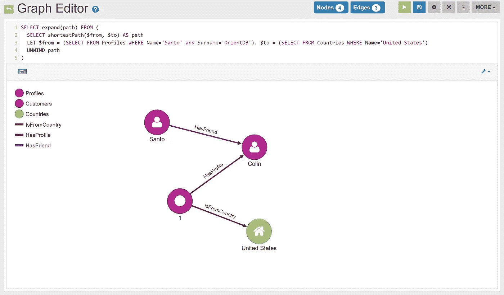

Source: [OrientDB demo page](https://orientdb.com/docs/3.0.x/gettingstarted/demodb/queries/DemoDB-Queries-Shortest-Paths.html)

**第二，什么是我们能察觉到的模式？**

我们想要标记节点。图中的每个实体都有一些我们想要分类的特征，我们只有一些节点的标签。我们可以预测简单的[布尔](https://english.stackexchange.com/questions/4481/should-the-word-boolean-be-capitalized)标签，如“人”或“不是人”，以及更有趣的标签，如将节点分类到几个类别中的一个。然后，我们可以进行更复杂的回归，比如根据我们从图表中获得的实体数据来预测实体带来的风险。这包括节点到其他节点的连接。为了简单起见，让我们继续讨论本文中的布尔节点标记/分类问题。我们希望将大约 4000 个银行账户的 594643 笔交易标记为可疑或不可疑。我们希望在不到一分钟的时间内完成。不是几小时或几天。

**第三，如何定义一个 kegra 看得懂的图？**

我们需要指定两个文件。第一个包含节点描述的节点 id，第二个描述节点如何连接。在 kegra 提供的 cora 示例中，有 2708 个节点的描述和标签，5429 条边(节点对)定义了节点之间的连接。

以下是每个文件的几行视图:

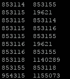

Links between nodes

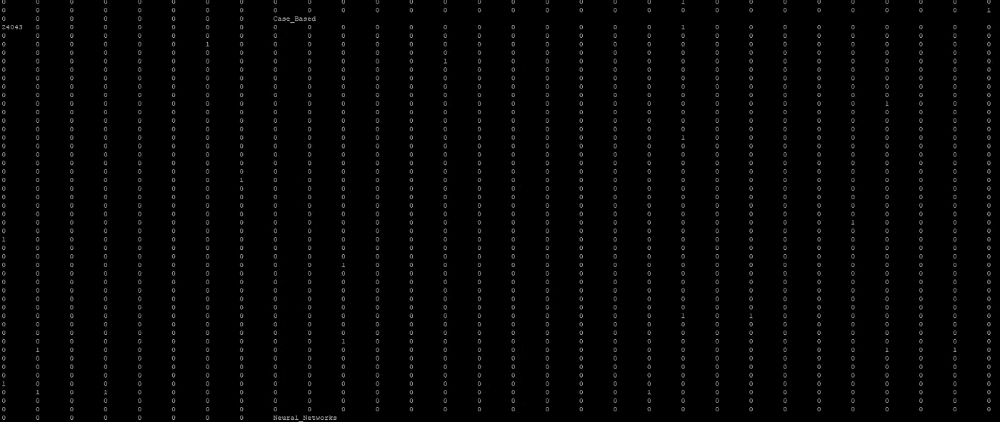

Each node ID is followed by features (mostly 0s) and finally there is a node label (e.g. Neural_Networks, Case_Based). The features are mostly 0s and wrap around for many lines in the screenshot above. Each feature represents the use in the document (node) of a certain word. More info in the [kegra README here](https://github.com/tkipf/keras-gcn/blob/master/kegra/data/cora/README).

让我们试一试吧

首先，您需要 Keras 2，所以这样做:

```
pip install keras --upgrade
```

假设你安装了 Keras 和 TensorFlow，keras-gcn 依赖于 gcn，那我们就 git 克隆，一个一个安装。

```
#install gcn
git clone [https://github.com/tkipf/gcn.git](https://github.com/tkipf/gcn.git)
cd gcn/
python setup.py install
cd ..#install keras-gcn
git clone [https://github.com/tkipf/keras-gcn.git](https://github.com/tkipf/keras-gcn.git)
cd keras-gcn/
python setup.py install
```

首先让我们在一个现成的例子[上运行代码，这个例子提供了名为 cora](https://github.com/tkipf/keras-gcn/tree/master/kegra/data/cora) 的 kegra。我们在输出中看到，cora 从原始数据中检测并打印出了预期的节点和边的数量。

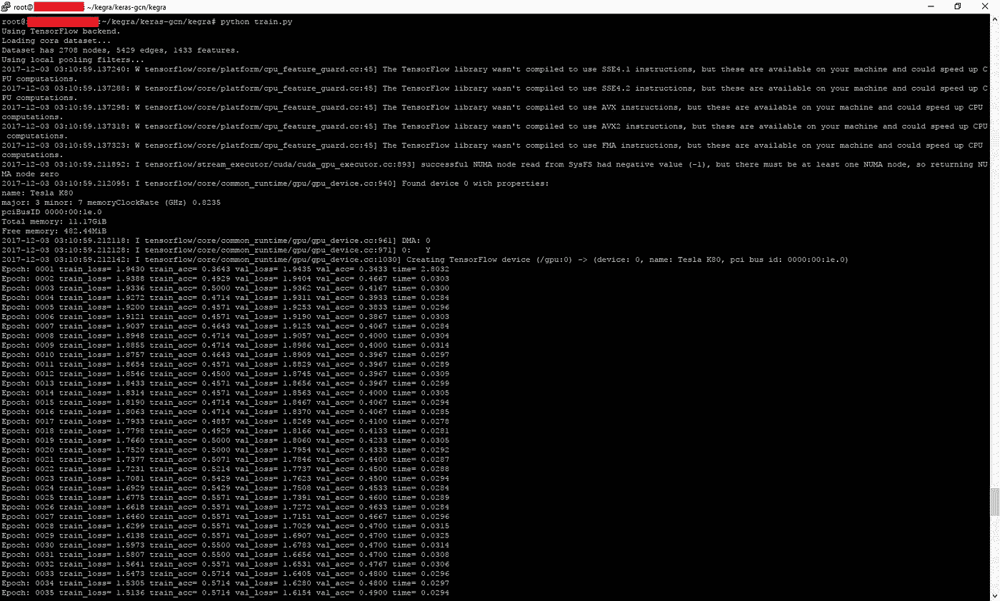

Training run on the cora dataset: 36% accuracy and rising.

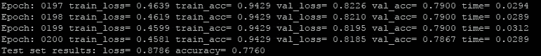

Testing result on the cora dataset: 77.6% accuracy.

我们现在对 kegra 理解输入文件的方式做了一点小小的改变，只是为了让名字更好听。在 github 上的当前版本中，输入文件是“*”。引用"来描述节点之间的弧，并引用" *。内容”来描述节点。相反，我把 kegra 改成了“*”。链接"和" *。节点”文件。您的数据文件夹现在应该是这样的:

```
~/kegra/keras-gcn/kegra$ ls -l data/cora/
total 7720
-rwxrwxr-x 1 ubuntu ubuntu 69928 Dec 3 02:52 **cora.link (was cora.cites)**
-rwxrwxr-x 1 ubuntu ubuntu 7823427 Dec 3 02:52 **cora.node (was cora.content)**
-rwxrwxr-x 1 ubuntu ubuntu 1560 Dec 3 02:52 README
~/kegra/keras-gcn/kegra$ ls -l data/**customerTx**/
total 7720
-rwxrwxr-x 1 ubuntu ubuntu 7823427 Dec 3 05:20 **customerTx.node**
-rwxrwxr-x 1 ubuntu ubuntu 1560 Dec 3 05:20 README
-rwxrwxr-x 1 ubuntu ubuntu 69928 Dec 3 05:20 **customerTx.link**
```

现在让我们用交易数据填充 **customerTx.node** 和 **customerTx.link** 。第一个文件是银行客户及其特征的列表。格式是:

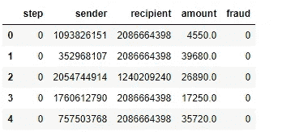

Quick view of some transaction records. In this scenario, there is a sender and recipient of money, and a record of the amount sent (amount column), and the label applied by a human analyst that reviewed the transaction (fraud column). We can ignore the first two columns (the index and step columns).

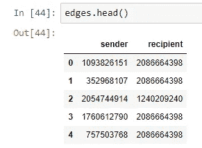

The edges file (**customerTx.link**) records who the two parties are in each transaction.

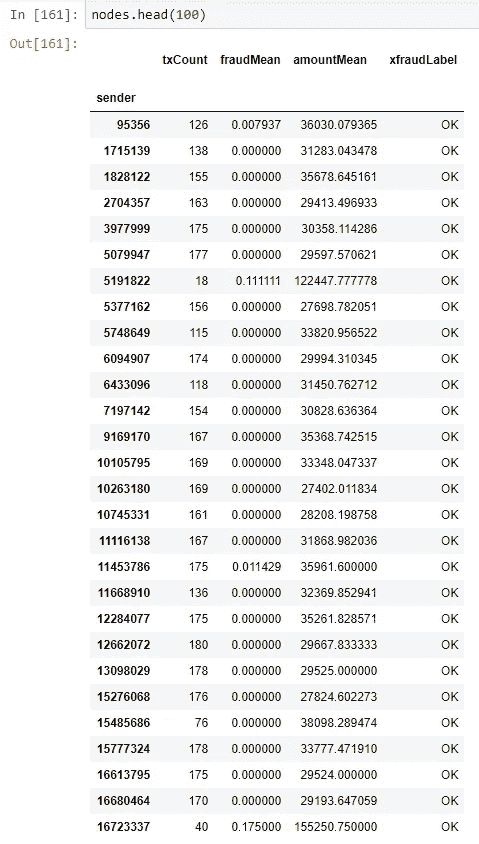

The nodes file (**customerTx.node**) records information on each node in the graph as a sender of funds on each transaction. The **txCount** column lists the number of transactions (edges) leaving the node. The **amountMean** column specifies the mean transaction size. The **fraudMean** column is the mean of flagged transactions on the sender account during the period this data covers. Note that the vast majority of transactions are OK and not FRAUD, which is a [dataset imbalance](https://machinelearningmastery.com/tactics-to-combat-imbalanced-classes-in-your-machine-learning-dataset/).

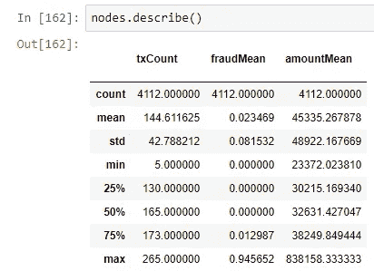

There are 4112 nodes in the graph. On average 2.3% have been flagged as problematic by an analyst.

我们现在可以使用 kegra 以不同的分析师准确度来分析图表。

如果一个完美的分析师对系统进行数据训练，它应该能够完美地学习如何分析图表。然而，如果人类分析师有 20%的时间是错误的，那么 kegra 模型的预测能力同样应该被限制在 80%。为了验证这一点，我在图表标签中添加了不同数量的随机噪声，以观察随着训练数据的质量越来越差，kegra 会如何表现。

以下是表格和图表形式的结果:

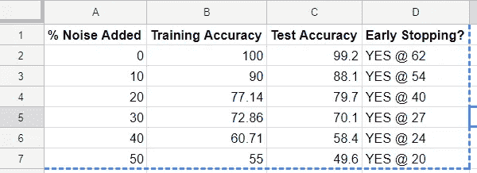

Raw results for the transaction labeling experiments, using deep learning on knowledge graphs

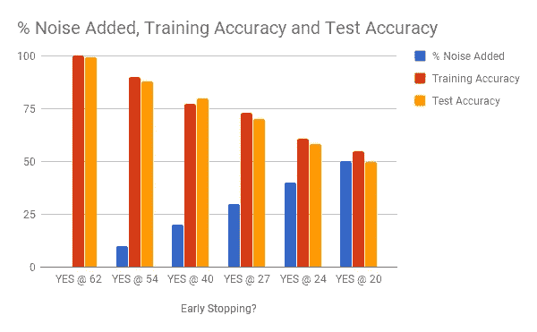

This is the same data as the table above, but in an easier to understand graphic

这里有很多东西需要消化。首先，我们看到，随着数据(蓝色)中的噪声增加，早期停止(x 轴上的标签)在训练中越来越早地出现。这告诉我们，特征的数量如此之少(几列)会导致训练数据的过度拟合。第二，我们看到测试精度普遍低于训练精度。这是意料之中的，因为分类器熟悉训练数据，而测试数据不熟悉。第三，测试精度不为零。很好！这意味着分类器可以仅使用图和每个节点的特征(txCount、amountMean 和 fraudMean)来重新生成 OK/FRAUD 标签。第四，分类器(橙色)的精度随着注入噪声(蓝色)的增加而下降。这意味着结果不是随机的。第五，我们看到，训练精度(红色)加上添加的噪声(蓝色)加起来约为 100%，这意味着分类器与标记数据集的分析师一样好/差，但不会差太多。

综上所述，kegra 在知识图分类上表现非常好。与他们论文中的结果相比，这些结果可能太好了。我将检查交易文件中的欺诈标签列是否太具解释性，并使用更难从更广泛的数据集中预测的功能来替换它，如原产国、城市、邮政编码和更多列。

我的下一个动作是从包含更多列的源文件中重新生成事务数据集，看看 kegra 的性能是否仍然如此之好。在 cora 数据集上没有提前停止，因此我怀疑交易数据对 kegra 来说没有挑战性，原因之一我在上面提到过。也许如果我在生成的图中嵌入更多的语义特征…接下来我可以做很多有趣的事情。

特别感谢[托马斯·基普夫](https://github.com/tkipf)在发表前审阅了这篇文章。与我通常的高水平文章相比，这是一篇准备(和阅读)非常复杂的文章。如果你喜欢这篇关于图形深度学习的文章，那么请让我知道写更多像这样的[研究](https://en.wiktionary.org/wiki/researchy)内容。我也很高兴在评论中听到你的反馈。你怎么想呢?

试用**拍手工具**。轻点那个。跟着我们走。分享这篇文章的链接。去吧。

编码快乐！

——丹尼尔
[丹尼尔@lemay.ai](mailto:daniel@lemay.ai) ←这个其实*管用*。打个招呼。

LEMAY . AI
1(855)LEMAY-AI

您可能喜欢的其他文章:

*   [人工智能和不良数据](/artificial-intelligence-and-bad-data-fbf2564c541a)
*   [人工智能:超参数](/artificial-intelligence-hyperparameters-48fa29daa516)
*   [人工智能:让你的用户给你的数据贴上标签](https://medium.com/towards-data-science/artificial-intelligence-get-your-users-to-label-your-data-b5fa7c0c9e00)