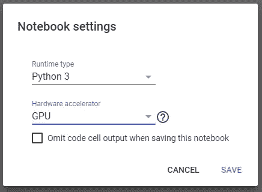
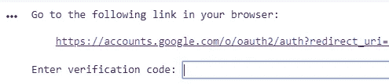

# 使用 Hyperas 在 Google Colab 中调整 Keras 超参数

> 原文：<https://towardsdatascience.com/keras-hyperparameter-tuning-in-google-colab-using-hyperas-624fa4bbf673?source=collection_archive---------11----------------------->


Tuning Hyperparameters for your neural network can be tricky (Photo by [Anthony Roberts](https://unsplash.com/@aroberts1228?utm_source=medium&utm_medium=referral) on [Unsplash](https://unsplash.com?utm_source=medium&utm_medium=referral))

超参数调整是创建深度学习网络时计算量最大的任务之一。幸运的是，你可以使用 Google Colab 来大大加快这个过程。在这篇文章中，我将向您展示如何使用 Hyperas 调整现有 keras 模型的超参数，并在 Google Colab 笔记本中运行一切。

## 创建新笔记本并启用 GPU 运行时



Dialog to change the runtime to GPU

首先，您需要创建一个新笔记本。打开你的 [Colab 控制台](https://colab.research.google.com)并选择**新的 Python 3 笔记本。**在笔记本中，从菜单中选择**运行时**，然后**改变运行时类型。**选择硬件加速器:GPU，点击保存。这将大大加快你在笔记本上做的每一个计算。

## 安装软件包

您可以使用 *pip* 来安装新的软件包。在这种情况下，我们需要 [hyperas](https://github.com/maxpumperla/hyperas) 和[hyperpt](https://github.com/hyperopt/hyperopt)。将以下内容复制并粘贴到笔记本的第一个单元格中:

```
!pip install hyperas
!pip install hyperopt
```

当您运行单元时，您将看到 pip 正在下载和安装依赖项。

# **获取数据并创建模型**

在这篇文章中，我将使用来自 [hyperas github 页面](https://github.com/maxpumperla/hyperas)的例子。你可以在这里找到成品的 Colab 笔记本。

## **数据功能**

你需要一个数据函数来加载你的数据。它需要返回你的 X_train，Y_train，X_test 和 Y_test 值。以下是一个数据函数的示例:

> **注意:**你的数据函数需要完全按照这个顺序返回值:X_train，Y_train，X_test，Y_test。如果你使用 scikit learns[train _ test _ split](https://scikit-learn.org/stable/modules/generated/sklearn.model_selection.train_test_split.html)要小心，因为这会以不同的顺序返回值

## **模型功能**

模型函数是定义模型的地方。您可以使用所有可用的 keras 函数和层。要添加用于调优的超参数，可以使用 **{{uniform()}}** 和 **{{choice()}}** 关键字。

假设您想为您的 *batch_size* 尝试不同的值。您可以简单地编写 *batch_size={{choice([32，64，128])}}* 并且在每次试验期间，将选择并试验其中一个值。关于如何定义要调整的参数的更深入的解释可以在 [Hyperas Github 页面](https://github.com/maxpumperla/hyperas)上找到，或者你可以看看例子:

> **注意:**你的模型函数必须返回一个带有丢失键和状态键的 python 字典

# Colab 的问题

如果您现在尝试运行此示例，试验将会失败，因为 Hyperas 将无法找到您的笔记本。你需要复制你的笔记本并再次上传到你的 google drive 文件夹。幸运的是，你可以在你的笔记本里这样做，正如这个 [stackoverflow 回答](https://stackoverflow.com/questions/49920031/get-the-path-of-the-notebook-on-google-colab)中所描述的。

> **注意:**在第 16 行和第 18 行，您需要将 *HyperasMediumExample* 改为您自己的笔记本的名称

运行此单元后，系统会提示您在浏览器中打开一个网站，并将代码复制粘贴回笔记本:



The Output after you run the cell above

点击链接，用你的谷歌账户登录，将代码复制粘贴回笔记本。如果你打开左侧边栏的**文件**标签，你应该会看到一个名为< YourNotebook >的文件。ipynb

## 开始试验

现在你可以开始试验了。请注意，您必须将参数 *notebook_name* 设置为您笔记本的名称。否则试验将会失败:

运行此单元后，扫描开始，您可以在单元的输出中看到结果。

# **故障排除**

如果您在执行此操作时遇到任何问题，我建议您执行以下操作:

1.  在左侧栏中，打开**文件。**会有一个名为< YourNotebook > .ipynb 的文件，删除那个文件
2.  在菜单中选择**运行时**，然后选择**重启运行时**。
3.  重新加载页面

在您的运行时再次连接后，您可以通过从上到下运行每个单元来重新开始

# 结论

只需稍作调整，您就可以使用 Google colab 来调整 keras 网络的超参数。同样，完整的例子可以在这里找到[。](https://colab.research.google.com/drive/184Tas98M-pPQanCfTbOHRBRUeE9dtdM9#scrollTo=rdo3mScvBHF4)