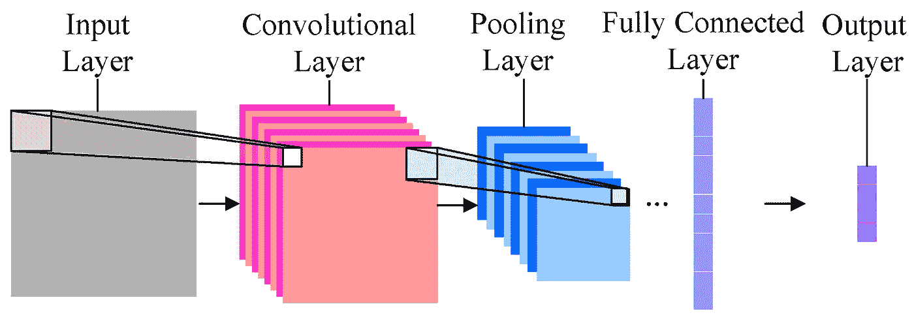

# 使用 Keras 中的迁移学习为初学者提供深度学习

> 原文：<https://towardsdatascience.com/keras-transfer-learning-for-beginners-6c9b8b7143e?source=collection_archive---------0----------------------->

***本博客由三部分组成:***

1.  什么是迁移学习？
2.  为什么迁移学习效果这么好？
3.  使用迁移学习编写您的第一个图像识别器。

[***直奔 Github 上的代码。***](https://github.com/aditya9898/transfer-learning)

“galaxy with starry night” by [Bryan Goff](https://unsplash.com/@bryangoffphoto?utm_source=medium&utm_medium=referral) on [Unsplash](https://unsplash.com?utm_source=medium&utm_medium=referral)

## 什么是迁移学习？

如果不是为了**迁移学习**，机器学习对于一个绝对的初学者来说是一件相当艰难的事情。在最底层，机器学习包括计算一个函数，该函数将一些输入映射到它们相应的输出。虽然函数本身只是一堆加法和乘法运算，但当通过非线性激活函数并将这些层堆叠在一起时，**函数可以用来学习任何东西**，只要有足够的数据可以学习，以及巨大的计算能力。

***欢迎来到深度学习。***

当在足够多的数据上训练时，卷积神经网络可以学习极其复杂的映射函数。我们还不能理解卷积网络是如何学习如此复杂的函数的。

在基本水平上，CNN(卷积神经网络)的权重由**过滤器**组成。把过滤器想象成一个由特定数字组成的( ***n*n)*** 矩阵。现在这个过滤器是**回旋(滑动和乘)**通过提供的图像。假设输入图像的大小为(10，10 ),滤波器的大小为(3，3 ),首先将滤波器与输入图像左上角的 9 个像素相乘，该乘法产生另一个(3，3)矩阵。该矩阵的 9 个像素值相加，该值成为 CNN**layer _ 2**左上角的单个像素值。

representation of convolutional networks

基本上，CNN 的训练包括在每个滤波器上找到正确的值，使得输入图像在通过多个层时，激活最后一层的某些神经元，从而预测正确的类别。

虽然从头开始训练 CNN 对于小项目来说是可能的，但是大多数应用程序需要训练非常大的 CNN，正如你所猜测的，这需要极其大量的处理数据和计算能力。这两者现在都不容易找到了。

这就是迁移学习发挥作用的地方。在迁移学习中，我们采用已经训练好的模型的预训练权重(该模型已经在几天内在几个高功率 GPU 上对属于 1000 个类别的数百万幅图像进行了训练),并使用这些已经学习的特征来预测新的类别。

***迁移学习的优势在于:***

***1:不需要特别大的训练数据集。***

***2:不需要太多计算能力。因为我们使用预先训练的权重，并且只需要学习最后几层的权重。***

有几个模型已经在 image net 数据集上进行了训练，并且是开源的。

比如 VGG 16，VGG 19，盗梦空间 V3 等等。有关这些型号的更多详细信息，请阅读 keras 官方文档[此处](https://keras.io/applications/)。

## 为什么迁移学习效果这么好？

为了了解为什么迁移学习如此有效，我们必须首先看看卷积神经网络的不同层真正在学习什么。

当我们在图像数据集上训练深度卷积神经网络时，在训练过程中，通过在每层的图像上应用几个过滤器，图像穿过网络。滤波器矩阵的值与每层图像的激活相乘。来自最终层的激活用于找出图像属于哪一类。

当我们训练一个深度网络时，我们的目标是找到每个滤波器矩阵的最优值，这样当一个图像通过网络传播时，输出激活可以用来准确地找到图像所属的类别。用于找到这些滤波器矩阵值的过程是梯度下降。

当我们在 imagenet 数据集上训练一个 conv 网络，然后看看 conv 网络每一层上的过滤器已经学会识别什么，或者每个过滤器被什么激活时，我们能够看到一些真正有趣的事情。

conv 网前几层的过滤器学会识别颜色和某些水平线和垂直线。

接下来的几层慢慢学会使用前几层学到的线条和颜色来识别微小的形状。

然后下一层学习识别纹理，然后像腿，眼睛，鼻子等物体的一部分。

最后，最后一层的过滤器被整个物体激活，比如狗、汽车等等。

现在让我们开始转移学习。它工作得如此好的原因是，我们使用了一个在 imagenet 数据集上预先训练的网络，这个网络已经学会了在其初始层中识别不同对象的微小形状和小部分。通过使用预训练网络进行迁移学习，我们只需在预训练网络的末端添加几个密集层，并了解这些已学习特征的组合有助于识别新数据集中的对象。

因此，我们只训练几个密集层。此外，我们正在使用这些已经学习的琐碎特征的组合来识别新的对象。所有这些有助于使训练过程非常快，并且与从头开始训练 conv 网络相比，需要非常少的训练数据。

# 现在让我们使用 Keras 中的迁移学习建立一个实际的图像识别模型。

我们将在这里使用的模型是 MobileNet。

移动网是一种给出相当好的图像网分类精度并且占用非常少空间的模型。(根据 keras 文档显示为 17 MB)。

**所需依赖关系:**

*   Keras(带 tensorflow 后端)
*   Numpy
*   Matplotlib
*   熊猫

**数据要求:**

*   训练数据必须以特定的格式存储，以便输入网络进行训练。我们将使用 keras 中提供的 ImageDataGenerator 来根据可用数据训练我们的模型。这样，这个过程在代码方面就变得简单多了。
*   必须有一个主数据文件夹，在该数据文件夹中，必须有一个包含相应图像的每类数据的文件夹。文件夹的名称必须是它们各自的类名。

**模型的建立分三步走:**

1.  导入预训练模型并添加密集层。
2.  正在将列车数据加载到 ImageDataGenerators 中。
3.  培训和评估模型。

**<开始编码/ >**

首先加载依赖项。

然后导入预先训练好的 MobileNet 模型。Mobilenet(在 imagenet 数据集上训练了一千个类)将具有由 1000 个神经元组成的最后一层(每个类一个)。我们希望在网络的最后一层有多少神经元，就有多少我们希望识别的类别。因此，我们放弃了 1000 个神经元层，并为网络添加了我们自己的最后一层。

这可以通过在导入模型时设置( *IncludeTop=False* )来实现。

因此，假设你想训练一个狗品种分类器来识别 120 个不同的品种，我们需要在最后一层有 120 个神经元。这可以使用下面的代码来完成。

*这是* ***流程的第 1 步*** *。导入和构建所需的模型。*

我们导入没有最后一层的 MobileNet 模型，并添加一些密集层，以便我们的模型可以学习更复杂的函数。密集层必须具有 relu 激活功能，并且最后一层必须具有 softmax 激活，该层包含与类的数量一样多的神经元。

接下来，我们根据我们提供的架构制作一个模型。

为了检查我们模型的架构，我们只需要使用下面给出的这行代码。

现在我们有了模型，因为我们将使用预训练的权重，我们的模型已经在其上训练过(imagenet 数据集)，我们必须将所有权重设置为不可训练的。我们将只训练我们以前制作的最后的密集层。下面给出了执行此操作的代码。

现在我们进入流程的 ***步骤 2*** ，将训练数据加载到 ImageDataGenerator 中。

ImageDataGenerators 内置在 keras 中，帮助我们训练模型。我们只需指定训练数据的路径，它就会自动批量发送训练数据。这使得代码更加简单。

为此，我们需要博客前面提到的特定格式的训练数据。

接下来我们进入 ***步骤 3*** ，在数据集上训练模型。

为此，我们首先编译我们制作的模型，然后用我们的生成器训练我们的模型。这可以使用下面的代码来完成。

有了这个，我们就训练出了一个模型。然后，通过使用 model.predict(new_image ),训练好的模型可用于预测新的看不见的图像属于哪一类。

[***获取 Github 上的代码。***](https://github.com/aditya9898/transfer-learning)

一如既往，快乐学习。