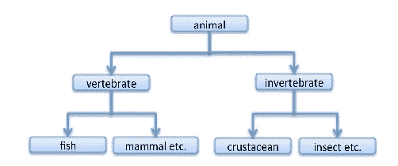
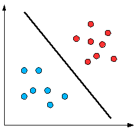

# 核函数

> 原文：<https://towardsdatascience.com/kernel-function-6f1d2be6091?source=collection_archive---------0----------------------->

最近，我读了一些关于机器学习的资料，而内核恰好是分类问题的一个有趣部分，在我继续之前，这个主题是由[艾伦](https://medium.com/u/1d2f805e8419?source=post_page-----6f1d2be6091--------------------------------)、[自己动手为机器人开发者做 NLP](https://medium.com/lastmile-conversations/do-it-yourself-nlp-for-bot-developers-2e2da2817f3d#.smuhw16q3)写的一篇文章启发的。谢谢 a。

# 什么是核函数？

要说内核，我们需要了解类似[**SVM**](https://en.wikipedia.org/wiki/Support_vector_machine) (支持向量机)——**分类** - **监督学习** - **机器学习**-等等等等等等。这么多术语，对吗？，但不要因此而气馁(在 DIY 练习之前，我对这些一无所知)。让我们一起走进去吧

*那么到底什么是“机器学习(ML)”*？事实证明，ML 实际上是一大堆东西，但最重要的主题可以用阿瑟·塞缪尔早在 1959 年就说过的一句话来概括:

*“机器学习(Machine Learning)是在没有被* ***明确*** *编程的情况下，赋予计算机学习能力的研究领域。”*

> *一个计算机程序被说成是从* ***经验中学习*** *E 关于某些* ***任务*** *T 和某些* ***性能度量*** *P，如果它在 T 上的性能，如由 P 所度量的，随着经验 E 而提高”——汤姆·米切尔，卡内基梅隆大学*

因此，如果你希望你的程序预测，例如，一个繁忙的十字路口的交通模式(任务 T)，你可以通过一个机器学习算法来运行它，该算法具有关于过去交通模式的数据(经验 E)，如果它已经成功“学习”，那么它将在预测未来交通模式方面做得更好(性能指标 P)。

在不同类型的 ML 任务中，我们称之为**监督学习(SL)。**在这种情况下，你可以输入一些你已经知道答案的数据(例如，为了预测一只狗是否是一个特定的品种，我们输入了数百万条狗的信息/属性，如类型、身高、肤色、体毛长度等。在 ML 行话中，这些属性被称为“特性”。这些特征列表中的单个条目是一个数据实例，而所有内容的集合是训练数据，这些数据形成了你预测的基础，即如果你知道特定狗的肤色、体毛长度、身高等，那么你就可以预测它可能属于哪个品种。

> 在我们进入内核之前，我们需要理解什么是支持向量机。支持向量机或 SVM 是具有相关学习[算法](https://en.wikipedia.org/wiki/Algorithm)的监督学习模型，分析数据进行分类(分类意味着知道什么属于什么，例如“苹果”属于“水果”类，而“狗”属于“动物”类——见图 1)

Fig. 1

在支持向量机中，它看起来有点像下面的图 2:)，它将蓝色的球与红色的球分开。

> SVM 是一个由分离超平面正式定义**的**分类器**。超平面是比它的**周围空间**小一个**维度**的子空间。数学空间(或对象)的**维度**被非正式地定义为指定其中任何点(如每个蓝色和红色点)所需的最小坐标数(x，y，z 轴),而周围空间是数学对象周围的空间。**数学对象**是数学中出现的抽象对象**抽象对象**是不存在于任何特定时间或地点的对象，而是作为一种类型的事物存在，即思想或抽象(维基百科)。**

因此，下面的二维空间的超平面(图 2)是划分红色和蓝色点的一维线。

Fig. 2

从上面试图预测一只特定狗的品种的例子来看，它是这样的

数据(所有品种的狗)→特征(肤色、毛发等)→学习算法

# 那么为什么是内核呢？

考虑下面的图 3

Fig. 3

你能试着像图 2 那样线性地解决上面的问题吗？

不要！

红色和蓝色的球不能被一条直线分开，因为它们是随机分布的，这就是现实生活中大多数问题数据的随机分布。

在机器学习中，“内核”通常用于指内核技巧，即使用线性分类器来解决非线性问题的方法。它需要将线性不可分的数据(如图 3)转换成线性可分的数据(如图 2)。核函数是应用于每个数据实例的函数，用于将原始非线性观察值映射到高维空间，在该空间中它们变得可分离。

再次使用狗品种预测的例子，内核提供了一个更好的选择。你不用定义一系列的特征，而是定义一个单一的核函数来计算不同品种狗之间的相似度。你把这个内核，连同数据和标签一起提供给学习算法，就产生了一个分类器。

# 它是如何工作的？

为了更好地理解内核是如何工作的，让我们使用姜黎黎的数学[图](https://www.quora.com/What-are-Kernels-in-Machine-Learning-and-SVM/answer/Lili-Jiang?srid=oOgT)

> **数学定义** : K(x，y) = < f(x)，f(y) >。这里 K 是核函数，x，y 是 n 维输入。f 是从 n 维到 m 维空间的映射。< x，y >表示点积。通常 m 比 n 大很多。
> 
> **直觉**:正常计算< f(x)，f(y) >需要我们先计算 f(x)，f(y)，然后做点积。这两个计算步骤可能相当昂贵，因为它们涉及 m 维空间中的操作，其中 m 可以是大的数字。但是在经历了所有去高维空间的麻烦之后，点积的结果真的是标量:我们又回到一维空间了！现在，我们的问题是:我们真的需要大费周章去得到这个数字吗？我们真的要去 m 维空间吗？答案是否定的，如果你找到一个聪明的内核。
> 
> **简单例子:** x = (x1，x2，x3)；y = (y1，y2，y3)。那么对于函数 f(x) = (x1x1，x1x2，x1x3，x2x1，x2x2，x2x3，x3x1，x3x2，x3x3)，核就是 K(x，y ) = ( < x，y >)。
> 
> 让我们插入一些数字，让这个更直观:假设 x = (1，2，3)；y = (4，5，6)。然后:
> f(x) = (1，2，3，2，4，6，3，6，9)
> f(y) = (16，20，24，20，25，30，24，30，36)
> < f(x)，f(y)>= 16+40+72+40+100+180+72+180+324 = 1024
> 
> 代数很多，主要是因为 f 是 3 维到 9 维空间的映射。
> 
> 现在让我们用核来代替:
> K(x，y) = (4 + 10 + 18 ) ^2 = 32 = 1024
> 同样的结果，但是这个计算简单多了。

内核大概就是这样。干得好！你刚刚迈出了成为机器学习专家的第一步:)

***额外说明:*** *了解更多，可以查看* [*我是如何在 Numerai ml 预测股市的*](https://medium.com/@Yettie/how-i-predicted-the-stock-market-at-numerai-ml-tournament-6f74e1c8809e#.x456mngmw) *和* [*机器学习中有哪些内核以及*](https://www.quora.com/What-are-Kernels-in-Machine-Learning-and-SVM) *。*

[*Pelumi Aboluwarin*](https://medium.com/u/db00622f19c5?source=post_page-----6f1d2be6091--------------------------------)*在阅读草案和建议这个主题方面做得非常出色。谢谢大家！*

如果你像我喜欢写这篇文章一样喜欢读它，你知道该怎么做；)给它一些爱，如果你对你想让我写的话题有什么建议，请写在下面的评论区。感谢阅读:)

*   **所有图片均来自网络***

额外阅读

1.  [https://en.wikipedia.org/wiki/Statistical_classification](https://en.wikipedia.org/wiki/Statistical_classification)
2.  [https://en.wikipedia.org/wiki/Supervised_learning](https://en.wikipedia.org/wiki/Supervised_learning)