# Tensorflow/sklearn 中的核 PCA vs PCA vs ICA

> 原文：<https://towardsdatascience.com/kernel-pca-vs-pca-vs-ica-in-tensorflow-sklearn-60e17eb15a64?source=collection_archive---------9----------------------->

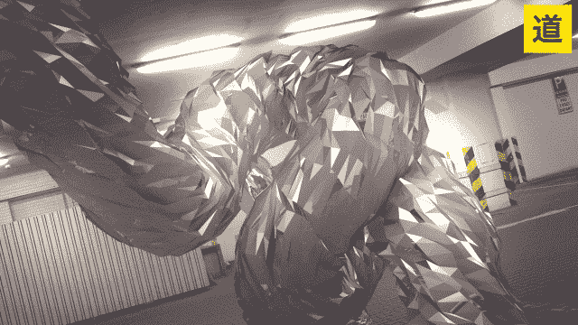

GIF from this [website](https://giphy.com/gifs/trapcode-xponentialdesign-trapcodetao-UOqSr1m4isHaE)

主成分分析对给定的数据执行线性变换，然而，许多真实世界的数据不是线性可分的。那么，我们能否利用更高维度的优势，同时又不大幅增加所需的计算能力呢？

> **请注意，这个帖子是给未来的自己看的，用来回顾和复习这个帖子上的材料。**(还有自学)

**讲座:内核主成分分析**

PPT from this [website](http://www.cs.haifa.ac.il/~rita/uml_course/lectures/KPCA.pdf)

根据上面的 PPT，我会做一些对我有帮助的简短笔记。

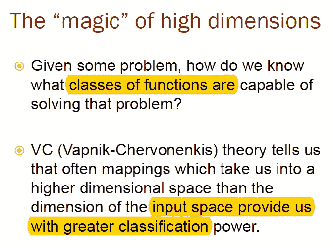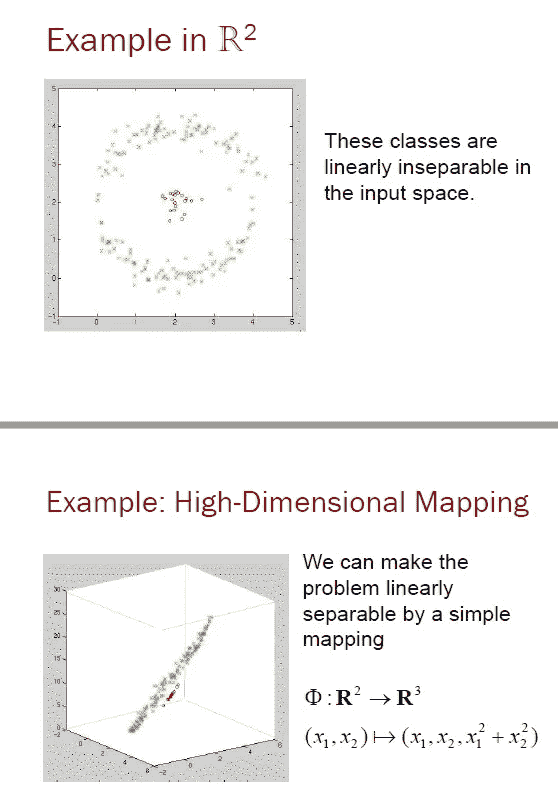

[VAP Nik–Chervonenkis theor](https://en.wikipedia.org/wiki/Vapnik%E2%80%93Chervonenkis_theory)y 告诉我们，如果我们将数据投影到一个更高维的空间，它会为我们提供更好的分类能力。(左图示例。)这可能类似于神经网络总体所做的，随着深度的增加，更多的抽象特征被提取，并且具有更好的特征来执行分类。

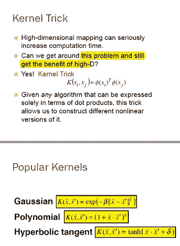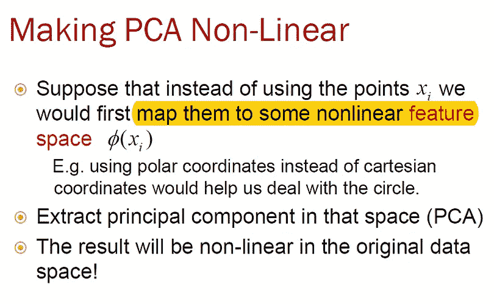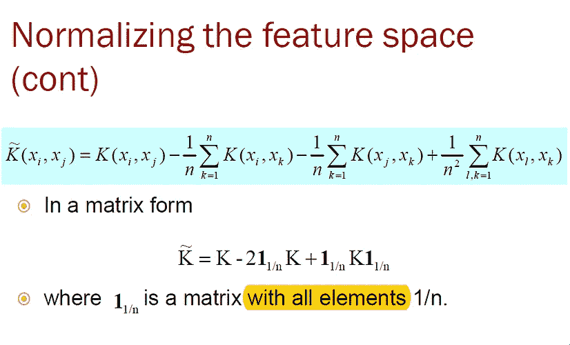

内核技巧，一种在不牺牲太多计算时间的情况下将原始数据投影到更高维度的方法。(非线性特征映射)。和矩阵形式来归一化特征空间。

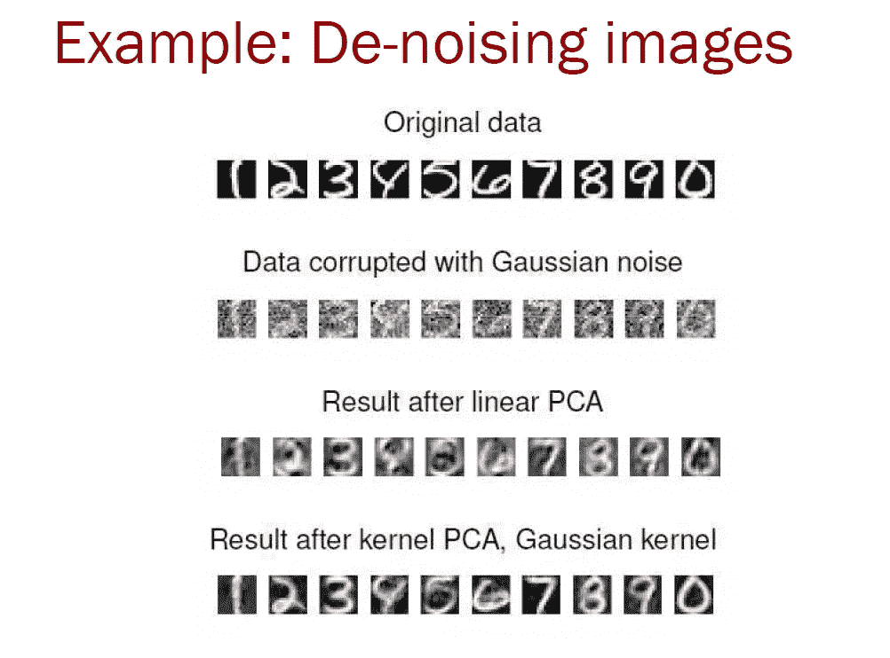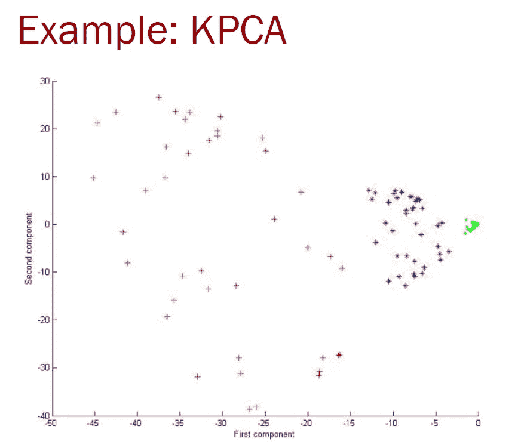

有效使用 KPCA 的例子，见上文。

**KPCA 的不同使用案例**

Paper from this [website](https://bmcbioinformatics.biomedcentral.com/articles/10.1186/1471-2105-15-137)

Paper from this [website](https://www.frontiersin.org/articles/10.3389/fnsys.2012.00074/full)

在第一篇论文中，作者使用 KPCA 作为预处理步骤，作为特征变换的手段，并与最小二乘支持向量机配对，对 DNA 微阵列进行分类。(微阵列数据具有高维度，因此在执行分类之前执行维度缩减技术是一个好主意。)在第二篇论文中，使用 KPCA 从功能性磁共振图像(fMRI)中提取特征，以对注意力缺陷多动障碍(ADHD)执行自动诊断。

**tensor flow 中的 KPCA (RBF)层**

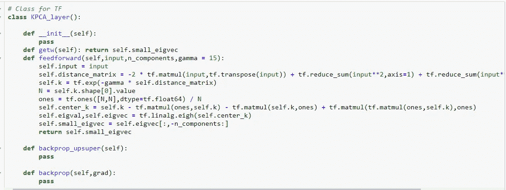

可以像上面那样实现一个简单的前馈操作，在撰写本文时，我不会对输入数据实现反向传播。

**KPCA vs PCA vs ICA**

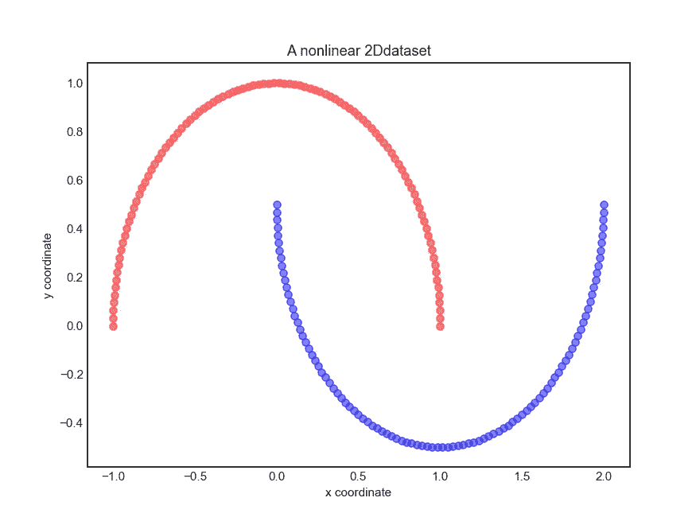

让我们从简单的开始，我们有一个线性不可分的 2D 数据点，现在为了验证我们的实现正在工作，让我们使用每个 KPCA、PCA 和 ICA 将我们的数据投影到二维空间中。

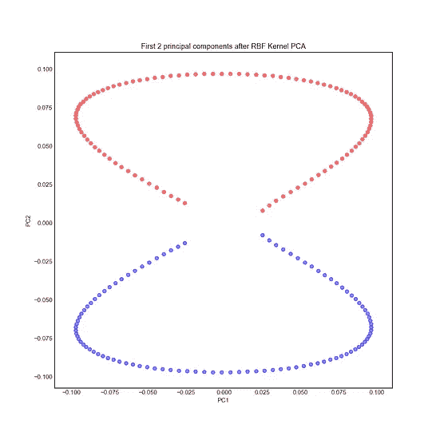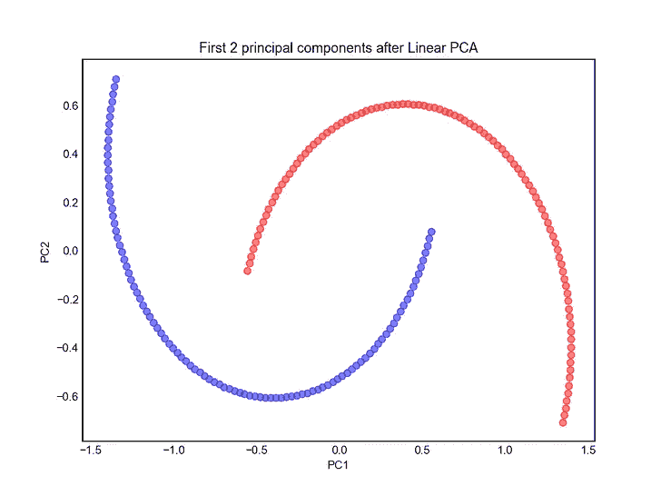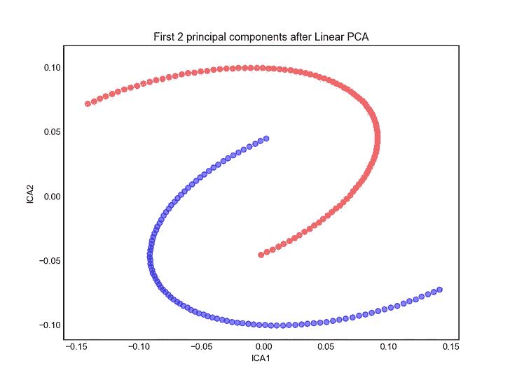

**左图** →使用 KPCA 的投影
**中图** →使用 PCA 的投影
**右图→** 使用 ICA 的投影

从上面的例子我们可以看到，我们的实现工作正常，我们的数据现在是线性可分的。但是为了让事情变得更有趣，让我们看看这些方法在组织病理学图像上的效果。我正在使用来自[骨髓活检组织病理学数据(HistBMP)的数据集。](https://zenodo.org/record/1205024#.W5bbVOhKiUk)

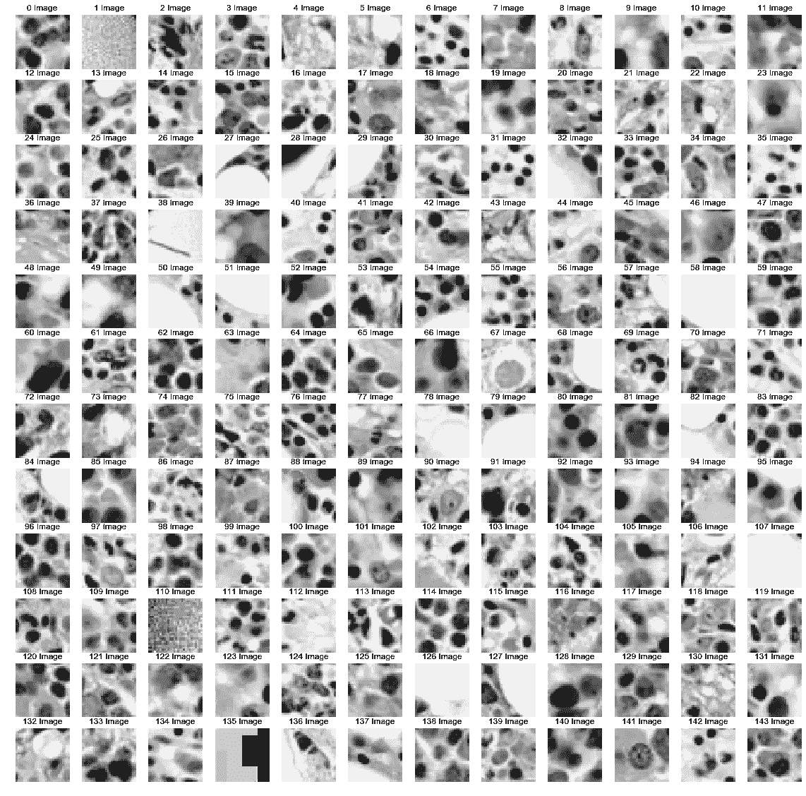

如上所述，每幅图像都是 28*28 的灰度图像，我们将通过将 1000 幅图像压缩成 100 幅来找到特征图像。

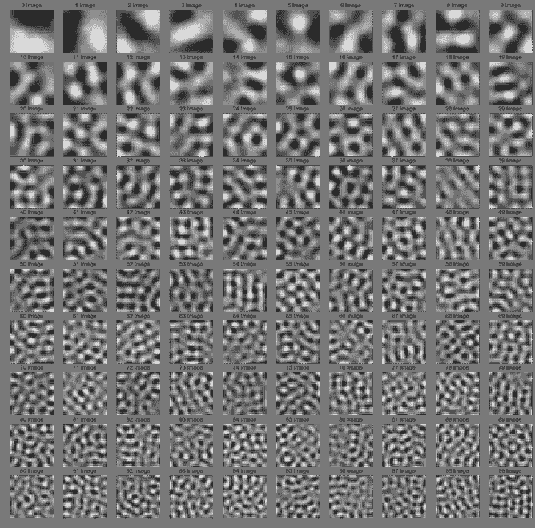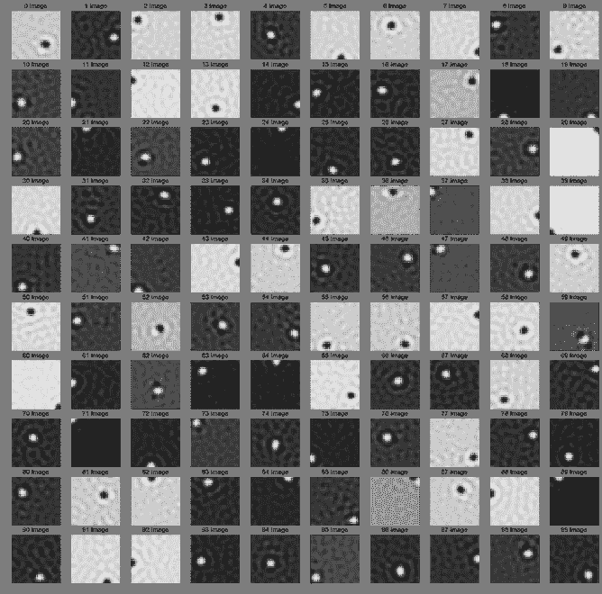

**左图** →使用 KPCA
的投影**中图** →使用 PCA
的投影**右图→** 使用 ICA 的投影

总的来说，我们可以看到 PCA 试图捕捉全局变化，ICA 试图捕捉局部变化。但 KPCA 似乎首先捕捉到了全球变化，但当我们到达特征图像的下部时，我们可以看到它正在捕捉局部变化。

**代码**

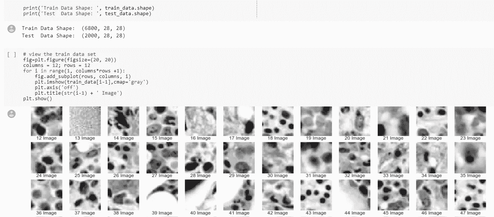

*对于 Google Colab，您需要一个 Google 帐户来查看代码，而且您不能在 Google Colab 中运行只读脚本，因此请在您的操场上创建一个副本。最后，我永远不会请求允许访问你在 Google Drive 上的文件，仅供参考。编码快乐！*

要访问这篇文章的代码，请点击[这里](https://colab.research.google.com/drive/1n-RW3kPHKExZNS_d7imsbjuwzr06qclU)。

**遗言**

请注意，对于距离矩阵，我从这个[网站](https://medium.com/dataholiks-distillery/l2-distance-matrix-vectorization-trick-26aa3247ac6c)借用了非循环形式，整体实现从 Sebastian Raschka 的“[核技巧和通过 RBF 核 PCA 的非线性维度缩减](https://sebastianraschka.com/Articles/2014_kernel_pca.html)”借用。

我一直想知道如何绘制每个特征值的方差，这是一篇很好的文章[解释了其中的诀窍。](https://sebastianraschka.com/Articles/2015_pca_in_3_steps.html)

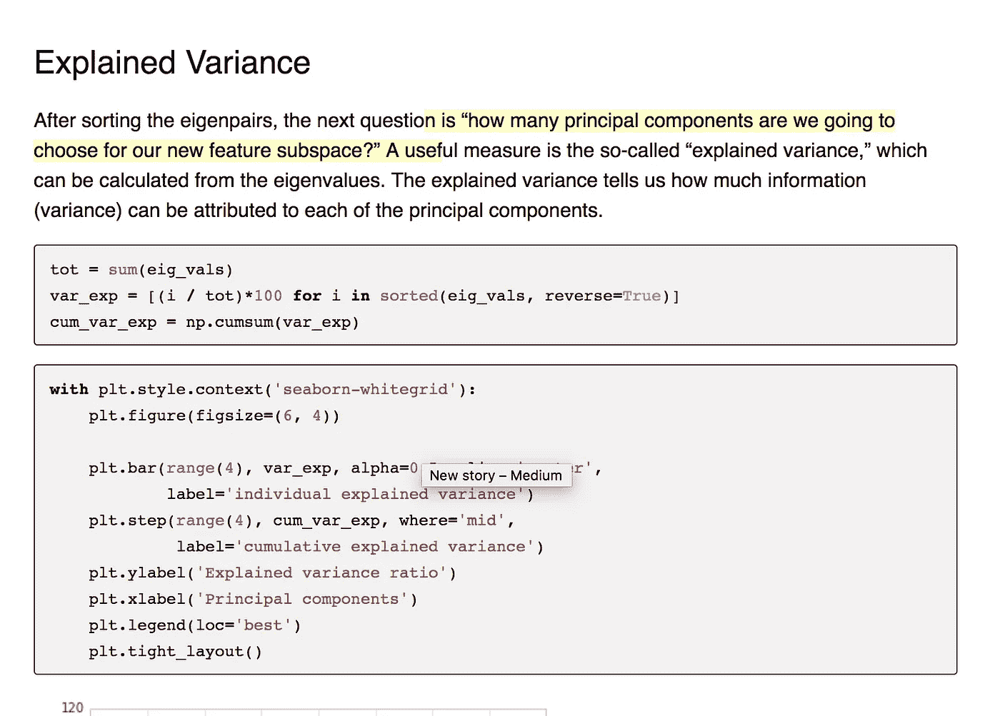

Image from this [website](https://sebastianraschka.com/Articles/2015_pca_in_3_steps.html)

这也是我发现的一个有趣的视频。

video from this [website](https://www.youtube.com/watch?v=3k9hwRCcT30)

最后，有趣的是，主成分分析/ KPCA 受到方差膨胀和缺乏可推广性的影响，下面的论文提出了一个解决问题的方法。

Paper from this [website](http://jmlr.csail.mit.edu/papers/v12/abrahamsen11a.html)

如果发现任何错误，请发电子邮件到 jae.duk.seo@gmail.com 给我，如果你想看我所有写作的列表，请在这里查看我的网站。

同时，在我的 twitter 上关注我[这里](https://twitter.com/JaeDukSeo)，访问[我的网站](https://jaedukseo.me/)，或者我的 [Youtube 频道](https://www.youtube.com/c/JaeDukSeo)了解更多内容。我还实现了[广残网，请点击这里查看博文](https://medium.com/@SeoJaeDuk/wide-residual-networks-with-interactive-code-5e190f8f25ec) t。

**参考**

1.  主成分分析。(2015).塞巴斯蒂安·拉什卡博士。2018 年 9 月 7 日检索，来自[https://sebastianraschka . com/Articles/2015 _ PCA _ in _ 3 _ steps . html](https://sebastianraschka.com/Articles/2015_pca_in_3_steps.html)
2.  关于特征缩放和规范化。(2014).塞巴斯蒂安·拉什卡博士。检索于 2018 年 9 月 7 日，来自[https://sebastianraschka . com/Articles/2014 _ about _ feature _ scaling . html](https://sebastianraschka.com/Articles/2014_about_feature_scaling.html)
3.  关于特征缩放和规范化。(2014).塞巴斯蒂安·拉什卡博士。检索于 2018 年 9 月 7 日，来自[https://sebastianraschka . com/Articles/2014 _ about _ feature _ scaling . html](https://sebastianraschka.com/Articles/2014_about_feature_scaling.html)
4.  实施主成分分析(PCA)。(2014).塞巴斯蒂安·拉什卡博士。2018 年 9 月 7 日检索，来自[https://sebastianraschka . com/Articles/2014 _ PCA _ step _ by _ step . html](https://sebastianraschka.com/Articles/2014_pca_step_by_step.html)
5.  tf.ones | TensorFlow。(2018).张量流。检索于 2018 年 9 月 10 日，来自[https://www.tensorflow.org/api_docs/python/tf/ones](https://www.tensorflow.org/api_docs/python/tf/ones)
6.  距离矩阵矢量化技巧-流形博客-中。(2016).中等。检索于 2018 年 9 月 10 日，来自[https://medium . com/data holiks-distillery/L2-distance-matrix-vectorization-trick-26aa 3247 ac6c](https://medium.com/dataholiks-distillery/l2-distance-matrix-vectorization-trick-26aa3247ac6c)
7.  matplotlib，P. (2018 年)。用 matplotlib 同时绘制两个直方图。堆栈溢出。检索于 2018 年 9 月 10 日，来自[https://stack overflow . com/questions/6871201/plot-two-histograms-at-same-time-with-matplotlib](https://stackoverflow.com/questions/6871201/plot-two-histograms-at-the-same-time-with-matplotlib)
8.  tf.self _ 共轭 _eig | TensorFlow。(2018).张量流。检索于 2018 年 9 月 10 日，来自[https://www . tensor flow . org/API _ docs/python/TF/self _ agreement _ EIG](https://www.tensorflow.org/api_docs/python/tf/self_adjoint_eig)
9.  核技巧和基于 RBF 核 PCA 的非线性降维。(2014).塞巴斯蒂安·拉什卡博士。检索于 2018 年 9 月 10 日，来自 https://sebastianraschka.com/Articles/2014_kernel_pca.html
10.  VAP Nik-Chervonenkis 理论。(2018).En.wikipedia.org。检索于 2018 年 9 月 10 日，来自[https://en . Wikipedia . org/wiki/VAP Nik % E2 % 80% 93c hervonenkis _ theory](https://en.wikipedia.org/wiki/Vapnik%E2%80%93Chervonenkis_theory)
11.  Sidhu、n . as garian、r . Greiner 和 m . Brown(2012 年)。核主成分分析在基于 fMRI 的 ADHD 诊断中的降维作用。系统神经科学前沿，6。doi:10.3389/fnsys
12.  m .托马斯、k .布拉班特和 b .穆尔(2014 年)。核主成分分析的新带宽选择准则:降维和分类问题的方法。BMC 生物信息学，15(1)，137。doi:10.1186/1471–2105–15–137
13.  t .亚伯拉罕森和 l .汉森(2011 年)。高维核主成分分析中方差膨胀的一种解决方法。机器学习研究杂志，12 期(6 月)，2027–2044。从 http://jmlr.csail.mit.edu/papers/v12/abrahamsen11a.html[取回](http://jmlr.csail.mit.edu/papers/v12/abrahamsen11a.html)
14.  j . tomczak(2018 年)。骨髓活检(HistBMP)的组织病理学数据。芝诺多。检索于 2018 年 9 月 10 日，来自[https://zenodo.org/record/1205024#.W5bcCOhKiUm](https://zenodo.org/record/1205024#.W5bcCOhKiUm)