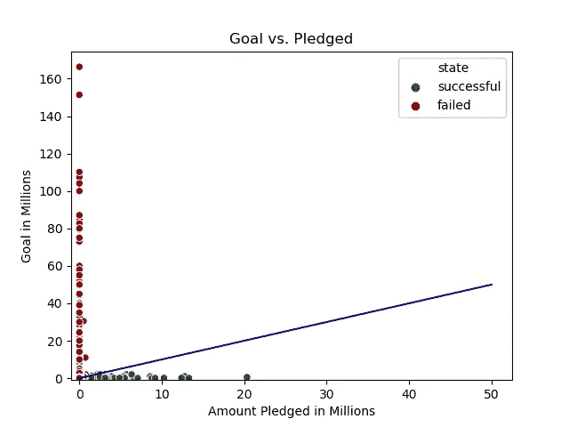
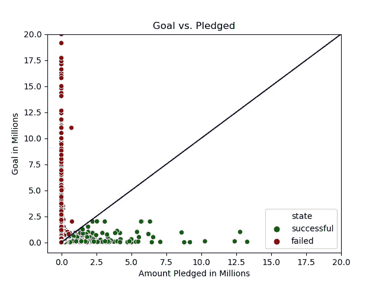
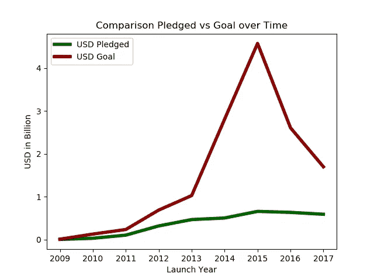
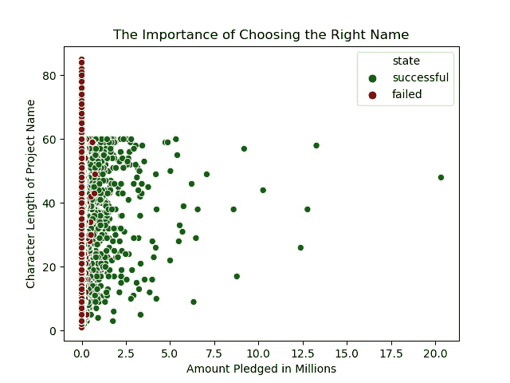
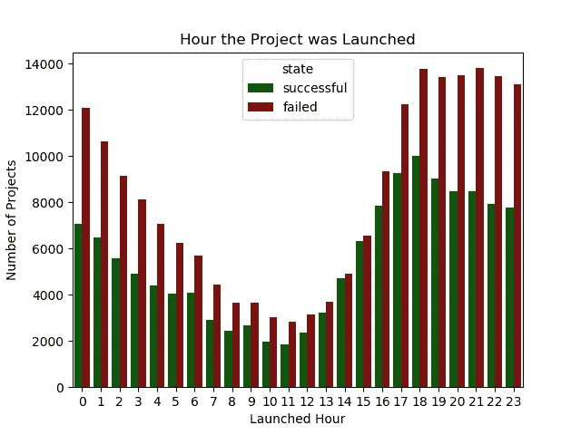
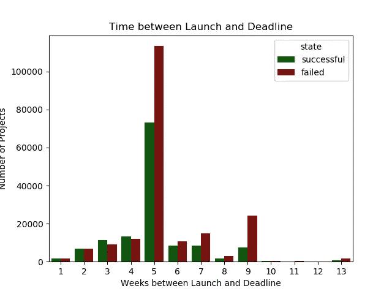
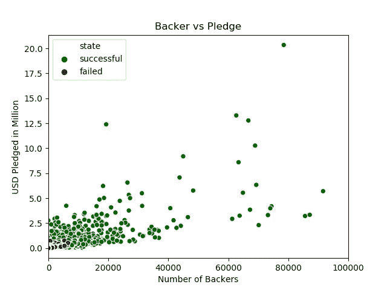
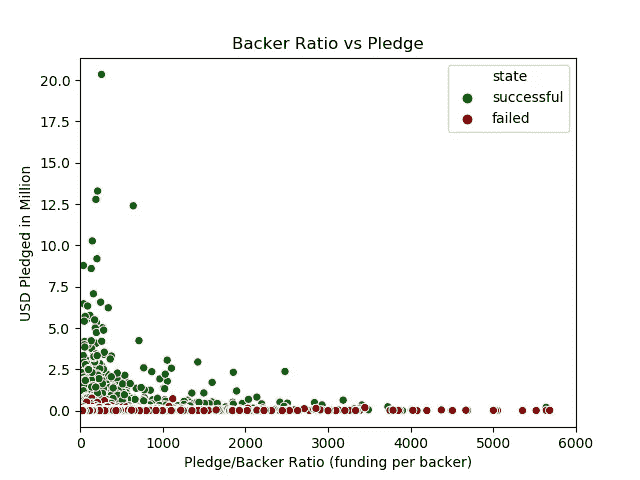

# Kickstarter 项目演练 Python 中的简单数据探索

> 原文：<https://towardsdatascience.com/kickstarter-projects-walk-through-simple-data-exploration-in-python-c2302a997789?source=collection_archive---------7----------------------->


这篇文章分析了大约 380.000 个 Kickstarter 项目的数据集。我将带领您通过 Python 进行简单的数据探索，揭示 Kickstarter 项目中有趣的见解，以及在检查某个项目的成功(或失败)时哪些属性是重要的。总的来说，我们将看看 Python 的基本数据可视化和特征工程。

# 1.一般想法和想法

Kickstarter 是最著名的推广(主要是)创造性的、聪明的和有远见的想法和概念的平台之一。每个项目都寻求 Kickstarter 人群能够提供的资金，如果他们支持这个想法并希望看到它成功的话。然而，有许多项目失败了，即使最初的想法可能是令人信服的。这是为什么呢？本文试图深入研究与每个项目相关的属性，并揭示与 Kickstarter 项目相关的模式、见解和任何感兴趣的东西。

# 2.初始数据集和属性

该数据集包含来自 Kickstarter 的 378.661 个项目以及与每个项目相关的 12 个初始属性。让我们看看我们从每个项目中获得了哪些信息:

1.  **名**
    挺明显的，各自项目的名称。例如“日常冲泡咖啡”
2.  **main_category** 项目所属的主类别。例如“诗歌”、“美食”、“音乐”等等
3.  **类别**
    对主要类别的更精确的描述。基本上，main_category 的一个子群(参见 2。).例如“饮料”,它是 main_category 属性中“食物”的子组。
4.  **货币**
    项目的货币(如美元或英镑)
5.  **启动**
    项目的启动日期。当我们稍后分析时间框架时，这将非常重要
6.  **截止日期**
    项目的截止日期。正如上市日期一样，截止日期将变得和上市日期一样重要
7.  **美元 _ 质押 _ 真实**
    项目在截止日期实现的美元金额
8.  **usd_goal_real**
    项目最初要求的美元金额
9.  **支持者**
    实际投资该项目的支持者人数
10.  **国别**项目原产国

11.  **ID** 项目 ID

12.  **状态**
    项目最后成功了吗？*状态*是一个分类变量，分为成功*、失败、有效、取消、未定义*和暂停*等级别*。为了清楚起见，我们将只看一个项目是*成功*还是*失败*(因此，我们将删除未被归类为两者之一的所有项目)。失败或成功的项目约占所有项目的 88%。

让我们快速移除所有没有*失败*或*成功*作为其*状态*的项目。

```
#return only successful and failed projects. This makes things more clear later on**data_kick = data_kick.loc[data_kick['state'].isin(
            ['successful', 'failed'])]**
```

让我们先来看看所有属性的数据类型，以便更好地理解数据，看看是否一切正常。

```
**data_kick.info()**ID                  378661 non-null int64
name                378657 non-null object
category            378661 non-null object
main_category       378661 non-null object
currency            378661 non-null object
deadline            378661 non-null object
goal                378661 non-null float64
launched            378661 non-null object
pledged             378661 non-null float64
state               378661 non-null object
backers             378661 non-null int64
country             378661 non-null object
usd pledged         374864 non-null float64
usd_pledged_real    378661 non-null float64
usd_goal_real       378661 non-null float64
```

可以看出，所有属性都倾向于采用精确的数据格式——要么是浮点型(因此是数字型),要么是对象型(因此是分类型)。唯一两个不符合期望格式的属性是我们的两个时间属性:*发起*和*截止日期*。我们一会儿会处理这些。但是，让我们首先通过分析承诺的金额*与项目的最初目标*来了解数据集。

# 3.目标与承诺

让我们来看看一个项目的目标和实际承诺金额之间的关系。很明显，如果
**承诺金额≥目标**则一个项目被标记为*成功*，如果**承诺金额<目标则被标记为*不成功*。** 下图显示了每个项目的目标和承诺金额以及项目的单个状态(仅显示了*失败的*和*成功的*项目)。

```
#define colors (darkgreen for successful projects and darkred for failed ones**colors = ('darkgreen','darkred')**#create a plot using seaborn, adjust data to millions**ax = sns.scatterplot(data_kick.usd_pledged_real/1e6, data_kick.usd_goal_real/1e6, hue=data_kick.state, palette=colors)**#add blue line to better visualize the border between failed and successful projects**sns.lineplot(x=(0,50), y=(0,50), color='darkblue')**#set the axes from -1 to their maximum (-1 looks better than 0 actually)**ax.set(ylim=(-1,None), xlim=(-1,None))**#set labels and title**ax.set(xlabel='Amount Pledged in Millions', ylabel='Goal in Millions', title= 'Goal vs. Pledged')**
```



直观地看，承诺超过/达到其目标的项目是*成功的*，显示为绿色，而*失败的*项目被标记为红色。看看与原点相交的蓝线:*成功的*项目总是在这条线的下面，而*失败的*项目在这条线的上面。这很有道理，不是吗？顺便说一句，你可以观察到，承诺金额最高的项目募集了大约 2000 万美元，目标最高的项目寻求超过 1.6 亿美元(但失败了)。是时候近距离观察了。

让我们放大一点，通过将两个轴的范围从 0 到 2000 万来更好地理解:

```
#we are using the same code as above expect for the axis limits, that are set from 0 Millions (-1 in the code) to 20 Millions**ax.set(ylim=(-1,20), xlim=(-1,20)**
```



这种放大允许更直观的方法:蓝线现在以 45°角与原点相交，因为我们相应地将轴调整到相同的范围。如前所述，线下的每个数据点(即项目)都成功了，而线上的每个数据点都失败了。

有趣的是，该图表明，不成功的项目通常没有接近目标就失败了，这意味着它们“没有水平移动到蓝线，而是停留在 x~0”。由此得出结论，Kickstarter 是一个“要么全有，要么全无”的平台。如果你没有成功，你可能根本就没有成功。另一方面，许多成功的项目远远超过了他们的既定目标，并保证是他们最初目标的数倍。

随着时间的推移，承诺金额和目标之间的关系是如何发展的？让我们看看按年份分组的整个时间框架内目标和承诺的发展情况。我们使用下面的代码来获得每年目标和承诺的累计金额。

```
#we choose the desired grouping intervall ('launched year') and the two variables pledge and goal that we are interested in and sum them up over the years.**data_kick_groupby_year = data_kick.groupby('launched_year')['usd_pledged_real', 'usd_goal_real'].sum()**#let's use this variable to plot the data over time:**ax = sns.lineplot(x=data_kick_groupby_year_sum.index, y= data_kick_groupby_year_sum.usd_pledged_real/1e9, linewidth= 4, label= 'USD Pledged', color= 'darkgreen')****sns.lineplot(x=data_kick_groupby_year_sum.index, y= data_kick_groupby_year_sum.usd_goal_real/1e9, linewidth= 4,label='USD Goal', color= 'darkred')**#set labels and title**ax.set(xlabel='Launch Year', ylabel='USD in Billion', title='Comparison Pledged vs Goal over Time')**
```

我们得到了这个图表:



该图显示了各年度所有项目的目标和承诺的累计金额。例如，2013 年，所有已启动项目的财务目标总和略高于 10 亿美元。

可以看出，总目标的累积金额在 2013 年急剧增加，在 2015 年达到峰值，然后缓慢下降。另一方面，每年的累计认捐额稳步下降，但呈线性下降。实际上从 2015 年到 2017 年略有下降。

目标值剧增的原因是相当明显的，不是吗？项目数量急剧增加，如下图所示:

```
**data_kick['launched_year'].value_counts()**2015    65272
2014    59306
2016    49292
2017    43419
2013    41101
2012    38478
2011    24048
2010     9577
2009     1179
```

更多的项目，更多的目标。然而，这只是促成累积目标增加的一个因素。这些年来，不仅启动了更多的项目，而且每个项目的平均目标也在增加，如下所示:

```
#we group again. This time we take the average though:**data_kick_groupby_year_avg = data_kick.groupby('launched_year')['usd_pledged_real', 'usd_goal_real'].mean()****print(data_kick_groupby_year_avg)**launched_year  usd_pledged_real  usd_goal_real   
2009                2375.535335    6799.507430
2010                3041.302897   13270.062647
2011                4256.161398    9715.957062
2012                8247.532875   17862.738838
2013               11326.171820   24946.164929
2014                8466.032884   47346.942048
2015               10058.201943   70094.513735
2016               12847.626664   52879.135752
2017               13564.594251   39073.175276
```

平均目标随着时间的推移而增加(从大约。2011 年向 ca 支付 10，000 美元。2016 年为 53，000 美元，随后在 2017 年大幅下降)。因此，不仅项目数量增加了，每个项目的平均目标也增加了。随着时间的推移，这些因素的结合增加了累积目标图。现在，时间够了。让我们看看名字！

# 4.名字的作用

另一个可能影响项目结果的方面是它的名字。我们希望更短、更简洁的名字比冗长、模糊的短语更能吸引(潜在)投资者。

例如，一个像“Circa Vitae 要求群众基金会录制我们的全长专辑…到乙烯基！！!"不如“第 X 天”吸引人(第一个项目确实失败了，后者成功了)。数据支持这个假设吗？让我们做一点特性工程，创建一个包含项目名称的字符串长度的新列。

```
**data_kick['name_length'] = data_kick['name'].str.len()**
```

我们现在将每个项目名称的字符串长度保存在 *name_length 中。*让我们看看这个栏目是什么样子的。

```
**data_kick.loc[:,['name','name_length']].head(5)**name                                                  name_length
0                    The Songs of Adelaide & Abullah         31.0
1      Greeting From Earth: ZGAC Arts Capsule For ET         45.0
2                                     Where is Hank?         14.0
3  ToshiCapital Rekordz Needs Help to Complete Album         49.0
4  Community Film Project: The Art of Neighborhoo...         58.0
```

让我们创建一个散点图来显示 *name_length* 和*USD _ pleated _ real*之间的关系。

```
#create scatterplot for pledged amount and name length**ax = sns.scatterplot(data_kick.usd_pledged_real/1e6, data_kick.name_length, hue=data_kick.state, palette=colors)**#set labels accordingly**ax.set(xlabel='Amount Pledged in Millions', ylabel='Character Length of Project Name', title= 'The Importance of Choosing the Right Name')**
```



有趣的是，如果一个项目的名称超过 60 个字符，承诺的金额将分布在 0 附近，并且(或多或少)所有项目似乎都会失败。让我们来看看这些项目的目标与<60 projects and check the following hypothesis:

*   Could it be that >相比，60 个角色的项目确实有明确的高目标值，他们的目标是收集？为了验证这个假设，让我们来看看 *name_length* ≥60 的平均*目标*与 *name_length* < 60 的平均*目标*。

让我们来看看这个项目分组，根据它们的*目标*大小和它们的项目*状态*有超过 60 个字符:

```
#create a variable for all data points above a name length of 60**data_kick_60_up = data_kick.loc[data_kick.name_length >= 60, ['state','usd_goal_real']]**#create a variable for the data points below a name length of 60**data_kick_60_down = data_kick.loc[data_kick.name_length < 60, ['state','usd_goal_real']]**#compare the median of both groups. We see that the above 60 group actually has a higher median than the below 60 group.**print(data_kick_60_up['usd_goal_real'].median() > data_kick_60_down['usd_goal_real'].median())****True**
```

我们可以看到，对于≥60 岁的群体，他们的目标中值(以及均值)更高(布尔返回“真”)。因此，我们不能得出名称长度≥60 的项目仅仅具有较低的*目标*值的结论。相反，他们实际上比那些名字平均为 60 个字符的项目有更高的目标。这可能是他们失败的原因。那不是很了不起吗！

如前所述，基于项目名称长度的“成功细分”最直观的解释是，长名称有听起来不专业、不切题和不投入的倾向(显然这只是个人观点)。因此，他们承诺的少了，失败了。

# 5.探索时间

如前所述，除了时间变量，所有变量都是正确的类型。幸运的是，Pandas 允许我们快速地将日期变量更改为实际日期:

```
data_kick['launched'] = pd.to_datetime(data_kick['launched'],
format='%Y-%m-%d %H:%M:%S')data_kick['deadline'] = pd.to_datetime(data_kick['deadline'],
format='%Y-%m-%d %H:%M:%S')
```

如果您现在检查 *data_kick.info()* ，您将看到*已启动*和*截止日期*具有正确的数据类型。现在我们已经将时间变量转换成了正确的格式，让我们更仔细地看看它们。特别是，我们有两个有趣的时间栏:项目在*启动的确切日期*以及每个项目的*截止日期*。现在怎么办？

也许项目启动的日期会影响它的成功，也许启动和截止日期之间的时间也会影响项目的结果。有人可能会说，上市和截止日期之间的时间间隔越长，就有越多的时间被关注和赚钱。因此，跨度越长，成功的机会就越大。此外，项目启动的月份(甚至时间)可能会影响其结果。但是数据支持这些假设吗？让我们先看看发射时间。

我们可以通过以下代码提取项目启动的时间:

```
**data_kick['launched_hour'] = 
                          data_kick.launched.apply(lambda x: x.hour)****data_kick['launched_month'] = 
                         data_kick.launched.apply(lambda x: x.month)**
```

我们刚刚创建了两个新列，分别包含项目启动的月份和时间。让我们看看这些新属性是否包含帮助我们理解项目是否成功的模式。让我们想象一下这一天的时刻和项目的成功:

```
#extract launched hour and state for all states 'successful' and append the same for all states 'failed'.**data_kick = data_kick.loc[data_kick.state == 'successful',['launched_hour', 'state']]
.append(data_kick.loc[data_kick.state == 'failed',   ['launched_hour', 'state']])**#plot the data**ax = sns.countplot(x=extracted_levels_hour.launched_hour, 
              hue = extracted_levels_hour.state)**#set labels and title**ax.set(xlabel='Launched Hour', ylabel='Number of Projects', title= 'Hour the Project was Launched')**
```



这里有一些有趣的事情需要注意:

1.  一般来说，与早上 7 点到下午 3 点之间的时间相比，在清晨(0 点到 6 点之间)和傍晚(下午 4 点到 23 点之间)启动的项目更多。
2.  成功和失败项目之间的比率在一天中的不同时间有所不同。我们可以看到，对于在下午 2 点到 3 点之间启动的项目，失败和成功项目的比率几乎是 1(实际上有点小)。相反，在晚上 8 点以后启动的项目的比率要差得多(换句话说:失败的项目远远多于成功的项目)。

让我们看看项目启动的那个月是否揭示了它的状态:

```
#plot the data**sns.countplot(x=data_kick.launched_hour, 
              hue = data_kick.state)**#set labels and title**ax.set(xlabel='Month of the Year', ylabel='Number of Projects', title= 'Month the Project was Launched')**
```


与一天中的某个时刻相比，月份似乎并没有显示出任何令人惊讶的见解。但是，请注意，与所有其他月份相比，12 月启动的项目要少得多。

最后，让我们看看*推出*和*截止*之间的跨度。通过从 deadline 中减去 launched，我们可以很容易地获得这个跨度(这是我们之前完成的 *date_time* 转换的一个有用特性)。在下面的代码中，我们取 launched 和 deadline 之间的差值，并立即提取日期(' timedelta64[D]'):

```
**data_kick['project_time'] =  
(data_kick['deadline'] -data_kick['launched']).astype('timedelta64[D]').astype(int)****data_kick['project_time'].head(5)**0    58
1    59
2    44
3    29
4    55
```

您可以看到，我们的新列 project_time 以天为单位来度量启动和截止日期之间的时间跨度。例如，数据集中的第一个项目([0])在 Kickstarter 上呆了将近两个月(58 天)。在我们想象一个项目的跨度之前，让我们先看看结果。*data _ kick[' project _ time ']*的最大值是 91，因此我们可以按周对数据进行分类，以获得更直观的概览，而不是获得 91 个不同的结果。让我们首先编写一个允许我们有效绑定数据的函数:

```
**def discretizer(data, binning_values, labels):
**    *"""
    Input: data series that should be discretized
    bininningvalues: enter numerical array of binning cuts
    labels: enter string array of names for bins**Output: gives you a list of binned data
    """
   ***data = pd.cut(data, bins=binning_values, labels=labels)
    return data**
```

让我们解析 *project_time* 并按周绑定它:

```
#save the binned data as new column
**data_kick["project_time_weeks"] =**#call the discretizer funtion
**discretizer(**#first thing we pass is the column we want to be discretized, project_time in this case**data_kick['project_time'],**#next, we create a list with the different binning intervals (starting at 0 and then going in steps of 7 until the maximum value of project_time (+7)**list(range(0,max(data_kick['project_time'])+7,7)),**#last but not least, we need to label the bins. We number them by creating a list from 1 (first week) to the last week depending on the maximum value of project_time**list(range(1,max(list(range(0,max(data_kick['project_time'])//7+2))))))**
```

那么新列 project_time_weeks 是什么样子的呢？

```
#print first 5 rows of both columns:**data_kick[['project_time', 'project_time_weeks']].head(5)**#resulting in:**project_time  project_time_weeks
          34                  5
          19                  3
          29                  5
          27                  4
          14                  2**
```

我们可以看到日子被成功地分成了几个星期。例如，19 天转换为第 3 周。现在，最后，让我们看看*发布*和*截止日期*之间的时间是否会影响项目的成功:

```
#plot the data
**sns.countplot(x=data_kick.project_time_discret, 
              hue = data_reduced.state, palette=colors)**
```



我们立刻注意到，大多数项目在 Kickstarter 上放了大约 5 周，几乎所有项目都在 1 到 9 周之间(所以比 2 个月多一点)。

成功和失败项目的比例随着时间的推移而变化:运行时间短(1-4 周)的项目比运行时间中长(5-13 周)的项目更容易成功。这种见解可以支持这样一种假设，即项目存在的时间越长，成功的可能性就越大，正如人们可能事先假设的那样(->项目存在的时间越长，人们有更多的机会看到它，它就越有可能成功。这似乎不是真的)。

# 6.支持者的角色

现在我们来看看支持每个项目的支持者的角色。总的来说，我们期望大量的支持者对特定项目成功的可能性做出积极的贡献。但事实真的是这样吗？

让我们想象一下支持者的数量、承诺的金额和项目的状态。

```
**ax = sns.scatterplot(x=data_kick.backers, y=data_kick.usd_pledged_real/1e6, hue=data_kick.state, palette=colors)**#we set the xlim to 100,000 backers to get a better overview
**ax.set(ylim=(-1,None), xlim=(-1,100000))**#set labels and title**ax.set(xlabel='Number of Backers', ylabel='USD Pledged in Million', title= 'Backer vs Pledge')**
```

该代码会生成下图:



这个结果并不令人惊讶，是吗？我们可以清楚地看到，支持者的数量与项目的成功相关。大多数失败的项目也有相对较少的支持者。然而，让我们更进一步:不仅每个项目支持者的绝对数量是有趣的，而且每个项目每个支持者花费的平均金额也是有趣的。为了得到这个属性，我们需要将质押的金额除以实际支持者的数量。让我们快点做那件事。

```
#divide usd_pledged_real by number of backers (note that a Zerodivisionerror will occur if we divide by zero resulting in a NaN. We replace these with 0**data_kick['backer_ratio'] = (data_kick['usd_pledged_real']//data_kick['backers']).fillna(0)**#set label and title**ax.set(xlabel='Pledge/Backer Ratio (funding per backer)', ylabel='USD Pledged in Million', title= 'Backer Ratio vs Pledge')**
```



看一下资助者比率(即认捐总额除以资助者总数),我们可以看到大多数成功项目的资助者比率相对较低，这意味着每个资助者贡献的金额相对较小。根据图表，该金额在略高于 0 美元到大约 700 美元之间变化。我们可以看到，大多数支持者比率相对较高(< 2000 美元)的项目都失败了。

既然我们已经看了时间框架、名称、支持者和许多其他细节，是时候停止我们的小演练了。仍然有许多可能的见解和模式要揭示，但我把这个留给你；-)

6.结论

这篇关于 Python 中基本数据可视化的介绍性文章揭示了一些关于 Kickstarter 项目的有趣事实。我们总结一下:

1.  失败的项目，大多数时候都是惨败。如第三部分所述，他们“不能向蓝线移动”。要么全有，要么全无；-).
2.  随着时间的推移，项目的数量和平均目标急剧增加(至少到 2015 年)，而提供的承诺仅缓慢增加。
3.  名字起着很大的作用。如果你想启动一个项目，确保它的名字准确而简短。“顽固的独家斯科特·托尔森叔叔 Argh NOIR Mini Qee”听起来可能很好笑(实际上并不好笑)，但不会让你去任何地方。
4.  尝试在下午 12 点到 4 点之间启动你的项目，不要在 12 月启动(好吧，我不是 100%认真的)。

我希望你喜欢这本书。我感谢任何形式的反馈，(建设性的)批评或其他建议。谢谢！