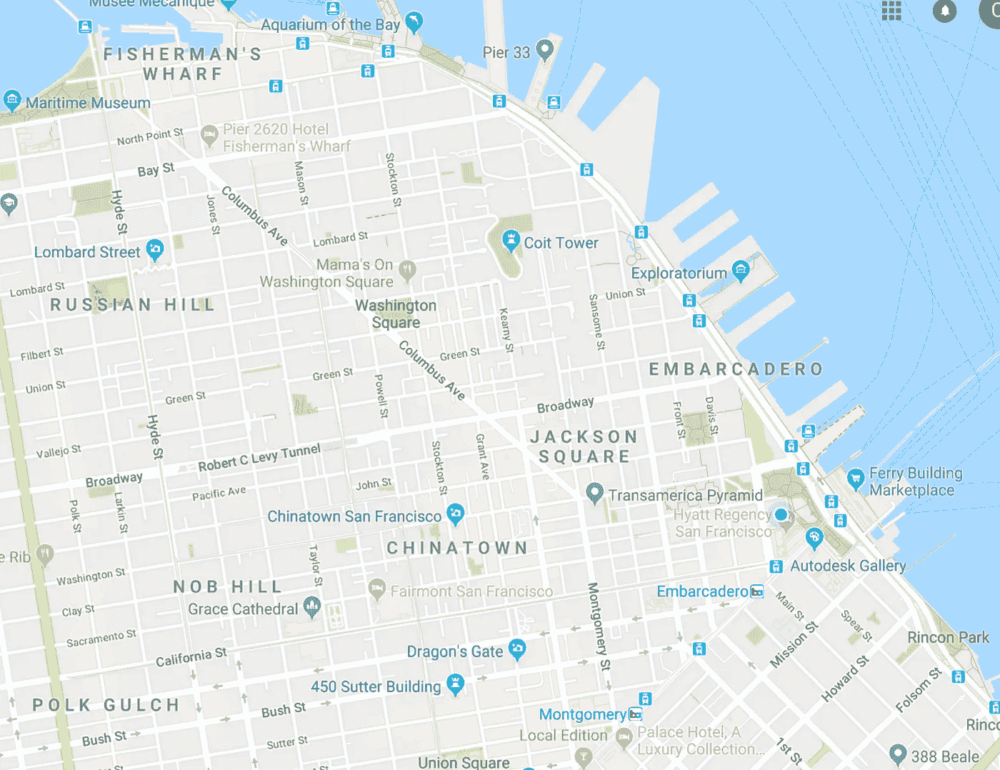

# kMeans 对地图数据进行哈希搜索

> 原文：<https://towardsdatascience.com/kmeans-hash-search-map-search-in-o-n%C2%B2lgn-33743ece434f?source=collection_archive---------11----------------------->

kMeans 聚类算法因其作为“无监督人工智能”学习算法的分类而非常受欢迎。这种聚类的工作原理是将数据集的要素组合在一起，以区分实体。实体可以是地理上的一个地方，例如加利福尼亚的旧金山。

当你长时间使用谷歌地图 API 处理街道数据时，你会产生一种新的语感。纬度/液化天然气坐标系统是观察庞大社会的一种不可思议的方式。您甚至可以立即认出下图中的 JSON 坐标是在美国还是在英国。

```
{ lat: 36.778, lng: -119.4179 }
```

当我们试图理解像旧金山湾区这样的大规模道路网络时，(如下图)。我们意识到我们需要开发二维(lat/lng)空间的搜索算法。



San Francisco Road Map

旧金山有很多很酷的地方可以看，初创公司也有很多机会找到很酷的办公场所并招募他们的团队。然而，对于我们当前的算法来说，搜索给定半径内的地点并计算最短路径并不容易。

从计算复杂性的角度来看，使用地图数据和创建地图用户界面的问题在于这些数据的巨大复杂性。以运行在 O(n log n)中的 mergsort 等传统排序算法为例。这个算法只适用于一维向量空间。而使用某种径向基函数将 lat / lng 映射到一维坐标平面可能是一种有效的解决方案。本文将讨论开发一种搜索算法，同时保持更自然的二维 lat/lng 数据集。

在现代计算机系统中对道路网络数据建模的标准是图形数据库。图被表示为 n×n 矩阵，其中 n[i][j]处的值包含节点之间的距离。然而，典型的道路数据被编码为一个非常精细的矩阵，lat/lng 十进制值跟踪到 7 位。L1/曼哈顿纬度/液化天然气距离将唐人街(SF)和恩巴卡德罗路(SF)区分为. 000008，这并不罕见。

由于这个原因，在将 lat/lng 全部乘以大约 10，000，000 后，在我们的数据集中开始编码可能是有用的。这样，在使用图形数据库搜索道路地图的几何图形之后，我们可以很容易地用“500 英尺”来表示距离。

怎样才能用拓扑几何加速空间查询？

旅行商问题可以说是计算机科学中最著名的 NP 难问题。此问题计算通过迷宫(如道路网络)并到达最终目的地所需的最短时间。

正如许多旅行者所知，在一个大城市的道路网络中导航以计划最终的假期是非常困难的。

以旧金山为例:

第一天:{观景廊/渔人码头/日本广场/小意大利/唐人街/甲骨文球馆/美国电话电报公司球馆/金门公园}

这些令人惊叹的旅游目的地都可以组织成一系列

```
{ lat: (float), lng: (float) }
```

使用地图需要大量的数据工程和管道来帮助纠正维度失衡和填充缺失的数据点。

数据工程:将 XML 转换成 JSON。我们的大部分处理都是在 csv 文件和 JSON 文件上完成的，前者在 Python 中容易阅读，后者在 JavaScript 中容易阅读。JavaScript 特别有用，因为它可以连接前端、后端和数据库逻辑，构建强大的 web 应用程序。

研究地理边界数据时，您可能会发现 XML 格式的数据，如下所示:

```
<state name="Minnesota" colour="#0000ff">
<point lat="43.5008" lng="-96.4517"/>
<point lat="43.5017" lng="-91.2195"/>
<point lat="43.8226" lng="-91.3101"/>
<point lat="43.9651" lng="-91.4914"/>
<point lat="44.1113" lng="-91.7084"/>
<point lat="44.2806" lng="-91.8951"/>
<point lat="44.3710" lng="-91.9556"/>
<point lat="44.4357" lng="-92.2083"/>
<point lat="44.5513" lng="-92.3360"/>
```

我们需要编写一个 python 脚本来将它转换成一个字符串列表，我们可以将它硬编码成 JavaScript 来概括这些状态。

```
var MinnesotaCoords = [
 {lat: 36.9971, lng: -109.0448 },
 {lat: 31.3337, lng: -109.0489 },
 {lat: 31.3349, lng: -108.2140 },
 {lat: 31.7795, lng: -108.2071 },
 {lat: 31.7830, lng: -106.5317 },
 {lat: 32.0034, lng: -106.6223 },
 {lat: 31.9999, lng: -103.0696 },
 {lat: 36.9982, lng: -103.0023 },
 {lat: 36.9982, lng: -109.0475 },
];
```

一旦你有了这些，你将能够使用 kMeans 算法来组织地理信息，比如下面用 Python 写的大量代码块。

```
pointSet = [["Arizona (AZ)", 34.054455, -111.293573], ["Arkansas (AR)", 35.201050, -91.831833],
 ["California (CA)", 36.778261, -119.417932], ["Colorado (CO)", 39.550051, -105.782067], 
 ["Connecticut (CT)", 41.603221, -73.087749], ["Florida (FL)", 27.664827, -81.515754], 
 ["Georgia (GA)", 32.165622, -82.900075], ["Illinois (IL)", 40.633125, -89.398528], 
 ["Maryland (MD)", 39.045755, -76.641271], ["Michigan (MI)", 44.314844, -85.602364] ];
cluster1 = []
cluster2 = []
cluster3 = []
cluster4 = []
cluster5 = []
def calculateDistance(a,b):
    return (abs(a[1] - b[1]) + abs(a[2] - b[2]))
def getMeanValue(pointSet):
    xSum = 0
    ySum = 0
    for i in range(len(pointSet)):
        xSum += pointSet[i][1]
        ySum += pointSet[i][2]
    xAvg = 0
    yAvg = 0
    if (len(pointSet) != 0):
        xAvg = xSum / len(pointSet)
        yAvg = ySum / len(pointSet)
    return ["DimensionFill", xAvg, yAvg]
def initializeCentroids(pointSet):
    mean = getMeanValue(pointSet)
    centroid1 = ["DimensionFill", mean[1] + 10, mean[2] + 10]
    centroid2 = ["DimensionFill", mean[1] + 5, mean[2] - 5]
    centroid3 = ["DimensionFill", mean[1], mean[2]]
    centroid4 = ["DimensionFill", mean[1] - 5, mean[2] - 5]
    centroid5 = ["DimensionFill", mean[1] - 10, mean[2] - 10]
    return [centroid1, centroid2, centroid3, centroid4, centroid5]

centroids = initializeCentroids(pointSet)
centroid1 = centroids[0]
centroid2 = centroids[1]
centroid3 = centroids[2]
centroid4 = centroids[3]
centroid5 = centroids[4]
j = 1
for i in range(len(pointSet)):
    dist1 = calculateDistance(pointSet[i], centroid1)
    dist2 = calculateDistance(pointSet[i], centroid2)
    dist3 = calculateDistance(pointSet[i], centroid3)
    dist4 = calculateDistance(pointSet[i], centroid4)
    dist5 = calculateDistance(pointSet[i], centroid5)
    if (dist1 < dist2 and dist1 < dist3 and dist1 < dist4 and dist1 < dist5):
        cluster1.append(pointSet[i])
    elif (dist2 < dist1 and dist2 < dist3 and dist2 < dist4 and dist2 < dist5):
        cluster2.append(pointSet[i])
    elif (dist3 < dist1 and dist3 < dist2 and dist3 < dist4 and dist3 < dist5):
        cluster3.append(pointSet[i])
    elif (dist4 < dist1 and dist4 < dist2 and dist4 < dist3 and dist4 < dist5):
        cluster4.append(pointSet[i])
    else:
        cluster5.append(pointSet[i])
# j is number of iterations for kMeans
j = 5
while (j > 0):
    newCluster1 = []
    newCluster2 = []
    newCluster3 = []
    newCluster4 = []
    newCluster5 = []
    for k in range(len(cluster1)):
        dist1 = calculateDistance(cluster1[k], centroid1)
        dist2 = calculateDistance(cluster1[k], centroid2)
        dist3 = calculateDistance(cluster1[k], centroid3)
        dist4 = calculateDistance(cluster1[k], centroid4)
        dist5 = calculateDistance(cluster1[k], centroid5)
        if (dist1 < dist2 and dist1 < dist3 and dist1 < dist4 and dist1 < dist5):
            newCluster1.append(cluster1[k])
        elif (dist2 < dist1 and dist2 < dist3 and dist2 < dist4 and dist2 < dist5):
            newCluster2.append(cluster1[k])
        elif (dist3 < dist1 and dist3 < dist2 and dist3 < dist4 and dist3 < dist5):
            newCluster3.append(cluster1[k])
        elif (dist4 < dist1 and dist4 < dist2 and dist4 < dist3 and dist4 < dist5):
            newCluster4.append(cluster1[k])
        else:
            newCluster5.append(cluster1[k])
    for k in range(len(cluster2)):
        dist1 = calculateDistance(cluster2[k], centroid1)
        dist2 = calculateDistance(cluster2[k], centroid2)
        dist3 = calculateDistance(cluster2[k], centroid3)
        dist4 = calculateDistance(cluster2[k], centroid4)
        dist5 = calculateDistance(cluster2[k], centroid5)
        if (dist1 < dist2 and dist1 < dist3 and dist1 < dist4 and dist1 < dist5):
            newCluster1.append(cluster2[k])
        elif (dist2 < dist1 and dist2 < dist3 and dist2 < dist4 and dist2 < dist5):
            newCluster2.append(cluster2[k])
        elif (dist3 < dist1 and dist3 < dist2 and dist3 < dist4 and dist3 < dist5):
            newCluster3.append(cluster2[k])
        elif (dist4 < dist1 and dist4 < dist2 and dist4 < dist3 and dist4 < dist5):
            newCluster4.append(cluster2[k])
        else:
            newCluster5.append(cluster2[k])
    for k in range(len(cluster3)):
        dist1 = calculateDistance(cluster3[k], centroid1)
        dist2 = calculateDistance(cluster3[k], centroid2)
        dist3 = calculateDistance(cluster3[k], centroid3)
        dist4 = calculateDistance(cluster3[k], centroid4)
        dist5 = calculateDistance(cluster3[k], centroid5)
        if (dist1 < dist2 and dist1 < dist3 and dist1 < dist4 and dist1 < dist5):
            newCluster1.append(cluster3[k])
        elif (dist2 < dist1 and dist2 < dist3 and dist2 < dist4 and dist2 < dist5):
            newCluster2.append(cluster3[k])
        elif (dist3 < dist1 and dist3 < dist2 and dist3 < dist4 and dist3 < dist5):
            newCluster3.append(cluster3[k])
        elif (dist4 < dist1 and dist4 < dist2 and dist4 < dist3 and dist4 < dist5):
            newCluster4.append(cluster3[k])
        else:
            newCluster5.push(cluster3[k])
    for k in range(len(cluster4)):
        dist1 = calculateDistance(cluster4[k], centroid1)
        dist2 = calculateDistance(cluster4[k], centroid2)
        dist3 = calculateDistance(cluster4[k], centroid3)
        dist4 = calculateDistance(cluster4[k], centroid4)
        dist5 = calculateDistance(cluster4[k], centroid5)
        if (dist1 < dist2 and dist1 < dist3 and dist1 < dist4 and dist1 < dist5):
            newCluster1.append(cluster4[k])
        elif (dist2 < dist1 and dist2 < dist3 and dist2 < dist4 and dist2 < dist5):
            newCluster2.append(cluster4[k])
        elif (dist3 < dist1 and dist3 < dist2 and dist3 < dist4 and dist3 < dist5):
            newCluster3.append(cluster4[k])
        elif (dist4 < dist1 and dist4 < dist2 and dist4 < dist3 and dist4 < dist5):
            newCluster4.append(cluster4[k])
        else:
            newCluster5.push(cluster4[k])
    for k in range(len(cluster5)):
        dist1 = calculateDistance(cluster5[k], centroid1)
        dist2 = calculateDistance(cluster5[k], centroid2)
        dist3 = calculateDistance(cluster5[k], centroid3)
        dist4 = calculateDistance(cluster5[k], centroid4)
        dist5 = calculateDistance(cluster5[k], centroid5)
        if (dist1 < dist2 and dist1 < dist3 and dist1 < dist4 and dist1 < dist5):
            newCluster1.append(cluster5[k])
        elif (dist2 < dist1 and dist2 < dist3 and dist2 < dist4 and dist2 < dist5):
            newCluster2.append(cluster5[k])
        elif (dist3 < dist1 and dist3 < dist2 and dist3 < dist4 and dist3 < dist5):
            newCluster3.append(cluster5[k])
        elif (dist4 < dist1 and dist4 < dist2 and dist4 < dist3 and dist4 < dist5):
            newCluster4.append(cluster5[k])
        else:
            newCluster5.append(cluster5[k])
    cluster1 = newCluster1
    cluster2 = newCluster2
    cluster3 = newCluster3
    cluster4 = newCluster4
    cluster5 = newCluster5
    centroid1 = getMeanValue(cluster1)
    centroid2 = getMeanValue(cluster2)
    centroid3 = getMeanValue(cluster3)
    centroid4 = getMeanValue(cluster4)
    centroid5 = getMeanValue(cluster5)
    j -= 1print("Cluster1")
print(cluster1)
print("Cluster2")
print(cluster2)
print("Cluster3")
print(cluster3)
print("Cluster4")
print(cluster4)
print("Cluster5")
print(cluster5)
print("Centroid 1")
print(centroid1)
print("Centroid 2")
print(centroid2)
print("Centroid 3")
print(centroid3)
print("Centroid 4")
print(centroid4)
print("Centroid 5")
print(centroid5)
```

如果你觉得这段代码有用，请查看我的开源 Github 库和我参与的其他代码项目:[https://github.com/CShorten](https://github.com/CShorten)

另外，请在媒体上关注我，获取更多类似的文章，发表在[值得关注的](https://blog.usejournal.com/)。

# [CShorten](https://medium.com/@connorshorten300)

是佛罗里达大西洋大学的计算机科学学生。对软件经济学、深度学习和软件工程感兴趣。请关注我的频道，获取这些领域的更多文章。