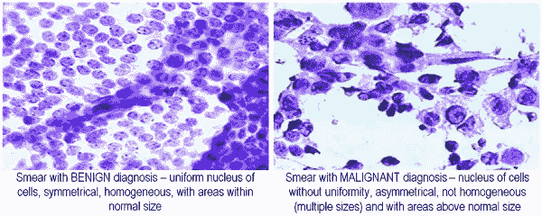
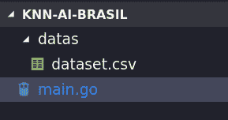

# KNN # 3——编码我们的乳腺癌分类器

> 原文：<https://towardsdatascience.com/knn-3-coding-our-breast-cancer-classifier-503b804988f8?source=collection_archive---------9----------------------->

## 给我看看代码！



为了开始这个项目，我们需要数据，让我们下载在之前的[文章](https://medium.com/brasil-ai/knn-k-nearest-neighbors-2-f2ab9e5662b)中看到的[乳腺癌威斯康星州](https://archive.ics.uci.edu/ml/datasets/Breast+Cancer+Wisconsin+%28Diagnostic%29)数据集。

阅读上一篇文章，您可以知道如何下载数据文件

在我们开始之前的一些观察，在我找到那个数据集之后，我在那里做了一些非常简单的修改:

*   我删除了 ID 列，因为它不能帮助我们对癌症类型进行分类；
*   我把班级列的位置改到了最后一列；

下载后，您有两个选择:

—通过此[链接](https://github.com/italojs/knn/blob/for-dummies/data.csv)下载我修改的一个数据集，方便 KNN 开发；

或者

—按部就班地执行，并使代码适应数据集；

好了，我们开始吧！首先，本教程的完整代码在 github 的这个[链接](https://github.com/italojs/knn/tree/for-dummies)上。

当您有了数据集后，让我们在项目文件夹中创建一个名为“datas”的文件夹，并将所有数据集放在那里。

在根文件夹中，我们将创建名为 main.go 的文件



我使用 VS 代码编辑器来开发这个算法，但是你可以使用任何你想要的其他文本/代码编辑器。

让我们定义包名并创建主函数。

为了开始我们的项目，我们需要将数据集加载到内存中，所以让我们创建一个方法来读取 csv 并返回一个数组给我们。

现在，我们的整个数据集都在变量" records "
中，如果我在终端中打印变量的值，我们将得到以下输出。

```
fmt.Println(records)…[7.76 24.54 47.92 181 0.05263 0.04362 0 0 0.1587 0.05884 0.3857 1.428 2.548 19.15 0.007189 0.00466 0 0 0.02676 0.002783 9.456 30.37 59.16 268.6 0.08996 0.06444 0 0 0.2871 B]]
```

然后我们有我们的数据集，我们将进行几次迭代，并应用我们在[文章# 1](https://medium.com/brasil-ai/knn-k-nearest-neighbors-1-e140c82e9c4e) 中看到的所有理论。
得到数据集后的下一步，将把它分割成 2 部分，第一部分是训练数据，第二部分是测试数据。
**训练数据**:这是已经分类的数据，我们将用它来训练我们的算法；
**测试数据:**是我们用来验证我们算法准确性的分类数据；
让我们将数据集划分如下，对于每个类，我们将获得 70%的数据训练，每个类的剩余部分(30%)用于测试。

首先让我们从数据集中提取唯一的类，为此我们将使用以下逻辑；
- >从我们的数据集(记录)中提取包含类值的列；
->Make distinct()清除重复值从而得到我们唯一的类；

**【getcolum(…)】**

getCollum 方法接收一个矩阵和一个列索引作为参数，所以我们使用 column index 变量进入矩阵的列索引，并且对于该列中的每一行，我们将它添加到一个我们将要返回的新数组中。

**【独特(……)】**

通过 getcolum 返回，我们将把这个值传递给 distict()方法，该方法接收一个数组作为参数，并且对于这个数组的每个元素:
- >验证这个相同的元素是否在“en centred”映射(字典)
- >中，如果它不存在，它将把这个元素添加到“en centred”映射变量
- >中，如果它存在，什么也不做；最后，我们将把地图放回没有重复分类的地方。
当我们打印值“classes”时 **fmt。Println (classes)** 我们将拥有一个包含两个值的数组【M，B】
让我们遍历这些类，从每个类中获取 70%的数据用于训练，30%的数据用于测试。

让我们用 70%和 30%的数据创建我们的训练矩阵和测试矩阵；

getValuesByClass()方法接收一个数组和一个类，所以我们将过滤我们的数组以获得特定的类数据。
在第一次迭代中，数组中的值对应于单个类，例如:m。
在第二次类循环迭代中，变量“values”将包含对应于类:b 的数据。
在我们仅过滤了对应于某个类的数据后，我们需要将它划分为训练数据和测试数据，我们将在以下代码中执行此操作:

当我们将测试和训练数据放入循环的范围时，让我们将数组放入循环范围之外。

我知道，用一个循环来连接一个数组/片并不是最好的方法，但是请记住，我是以我所能做到的最有启发性的方式来编码的，所以请随意修改它。
分离数据后，我们来测试一下！
让我们对测试数据集中的每一行进行排序，并统计我们命中了多少行，错过了多少行。

最后我们可以打印一些小东西:

```
fmt.Println(“Total de dados: “, len(records))
 fmt.Println(“Total de treinamento: “, len(train))
 fmt.Println(“Total de testes: “, len(test))
 fmt.Println(“Total de acertos: “, hits)
 fmt.Println(“Porcentagem de acertos: “, (100 * hits / len(test)),   “%”)
```

最后，当我们在终端中运行“go run main.go”时，我们将得到以下结果:

```
Total de dados: 569
Total de treinamento: 513
Total de testes: 513
Total de acertos: 484
Porcentagem de acertos: 94 %
```

在这种情况下，人们对哈林 22 岁以下的孩子进行了分类:

如果你想看看你的算法的命中和错误数据，我们可以通过取消注释上面要点的第 22 行来打印测试数据的分类:

```
//fmt.Println(“tumor: “, test[i][columnIndex], “ classificado como:
```

e .泰雷莫斯·塞吉特·萨伊达:

我们将得到以下输出:

```
tumor: M classificado como: B
tumor: M classificado como: M
tumor: M classificado como: M
tumor: M classificado como: M
tumor: M classificado como: M
tumor: M classificado como: M
tumor: B classificado como: B
tumor: B classificado como: B
tumor: B classificado como: B
tumor: B classificado como: B
tumor: B classificado como: B
tumor: B classificado como: B
tumor: B classificado como: B
tumor: B classificado como: B
Total de dados: 569
Total de treinamento: 513
Total de testes: 513
Total de acertos: 479
Porcentagem de acertos: 93 %
```

感谢阅读所有内容，希望你觉得很有用。