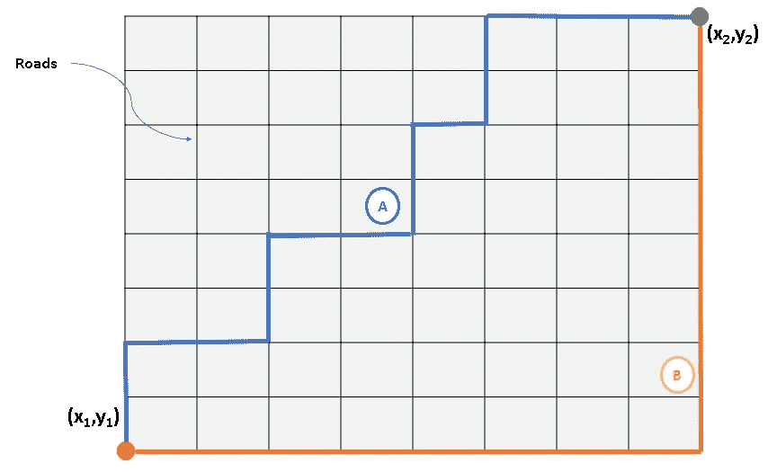
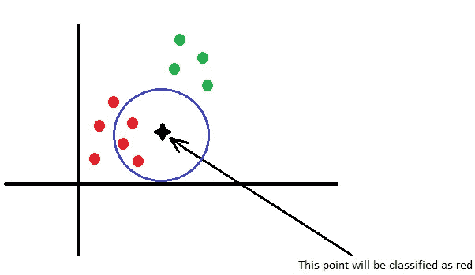
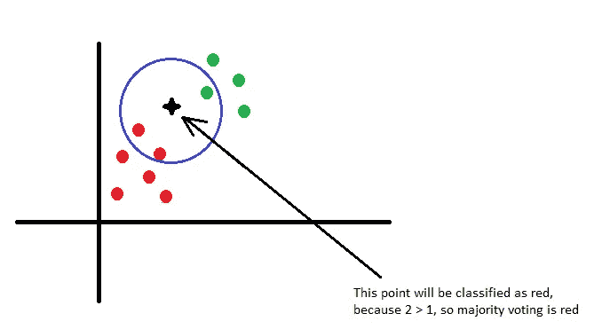
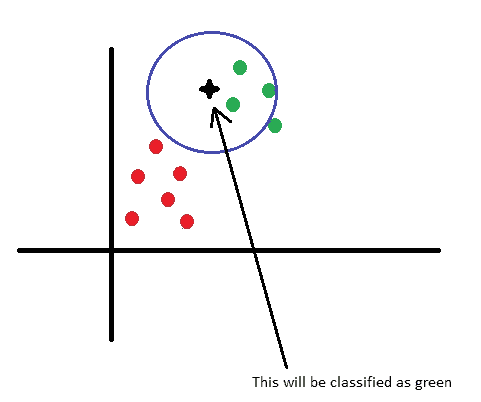
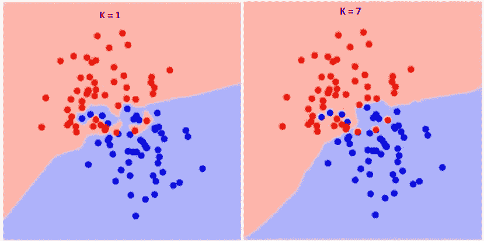
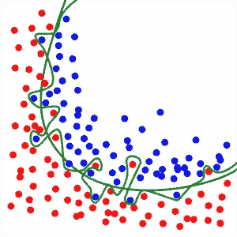
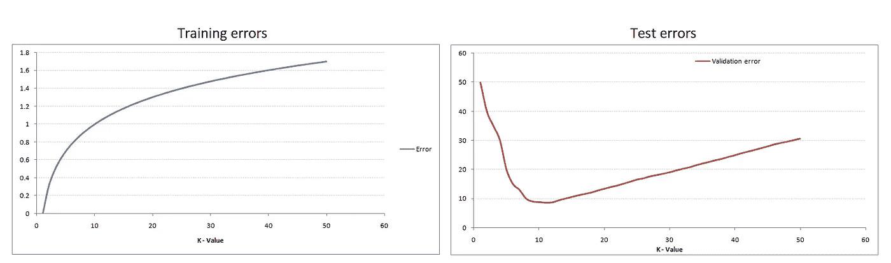
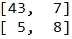
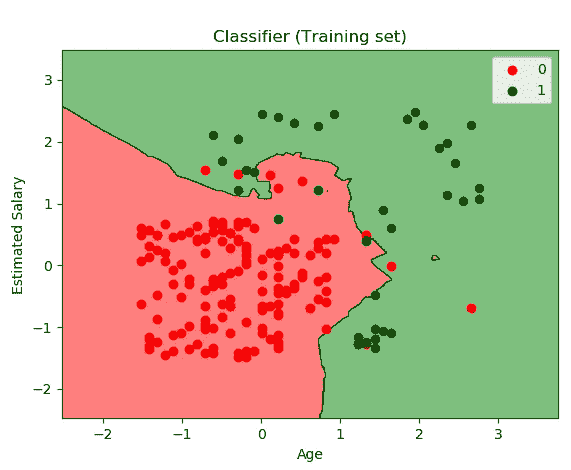
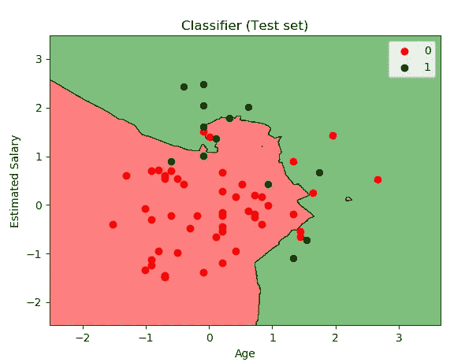

# 蟒蛇皮 KNN

> 原文：<https://towardsdatascience.com/knn-in-python-835643e2fb53?source=collection_archive---------7----------------------->


Photo by <a href=”[https://stocksnap.io/author/11667](https://stocksnap.io/author/11667)">Henry Lorenzatto</a> from <a href=”[https://stocksnap.io](https://stocksnap.io)">StockSnap</a>

# 摘要

在这篇文章中，你将了解到一个非常简单的但**强大的**算法，叫做 **KNN** 或**K-最近邻**。第一部分将包含该算法的详细而清晰的解释。在本文的最后，你可以找到一个使用 KNN(用 python 实现)的例子。

# KNN 解释道

KNN 是一种非常流行的算法，它是十大人工智能算法之一(参见[十大人工智能算法](/a-tour-of-the-top-10-algorithms-for-machine-learning-newbies-dde4edffae11))。它的流行源于这样一个事实，即它非常容易理解和解释，但很多时候它的准确性与其他更复杂的算法相当，甚至更好。

**KNN** 是一种**监督算法**(这意味着训练数据被标记，参见[监督和非监督算法](https://machinelearningmastery.com/supervised-and-unsupervised-machine-learning-algorithms/))，它是**非参数**和**懒惰(基于实例)**。

为什么是懒？因为它**不显式学习模型**，但它**保存所有训练数据**并使用整个训练集进行分类或预测。这与其他技术形成对比，如 **SVM，**你可以毫无问题地丢弃所有非支持向量。

这意味着**训练过程非常快**，它只是保存数据集中的所有值。真正的问题是**巨大的内存消耗**(因为我们必须存储所有的数据)和**在测试时间**的时间复杂度(因为给定的观察分类需要运行整个数据集)。但总的来说，在小数据集的情况下(或者如果你有大量的时间和内存)或出于教育目的，这是一个非常有用的算法。

另一个重要的假设是，该算法要求**数据在度量空间**中。这意味着我们**可以定义** **度量来计算数据点之间的距离**。定义距离度量可能是一个真正的挑战(参见[最近邻分类和检索](http://vlm1.uta.edu/~athitsos/nearest_neighbors/))。一个有趣的想法是使用机器学习来寻找距离度量(主要是通过将数据转换到向量空间，将对象之间的差异表示为向量之间的距离并学习那些差异，但这是另一个主题，我们稍后会谈到这一点)。

最常用的距离度量是:

*   **欧几里德距离**:

这是我们在日常生活中使用的几何距离。它的计算方法是两个感兴趣点的平方差之和的平方根。


公式在 2D 空间中:


*   **曼哈顿距离**:

使用绝对差的和计算实向量之间的距离。也叫**城市街区距离**。你可以把这想象成在一个组织成矩阵的城市中行走(或者在曼哈顿行走)。街道是矩阵中小方块的边缘。如果你想从方块 A 到方块 B，你必须走在小方块的边缘。这比欧几里得距离要长，因为你不是从 A 到 B 一直走，而是之字形。



公式在 2D 空间中:


*   **闵可夫斯基距离**:欧几里德距离和曼哈顿距离的推广。计算 N 维距离的通用公式(见[闵可夫斯基距离](https://en.wikipedia.org/wiki/Minkowski_distance))。
*   **汉明距离**:计算二元向量之间的距离(参见[汉明距离](https://en.wikipedia.org/wiki/Hamming_distance))。

# KNN 用于分类

非正式的**分类**意味着我们有一些**标记的示例**(训练数据)，对于新的**未标记的示例**(测试集)**我们希望基于训练集的经验教训分配标签**。

正如我前面所说，KNN 算法是懒惰的，在训练阶段没有学习或推广。实际工作是在分类或预测时完成的。

KNN 算法的步骤是(**形式伪代码**):

1.  为来自**训练集**的所有 ***i*** 数据点初始化 ***selectedi = 0***
2.  选择一个**距离度量**(假设我们使用欧几里德距离)
3.  对于每个训练集数据点 ***i*** 计算***distance ei***=新数据点与训练点 ***i*** 之间的距离
4.  选择算法的 **K** 参数( **K =考虑的邻居数量**)，通常是奇数，这样可以避免多数投票中出现平局
5.  对于 ***j = 1 到 K*** 循环通过****所有的训练集数据点**，并在每一步中选择与新观测值具有最小距离的点**(最小 ***距离*** )****
6.  **对于**每个现有类别**计算 K 个选定数据点中有多少是该类别的一部分(**投票****
7.  **将具有最大**计数(最高票数)的班级分配给新的观察——这是**多数投票**。****

**好吧，可能上面的正式伪代码有点难以理解，所以我们来看看**非正式解释**。**

**主要思想是，对于新的观察，我们搜索 K 个最近点(具有最小距离)。这些点将通过多数表决来定义新观察的类别。**

**例如，如果我们有两个类，红色和绿色，在计算距离并获得 3 个最近的点之后，其中 2 个是红色，1 个是绿色，那么通过多数投票选择的类是红色(2 > 1)。**

**如果我们不得不面对以下情况:**

****

**我们有两个班，红色和绿色和一个新的观察，黑色的星星。我们选择 K = 3，因此我们将考虑距离新观测值最小的 3 个点。该恒星接近 3 个红点，因此很明显，这个新观测结果将被归类为红点。**

****

**在上面的图片中，我把星星移近了绿点。在这种情况下，我们选择了 2 个红色点和 1 个绿色点。因为 2 > 1，所以这颗星仍然被归类为红色。**

****

**随着我们越来越靠近绿点，选择红色作为标签的信心下降，直到新的观察结果将被分类为绿色。这是红色阶级和绿色阶级的**界限**，不同国家的情况也是如此。所以从不同的角度来看，我们可以说用这个算法我们**建立了类的边界**。边界由 K 值控制**。小 K 将导致清晰的边界，而大 K 将导致平滑的边界。最有趣也是最重要的部分，就是在你的特定数据集的背景下，如何选择 K 的最佳值。在下面几节中，我们将看到如何选择 k 的最佳值。****

**我在上面描述的**并不一定意味着**KNN 算法将总是**线性比较**测试样本和训练数据，就好像它是一个列表一样。训练数据可以用不同的结构表示，如 [K-D 树](https://en.wikipedia.org/wiki/K-d_tree)或[球树](https://en.wikipedia.org/wiki/Ball_tree)。**

**另一个改进是我们可以**为分类中更重要的属性**分配权重。这样，如果我们知道在我们的数据集中有一些重要的属性需要考虑，我们可以给它们分配更高的权重。这将导致它们在给新的观察分配标签时具有**更大的影响。权重可以是**统一的**(所有邻居的同等优势)或**与邻居到测试样本的距离**成反比。你也可以设计自己的权重分配算法(例如使用另一种人工智能算法来寻找最重要的属性，并给它们分配更高的权重)。****

# **KNN 预测**

**KNN 算法也可用于**预测新值**。最常见的例子是用 KNN 预测某物(房子、汽车等)的价格。)基于训练数据。为了预测新值，KNN 算法几乎是相同的。在预测**的情况下，我们计算 K 个最相似的点**(相似性的度量必须由用户定义)，并且基于这些点，我们可以使用公式预测新的值**，例如**平均**、**加权平均**等。所以思路是一样的，**定义度量**计算距离(这里是相似度)，**选择 K 个最相似的点**然后使用一个**公式**基于选择的 K 个点预测新值。****

# **计算的复杂性**

**为了计算 KNN 的计算复杂度，让我们考虑一个 **d** 维空间， **k** 是邻居的数量， **n** 是训练数据点的总数。**

**要了解我们如何计算这个算法的复杂度，请看看正式的[伪代码](#pseudocode)！每次距离计算都需要 **O(d)** 运行时，所以第三步需要 **O(nd)** 工作。对于第五步中的每次迭代，我们通过循环训练集观察来执行 **O(n)** 工作，因此整个步骤需要 **O(nk)** 工作。第一步只需要 **O(n)** 工作，所以我们得到一个 **O(nd + kn)** 运行时。如果我们使用[快速选择](https://en.wikipedia.org/wiki/Median_of_medians)算法来选择具有最小距离的 K 个点，我们可以将这个运行时间复杂度降低到 **O(nd)** 。**

# **如何为你的数据集选择最好的 K**

**您可能想知道，如何找到 K 的最佳值来最大化分类或预测的准确性。首先我必须提到的是， **K 是一个** **超参数**，这意味着这个参数是由你，开发者选择的。我前面说过，你可以把 K 想象成控制决策边界的参数。例如:**

****

**正如你所看到的，如果 K=1，边界非常尖锐，呈之字形，但在 K = 7 的情况下，边界更平滑。因此，随着 K 值的增加，边界变得更加平滑。如果 K 是无穷大，那么所有的东西都是蓝色或红色的，基于总多数。**

****训练误差率**和**验证误差率**是我们在选择正确的 k 时需要考虑的两个参数，如果训练误差很低但测试误差很高，那么我们就要讨论关于**过拟合**的问题了。**

****过拟合**发生在**模型学习**训练数据中的**细节** **和噪声**到了**对模型在新数据**上的性能产生负面影响的程度。这意味着训练数据**中的**噪声或随机波动**被模型拾取并学习为概念**。**

**比较过度拟合和常规边界:**

****

****绿色** **线**代表**过拟合** **模型****黑色** **线**代表**规则化模型**。虽然绿线最符合训练数据，但它过于依赖该数据，并且与黑线相比，它可能对新的、看不见的数据具有更高的错误率。**

****欠拟合**是指既不能对训练数据建模，也不能推广到新数据的模型。例如，对非线性数据使用线性算法将会有很差的性能。**

**我们必须找到中庸之道，有一个模型，可以很好地推广到新的数据，但不是太好，避免学习噪音和避免过度拟合。**

**如果我们表示训练错误率和测试错误率，我们将得到如下一些图表:**

****

**如您所见，当 K=1 时，训练误差为 0，因为任何训练数据点的接近点都是其自身。如果我们看看测试误差，当 K=1 时，误差非常高，这是正常的，因为我们有过拟合。随着 K 值的增加，测试误差率下降，直到达到最小值，之后误差开始再次增加。所以基本上寻找最佳 K 的问题是一个最优化问题，在曲线上寻找最小值。这种叫做**弯头**T42 的方法，因为测试误差曲线看起来像一个弯头。**

**结论是为了找到最佳 K 值，使用肘形法并在曲线上找到最小值。这可以通过蛮力很容易地完成，通过多次运行模型，每次增加 K 的值。找到最佳 K 的有效方法是使用 **K-Fold 交叉验证**，但我们将在最后一章(提升 AI 算法)中讨论这一点。**

# **使用 Python 的 KNN 示例**

**在本例中，我们将使用 Social_Networks_Ads.csv 文件，该文件包含有关用户的信息，如性别、年龄、工资。**购买栏**包含用户的**标签**。这是一个**二元分类**(我们有两个类)。如果**标签为 1** 则意味着用户**已经购买了产品 X** ，而 **0** 则意味着用户**还没有购买**该特定产品。**

**这里可以下载文件:[社交 _ 网络 _ 广告](http://dummyprogramming.com/wp-content/uploads/2018/08/Social_Network_Ads.csv)。**

**在这个例子中，我们将使用以下库: **numpy、pandas、sklearn 和 motplotlib。****

**第一步是导出数据集。**

```
# Importing the libraries
import numpy as np
import matplotlib.pyplot as plt
import pandas as pd# Importing the dataset
dataset = pd.read_csv('Social_Network_Ads.csv')
X = dataset.iloc[:, [2, 3]].values
y = dataset.iloc[:, 4].values
```

**这是一个简单的任务，因为 pandas 库包含了 **read_csv** 方法，该方法读取我们的数据并将其保存在一个名为 [DataFrame](https://pandas.pydata.org/pandas-docs/stable/generated/pandas.DataFrame.html) 的数据结构中。**

**来自 **sklearn** 库**的大多数算法要求**属性和标签在单独的变量中，所以我们必须解析我们的数据。**

**在本例中(因为我们想用二维图表表示数据),我们将只使用年龄和工资来训练我们的模型。如果打开文件，可以看到前两列是用户的 ID 和性别。我们不想考虑这些属性。**

****X 包含属性**。因为我们不想考虑前两列，所以我们将只复制第 2 列和第 3 列(见第 8 行)。**

****标签**在第 4 列，所以我们将把这一列复制到变量 **y** 中(见第 9 行)。**

**下一步是**将我们的数据分成两个不同的块**，一个将用于**训练**我们的数据，另一个将用于**测试**我们模型的结果(测试属性将是新的观察结果，预测标签将与测试集中的标签进行比较)。**

```
# Splitting the dataset into the Training set and Test set
from sklearn.model_selection import train_test_split
X_train, X_test, y_train, y_test = train_test_split(X, y, test_size = 0.25, random_state = 0)
```

**这是另一个简单的任务，因为 sklearn 有一个名为 [**train_test_split**](http://scikit-learn.org/stable/modules/generated/sklearn.model_selection.train_test_split.html) 的方法，它将拆分我们的数据集，返回 4 个值，即火车属性(X_train)、测试属性(X_test)、火车标签(y_train)和测试标签(y_test)。通常的设置是将**数据集的 25%用于测试，75%用于训练**。如果您愿意，可以使用其他设置。**

**现在再看一遍数据集。您可以观察到“薪水”列中的值比“年龄”列中的值高得多。这可能是个问题，因为薪水栏的影响会高得多。你想想看，如果你有 10000 和 9000 这两个非常接近的工资，计算它们之间的距离，结果是 10000–9000 = 1000。现在，如果您将年龄列的值设为 10 和 9，则差值为 10–9 = 1，影响较小(与 1000 相比，10 非常小，就像您有加权属性一样)。**

```
from sklearn.preprocessing import StandardScaler
sc = StandardScaler()
X_train = sc.fit_transform(X_train)
X_test = sc.transform(X_test)
```

**为了解决这个量级问题，我们必须缩放属性。为此我们使用了 sklearn 的[**standard scaler**](http://scikit-learn.org/stable/modules/generated/sklearn.preprocessing.StandardScaler.html)**。****

****下一步是训练模型:****

```
**# Fitting classifier to the Training set
from sklearn.neighbors import KNeighborsClassifier
classifier = KNeighborsClassifier(n_neighbors = 2)
classifier.fit(X_train, y_train)**
```

****我们从 sklearn 导入[**KNeighborsClassifier**](http://scikit-learn.org/stable/modules/generated/sklearn.neighbors.KNeighborsClassifier.html)。这需要多个参数。**最重要的** **参数**有:****

1.  ******n _ neighbors**:k 的值，考虑的邻居数量****
2.  ******权重**:如果您想使用加权属性，您可以在这里配置权重。这需要像统一、距离(到新点的反距离)或可调用这样的值，这些值应该由用户定义。默认值是统一的。****
3.  ******算法**:如果你想要一个不同的数据表示，这里你可以使用 ball_tree，kd_tree 或者 brute 这样的值，默认为 auto，试图自动选择当前数据集的最佳表示。****
4.  ******度量**:距离度量(欧几里德、曼哈顿等)，默认为欧几里德。****

****我们保留所有默认参数，但对于 n_neighbors，我们将使用 2(默认值为 5)。****

****如果您想要预测新观察值的类别，您可以使用以下代码:****

```
**# Predicting the Test set results
y_pred = classifier.predict(X_test)**
```

****下一步是评估我们的模型。为此，我们将使用[混淆矩阵](https://www.geeksforgeeks.org/confusion-matrix-machine-learning/)。****

```
**# Making the Confusion Matrix
from sklearn.metrics import confusion_matrix
cm = confusion_matrix(y_test, y_pred)**
```

****混淆矩阵的结果是:****

********

****正如你所看到的，我们只有 5 个假阳性和 7 个假阴性，这是一个非常好的结果(这里的准确率是 80%)。****

****最后一步是可视化决策边界。让我们从训练集的决策边界开始。****

```
**# Visualising the Training set results
from matplotlib.colors import ListedColormap
X_set, y_set = X_train, y_train
X1, X2 = np.meshgrid(np.arange(start = X_set[:, 0].min() - 1, stop = X_set[:, 0].max() + 1, step = 0.01),
                     np.arange(start = X_set[:, 1].min() - 1, stop = X_set[:, 1].max() + 1, step = 0.01))
plt.contourf(X1, X2, classifier.predict(np.array([X1.ravel(), X2.ravel()]).T).reshape(X1.shape),
             alpha = 0.75, cmap = ListedColormap(('red', 'green')))
plt.xlim(X1.min(), X1.max())
plt.ylim(X2.min(), X2.max())
for i, j in enumerate(np.unique(y_set)):
    plt.scatter(X_set[y_set == j, 0], X_set[y_set == j, 1],
                c = ListedColormap(('red', 'green'))(i), label = j)
plt.title('Classifier (Training set)')
plt.xlabel('Age')
plt.ylabel('Estimated Salary')
plt.legend()
plt.show()**
```

******meshgrid** 函数用一个 x 值数组和一个 y 值数组创建一个**矩形网格(这里 x = X1，y = X2)。******

******contourf** 方法**绘制填充轮廓**，所以我们用这个方法**用与之相关的类**的颜色填充背景。诀窍在于，对于每个像素 **，我们进行预测**，并用与预测类别相关的颜色对该像素进行着色。这里我们有两个类，我们用红色和绿色表示 0 和 1。****

****在行 10 和 12 a 之间，我们**循环所有训练数据点**，我们**预测它们的标签**，如果预测值为 0，将它们涂成红色，如果预测值为 1，将它们涂成绿色。****

****这段代码的结果是:****

********

****为了可视化测试集的边界，我们使用相同的代码，但是将 **X_set，y_set 改为 X_test，y_test。**运行代码来可视化测试集的边界的结果是:****

********

****正如你在上图中看到的，我们有一个非常好的模型，只有几个点被错误分类。****

# ****结论****

1.  ****KNN 算法非常**直观**和**易于理解******
2.  ******训练时间最短**，模型实际上不学习或推广****
3.  ******测试时间可能会很长**，因为算法在整个训练数据集上循环并计算距离(基于距离度量的类型和数据集的类型，距离计算可能是一项艰巨的工作)****
4.  ****对于**小 K 值**，算法可能对**噪声敏感并且容易过拟合******
5.  ******数据集应该是数字的**或一个**距离度量应该存在**以计算点之间的距离****
6.  ****在不平衡数据上表现不佳****

****[](https://ko-fi.com/zozoczako)****

****我真的很喜欢咖啡，因为它给了我写更多文章的能量。****

****如果你喜欢这篇文章，那么你可以请我喝杯咖啡来表达你的欣赏和支持！****

******成为媒介上的作家:**【https://czakozoltan08.medium.com/membership】T2****

# ****参考****

1.  ****[KNearestNeighbors 解释](https://medium.com/data-science-group-iitr/k-nearest-neighbors-knn-500f0d17c8f1)****
2.  ****[KNN 完整指南](https://kevinzakka.github.io/2016/07/13/k-nearest-neighbor/)****
3.  ****[机器学习中的过拟合和欠拟合](https://machinelearningmastery.com/overfitting-and-underfitting-with-machine-learning-algorithms/)****
4.  ****[KNN 详细介绍](https://saravananthirumuruganathan.wordpress.com/2010/05/17/a-detailed-introduction-to-k-nearest-neighbor-knn-algorithm/)****
5.  ****[Udemy —从 A 到 Z 的机器学习](https://www.udemy.com/machinelearning/learn/v4/t/lecture/5735502?start=0)****
6.  ****[KNN 计算复杂度](https://stats.stackexchange.com/questions/219655/k-nn-computational-complexity)****

****如果你**喜欢**这篇文章，并且你想**为**免费**学习**更多有趣的 AI 算法，请**订阅**！****