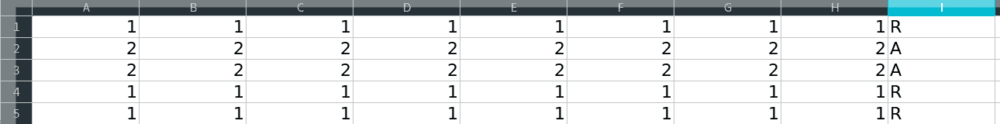
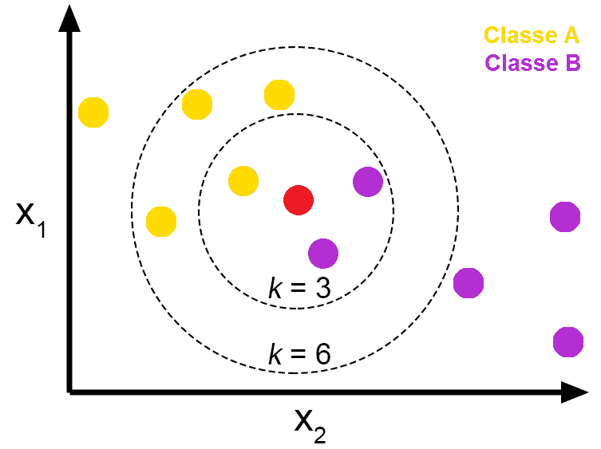
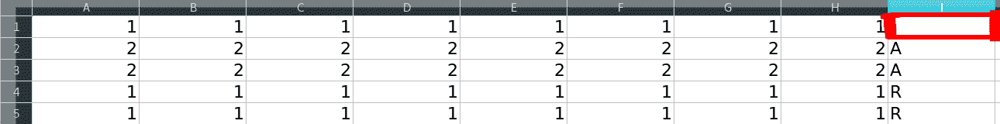

# KNN (K 近邻)#1

> 原文：<https://towardsdatascience.com/knn-k-nearest-neighbors-1-a4707b24bd1d?source=collection_archive---------1----------------------->

## 它是如何工作的

## KNN 是什么？

KNN(K-最近邻)是数据挖掘和机器学习中使用的许多(监督学习)算法之一，它是一种分类器算法，学习基于数据(向量)与其他数据(向量)的“相似程度”。

## 它是如何工作的？

KNN 非常简单，假设你有一个关于彩球的数据:

*   紫球；
*   黄色的球；
*   还有一个球，你不知道它是紫色还是黄色，但是你有这个颜色的所有数据(除了颜色标签)。

那么，你怎么知道球的颜色呢？想象你喜欢一台只有球的特征(数据)，没有最终标签的机器。你想知道球的颜色(最终标签/你的班级)吗？



Obs:让我们假设编号为 1(和标签 R)的数据指的是紫色的球，编号为 2(和标签 A)的数据指的是黄色的球，这只是为了使解释更容易，在以后的文章中我们将使用真实的数据。

每行表示一个球，每列表示一个球的特征，最后一列是每个球的类别(颜色):

*   **R** - >紫色；
*   **一种** - >黄色

我们有 5 个球(5 行)，每个球都有你的分类，你可以尝试用 N 种方法来发现新球的颜色(在这种情况下是类别)，这 N 种方法中的一种是将这个新球的特征与所有其他球进行比较，看看它看起来最像什么，如果这个新球(你不知道正确的类别)的数据(特征)与黄色球的数据相似， 那么新球的颜色是黄色，如果新球中的数据更类似于紫色然后是黄色的数据，那么新球的颜色是紫色，看起来很简单，这几乎就是 knn 所做的，但以最复杂的方式。

在 KNN 的例子中，实际上它并不“比较”新的(未分类的)数据和所有其他的，实际上他执行一个数学计算来测量数据之间的距离来进行分类，(那几乎是同样的事情)。我所说的这个计算可以是测量两点之间距离的任何其他计算，例如:欧几里得、曼哈顿、闵可夫斯基、加权...

**KNN 的步骤是:**

1 —接收未分类的数据；

2-测量新数据与所有其他已分类数据之间的距离(欧几里德距离、曼哈顿距离、闵可夫斯基距离或加权距离);

3-获取 K(K 是您定义的参数)较小的距离；

4-检查具有最短距离的类别列表，并计算出现的每个类别的数量；

5-将出现次数最多的类别视为正确类别；

6-用您在步骤 5 中采用的类对新数据进行分类；

下面我们有一张图片，上面是我们在本文中讨论的所有过程，您有一个未分类的数据(红色)和所有其他已分类的数据(黄色和紫色)，每个数据都属于您的类别(A 或 B)。因此，您计算新数据与所有其他数据的距离，以了解哪些数据具有最小的距离，因此您获得 3(或 6)个最接近的数据，并检查哪个类出现得最多，在下图的情况下，与新数据最接近的数据是在第一个圆圈内(圆圈内)的数据，在这个圆圈内有 3 个其他数据(已经用黄色分类)， 我们将检查哪个是主要的类，看，它是紫色的，因为有两个紫色的球，只有一个黄色的，所以这个以前没有分类的新数据，现在将被分类为紫色。



## 计算距离:

计算两点(您的新样本和数据集中的所有数据)之间的距离非常简单，如前所述，有几种方法可以获得该值，在本文中我们将使用欧几里德距离。

欧几里德距离的公式如下图所示:


等等，不要担心，它并没有听起来那么复杂，读完这篇文章并继续发现它很复杂，当我们进入代码时，你会看到它是多么简单。

使用此公式，您将检查数据集中 1 个点(您的未分类样本)和 1 个其他点(1 个其他已分类数据)之间的距离，在您的所有数据集中，一个接一个，计算结果越小，这两个数据之间最相似。是的，你将运行这个计算很多次，直到你已经在所有数据中运行它，当你这样做时，你将有一个数组(让我们用一个数组作为例子)你的未分类数据到另一个已经分类的数据的结果。

好，我们开始吧！这很简单，但慢慢读，基本上你会:

*   从数据集中获取每个特征；
*   减去每一个，例，(第 1 行，第 5 列)—(第 1 行，第 5 列)= X …(第 1 行，第 13 列)—(第 1 行，第 13 列)= Z；
*   在得到所有列的减法后，你将得到所有的结果，并将其 X+Y +Z 相加…
*   所以你会得到总和的平方根。

让我们使用前面工作表中的示例，但现在有 1 个未分类数据，这是我们想要发现的信息。

在这个例子中，我们有 5 个数据(行)，每个样本(数据/行)都有你的属性(特征)，让我们**想象**所有这些都是图像，每一行都是图像，每一列都是图像的像素。



所以让我们从上面解释混乱开始。

让我们取第一行，这是我们要分类的数据，让我们测量到第二行的欧几里德距离

**1 —减法**

让我们用第 2 行的属性减去第 1 行的每个属性(列)，例如:

```
(1–2) = -1
```

**2 —取幂:**

从第 1 行减去第 1 列，从第 2 行减去第 1 列，我们将得到平方根，因此结果数字始终为正数，例如:

```
(1–2)² = (-1)²(-1)² = 1
```

**3 —总和**

完成第 2 步后，对于第 1 行的所有列和第 2 行的所有列，我们将对所有这些结果进行求和，让我们使用电子表格的列图像做一个示例，我们将得到以下结果:


```
(1–2)² + (1–2)² + (1–2)² + (1–2)² + (1–2)² + (1–2)² + (1–2)² + 
(1–2)² = 8
```

请注意，我们在第 1 行和第 2 行都有 8 个属性列，我们为每个数据集的属性执行了第 2 步，因此最终结果是 8，但为什么是 8 呢？因为每次我们运行第 2 步，结果都是 1，出于“巧合”，我们在所有列中都有相同的数据，并且(1–2)的结果等于 1，所以我在这里使用这些值来简化数学，但是不，这个属性并不需要总是相同的数字，以后我们将在使用此算法实现代码时看到这一点。

**4—平方根:**

在执行了第 3 步之后，我们将得到减法的和的平方根。在第 3 步中，结果是 8，所以让我们取数字 8 的平方根:

```
√8 = 2,83 ou 8^(½) = 2,83
```

太棒了。现在你有了从第 1 行到第 2 行的欧几里得距离，看，它并没有那么难，你可以在一张简单的纸上完成！

现在，您只需要为数据集的所有行(从第 1 行到所有其他行)创建这些，在执行此操作时，您将获得第 1 行到所有其他行的欧几里德距离，然后您将对其进行排序以获得“k”(例如，k = 3)最小距离，因此您将检查哪个是出现最多的类，出现最多的类将是用于对第 1 行进行分类的类(以前没有对其进行分类)。

简单对吧。在接下来的文章中，我们将开始在 GO 中实现这个算法！不过不用担心，Go 的语法非常简单，您可以按照教程的内容，用自己的语言来应用它。

TKS！