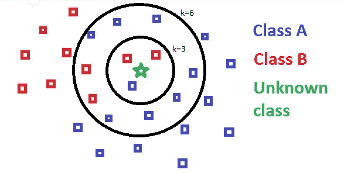
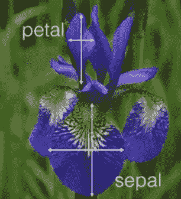
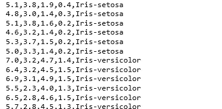
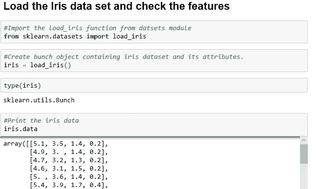
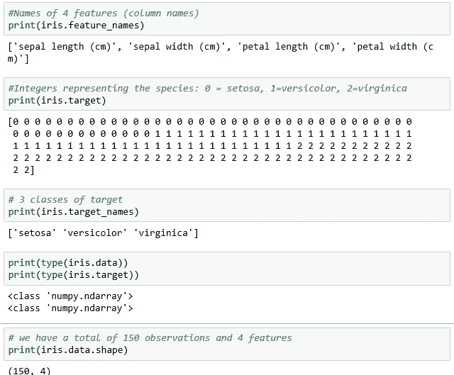
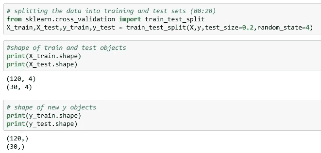
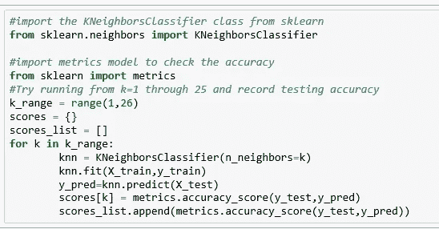
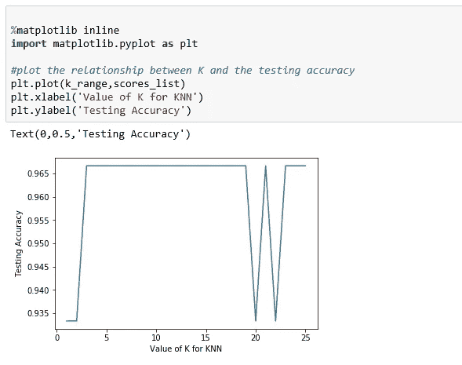
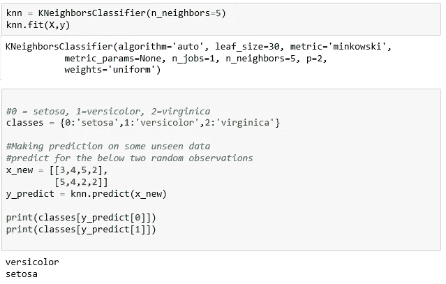

# 机器学习— KNN 使用 scikit-learn

> 原文：<https://towardsdatascience.com/knn-using-scikit-learn-c6bed765be75?source=collection_archive---------1----------------------->

KNN(K-最近邻)是一种简单的监督分类算法，我们可以使用它来为新的数据点分配类别。它也可以用于回归，KNN 没有对数据分布做任何假设，因此它是非参数的。它保留所有训练数据，通过计算输入样本和每个训练实例之间的相似性来进行未来预测。

**KNN 可以概括如下:**

1.  计算每个训练示例的新数据点之间的距离。
2.  为了计算距离，将使用欧几里德距离、汉明距离或曼哈顿距离等距离度量。
3.  模型在数据库中挑选 K 个最接近新数据点的条目。
4.  然后，它进行多数表决，即这 K 个条目中最常见的类别/标签将是新数据点的类别。

With K=3, Class B will be assigned, with K=6 Class A will be assigned

关于 KNN 的详细文件可以在[这里](http://scikit-learn.org/stable/modules/neighbors.html)找到。

以下示例显示了使用 scikit-learn 库在 iris 数据集上实现 KNN。Iris 数据集对每种不同的鸢尾花有 50 个样本(总共 150 个)。对于每个样本，我们有萼片长度、宽度、花瓣长度和宽度以及物种名称(类别/标签)。

Iris flower: sepal length, sepal width, petal length and width

*   **150 观察**
*   **4 特征**(萼片长度、萼片宽度、花瓣长度、花瓣宽度)
*   **响应**变量是鸢尾物种
*   **分类**问题，因为响应是分类的。

我们的任务是建立一个 KNN 模型，根据萼片和花瓣的测量结果对新物种进行分类。Iris 数据集在 scikit-learn 中可用，我们可以利用它来构建我们的 KNN。

完整的代码可以在 [Git Repo](https://github.com/Msanjayds/Scikit-learn/blob/master/KNN%20on%20Iris%20Datset.ipynb) 中找到。

**第一步:导入所需数据并检查特征。**

从 scikit-learn datasets 模块导入 load_iris 函数，并创建一个 iris Bunch 对象(Bunch 是 scikitlearn 用于存储数据集及其属性的特殊对象类型)。

每次观察代表一朵花，4 列代表 4 次测量。我们可以在“数据”属性下看到特征(测量值)，而在“特征名称”下看到标签。正如我们在下面看到的，标签/响应被编码为 0、1 和 2。因为对于 scikit-learn 模型，特征和静止应该是数字的(Numpy 数组),并且它们应该具有特定的形状。

**第二步:拆分数据，训练模型。**

对相同的数据进行训练和测试并不是一种最佳的方法，所以我们将数据分成两部分，训练集和测试集。我们使用‘train _ test _ split’函数来拆分数据。可选参数“测试大小”决定了分割百分比。“random_state”参数使数据在每次运行时以相同的方式分割。由于我们是在不同的数据集上进行训练和测试，因此得到的测试精度将更好地估计模型在看不见的数据上的表现。

Scikit-learn 被仔细地组织成模块，这样我们就可以很容易地导入相关的类。从“NeighborsClassifer”模块导入类“KNeighborsClassifer”并实例化估计器(“估计器”是 scikit-learn 对模型的术语)。我们称模型为估计器，因为它们的主要作用是估计未知量。

在我们的示例中，我们创建了一个“KNeighborsClassifer”类的实例(“knn”)，换句话说，我们创建了一个名为“knn”的对象，它知道在我们提供数据后如何进行 KNN 分类。参数“n_neighbors”是调整参数/超级参数(k)。所有其他参数都设置为默认值。

“拟合”方法用于根据训练数据(X_train，y_train)训练模型，而“预测”方法用于根据测试数据(X_test)进行测试。选择 K 的最佳值至关重要，因此我们使用 for 循环来拟合和测试不同 K 值(从 1 到 25)的模型，并在变量(分数)中记录 KNN 的测试精度。

使用 matplotlib 库绘制 K 值与相应测试精度之间的关系。正如我们所看到的，精确度有升有降，这在用精确度检查模型复杂性时非常典型。一般来说，随着 K 值的增加，精度似乎会提高，但又会下降。

一般来说，训练精度随着模型复杂性的增加而提高，对于 KNN，模型复杂性由 K 值决定。K 值越大，决策边界越平滑(模型越不复杂)。较小的 K 导致更复杂的模型(可能导致过度拟合)。测试准确性会对过于复杂(过度拟合)或不够复杂(拟合不足)的模型造成不利影响。当模型具有适当的复杂程度时，我们得到最大的测试精确度，在我们的例子中，我们可以看到，对于 3 到 19 的 K 值，我们的模型精确度是 96.6%。

对于我们的最终模型，我们可以选择 K 的最佳值为 5(介于 3 和 19 之间)，并用所有可用的数据重新训练该模型。这将是我们最终的模型，可以做预测了。

感谢您的阅读，如果您有任何建议/修改，请告诉我们。