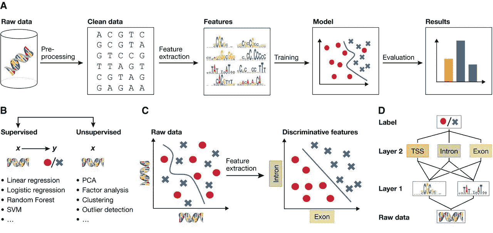
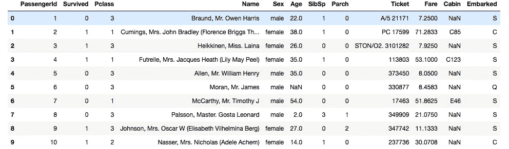
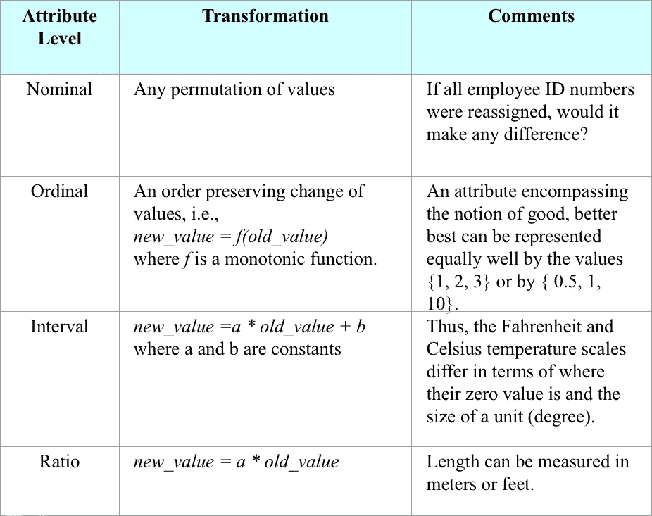
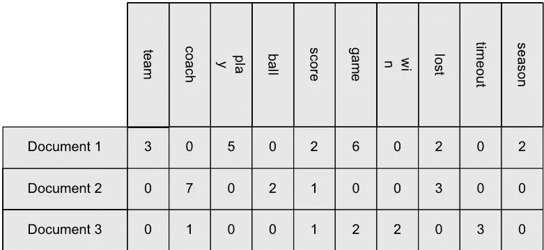
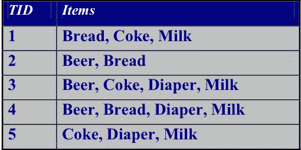
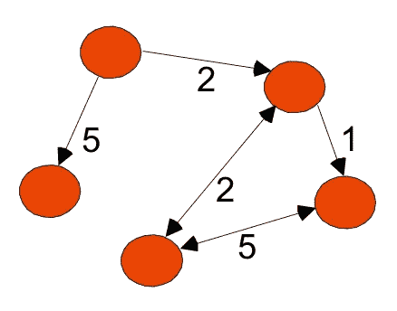
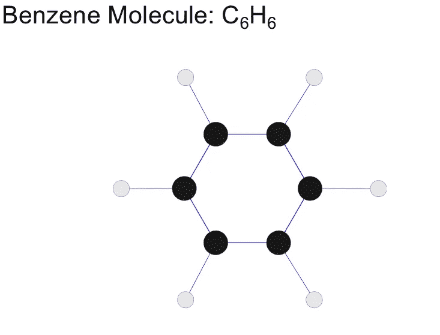
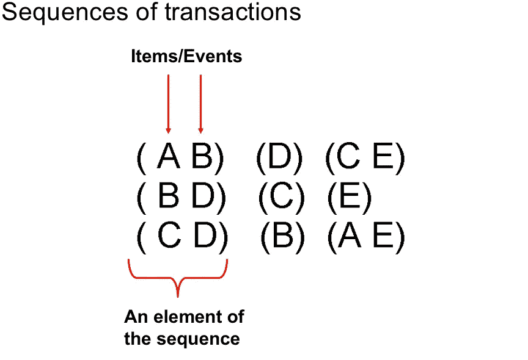

# 了解您的数据|第 1 部分

> 原文：<https://towardsdatascience.com/know-your-data-part-1-c6bd56553ae8?source=collection_archive---------12----------------------->

在我之前的[文章](https://medium.com/@KtheAgent/when-machine-learning-meets-big-data-4923091ba140)中，我们讨论了大数据和机器学习之间的化学反应。我们还得出这样一个事实:为了建立一个好的学习模型，我们首先需要很好地理解我们的数据。

下图代表了机器学习和数据挖掘的一般过程。数据清理和特征提取是最繁琐的工作，但你需要擅长它，使你的模型更加准确。

***什么是数据或数据集？***

数据对象及其属性的集合。属性捕获对象的基本特征。让我们检查一下著名的泰坦尼克号数据集，这里有。它表示乘客信息及其生存状态的列表(survived=0/1)。

每行代表一个乘客对象，列基本上是该乘客的特征，也称为属性。属性值是数字或一些类别。Ex Age 是数字，但 Pclass 基本上代表乘客级别(1 表示头等舱，2 表示二等舱……)

***属性类型？***

要理解数据，首先需要理解不同类型的属性。属性的类型取决于它拥有以下哪些属性:

> *清晰度:=，！=*
> 
> *订单:< >*
> 
> *追加:+ -*
> 
> *乘法:* /*

N***ominal***

遵循 distinctness 属性，例如:ID 号、眼睛颜色、邮政编码。

最终的结果

遵循独特性和顺序，例如:等级(例如，从 1-10 分制的薯片味道)、级别、身高(高、中、矮)

间隔

遵循区别，顺序和附加，例子:日历日期，摄氏或华氏温度。

比率

遵循所有四个属性，例如:开尔文温度，长度，时间，计数

根据属性值，我们可以说属性有两种类型。

***离散属性:*** 它会有*有限或可数无限的值集合*，邮政编码、Pclass 都是这方面的完美例子。二进制属性是离散属性的特殊形式(大数据集中的幸存属性就是二进制属性的一个例子)

***连续属性:*** 它会有实数作为值，例如:泰坦尼克号数据集中的票价。

# ***数据集的类型？***

*   **记录数据集:**由具有固定属性集的记录集合组成，也称为结构化数据。下面是几个记录数据集的例子。

**Data Matrix**

**Document Data**

**Transaction Data**

*   **图表数据集:**

**World Wide Web**

**Molecular Structures**

*   **有序数据集:**

**Sequential Data**

**Temporal Data**

在本文中，我们了解了不同类型的数据集、数据对象和属性。在我的下一篇文章中，我们将了解与数据集相关的问题，以及如何识别和处理它。我们还将通过一个例子演示如何在 Titanic 数据集上进行特征提取。

感谢您的阅读，请在评论中分享您的想法、反馈和想法。你也可以通过 twitter 上的@ [simplykk87](https://twitter.com/simplykk87) 和 linkedin 上的[联系我。](https://www.linkedin.com/in/krishna-kumar-tiwari-723b761b/)

参考文献

数据挖掘导论，庞-谭宁，密歇根州立大学，
迈克尔·斯坦巴克，明尼苏达大学维平·库马尔，明尼苏达大学