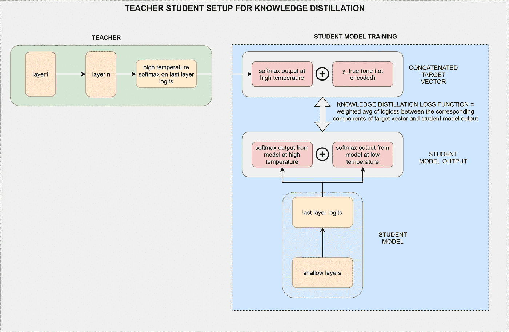
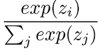
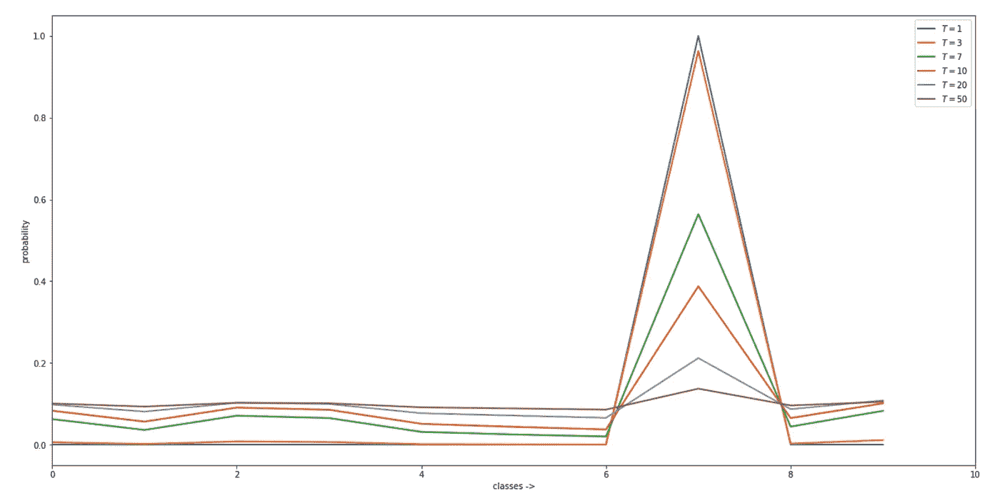
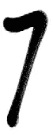

# 利用神经网络挖掘黑暗知识——知识提炼

> 原文：<https://towardsdatascience.com/knowledge-distillation-and-the-concept-of-dark-knowledge-8b7aed8014ac?source=collection_archive---------5----------------------->

**动机**:任何 ML/AI 模型的主要目标都取决于它对未知数据的概括能力，而不是它对训练数据的表现。如果我们更仔细地观察这个目标，那么为了训练和推理的目的，最好有不同的模型适应。在训练期间，我们需要深度和复杂的模型，以便在大量训练数据上进行训练，但在推理期间，我们只需要一个较轻的模型，它可以很好地概括任何看不见的数据。在生产中，较轻的模型显然在推理时间具有良好的性能。因此，本文的背景设置是要看看是否有一种有效的方法来将这些一般化的知识提取到一个更轻量级的模型中，以便两全其美。

*注意:神经网络和 MNIST 数字识别任务在本文中被用作参考来说明知识提炼的概念，但是相同的概念可扩展到任何 ML/AI 模型。*

【https://arxiv.org/abs/1503.02531】参考:这里所说的想法和概念都出自这篇参考文章: [*参考:*](https://arxiv.org/abs/1503.02531)

**Keras 中这篇文章的完整代码**:[https://tinyurl.com/yb4en6e3](https://tinyurl.com/yb4en6e3)

**迁移学习的区别&知识提炼:**迁移学习和知识提炼的目的有很大不同。在迁移学习中，权重从预训练的网络转移到新的网络，并且预训练的网络应该精确地匹配新的网络架构。这意味着新的网络本质上和预先训练的网络一样深入和复杂。

然而，知识提炼的目的是不同的。目标不是转移权重，而是将复杂模型的一般化转移到更轻的模型。但是等等…我们知道权重是如何转移的…但是我们如何转移一般化呢？如何量化一个复杂网络的一般化？进入**师生网**的术语，softmax 激活中的 c**oncept of temperature**，**暗知和软化概率**……让我们一个一个来了解这其中的每一个。

**师生模型:**参考下图 1。在本例中，教师是一个深度神经网络，它已经用足够好的正则化对大量数据进行了训练(或者它可以是任何其他集成模型),因此它的主要目标是可以对看不见的数据进行很好的概括。学生网络是一个浅浅的网络，将由老师训练，其主要目标是——学习大多数老师的概括，并且仍然更浅。考虑到严格的生产限制，更轻的模型显然在生产中更受欢迎，因为它可以快速预测。在掌握了剩余术语后，我们将回到这个主题。

Fig : 1, Teacher-Student architecture for knowledge distillation — image credits [Ravindra Kompella](https://medium.com/u/c3f8c66f5451?source=post_page-----8b7aed8014ac--------------------------------), Dhee Yantra solutions

**soft max 激活中的温度概念:**

使用 softmax 的主要优势是输出概率范围。输出概率的范围将从 **0 到 1** ，所有概率的总和将是**等于 1**。它返回每个类的概率，目标类将具有最高的概率。

Fig 2a : Regular Softmax function

该公式计算给定输入值的指数(e 次方)以及输入中所有值的指数值之和。那么输入值的指数与指数值之和的比值就是 softmax 函数的输出。

Fig 2b : High temperature softmax

当我们将输入—*‘z’(在神经网络中也称为 logit)*除以*‘T’(温度)时，获得高温 softmax 激活函数。*

为了说明温度对 softmax 激活的影响，考虑下面图 3 中的曲线。正如可以观察到的，预测数字‘7’的概率变得软化，并且随着温度的升高而软化。我们所说的软化概率是什么意思？

如果您沿着绿线(在更高的温度=7 时绘制)并仔细观察概率值，您可以看到该模型清楚地显示出一个事实，即它预测的数字“7”看起来更像 9 或 1，而不是 6(6 的预测概率小于 0.01，而 1 的预测概率约为 0.075)。

如果您沿着橙色/蓝色线(在较低温度下绘制)并仔细观察概率值，您可以看到模型预测数字“7”的可信度非常高，但**无法**区分预测的数字 7 更接近 1 还是 6(它们都具有“非常接近零”的概率)。

Probability prediction for the number ‘7’ digit at varied temperatures, Image credits [Ravindra Kompella](https://medium.com/u/c3f8c66f5451?source=post_page-----8b7aed8014ac--------------------------------), Dhee Yantra solutions

**黑暗知识:**我们可以通过查看手写数字“7”(如下图所示)来很好地关联我们自己的猜测，并判断它是否与 1 相似——这很像这个模型，它在高温下预测数字“7”时输出“1”的概率更高。

number one

number seven..oh wait..or is it number 1 ?

唯一的区别是，我们人类无法量化“7”看起来有多接近 1，而高温模型却可以很准确地做到这一点。因此，高温模型被认为具有**黑暗知识**——即，除了预测数字“7”之外，它还存储了数字“7”与数字“1”有多相似的信息。

低温模型(我们在 softmax 中通常遇到的没有温度的模型)通常擅长硬预测，我们会失去这些黑暗的知识。知识提炼背后的主要思想是将这种黑暗的知识从训练有素的教师转移到更轻松的学生模型中。

**师生培训:**现在我们已经理解了上下文和所有其他重要术语，让我们回到师生模型中我们离开的地方。将这些概括传递给学生的工作原理非常简单，如图 1 所示。在训练学生时，不是将一次性编码值作为硬目标，而是将这些软化概率(通过应用高温 softmax 收集的输出)作为目标。我们还可以定制知识提取损失函数(参见图 1 ),将知识提取损失计算为软目标+硬目标的连接向量的相应分量之间对数损失的加权平均值。

结果表明，以这种方式从老师那里训练的学生(观察到精度提高了 1%到 2%)能够比在相同数据上训练的独立学生更好地对看不见的数据进行概括。这里有几个重要的注意事项—

*   学生在和老师一样的高温下接受训练
*   学生模型中的推论将通过通常的 softmax 激活来完成(即没有温度)。

https://tinyurl.com/yb4en6e3:的这篇文章的全部代码

**知识提炼的优势:**可以看出，这种知识提炼过程有几个优势:

*   使用较轻的型号
*   在严格的生产限制下，降低计算要求并提供卓越的性能
*   比独立模型精度更高
*   即使学生模型的可用训练数据较少，也可以使用。有一个训练有素的老师就足够了。