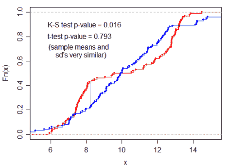
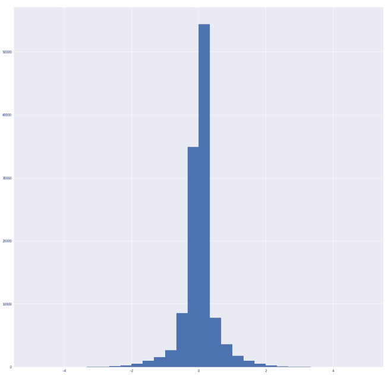
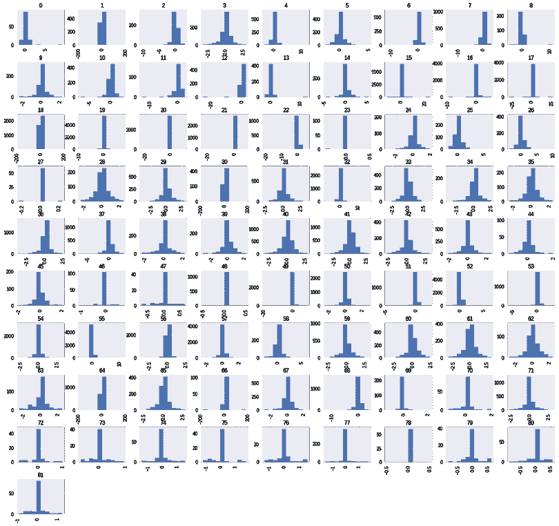
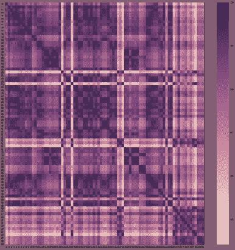
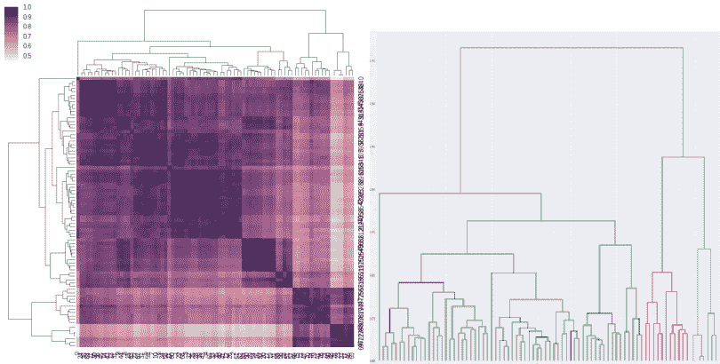
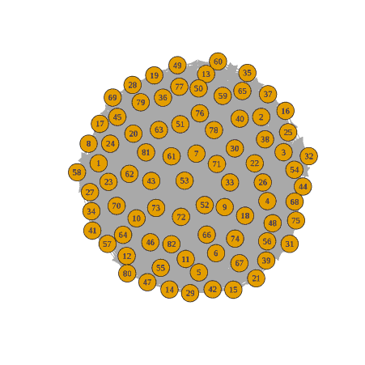
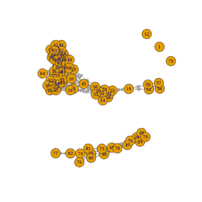

# 科尔莫戈罗夫-斯米尔诺夫试验

> 原文：<https://towardsdatascience.com/kolmogorov-smirnov-test-84c92fb4158d?source=collection_archive---------0----------------------->

## 数据科学工具箱中的必备工具

最近，在工作中，我们不得不做许多无人监督的分类。我们基本上必须从样本人群中区分出 N 个类别。我们大概知道有多少个类别，但没有什么是确定的，我们发现了[Kolmogorov-Smirnov 测试](https://en.wikipedia.org/wiki/Kolmogorov%E2%80%93Smirnov_test)这是一种非常有效的方法，可以确定两个样本之间是否存在显著差异。

我将向您介绍一下 Kolmogorov-Smirnov 测试的背景，并向您介绍我们用它解决的一个问题。

在 [coffeeanddata.ca](http://coffeeanddata.ca) 上的原始帖子

# 一点理论

*拒绝零假设。这听起来像是大学统计课上的痛苦回忆，但实际上这正是我们想要做的。我们要排除两个样本来自完全相同的分布的可能性。让我们来看看一些可用测试的非常高层次、非数学的概述。如果你想很好地理解所有这些测试背后的数学原理，可以使用所有章节中提供的维基百科链接。*

## 学生的 T 检验

学生的 T 检验可能是最广为人知的拒绝零假设的方法。该测试计算一个样本相对于正常总体或另一个样本的 P 值。结果 P 值告诉您这些样本来自完全相同的分布的可能性。

当获得 P 值时，可以将其与统计显著性阈值(例如. 05)进行比较，如果 P 值更小，我们可以拒绝零假设。

学生的 T 检验有问题，样本必须是正态的(正态分布)。这对我们来说是一个问题，因为我们做了很多泊松分布的工作。

## 科尔莫戈罗夫-斯米尔诺夫试验

Kolmogorov-Smirnov 测试 (KS 测试)稍微复杂一点，可以让你检测出用学生的 T 测试无法检测出的模式。

来自维基百科:

> *“Kolmogorov–Smirnov 统计量量化样本的* [*经验分布函数*](https://en.wikipedia.org/wiki/Empirical_distribution_function) *与参考分布的* [*累积分布函数*](https://en.wikipedia.org/wiki/Cumulative_distribution_function) *之间的距离，或者两个样本的经验分布函数之间的距离。”*

这里有一个例子来说明学生的 T 检验和 KS 检验之间的区别。

stackexchange.com

因为样本均值和标准差非常相似，所以学生的 T 检验给出了非常高的 p 值。KS 检验可以检测方差。在这种情况下，红色分布具有 KS 检测到的略微二项式分布。换句话说:

*   学生的 T 检验表明，两个样本有 **79.3%** 的几率来自同一分布。
*   KS 检验表明有 **1.6%** 的几率两个样本来自同一个分布。

## 其他测试

有许多其他测试和算法来做这类工作。[夏皮罗-维尔克测试](https://en.wikipedia.org/wiki/Shapiro%E2%80%93Wilk_test) **和** [**安德森-达林测试**](https://en.wikipedia.org/wiki/Anderson%E2%80%93Darling_test) 是被认为比 KS 测试更强大的两种测试。这两种测试有一个主要的缺点，它们不允许你比较两个样本，它们总是比较一个样本和一个标准分布。

编辑:我的一位同事向我展示了 Anderson-Darling 也可以用于双向测试(比较样本)。

> *“双样本 K–S 检验是比较两个样本的最有用和最通用的非参数方法之一”——维基百科。*

# 检测设备用户

对于这个特定的任务，我们必须检测哪个用户正在使用特定的设备。每个设备由一个或多个不同的用户使用，我们必须想出一种技术来识别是否有一个或多个用户。在多个用户的情况下，我们希望确定哪个用户使用了哪些内容。

## 我们的策略

我们决定混合使用图网络和 KS 测试来识别潜在的集群。这个演示背后的想法是想象一个图形网络，其中每个节点(样本)都与其他每个节点(样本)相连。这些节点之间的顶点或链接将进行测试，换句话说，这两个节点有多近。因此，具有低 KS P 值的两个节点会很近，而具有高 P 值的两个节点会很远。这有望创建可区分的集群。

## 数据集

以下是我们的数据:

正如你所看到的，我们所有的样本看起来像一个标准偏差非常低的正态分布。我们已经对该设备的所有 82 个不同使用时段进行了采样。

从这张照片中我们可以看到不同的图案。所有的样本不具有相同的直方图分布。这是一个非常好的开端。在此之后，我们看了明显的分布集群。

为了做到这一点，我们做了 KS 矩阵，它由每个样本分布与每隔一个样本的 KS 双向检验组成。快速查看 KS Matrix 热图并不能发现明显的结果(如您在右图中所见)。

经过这样的层次聚类，我们已经得到了一些较好的结果。(如下图所示。)

在这两个树状图可视化中，我们可以看到一些潜在的(3)集群。经过审查，这些集群是无关紧要的。

## 网络图

在不成功的树状图聚类之后，我们尝试了所提出的图方法。如前所述，这里的目标是绘制所有可能的节点和顶点。顶点长度是 KS 测试值。我们不得不移除自我参照(它总是 0(显然你和你自己非常相似)。

然后我们得到了一个网络图，其中每个人都与其他人相连，这不是特别有用。

下一步是只保留重要链接(低于某个阈值)

正如我们在这张图片上看到的，我们得到了一个非常令人兴奋的结果。我们可以清楚地看到两个不同的集群和三个异常值。

这完全符合我们的模型，大集群必须是主要用户，第二个集群可以是替代用户。

在有效性验证之后，我们发现集群在集群 1 和集群 2 的使用之间发现了一些差异，但不是我们要找的那个。换句话说，它没有解决我们的问题，但它实际上找到了另一种模式，在另一种情况下可能有用。

# 结论

经过这项工作，我们得出结论，KS 检验是自动区分不同分布的样本的一种非常有效的方法。它并没有完全解决我们的问题，但它确实表明它可以很容易地用在数据科学环境中。

今天我向你展示了我们用 KS 测试解决的一个问题，但我们也用它来解决其他问题。KS 测试真的成为我们数据科学瑞士刀里的好测试了。

# 想要阅读更多内容

在我的博客上关注我: [coffeeanddata.ca](http://coffeeanddata.ca)