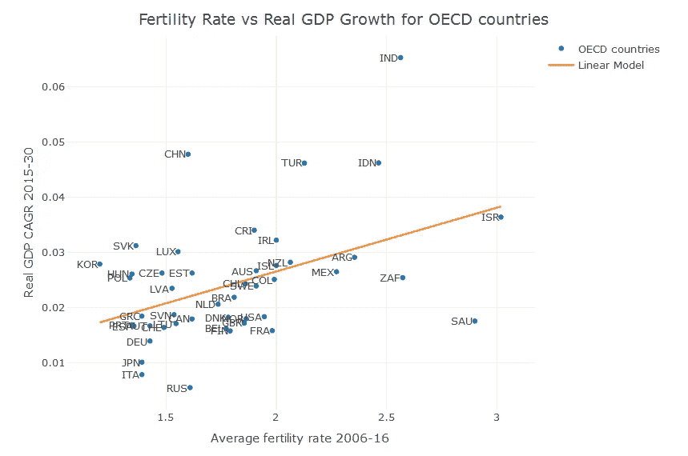

# 韩国的生育率暴跌——这意味着什么？

> 原文：<https://towardsdatascience.com/koreas-tanking-fertility-rate-what-does-it-mean-380a2477b4d6?source=collection_archive---------8----------------------->

今年，韩国的生育率预计将降至 1.00 以下。

这是一个相当了不起的统计数字。首先，低于 1.00 的平均生育率从数学上证明韩国有许多育龄妇女不会生育。第二，近在五十年前，生育率几乎为 5.00，在此之前甚至更高。下降幅度很大——50 年内下降了 80%,而全球平均下降幅度约为 50%。


This is becoming a less frequent sight in Seoul

## 为什么会出现这种情况？

虽然它还不是生育率最低的国家(这一荣誉属于新加坡)，但在如此大规模下降的背景下，人们很自然会问为什么会出现这种情况。大多数专家认为，这种下降的原因是经济、社会和文化因素的结合，主要有以下几个方面:

1.  韩国的成本一直在快速增长。以首尔为例，这里居住着 20%的韩国人口，[的房价每年上涨约 5%。](https://www.ft.com/content/5fb472d4-774e-11e7-90c0-90a9d1bc9691)
2.  这些成本，加上居高不下的年轻人失业率，导致与父母同住的成年人数量大幅增长——这一群体被命名为“袋鼠部落”。在 1985 年到 2010 年间，至少有一个 25 岁以上未婚子女的家庭比例从 9%激增到 25%。
3.  在韩国，工作场所对怀孕的态度阻碍女性生孩子，许多报道称女性因休产假和工作受到威胁而感到内疚。

## 生育率低不好吗？

是的，它是。低生育率导致经济衰退。这种观点可能有悖常理，因为最贫穷的国家往往出生率最高。然而，如果我们停下来想一想，问题是什么就变得非常清楚了。

低生育率意味着人口会随着时间的推移而下降。根据经合组织的说法:“假设没有净移民和死亡率不变，每个妇女 2.1 个孩子的总生育率确保了人口的大体稳定。”韩国人口增长率从 1960 年的 3.2%下降到 2016 年的 0.4%。假设生产率稳定，低人口增长的后果就是低经济增长。

低生育率导致年龄失衡，这一问题因人们寿命延长而加剧。随着人口中老年人比例的增加，这导致了医疗保健和社会护理相关成本的增加，以及养老金结构的不平衡。简而言之，越来越少的年轻人需要为越来越多的老年人提供资金。

## 数据怎么说？

为了让自己放心，我做了一个快速分析，以确定生育率和经济增长之间的联系强度。

我的第一站是精彩的经合组织数据门户，在那里我下载了 2006 年至 2016 年间所有可用国家生育率的 [csv 文件，以及 2015 年至 2030 年实际 GDP 预测](https://data.oecd.org/pop/fertility-rates.htm)的 [csv 文件。](https://data.oecd.org/gdp/real-gdp-long-term-forecast.htm)

我用 R 编程语言做了一些非常简单的计算，并创建了一个图表，向我展示了生育率和实际 GDP 增长之间的关系。首先，我加载了两个数据集，并使用`dplyr`软件包计算了 2016 年至 2030 年间实际 GDP 的 CAGR(复合年增长率):

```
gdp <- read.csv("GDP.csv")
fertility <- read.csv("fertility.csv")gdp_by_country <- gdp %>% dplyr::group_by(LOCATION) %>% dplyr::summarise(cagr = (tail(Value, n = 1)/head(Value, n = 1))^(1/15) - 1)
```

这给了我一个 49 个国家和他们的实际 GDP CAGR 的列表。接下来，我计算了生育率数据集中的国家在 2006 年至 2016 年之间的平均生育率，并将其加入到 GDP 数据集，这样我就有了真实的 GDP 统计数据和各国的生育率统计数据。

```
fertility_by_country <- fertility %>% dplyr::group_by(LOCATION) %>% dplyr::summarise(avg_rate = mean(Value))full_data <- dplyr::inner_join(gdp_by_country, fertility_by_country)
```

不是所有的国家都匹配，所以在我的最后一组中，我总共有 46 个国家。现在我想绘制 GDP 增长与生育率的关系图，并确定两者之间的关系。在 R 中计算线性模型非常容易，我保存它是为了以后绘图:

```
fit <- lm(cagr~avg_rate, data = full_data)
```

现在，我将在我最喜欢的绘图包`plotly`中绘制一个散点图，并将线性模型覆盖在上面:

```
# plot basic scatter
plotly::plot_ly(data = full_data, x = ~avg_rate, y = ~cagr, 
type = 'scatter', name = "OECD countries") %>% # add country labels to markers
  plotly::add_annotations(data = full_data, x = ~avg_rate, 
                          y = ~cagr,
                          text = ~LOCATION, 
                          showarrow = FALSE, xanchor = 'right',
                          yanchor = 'center') %>% # add linear model 
  plotly::add_lines(y = ~fitted(fit), name = "Linear Model") %>% # label axes and title
  plotly::layout(xaxis = list(title = "Average fertility rate 2006-16"),
                 yaxis = list(title = "Real GDP CAGR 2015-30"),
                 title = "Fertility Rate vs Real GDP Growth for OECD countries")
```



这证实了近期生育率和未来经济增长之间的关系。报告还显示，在样本国家中，韩国的近期生育率最低，尽管其经济增长预计不会像生育率数据让人相信的那样令人沮丧。

最初我是一名纯粹的数学家，后来我成为了一名心理计量学家和数据科学家。我热衷于将所有这些学科的严谨性应用到复杂的人的问题上。我也是一个编码极客和日本 RPG 的超级粉丝。在[*LinkedIn*](https://www.linkedin.com/in/keith-mcnulty/)*或*[*Twitter*](https://twitter.com/dr_keithmcnulty)*上找我。*