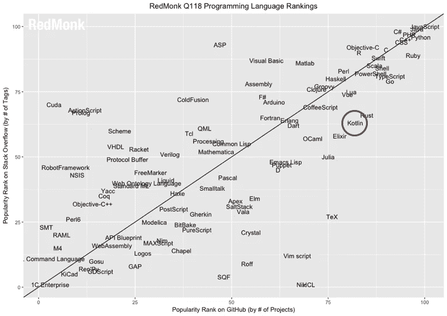

# 科特林和数据科学:一个萌芽的爱情故事

> 原文：<https://towardsdatascience.com/kotlin-data-science-a-budding-love-story-ad366a633213?source=collection_archive---------12----------------------->

Kotlin 于 2011 年首次出现，并席卷了编码界——我第一次听说这种语言是在一年前，巧合的是在谷歌宣布 Kotlin 是官方 Android 语言之后不久。自那以后，又发生了几次“大爆炸”,目前的预测预测全球使用量将继续增加。下面是今年 Github 库的语言分类:

Credit & thanks to: Rachel Stephens for extracting rankings from GitHub data and rendering the grid & Stephen O’ Grady for presenting [RedMonk findings on Programming Language Rankings](https://redmonk.com/sogrady/2018/03/07/language-rankings-1-18/)

由圣彼得堡的一个小型 JetBrains 团队开发的 Kotlin 是一种静态类型语言，它:

*   **在 JVM 上运行**
*   **可与 Java 互操作**
*   **表示面向对象和函数范例之间的流动性**

我一直认为自己是一个有着*必要*背景的程序员，我永远不会达到*功能性*编程的地位。当然，总有这样一个笑话:如果你真正理解了函数式编程，你就无法向别人解释它。我从来没有想象过一种语言可以允许流动性和变形为两个世界的一个实用和兼容的版本。

结果是**在一个努力理解两个世界的社区**中有明显更多的用户。**机构支持有助于承担为爆炸式增长的社区提供支持的重担**并且**有助于在大型软件** **系统**中使用 Kotlin 赢得行业信心，这些公司包括:

*   **Pinterest**
*   **格雷尔**
*   **优步**
*   **枢轴**
*   **亚特兰蒂斯**

今年我有幸参加了 KotlinConf，但我感到兴奋的不是我自己的内容。随着我参加的每一次演讲，我一点一点地意识到**因为** **Kotlin 是一种如此强大的语言，人们已经能够开始并超越以前在计算机科学中设定的限制。**

也许是来自不断增长的社区的越来越多的嗡嗡声:也许从 KotlinConf 内容的演变中可以明显看出这一点——但我有种悄悄的感觉 **Kotlin 可能是下一个数据科学栈**。

我很遗憾地说，不得不在我能参加的讲座之间做出选择是非常痛苦的(幸运的是，[所有的讲座](https://www.youtube.com/playlist?list=PLQ176FUIyIUbVvFMqDc2jhxS-t562uytr)都被记录了下来)。

[Kevin Most](https://www.youtube.com/watch?v=w-GMlaziIyo) 发现，与注释处理器不同，编写自己的编译器插件允许你在运行时修改现有代码。

[Thomas Nield](https://www.youtube.com/watch?v=-zTqtEcnM7A) 找到了解决调度问题的方法:通过在达到局部最小值后重新加热温度，在优化和贪婪算法之间切换。

Roman Elizarov 展示了新的 Kotlin 1.3 特性协程如何帮助管理现实生活中的并发和调度问题。

# **FP 帮助维护可扩展的软件**

函数式编程(FP)的优势在于为规模和复杂性不断增长的软件创建更稳定的数据堆栈:

1.  **纯函数容易测试。因为纯函数可能独立于其他纯函数，所以为算法编写单元测试比以往任何时候都更容易。**
2.  **由于函数式编程的确定性，它适合于并发和分布式编程。**这些功能对机器学习也很有用！

# 静态类型和空安全增加了运行时的稳定性

类型安全和空安全对于大型企业级应用程序尤其重要。作为一种静态类型的语言，Kotlin 已经有了一个用于类型检查的编译器，这让位于更稳定的系统。编译语言让位于更好的性能以及处理大型数据系统。

Kotlin 也有 null-safety，这是 Java 至今仍在经历的一个十亿美元的错误，NPE 会导致运行时崩溃。

安全带？检查。头盔？检查。

# Kotlin 致力于并发性和并行性

并发性和并行性对于大型软件系统中的数据健康和效率都是至关重要的。并发性描述了一个可以同时处理多个线程的系统，以及它无序执行功能并期待相同输入的能力*。*

一年前，我可能会傻傻地看着人们争取独占`val`而不是`var`的想法——但是*不变性*可以使处理并发线程更容易维护。

假设你在一次长途飞行中，你必须和其他的机组人员和乘客共用洗手间。通常情况下，一个洗手间的规则是一次只能有一个人在洗手间。或许去洗手。

[Flickr/veganstraightedge](https://www.flickr.com/photos/veganstraightedge/2378937068/in/photolist-5WKUmM-5nbQpY-5n7zpc-Cd24V3-dNj4wA-CwR8RX-BGL6ux-qJyQy-CuzCYQ-BGLaXv-4CdF1q-6jdKse-8tFeaB-r7ScsW-2bKYmd-6e2LQY-2bKXhL-guPm7B-84kBbP-2bKM2U-xYZ5h-7MAAXt-42XhTx-82GwwG-4C9o1Z-93FTmo-66Ab98-JUc19L-ekCtEZ-2bKQ6w-2bKGSo-49RdDz-dUmMPt-4CdF7m-66Er7L-5JE5Nh-AA9k1M-MwGuJ-5CT2Uu-8Wzd6r-5CT32d-ZotSsY-2bFhDK-7hL5E3-NVTd4c-GffLTv-wZBQww)

你不会希望别人撞见你使用洗手间。一些程序员可能用 TDD 管理并发性(*洗手间有人吗？*)。其他人可能使用锁(*门锁*)或信号量(`VACANT` / `IN USE` *)告诉人们是否尝试开门*来处理访问单个资源的多个线程或人员。

同样，如果两个线程访问同一个可变的资源，资源可能会被修改，导致访问不再可用的内容失败，对相同的输入获得不同的结果，甚至在计算中遇到越界异常。

并发性与并行性并不完全相同:虽然并发性与确定性有关，但是*并行性*与如何同时完成多个任务有关。

Kotlin 闪亮的新特性*协程*有助于在异步环境中管理并行性*。*协同程序通过自动调度优化来管理并行性。他们还可以用作用域构造并发性。常规线程的线程数量有限，因此它们可能会在没有调度的情况下被阻塞。有了协程，我们就不必担心共享的可变状态和同步，并且您可以根据需要派生出任意多的协程。

# 那么下一步是什么？

如果你碰巧好奇，Kotlin 中有一个流行的库和框架的列表，你可以在这里探索任何你感兴趣的东西。

[Flickr/Adrian Scottow](https://www.flickr.com/photos/chodhound/4861241464/in/photolist-8pz8J1-fiTWMx-6eyLUq-UcH2L5-77yWuc-dG56HV-4xzCHM-5EcRHu-dnQ93U-69jmrT-nXnJjP-pYySsk-2GPzah-7DPCFs-ssinJA-TxGbs3-9mwBxU-29i8pmu-nr3LoM-cpC92J-c3WKi1-2b1HUr2-29CSoHS-aoe3u2-8LCLvb-7ZegZj-bZNDa3-7HgRyD-q7xEav-6h9zuA-z6AGo-7SPpvc-c1Ka3G-JU2UD-6ewo6S-7RCNFm-abMEt8-4XwUgS-7Z24tX-cNuCPA-2cLPKt-4hijLi-abQsN1-9WCeKe-iNfa3-Yuqctv-8pLjHL-7SKrDx-aPMqAB-dGNLMs)

事实上，程序员们正着手用科特林解决不可能的事情，这绝非巧合。我们还没有完全准备好称自己为数据堆栈，但是 Kotlin 已经开始处理处理大型数据系统所需的健壮和稳定的软件的必要组件。我不知道一年后 Kotlin 会在哪里，但我当然期待继续与社区一起成长，尽我所能做出贡献！