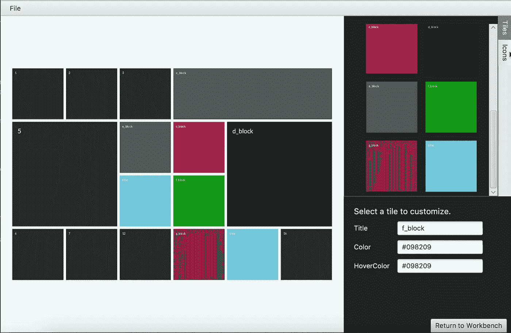
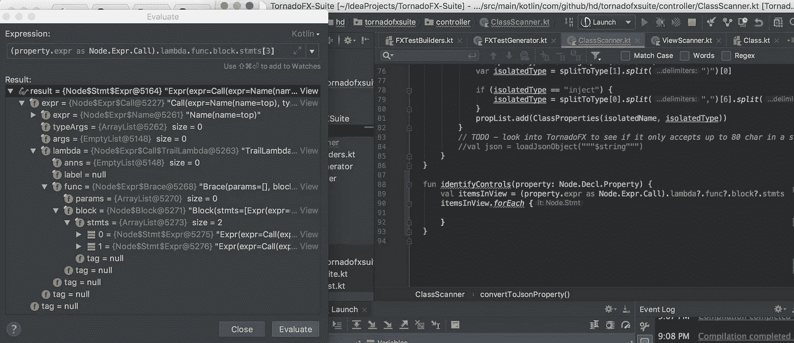
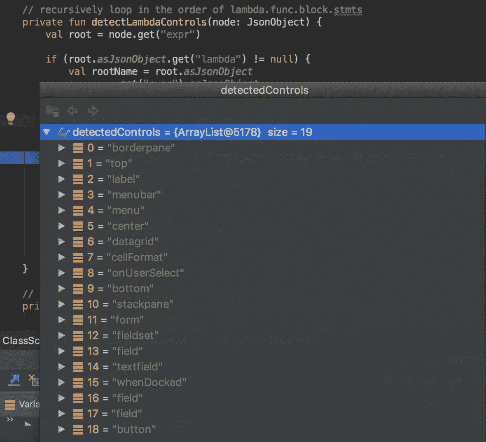
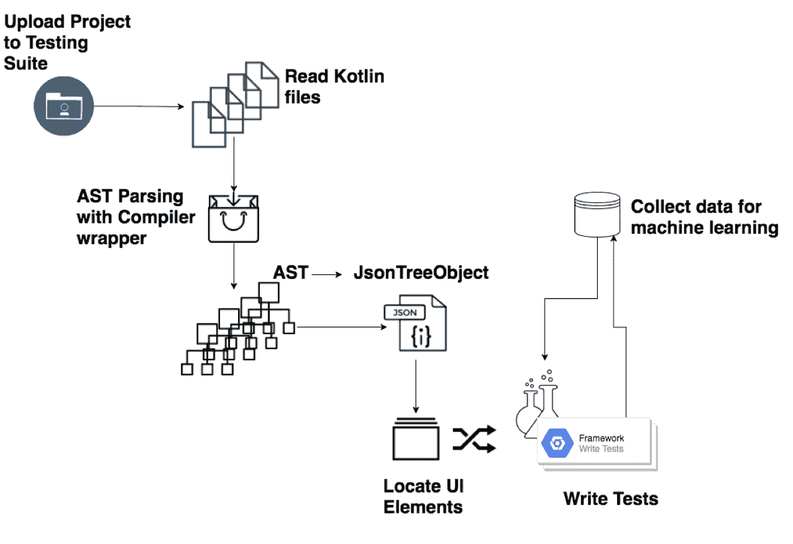

# Kotlin:现代(元)编程的下一个前沿

> 原文：<https://towardsdatascience.com/kotlin-the-next-frontier-in-modern-meta-programming-8c0ac2babfaa?source=collection_archive---------12----------------------->

今天，我为我的 KotlinConf 演讲写一篇关于 Kotlin、TornadoFX 和元编程的后续文章。在这次演讲中，我总结了[横切](https://medium.com/@hinchman_amanda/introduction-to-crosscutting-b70186f4a3fe)的广义定义，并探讨了元编程的常见形式。我们研究了用 Kotlin 编写的 TornadoFX 特性，以检验该语言的功能特性。回想起来，我希望我能更专注于谈论我的应用研究，所以我在这里谈谈我已经走过的路和我将要去的地方！

# 简要回顾

元编程有三种常见形式:

*   **向导** —也被称为“猴子补丁”，向导通常是用户生成的输入，仅限于 HTML 或 XML 等标记语言。Android Studio 的设计功能是向导的一个很好的例子。*向导容易导致用户输入错误，这使得它成为元编程的最低级形式。*
*   [**面向方面编程**](https://medium.com/@hinchman_amanda/introduction-to-java-aspect-oriented-programming-a9769613131e) — AOP 是一种思想，在这种思想中，你将关注点提取出来，放到一个更高的抽象层次，以便将其他关注点编织成一个更兼容的共存。 *AOP 通常局限于报告元数据，缺乏动态属性。*
*   **特定领域语言** —传统的 DSL 是一种完成特定任务的语言，但放弃了任何与特定类别无关的东西。您可以用 SQL 操作数据集，但不能用它们创建整个应用程序。*因为 DSL 通常不同于 Java、C、Kotlin 等通用语言。所以结果是 DSL 通常存储在不同的文件或字符串中，产生了大量的开销。*

巧合的是，Kotlin 包含了所有三种形式的能力，甚至改进了每种类型当前的缺点，作为一个功能范例。通过内部 DSL 和具体化的泛型，Kotlin 找到了一种方法来克服 JVM 堆栈中的限制，这些限制会阻止像函数这样的功能支柱成为一等公民。


Kotlin 在函数式和面向对象的范例之间不断变化，但是作为一种静态类型的语言，在尝试完成其他静态类型语言无法完成的真正的元编程方面存在一些挑战。

1.  真正的元编程不考虑封装。
2.  真正的元编程不需要编译就能生成代码，所以不需要类型检查。

话虽如此，我尝试了一些我不确定是真的真的勇敢还是真的真的愚蠢的事情。

这可能并不愚蠢。

# 开发中的测试

软件质量保证包括监控软件工程过程的手段和用于确保质量的方法。当然，这个过程的一部分是为编写的代码编写测试，并确保产品从用户的角度来看是按预期工作的。

当我意识到我需要 UI 测试时，我有点惭愧，在 JUnit 测试之后，我从来没有接受过自我测试的培训。但是我也意识到，有许多其他的工程师也避免测试，并且在实践中，许多策略对于回归测试来说更加麻烦。

大约一年前，我为销售人员编写了一个程序向导，为潜在客户生成现场演示，因为我很懒。巧合的是，这个项目是一种猴子补丁！



TornadoFX-Dnd-TilesFX is open source [here](https://github.com/ahinchman1/TornadoFX-DnD-TilesFX)

我最终编写了自己的拖放功能，因为我不知道如何序列化我的自定义对象；问题是我在调试我的微管理事件时遇到了困难，我意识到我需要测试 UI。另一个问题？我不知道如何编写 UI 测试。我想——**如果我使用元编程来为我生成这些测试会怎么样？**

所以我开始询问其他开发人员和 QA 工程师:

*   *什么是好的测试？*
*   *什么是糟糕的测试？*

我收到了数百个答案——从不同的框架到不同的策略到不同的风格。

# **龙卷风套件:不仅仅是应用研究**

TornadoFX-Suite 从简单地生成 TornadoFX UI 测试开始。但事实远不止如此。如果这个项目可以被多个人用于多种框架——我们可以收集这些数据并使用机器学习来找到这些答案吗？

让我们看看这个项目现在的样子，看看它做了什么。

TornadoFX-Suite is open source and can be found [here](https://github.com/ahinchman1/TornadoFX-Suite)

您会注意到这个应用程序检测 UI 输入——从那里， [kscripting](https://github.com/holgerbrandl/kscript) 将被实现来生成那些测试。

## 检测用户界面输入

到目前为止，这是项目中最难克服的困难。使用 Kotlin 编译器的包装器 [kastree](https://github.com/cretz/kastree) ，我能够将我扫描的 Kotlin 文件分解成抽象语法树(AST)。我选择 ASTs 的原因是我们能够保持代码分析的不可知论，以便在未来的框架中使用。在创建所需的映射时，我遇到了现实生活中的元编程挑战——在语法分析中，当您的静态系统关心您必须转换的类型时，很难递归地映射潜在的无限树(无论是高度还是宽度)。



Finally bumped into an identified challenge where true metaprogramming and statically-typed languages like [@kotlin](https://twitter.com/kotlin) don’t play where together — being able to inspect AST breakdowns recursively without caring about the type system.

特别是，分解 Kotlin 语言的属性被证明是困难的。属性可以是集合、变量、独立于类的函数或成员。这些项目中的每一个都可以在访问级别、类型方面有进一步的分类，并且可以在那些属性中包含额外的属性。

我不是说这是最好的解决方案。我不是说这是一个好的。但是我找到了一个！将这些 ast 转换成 JSON 对象/数组使得造型更容易以更不可知的方式递归:

性能差吗？*地狱是的，它是。*这个实现烂不烂？*当然有。* **但是这管用吗？如果行得通，那就不傻。**



所以我们有这些故障。我如何知道我应该关心哪些元素？这很容易用 Kotlin 枚举类为每个框架定制:

```
enum class INPUTS {
    Form, TextField, DateField, Button, Action,
    RadioButton, ToggleButton, ComboButton, Checkbox,
    Item, Paginator, PasswordField
}
```

好吧，我们有要注意的关键词。我们可以使用具体化的泛型，通过枚举类遍历我们的控件属性集合:

这是我们可以在任何框架中检测所需控制的概念验证。我们正在努力创建一个不可知论的解析系统，最终，当它成长到足以处理这样的责任时，让它存在于自己的库中。



# 下一步是什么？

行动是影响环境的东西。

这就是测试的作用。

测试是一个探索环境的主动过程，确定它如何响应各种条件。

测试人员从这些交互中学习。

因此，如果我们在谈论一个**生成型机器学习工具**来“做测试”，根据定义，它必须学习。它必须通过采取行动并能够处理这些行动的反馈来做到这一点。我们可以从创建生成的用户输入的排列开始，这些排列可以覆盖人类可能永远没有能力覆盖的情况，但我们会增加测试许多东西所需的时间。如果我们把这些排列缩短成有价值的测试会怎么样？

**元编程的自然发展是机器学习。**

我们可以从用户那里收集数据——为什么生成了什么测试，最初通过/失败了什么测试，有多少用户参与了项目？从那里，有可能检测出已知有问题的组件，并为此提供更智能的测试。我们甚至可以找到数据来说明什么是好的 UI/UX。我甚至不认为我在这里抓到表面。

你有兴趣投稿吗？我经常放松自己，当然，我也可以在[推特](https://twitter.com/hinchman_amanda)和 [github](https://github.com/ahinchman1) 上联系。项目可以在这里找到[。](https://github.com/ahinchman1/TornadoFX-Suite)