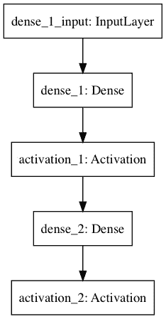
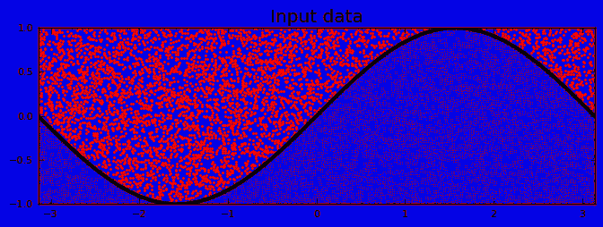
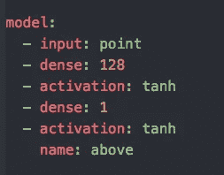
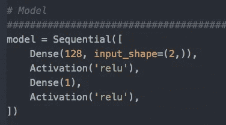
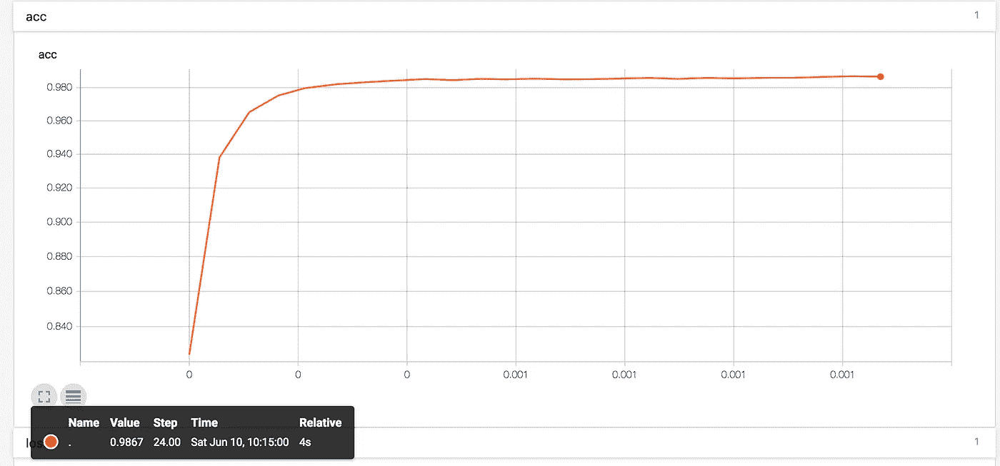

# 库尔、喀拉斯和张量流

> 原文：<https://towardsdatascience.com/kur-keras-and-tensorflow-f895c1d1c9e7?source=collection_archive---------6----------------------->

代码可在 [GitHub](https://github.com/wrannaman/sine) 上获得

用三个机器学习框架 Kur，Keras，Tensorflow 写的同一个模型的简单概述。用 TFRecords 探索张量流的数据管道。

大约一年前 Tensorflow 问世时，我和许多其他人一样，下载了它，并试图开始构建令人难以置信的机器学习模型，却发现这实际上是一件有点困难的事情。

事实证明，构建节点应用程序和构建 ML 模型的难度并不完全相同，但是围绕 ML 的工具似乎变得更容易使用，上周我又做了一次尝试。

我找到了 [Kur](http://kur.deepgram.com/) ，由 [DeepGram](https://www.deepgram.com/) 的人构建，它提供了比 Keras 更高级别的 api，并且可以使用 Tensorflow 作为后端。我经常发现自上而下的学习更容易，Kur 的 yaml 模型定义看起来是如此的平易近人。

从 Kur，我挖到 Keras，然后 Tensorflow 建立了两个密集层的相同简单模型。

Keras Sine Wave Model

目标是建立一个模型来预测给定点是在正弦波之上还是之下。这很琐碎，但是知道每一行代码是什么是一个足够小的问题。这是数据的可视化，其中红色点属于正弦波的上方，蓝色点属于正弦波的下方。

Visualizing the data

**库尔**

Kur 的模型定义出现在一个 yaml 文件中。上面的模型是这样的:

Kur model Definition

培训、测试和评估都非常简单，他们网站上的教程非常精彩。这个框架真的不妨碍你快速训练和测试一个想法。如果需要的话，你总是可以用一个 kur 模型并在一个较低层次的 api 中对它进行编码，但是这似乎是我开始下一个项目的地方。

**Keras**

Keras 的 api 也很简单，但是您不需要在 yaml 文件中指定模型，而是编写普通的 python。Keras 中的相同模型定义如下所示:

Keras model definition

它的编码也很简单，并且在 Tensorflow 的 Tensorboard 中也有一些很好的挂钩(你可以在 [GitHub](https://github.com/wrannaman/sine) 上找到它的实现)，这让你不费吹灰之力就能得到清晰的损耗和准确度图表。

Accuracy from Tensorboard. over 98%!

**张量流**

我在 Tensorflow 中遇到的最大问题是将数据正确地输入到模型中。Tensorflow 自己的数据管道使用 TFRecords，这有很多好处，但也比将 numpy 数组塞进模型中更复杂。

TFRecords 的一个好处是，一旦你正确地设置了阅读器，它们可以被批量处理，并自动随机化。当数据集达到一定大小时，试图一次加载整个数据集会耗尽内存。

一旦管道建立起来，将数据塞进模型是一件痛苦的事情。我到处扔重塑的东西。当然，这部分是因为我对 python 缺乏经验，但是其他两个框架帮我解决了这个问题，真是太好了。

另一件要注意的事情是，Tensorflow 模型的准确性比其他两个框架差。这显然是我的一个错误，但是我对从 tf 记录中读取数据感到满意。这个问题阻止了我继续上一次的讨论，下一个项目可以更关注模型本身，解决一个更有趣的问题。

查看 GitHub 上的[代码，希望它能为你节省一些设置数据管道的时间！](https://github.com/wrannaman/sine)