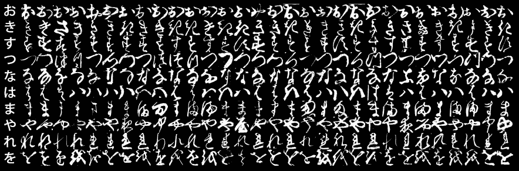
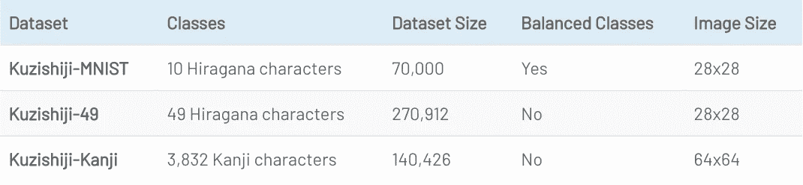
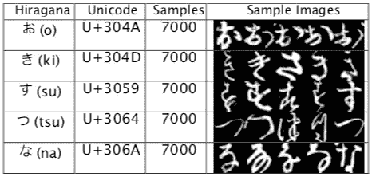

# 用于深度学习任务的 Kuzushiji-MNIST -日本文献备选数据集

> 原文：<https://towardsdatascience.com/kuzushiji-mnist-japanese-literature-alternative-dataset-for-deep-learning-tasks-d48ae3f5395b?source=collection_archive---------17----------------------->

## 加上我们的 VGG-雷斯内特系综模型与国家的艺术成果

[MNIST](http://yann.lecun.com/exdb/mnist/) 是一个拥有 70，000 张手写数字标记图像的数据集，二十多年来一直是图像处理和分类中最受欢迎的数据集之一。尽管它很受欢迎，但当代深度学习算法很容易处理它，经常超过 99.5%的准确率结果。一篇新的[论文](https://arxiv.org/abs/1812.01718)介绍了库祖什基-MNIST，一个比 MNIST 更难的备选数据集，同时还介绍了两个更难的库祖什基数据集。

有趣的是，Kuzushiji 数据集也可能有助于恢复一种几乎失传的语言——草书 Kuzushiji。草书 Kuzushiji 是一种使用了 1000 多年的日本文字，没有共同的标准，有时同一个词会有几十种风格和格式。在 19 世纪，日本改革了其官方语言和书写系统，并使其标准化，随着时间的推移,《文库世纪》灭绝了，导致数百万份日本文化和历史文件无法为大多数人所用。

# 数据集

Source: [Clanuwat et al](https://arxiv.org/abs/1812.01718)

# 数据集

日语可以分为两种体系:

*   标识系统，其中每个字符代表一个单词或一个短语(有数千个字符)。一个突出的标识系统是汉字，它是基于中文系统。
*   音节符号系统，其中单词由音节构成(类似于字母表)。一个突出的音节系统是具有 49 个字符的平假名(Kuzushiji-49)，在 Kuzushiji 标准化之前，每个平假名字符有几种表示。

Kuzushiji 数据集包括汉字和平假名字符，基于 18 世纪 35 本书的预处理字符图像。它包括 3 个部分:

《字谜 MNIST》在格式上与原版《MNIST》相似，但由于每个汉字都有多种变化，分类难度更大。其他数据集包括更多的类，并基于人物在书中出现的频率，有些类只包括几个样本。

Source: [Clanuwat et al](https://arxiv.org/abs/1812.01718)

数据集可以从[这里](https://github.com/rois-codh/kmnist)下载。作者计划扩大数据集并添加更多样本。

# 结果

Kuzushiji-MNIST 数据集的创建者通过训练一些分类算法并将其与 MNIST 进行比较，创建了一个基线。最好的算法(PreActResNet-18)在 MNIST 上达到了 99.56%，而在 Kuzushiji-MNIST 和 Kuzushiji-49 上分别只有 98.83%和 97.33%。

# 附加分析

为了评估 Kuzishiji-MNIST，我们比较了几种架构——VGG、ResNet-18、胶囊网络以及这些架构的组合。最好的结果是用 VGG 和雷斯内特的组合获得的——在测试集上有 98.9%的准确率，这是在新数据集上的最新结果

代码可以在[这里](https://github.com/ranihorev/Kuzushiji_MNIST)找到。

# 结论

Kuzushiji 数据集可以作为分类算法的新基准系统，比传统的 MNIST 更具挑战性。如图所示，诸如 ResNet 和 VGG 等算法可以在库祖什基-MNIST 数据集上取得优异的结果，但在其他数据集上仍有改进的空间。最后，对库祖什基数据集的研究也可能有助于从这种失传的语言中恢复数百万本书籍。