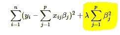

# L1 和 L2 正则化方法

> 原文：<https://towardsdatascience.com/l1-and-l2-regularization-methods-ce25e7fc831c?source=collection_archive---------0----------------------->

机器学习

在我的上一篇[文章](https://medium.com/@anujanagpal/over-fitting-and-regularization-64d16100f45c)中，我介绍了监督学习模型中的正则化。在这篇文章中，让我们回顾一些广泛使用的正则化技术以及它们之间的主要区别。

当数据集中有大量要素时，为了创建不太复杂(简洁)的模型，一些用于解决过度拟合和要素选择的正则化技术包括:

1. **L1 正规化**

2. **L2 正规化**

使用 L1 正则化技术的回归模型被称为 ***套索回归*** ，使用 L2 的模型被称为 ***岭回归*** 。

*这两者的主要区别在于刑罚期限。*

**岭回归**将系数的*平方值*作为惩罚项添加到损失函数中。这里*高亮显示的*部分代表 L2 正规化元素。

Cost function

这里，如果λ是零，那么你可以想象我们回到了 OLS。然而，如果*λ*非常大，那么它将增加太多的重量，并且将导致装配不足。话虽如此，如何选择λ很重要。这种技术可以很好地避免过度拟合的问题。

**Lasso 回归**(最小绝对收缩和选择算子)将系数的*大小的绝对值*作为惩罚项添加到损失函数中。

Cost function

同样，如果*λ*为零，那么我们将得到 OLS，而非常大的值将使系数为零，因此它将欠拟合。

这些技术之间的关键区别是套索将不太重要的特征的系数缩小到零，从而完全删除了一些特征。因此，在我们有大量特征的情况下，这对于**特征选择**很有用。

交叉验证、逐步回归等处理过度拟合和执行特征选择的传统方法适用于小的特征集，但当我们处理大的特征集时，这些技术是很好的替代方法。