# 洛杉矶地铁自行车共享数据第 1 部分—纸浆线性优化

> 原文：<https://towardsdatascience.com/la-metro-bike-share-data-part-1-linear-optimization-with-pulp-bc8ed4c85cd2?source=collection_archive---------10----------------------->


## 使用 Python 中的线性规划推导总收益最大化的定价方案

*二次优化的第二部分* [*这里*](/la-metro-bike-share-data-part-2-quadratic-optimization-with-scipy-394ab69dbc00) *。*

随着 Bird 和 Lime 最近的大规模筹款活动，滑板车和自行车为城市交通增添了新的维度。

然而，在这些初创企业的宠儿到来之前，许多城市已经有了根深蒂固的自行车共享系统。其中最著名的包括花旗自行车纽约，Divvy，和资本自行车份额。

这个生态系统中的一个小得多的参与者是洛杉矶地铁自行车公司，该公司始于 2016 年，已记录了 58 万次骑行。之前他们因每 30 分钟 3.5 美元的价格而受到批评，最近他们因调整定价结构而成为头条新闻。

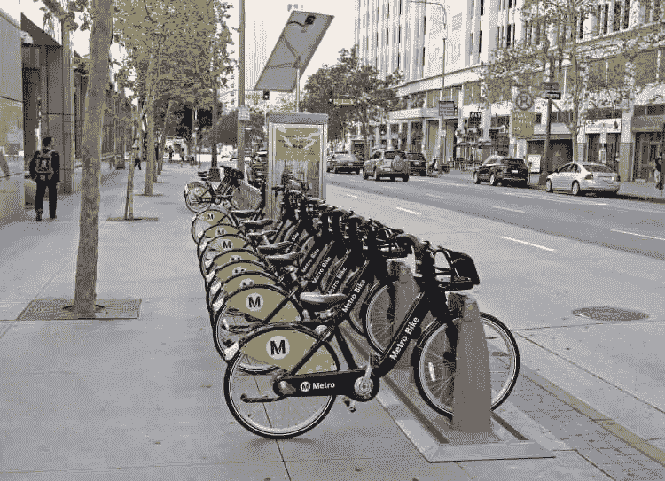

在这种新的结构下，每半小时的价格降低了 50%，为 1.75 美元。此外，基于时间的通行证现在也更便宜了。

虽然这一价格变化相当剧烈，但是否有更好的定价选择？Python 中的优化模型能对此有所帮助吗？我和 Shreenath Bhanderi 开始回答这些问题。

我们首先从洛杉矶地铁[数据网站](https://bikeshare.metro.net/about/data/)提取一年的自行车共享数据。然而，在我们开始优化 PuLP 之前，我们要经历通常的数据清理过程。


# 数据清理

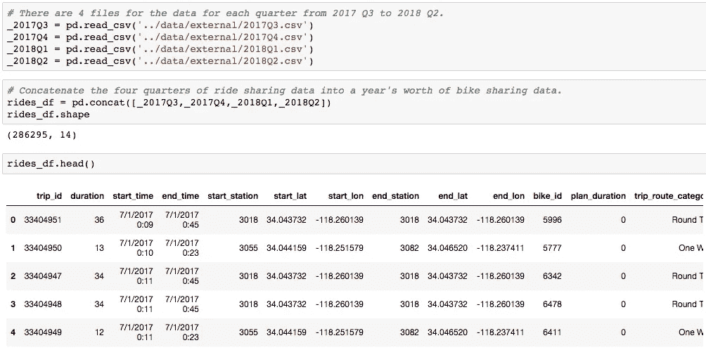

我们看到，在过去的 4 个季度中，有超过 286，000 次乘坐。这些数据还为我们提供了关于使用了哪些自行车、起点和终点的位置以及每次骑行的长度的信息。

与大多数数据集一样，日期在读入时是字符串。我们运行一个快速的 pd.to_datetime 函数，将 start_time 和 end_time 列转换为 datetime 对象。

我们使用 missingno 包来检查数据帧中的 NA 值。由于缺失值的数量与观察值的总数相比几乎可以忽略不计，因此我们删除了这些行。

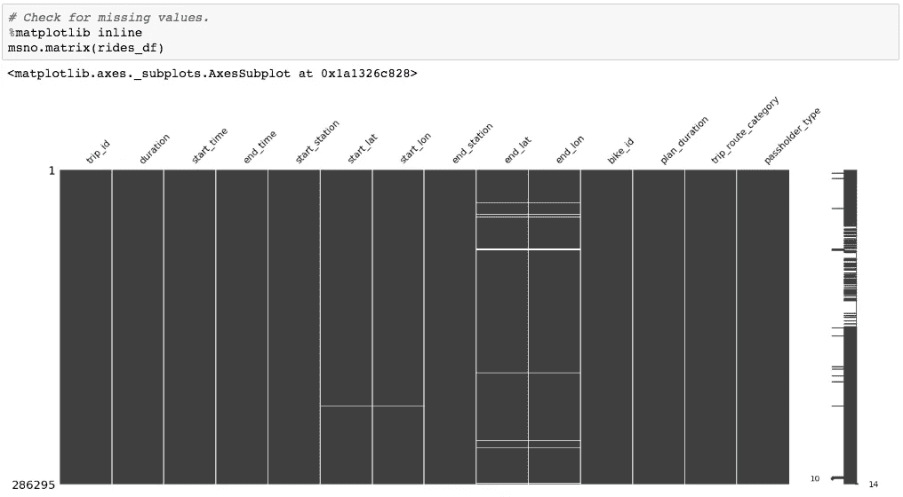

删除了大约 4849 行，占全部行的 1.7%。

## **填写自行车起止站数据**

我们需要更多关于自行车站的详细信息，如码头数量和地址。为此，我们从洛杉矶地铁下载 json 文件，其中包括不同自行车站的地址和容量。

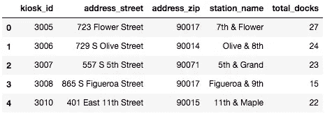

解析出相关字段后，我们获得 kiosk_id 来标识主数据帧中的站点、地址信息以及每个站点的停靠站数量。

然后，我们将该站数据与主数据帧合并两次，一次用于起点站，一次用于终点站。

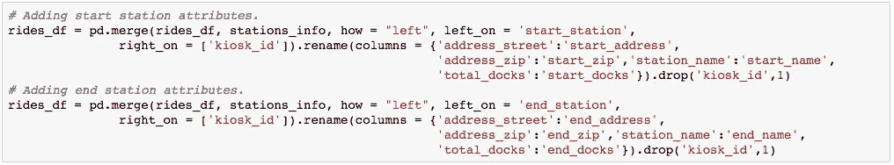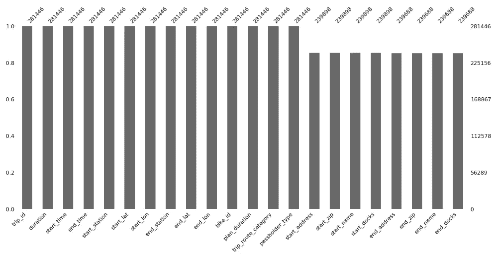

再次快速查看 missingno 表明，大约有 20%的记录缺少电台信息。由于这是数据集的一个相当大的部分，我们可以仔细看看如何处理这些丢失的值。

由于填写车站的所有信息可能是一项繁琐的工作，所以让我们首先仔细看看车站周围的描述性统计数据。


最常见的起点站出现在 11，437 次乘坐中，而最不常见的起点站仅出现在 6 次乘坐中。我们应该只填充高于 2269 计数平均值的站点吗？

中值为 1544，看起来 2269 计数可能太高了。因此，我们将使用中位数 1544 来代替。只有高于 1544 计数的站点才会填入信息。

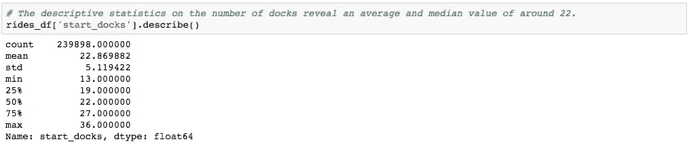

看一下码头的平均数和中位数，它们都在 22 左右，我们可以合理地用 22 来填充缺失的码头值。

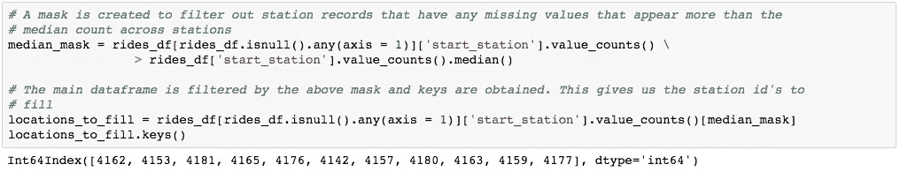

通过创建一个掩码和快速过滤器，我们获得了一个可用于填充数据帧的站点 id 列表。

通过手动搜索和 Google API 的结合，我们获得了以下关于一些缺失站点的信息。

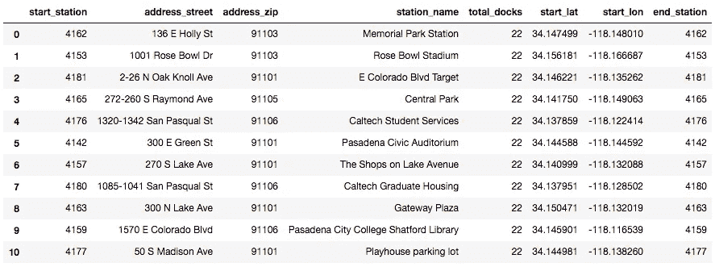

用 DataFrame 填充额外的站信息。在这里，我们再看一下 missingno 矩阵。

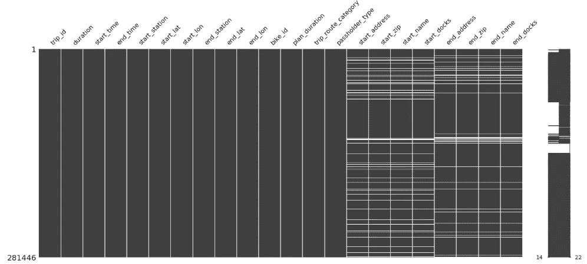

在删除最后的空值后，我们获得了一个包含 250，513 条记录的数据帧。在填写一些地址细节后，我们获得了大约 25，000 个额外的值。

## **活动自行车**

另一个值得注意的话题是洛杉矶地铁自行车车队的利用。

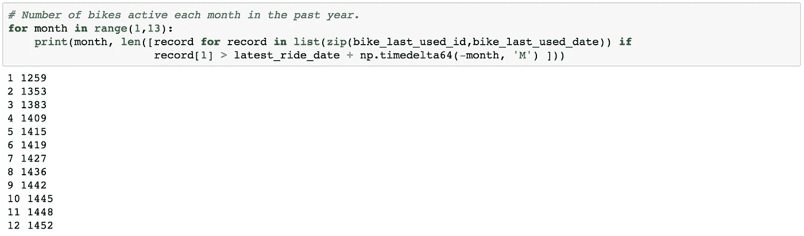

虽然所有的自行车在过去的一年里都是活跃的，但大约 1259 辆或大约 86%的自行车在过去的一个月里至少使用过一次。这似乎是一个相对健康的数字，但是实际的利用率和库存分析将在本系列的下一部分进行。

现在，我们确定在过去 6 个月中闲置的自行车，并在另一列中将其编码为 0。上个月活跃的自行车得到 1 分。

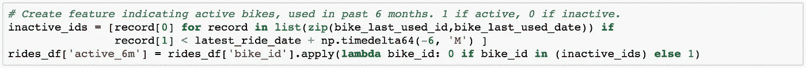

## **虚拟变量**

数据集还包括多个分类变量。稍后可能特别感兴趣的两个是护照持有者类型和旅行类别。

在这里，我们为两者创建虚拟变量列，并将它们连接到主数据集。

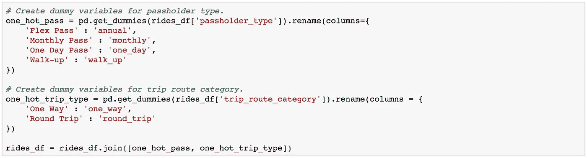

## **30 分钟时间段的计数**

鉴于洛杉矶地铁自行车的定价系统是基于用户在自行车上花费了多少 30 分钟的时间，将编码一个额外的列来计算每个乘客在一次旅行中花费的 30 分钟时间。

鉴于通行证持有者在乘车的前 30 分钟是免费的，他们将比无电梯乘车者少付费一个时间段。

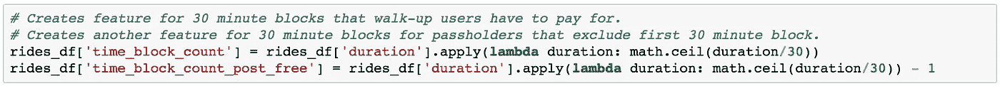

随着数据集在很大程度上得到清理并添加了额外的功能，我们可以开始解决优化问题。

# 定价计划优化

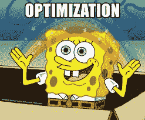

## **定义优化目标和限制**

这一优化的目标是使洛杉矶地铁自行车的总收入最大化。对于这种线性优化，我们将利用[纸浆](https://www.coin-or.org/PuLP/)库。

收入的两个主要来源是:

1.  所有乘坐的总票价
2.  通行证销售总额(每日、每月、每年)

洛杉矶地铁可以通过改变定价结构或改变提供的计划来增加总收入。

洛杉矶地铁自行车最近实施了如下新的价格结构。以前的计划和现在的计划如下:

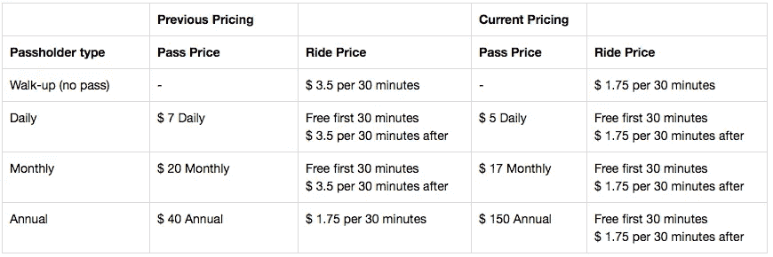

为了得出适当的价格与需求关系，必须对进一步的需求模型进行估计。然而，要在优化中考虑价格和数量的关系，需要一个二次公式。这将在下一篇文章中通过 [SciPy](https://www.scipy.org/) 和 [CVXOPT](https://cvxopt.org/) 来完成。

对于简单的线性模型，我们试图回答两个关键问题:

1.  洛杉矶地铁是否应该维持现有的每日、每月和年度计划体系，以实现收入最大化？
2.  在以前和新的价格结构中，这种情况如何变化？

## **估算每种通行证类型的售出通行证数量**

我们将要求估算每种通行证类型的售出数量，以估算总收入。我们首先看一下一些聚合指标:

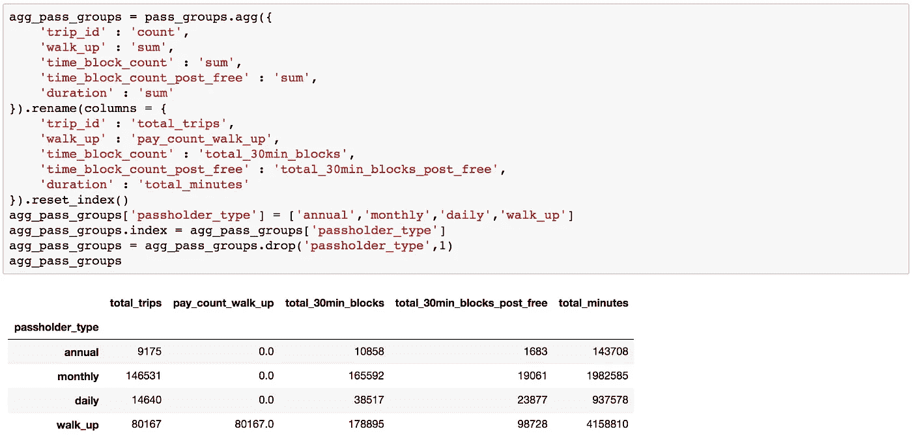

由于我们没有针对通行证持有人的唯一标识符，我们参考洛杉矶地铁自行车的[数据页面](https://bikeshare.metro.net/about/data/)来了解已经售出了多少通行证。

自 2016 年 7 月成立以来，已经完成了约 575，281 次行程，售出了 42，870 张通行证，预计在长达一年的分析期间，将售出约 20，000 张通行证。

我们将从盈亏平衡的角度估计每种通行证的销售额。支付一张通行证的价格平均需要多少次旅行？

由于大多数行程(> 60%)是从地铁站出发的“最后一英里”行程，行程的中位持续时间为 12 分钟，我们对 30 分钟以下的行程进行了以下盈亏平衡分析。

通过使用当前和以前的票价和通行证费用的平均值，我们得出以下结果:

```
Rides per day required for daily pass: 2.0 
Rides per month required for monthly pass: 5.714285714285714 
Rides per year required for annual pass: 22.857142857142858
```

看看保本所需的乘车次数并评估这些数字，这些数字似乎偏低。

如果购买每日通行证，每日通行证持有者可能会进行多次往返旅行。

月票持有者可能是偶尔的通勤者，即使是保守的每周 2 次乘车上班，一个月也要 8 次。


How often do you bike to work?

由于上一个定价计划中弹性点的价格为 40 美元，因此年度通行证持有者最难衡量。目前，它们将被缩放到与日和月票号码相同的因子。

将每日乘车次数提高到保守的 3 次乘车次数会增加 50%，而将每月乘车次数提高到保守的 8 次乘车次数会增加 40%。对于保守的估计，我们将这三个估计值按 40%的公共因子进行缩放。

```
Rides per day required for daily pass (scaled): 2.8 
Rides per month required for monthly pass (scaled): 8.0 
Rides per year required for annual pass (scaled): 32.0
```

因此，通过将每种票类型中的总乘车次数除以达到盈亏平衡所需的平均乘车次数来计算估计售出的票，得出以下结果:

```
Estimated passes sold for daily pass: 5229 
Estimated passes sold for monthly pass: 18317 
Estimated passes sold for annual pass: 287 
Total passes sold: 23833
```

在此期间售出的入场券总数估计约为 23 833 张。这与我们先前估计的 20，000 人大致相符。

现在让我们为这个优化模型公式化目标函数，以最大化来自通行证销售和乘坐的总收入。

总收入可分为以下几部分:

1.  来自无预约用户的总收入= 30 分钟使用价格*无预约用户的 30 分钟总块数
2.  日通票、月通票用户的总收入= 30 分钟的使用价格*前 30 分钟免费后的 30 分钟总时长
3.  销售门票的总收入=相应门票的价格*相应门票类型中售出的门票总数

现在可以进行一个快速计算，看看我们当前的总收入是多少，以及过去一年售出的门票的估计数量。

这里使用旧的定价方案来估算价格。在这里，年卡持有者每年支付 40 美元购买年卡，每半小时支付 1.75 美元。前半小时不是免费的。

```
Total revenue: $ 961,924.5
```

现在我们可以用纸浆来表示这个目标函数。

## 纸浆线性优化

在 PuLP 中，一个易于遵循的线性规划框架如下:

1.  引发纸浆问题
2.  定义决策变量
3.  形式目标函数
4.  表单约束
5.  解答和解释

为了回答我们之前提出的两个关键问题，我们需要两个独立的纸浆模型。一个包含以前的定价结构，另一个包含当前的定价结构。

**1。引发纸浆问题**

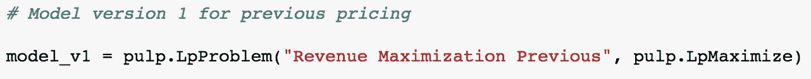

这里，我们在 PuLP 中创建一个 LpProblem，并用 pulp.LpMaximize 将其设置为一个最大化问题。

**2。定义决策变量**

为总共 6 个二元变量创建 3 对决策变量。每一对表示是否实现一个传递类型的“是”和“否”决定。

例如，month_yes 表示应该出售月票，month_no 表示不应该出售月票。

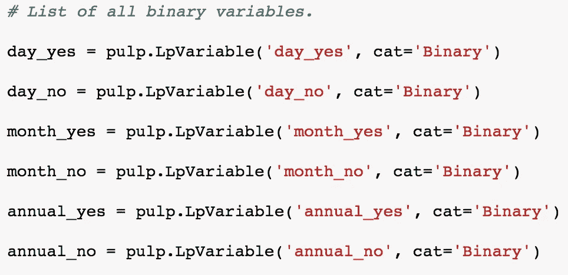

**3。表单目标函数**

现在我们需要为这个优化模型制定关于总收入的目标函数。

我们当前总收入的细分如下:

1.  按半小时收费的无电梯总收入。
2.  每个套票类别的游乐设施总收入。如果我们取消特定的传递类型，则值为 0。
3.  如果取消套票，每个套票类别的替代定价总收入。如果我们维护特定的通行证类型，则值为 0。
4.  出售门票的总收入。如果我们取消传递类型，则值为 0。

关于取消通票类型的替代定价，我们假设乘车将按无电梯收费。

鉴于乘客已经在抱怨每小时 3.50 美元的轮挡费用，在过去的定价方案中，任何通行证的减少都会导致乘客数量的急剧下降。此外，鉴于自行车和滑板车共享领域的激烈竞争，某些通行证的掉落可能会导致车手转向其他竞争者。

我们假设每个类别的基线磨损为 30%，并在运行模型时调整参数。

用 Python 表示每个收入流，我们得到了以下结果:

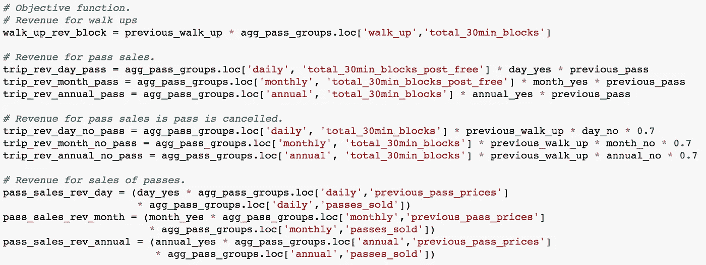

然后，我们将其添加到纸浆模型中。

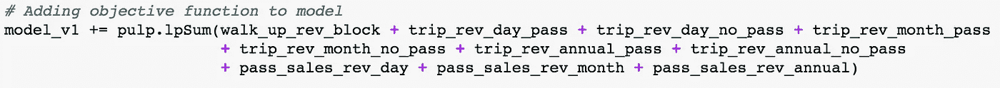

**4。形式约束**

然后，我们必须定义额外的约束，使得每个二进制对中只有一个决策变量可以并且必须是真的。

例如，二进制变量 month_yes 和 month_no 可以表示 0 或 1。这两个变量的总和不能是 0 或 2，因为这意味着不可能同时实施和不实施月度计划。

我们通过将总和设置为 1 来实施这个约束。

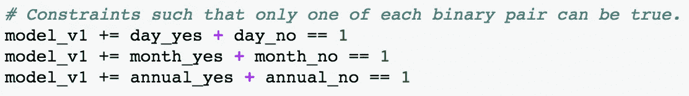

**5 .解析**

让我们看看我们的模型现在是什么样子:

```
Revenue Maximization Previous:
MAXIMIZE
26602.1*annual_no + 30481.5*annual_yes + 94366.65*day_no + 78387.75*day_yes + 405700.39999999997*month_no + 399696.75*month_yes + 626132.5
SUBJECT TO
_C1: day_no + day_yes = 1

_C2: month_no + month_yes = 1

_C3: annual_no + annual_yes = 1

VARIABLES
0 <= annual_no <= 1 Integer
0 <= annual_yes <= 1 Integer
0 <= day_no <= 1 Integer
0 <= day_yes <= 1 Integer
0 <= month_no <= 1 Integer
0 <= month_yes <= 1 Integer
```

使用 model.solve()求解模型，我们得到了以下解:

```
Status: Optimal
Optimal Solution to the problem:  1156681.05
Individual decision_variables: 
annual_no = 0.0
annual_yes = 1.0
day_no = 1.0
day_yes = 0.0
month_no = 1.0
month_yes = 0.0
```

上述解决方案可以这样理解:

1.  取消日票和月票。
2.  维护年度通行证。
3.  总收入将为 1，156，681.05 美元

如果任何通行证被取消，减员率为 30%，即得出了这一结论。事实是，不同通行证的流失率会有所不同。

例如，那些持有年度通行证的人不太可能磨损，因为他们可能是最需要使用自行车的人。

在调整了一些参数和损耗率后，我们得出以下结论:

*   如果取消计划的自然减员率高于 41%，则应保留日间计划。
*   如果取消计划的流失率高于 31%，则应保留每月计划。
*   如果取消计划的自然减员率高于 19%，则应保留年度计划。

按照这些边际损耗率计算的总收入为我们带来了优化的 1，136，357 美元总收入。

由于洛杉矶地铁此前一直收取 3.50 美元的高价，这些高流失率是有道理的。如果假设自然减员率为 30%，且洛杉矶地铁取消了月度计划，他们将能够通过向剩余的 70%的乘客收取步行费率来获得收入。

现在让我们对当前的定价重复同样的方案，费率减半。

由于新的年度定价方案与以前的年度(flex)通行证完全不同，并且在数据中单独列出，我们保持 40 美元的年度通行证价格。目前 150 美元的价格被考虑到以后的优化中。

我们得到了以下解决方案:

```
Status: Optimal
Optimal Solution to the problem:  1053249.14
Individual decision_variables: 
annual_no = 1.0
annual_yes = 0.0
day_no = 0.0
day_yes = 1.0
month_no = 0.0
month_yes = 1.0
```

考虑到将半小时费率减半至 1.75 美元的严厉措施，如果任何计划被取消，自然减员也不太可能如此之高。

此外，当前的最佳解决方案表明，即使没有损耗，我们可以按加价向每个通行证持有者收费，也应该保留每日和每月通行证。

另一方面，年度计划只有在超过 25%的年票持有者因计划取消而流失的情况下才能保留。考虑到年卡持有者最不容易发生摩擦，因为如果他们支付了年卡费用，他们可能确实需要通勤服务，洛杉矶地铁最近决定取消这一年度(弹性)计划很可能是正确的举措。

虽然 PuLP 只能处理简单的线性优化，但是还有许多其他强大的库，比如 CVXPY、IPOPT 和 SciPy。

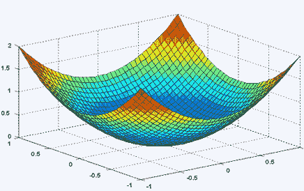

在下一篇文章中，我用一些需求曲线估计来解决二次优化问题，看看洛杉矶地铁自行车的其他定价方案。

感谢您的阅读，您可以在 [Github](https://github.com/finnqiao/la_metro_bikeshare_data) 上查看笔记本，并在 [LinkedIn](https://www.linkedin.com/in/finnqiao/) 上联系！