# 洛杉矶地铁自行车共享数据第 2 部分—使用 SciPy 进行二次优化

> 原文：<https://towardsdatascience.com/la-metro-bike-share-data-part-2-quadratic-optimization-with-scipy-394ab69dbc00?source=collection_archive---------11----------------------->


## 使用 SciPy 分析最近的价格变化并找到最佳价格组合

在[第 1 部分](/la-metro-bike-share-data-part-1-linear-optimization-with-pulp-bc8ed4c85cd2)中，我们清理了数据集，并通过 pulp 运行了一个简单的线性优化模型。正是在撰写第一部分的最后，洛杉矶地铁自行车的 2018 年第三季度数据公布。

这可能只是一个额外的数据点，但我们现在可以拟合一个基本的线性需求曲线，用于模型约束，以允许价格和需求波动。

在我们得到这些曲线之前，我们先确定一些用于后续分析的常数。

## 竞争基准

其他多家运营商最近也进入了自行车/滑板车共享市场。像 Bird、Lime 和 Jump 这样的名字应该是生活在洛杉矶地区的大多数人所熟悉的。

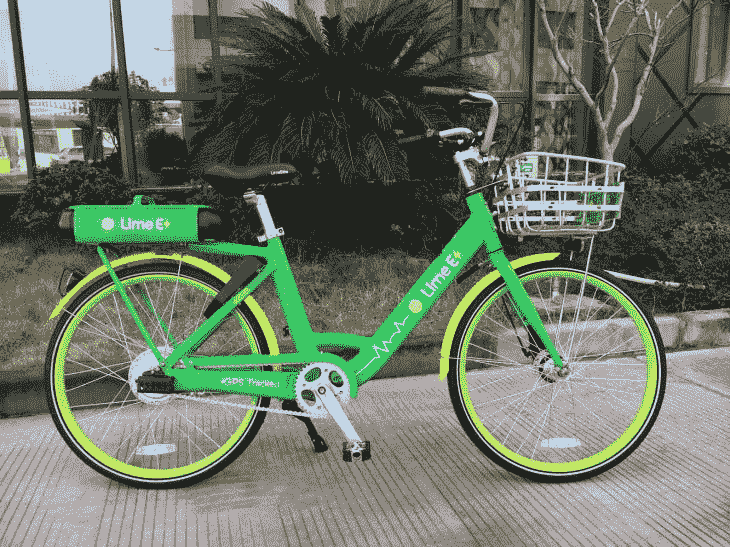

从竞争对手的角度来看，定价方案有多种构建方式。我们可以实施和比较的一些选项如下:

1.  每分钟可变利率
2.  按时间间隔可变费率(目前洛杉矶地铁为 30 分钟)
3.  任何乘坐的固定费用
4.  在实施可变费率之前的一段时间间隔内的固定费用
5.  涵盖特定时间内所有游乐设施的周票、月票。此后可变利率

为了与其他自行车和踏板车运营商的定价进行比较，让我们为所有运营商绘制不同的定价曲线。

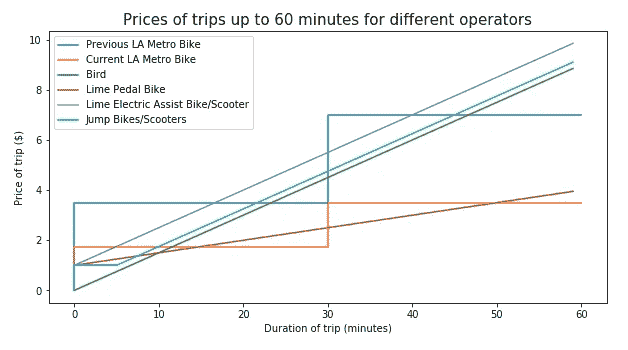

纵观洛杉矶自行车和踏板车运营商的不同定价方案，洛杉矶地铁刚刚颁布的当前定价绝对是最便宜的，一小时的自行车骑行价格为 3.50 美元。

下一个最便宜的选择是 Lime 踏板自行车，它比洛杉矶地铁的 walk on riders 便宜，骑行时间不到 15 分钟，骑行时间在 30 到 50 分钟之间。

因此，我们将设置价格上限，并在优化模型中将其用作常数:

1.  无通行证每分钟可变费率设置在 0.05 美元和 0.15 美元这两个最常见价格的平均值之下:
    无通行证每分钟可变费率<= 0.10 美元
2.  有计划的每分钟可变费率设置在洛杉矶地铁当前的 0.06 美元和 Jump 的 0.07 美元的平均值之下:
    有通行证的每分钟可变费率<= 0.065 美元
3.  每 30 分钟变化率设置在最近的竞争对手(石灰踏板)下:
    每 30 分钟变化率< = $2.5

## 总需求曲线

2018 年 Q2 是价格变化前的最后一个数据点，2018 年第三季度是之后的第一个数据点。我们将 y 设为每 30 分钟乘车的价格，x 设为该季度乘车的总次数。

使用简单的斜率估计，我们得到以下结果:

```
The linear function from two data points is: 
y = -9.762356353899364e-05 x + 11.05186600468593
Where y = price for half hour block
      x = rides in fiscal quarter
```

## 按客户细分的需求曲线

如果我们按客户细分细分需求会怎么样？

我们首先创建 2018 年 Q2 和 2018 年第三季度的分组表格。

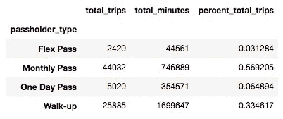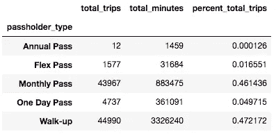

Left: 2018 Q2 figures, Right: 2018 Q3 figures

我们可以看到新的年度通行证还没有完全流行起来，在通行证季度仅售出 12 张通行证。150 美元的价位可能有点高。

有趣的是，价格下降并没有真正影响到任何通票持有者，但却使无电梯乘客的数量增加了一倍。

让我们看看其他需求曲线是什么样的。

```
Walk up demand function estimate
The linear function from two data points is: 
y = -9.159905783826223e-05 x + 5.871041612143418

Daily pass demand function estimate
The linear function from two data points is: 
y = 0.006183745583038869 x + -27.542402826855124

Monthly pass demand function estimate
The linear function from two data points is: 
y = 0.026923076923076925 x + -1181.9769230769232Annual(Flex) pass demand function estimate
The linear function from two data points is: 
y = 0.0020759193357058124 x + -1.5237247924080664
```

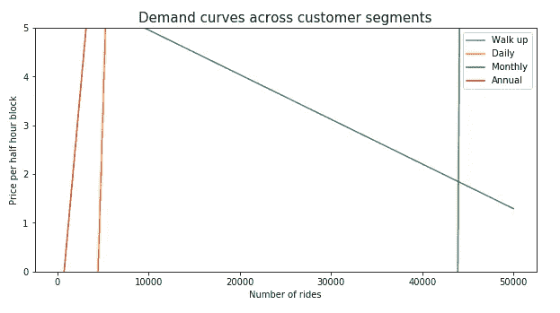

有趣的是，一条典型的负斜率需求曲线只出现在步行骑车者身上。鉴于费率从 3.50 美元大幅降至 1.75 美元，似乎许多乘客只是开始成为无电梯乘客，而不是购买通行证。由于通行证价格的下降与半小时费率的下降不成比例，因此放弃通行证变得更加经济。

## 基本二次优化模型

我们从定义目标函数开始，就像在纸浆中一样。

当我们在 PuLP 中将所有模型组件“添加”到一个问题中以创建模型时，SciPy optimize 只需要为目标函数和各种约束创建函数，然后将它们作为参数传递给 minimize 函数。

由于二次优化问题自然是一个极小化问题，所以我们将总收入返回为带负号的'-total_revenue '，以获得最大值。

还要注意的是，目标函数中只有一个参数，你初始化的每个变量都是从这个列表中传递过来的。

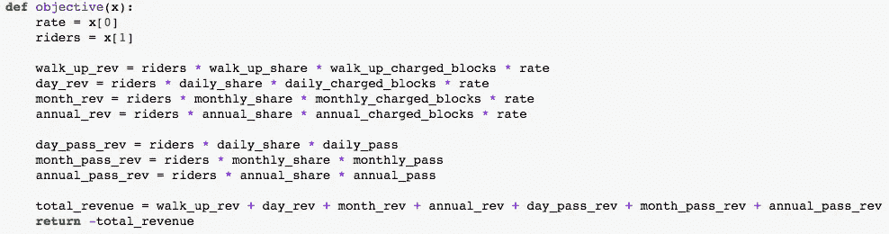

约束同样被定义为单个变量具有相同索引的单个函数。

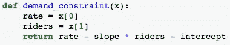

然后创建一个字典来标记约束的类型并列出所有单独的约束。

界限由元组表示。例如，b1 将代表收费率的上限和下限。1.5 代表速率的下限，2.5 代表速率的上限。

b2 代表总乘坐次数的范围。上限为 140，000，鉴于目前的市场形势，总乘坐次数翻倍似乎不现实。

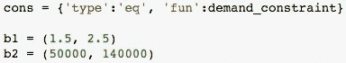

然后将边界添加到一个元组中，作为函数参数传递给 minimize 函数。

x0 指的是你对变量的最初猜测。在这里，我们选择当前的定价和总乘坐价值作为我们的初步猜测。

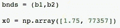

一旦创建了所有函数参数，我们就可以将它们传递给 optimize 中的 minimize()函数。

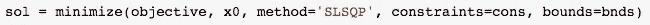

```
fun: -1623030.3308773183
     jac: array([-5.59883906e+04, -1.65781250e+01])
 message: 'Optimization terminated successfully.'
    nfev: 41
     nit: 10
    njev: 10
  status: 0
 success: True
       x: array([1.50000000e+00, 9.78438571e+04])
```

根据这一优化，当价格设置为每半小时 1.50 美元时，收入似乎得到了优化。这将使总乘坐次数增加到 97，844 次。

总收入将增加到 1 623 030 美元。

似乎负需求斜率意味着将价格降至下限是最有效的收益最大化策略。

如果我们调整变量的界限呢？如果允许最低价格进一步降至 1 美元以下会怎样？如果竞争比预期更激烈，最大乘坐增长限制在 100，000 次以下，会怎么样？

我们将下列界限添加到灵敏度分析中:

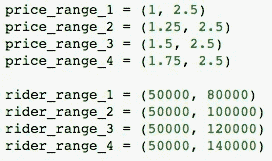

循环上述价格和附加条款范围的所有组合，我们获得以下总收入数字:

```
Total rev | Rate | Total riders | Rate range | Rider range
1678530     1.0    102966.0       (1, 2.5)     (50000, 140000)
1678530     1.0    102966.0       (1, 2.5)     (50000, 120000)
1651146     1.0    100405.0       (1.25, 2.5)  (50000, 140000)
1651146     1.0    100405.0       (1.25, 2.5)  (50000, 120000)
1646752     1.0    100000.0       (1.25, 2.5)  (50000, 100000)
1646752     1.0    100000.0       (1, 2.5)     (50000, 100000)
1623030     2.0    97844.0        (1.5, 2.5)   (50000, 140000)
1623030     2.0    97844.0        (1.5, 2.5)   (50000, 120000)
1623030     2.0    97844.0        (1.5, 2.5)   (50000, 100000)
1594182     2.0    95283.0        (1.75, 2.5)  (50000, 140000)
1594182     2.0    95283.0        (1.75, 2.5)  (50000, 120000)
1594182     2.0    95283.0        (1.75, 2.5)  (50000, 100000)
1372815     2.0    80000.0        (1.75, 2.5)  (50000, 80000)
1372815     2.0    80000.0        (1.5, 2.5)   (50000, 80000)
1372815     2.0    80000.0        (1.25, 2.5)  (50000, 80000)
1372815     2.0    80000.0        (1, 2.5)     (50000, 80000)
```

根据给定的需求曲线，似乎采用 1 美元的最低可能价格会导致最多 102，966 次乘坐。它还会产生最高收入 1，678，530 美元。

总的来说，似乎只要我们能够吸引 10 万次以上的乘坐，策略应该是降低价格。鉴于我们在这里看到的，也许从以前的定价方案大幅下降 50%是合理的。

如果我们创建一个基于分段需求曲线的新模型会怎么样？公式化的约束如下所示:

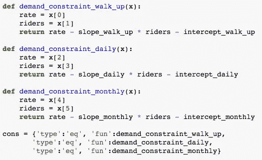

由于之前的年票/灵活票被取消，年票的需求曲线可能不再相关。

重新制定目标和解决这个新的方程产生了一个较低的无电梯乘车的最优价格和一个接近价格上限的其他组的价格。

但是，对于每次迭代，我们都会获得以下消息:

```
message: 'Positive directional derivative for linesearch'
success: False
```

看起来，使用我们当前的公式，优化器无法找到一个下降方向来足够快地降低目标函数。最终，这意味着结果不可能是最佳的。

鉴于每种通行证类型的粗略需求估计，等待更多新价格数据出来以适应不同细分市场的更好需求模型将是有益的。

此外，模型公式的改进可以帮助我们整合其他可变数据，如我们上面确定的基于分钟的定价。

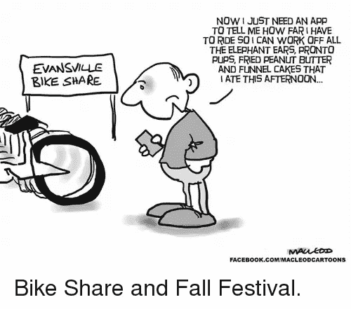

Maybe for the next project.

在下一部分中，我们将从清理后的数据集中查看更多基于地理的数据和库存。感谢阅读！笔记本可以在 [Github](https://github.com/finnqiao/la_metro_bikeshare_data/blob/master/notebooks/la_metro_part_2.ipynb) 上找到，也可以在 [LinkedIn](https://www.linkedin.com/in/finnqiao/) 上随意连接！