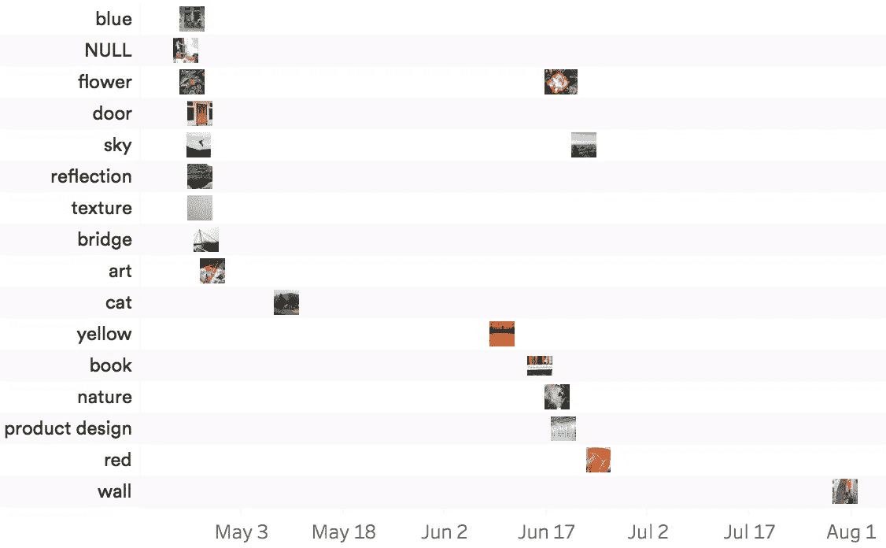

# 用谷歌视觉 API 标记 instagram 照片

> 原文：<https://towardsdatascience.com/labelling-instagram-photos-with-google-vision-api-fca4c4b54fa4?source=collection_archive---------16----------------------->

今天我将使用谷歌云视觉分析 instagram 图片

**方法**

主要涉及两个技术步骤:

*   使用 [instaR](https://github.com/pablobarbera/instaR) 包从我的 Instagram 账户中删除照片
*   通过[谷歌视觉](https://github.com/cloudyr/RoogleVision)用谷歌视觉 API 在 R 中给照片加标签

由于关于 RoogleVision 和 instaR 的操作方法已经在[这里](https://t.co/L9t7icFTUF)和[这里](https://bigdataenthusiast.wordpress.com/2016/03/22/exploring-instagram-api-using-r/)介绍过了，这两者都涉及到设置开发者账户和认证，所以我将重点介绍使用它们的体验和结果。

**观察结果**

我学到的一件事是，instagram 只允许在沙盒模式下抓取 20 张最新照片，除非你提交应用程序进行审查。此外，如果你使用的是“轮播”模式，在一篇文章中汇集几张照片，instaR 将只下载封面图片。由于我不经常发 instagram，这就涵盖了过去 3 个月的照片，也让我对我发布的内容有了更好的理解。

**结果**

labelled instagrams

一些观察结果:

*   该 api 正确地标记了大多数照片，除了非常抽象的照片，如沙滩上的沙子(标记为纹理)。谷歌视觉 API 更关注标签、颜色组合等，似乎不提供字幕
*   标签检测算法将返回几个最高概率的排序结果。具有预支配色块的图片更多地被标记为颜色而不是物体，即，穿红色衣服的人被标记为“红色”作为第一标签，而“面部表情”作为第二标签
*   还有一张复杂的照片没有标注。这张照片包含一幅 3D 壁画和食物。壁画似乎很难让图像识别 api 理解
*   我想量化我通常拍摄更多的主题，但是考虑到 20 张照片的限制，我只能说我有关于花和天空的重复帖子

这是我关于数据科学和视觉故事的[# 100 日项目](https://medium.com/@yanhann10)的第 45 天。我的 [github](https://github.com/yanhann10/opendata_viz) 上的全部代码。感谢阅读。欢迎新主题的建议和反馈。