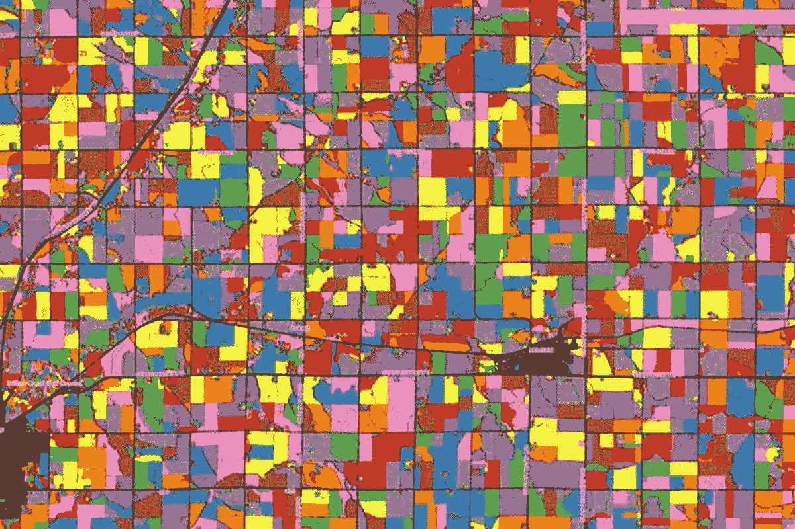
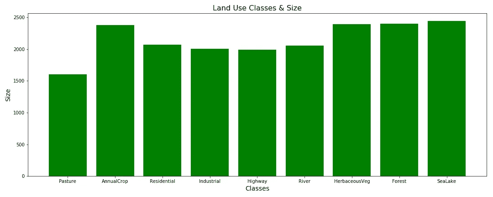
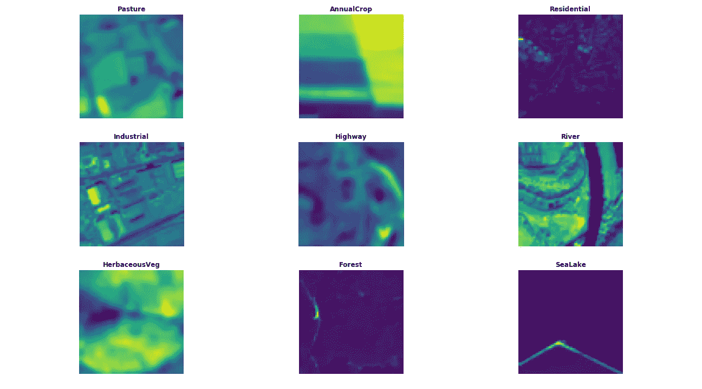
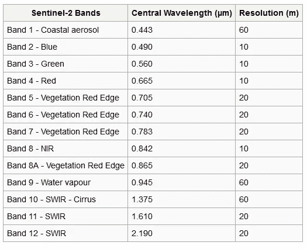
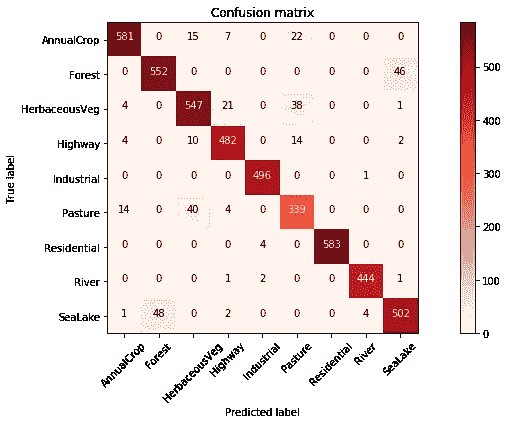

# 基于深度学习的土地利用/土地覆盖分类

> 原文：<https://towardsdatascience.com/land-use-land-cover-classification-with-deep-learning-9a5041095ddb?source=collection_archive---------4----------------------->



Land use classes

在环境监测和许多其他子领域中，识别地球表面的物理方面(土地覆盖)以及我们如何开发土地(土地利用)是一个具有挑战性的问题。这可以通过实地调查或分析卫星图像(遥感)来完成。虽然进行实地调查更加全面和权威，但这是一个昂贵的项目，而且大多需要很长时间来更新。

随着最近航天工业的发展和卫星图像(免费和商业)可用性的增加，深度学习和卷积神经网络在土地利用分类方面显示了有希望的结果。

在这个项目中，我使用了免费提供的 Sentinel-2 卫星图像对 9 个土地利用类别和 24000 张带标签的图像进行了分类(图 2)。原始数据集包含 10 个类和 27000 个带标签的图像，可从[这里](http://madm.dfki.de/downloads)获得。



Figure 2— Land use classes

这里有一些不同土地利用类型的可视化图像。



Figure 2- Visualization

Sentinel-2 的数据是多光谱的，在可见光、近红外和短波红外光谱中有 13 个波段。这些波段具有不同的空间分辨率，从 10 米到 60 米不等，因此图像可被归类为高-中分辨率。虽然有其他分辨率更高的卫星可用(1 米至 0.5 厘米)，但 Sentinel-2 的数据是免费的，重访时间长(5 天)，这使它成为监测土地利用的最佳选择。



Sentinel-2 Bands, Wavelength, and Resolution

# 数据预处理

虽然一些深度学习架构可以将所有 13 个波段作为输入，但有必要对数据进行预处理。这些图像是 TIFF 格式的，我尝试的一些架构不能适应它。我选择使用 GDAL 和 Rasterio，这是我最喜欢的工具，也是我最熟悉的工具，将它们转换成 JPG 格式并选择乐队。gdal_translate 成功了。

```
gdal_translate -of GTiff -b 1 -b 10 -b 13 input_sentinel_13_band.tif output_RGB.tif
```

这些是我尝试过的一些乐队组合:

*   所有 13 个乐队
*   红、绿、蓝(RGB)波段
*   短波红外线(SWIR)
*   高分辨率波段(10-20 米波段)
*   特殊波段组合——遥感领域的知识很有帮助。一些波段组合可以引出农业、植被、水或土地。
*   使用不同组合的数据增强(即具有特殊波段的 RGB)

# 建模

我用 Fastai 库的迁移学习(Resnet50)来训练我的模型。感谢 Fastai 团队令人惊叹的深度学习课程，这里使用的技术来自深度学习课程材料。我训练模型的步骤是:

*   训练最后一层
*   试试数据扩充
*   冻结所有层并从头开始重新训练

建模中使用的技术包括:学习率查找器、带重启的随机梯度下降和退火。

# 结果

正如在预处理部分提到的，我已经试验了不同的波段组合。我的模型的最高精度为 0.94，虽然这低于原始论文中报告的数据集的精度(0.98)，但对于我的项目及其目标来说，这是相对较高的。我所有实验的结果都在下表中(对关键要点的思考部分):

```
 +------------------------+-----------------------------+
        |   Bands                |   Result(Accuracy)          |     
        +------------------------+-----------------------------+
        | All Bands              |     0.83                    | 
        | RGB                    |     0.84                    | 
        | High Resolution Bands  |     0.81                    | 
        | **Special Bands**          |     **0.94  **                  |  
        | RGB+Special Bands      |     0.80                    |
        +------------------------+-----------------------------+
```

模型发现难以区分的一些类别是森林和海湖，如混淆矩阵所示(图 3)。仔细观察这两类的图像，人们可以推断，即使是人眼也很难清楚地区分。



Figure 3 — Confusion Matrix

# 关键要点:

波段组合的领域知识有助于改进这一特定模型。我在土地利用/土地覆被分类的深度学习应用中看到的所有文献都使用相同的波段作为所有的类输入(即 RGB 或 SWIR)。我的方法让我提高了将近 10%的准确率。

虽然我假设更多的波段肯定会改善我的模型，但我发现事实并非如此。使用所有 13 个波段效果不佳。这可归因于包含了低分辨率波段。但同样，仅使用高分辨率波段的精度最低(0.81)。

另一个实验是通过将 RGB 图像和特殊波段组合添加到同一个文件夹中来增加数据集，从而使可用于训练的图像数量翻倍。这个精度最低(0.80)。笔记本在这里[可用。](https://github.com/shakasom/Deep-Learning-for-Satellite-Imagery/blob/master/LULC_Final.ipynb)