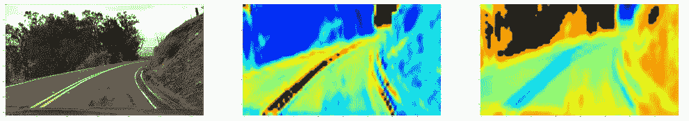
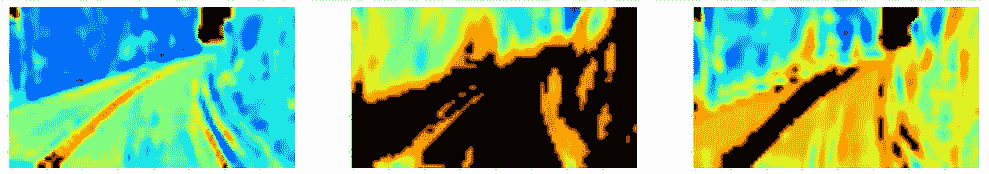
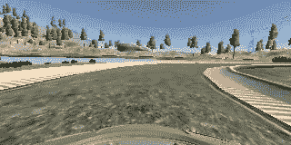
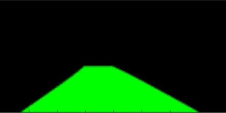
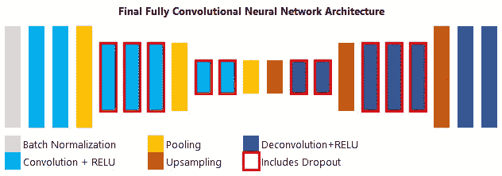
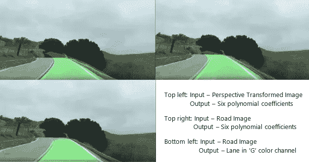
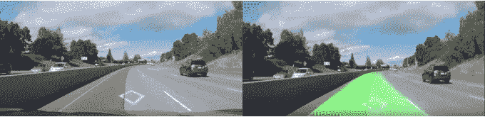

# 基于深度学习的车道检测(下)

> 原文：<https://towardsdatascience.com/lane-detection-with-deep-learning-part-2-3ba559b5c5af?source=collection_archive---------1----------------------->

*这是我的车道检测深度学习解决方案的第二部分，涵盖了我在寻找问题的最终解决方法时创建的实际模型，以及一些潜在的改进。请务必阅读第一部分***，了解我之前方法的局限性以及在我做出以下更改之前使用的初步数据。这里和之前帖子中提到的代码和数据可以在我的*[*Github repo*](https://github.com/mvirgo/MLND-Capstone)*中找到。**

*创建了一个不错的数据集，我准备好制作我的第一个使用深度学习来检测车道线的模型。*

## *透视变换模型*

*你可能会问，“等等，我还以为你是想摆脱透视变换呢？”这是事实。然而，为了创建一个初始的模型架构，我想检查一下，在数据集有些有限的情况下，深度学习是否可以学习做与基于 CV 的模型相同的事情。因此，这里的输入是透视变换的道路图像，由此神经网络学习系数似乎更容易，这似乎是合乎逻辑的。*

*我在这里使用了一个与我之前在行为克隆项目中使用的类似的[模型架构](https://github.com/mvirgo/MLND-Capstone/blob/early_steps/perspect_NN.py)，包括一个批量标准化层，接着是一些卷积层、一个汇集层、扁平化层和一些全连接层。对于要预测的车道线系数的数量，最终全连接图层的输出大小为 6。我还使用了 Keras 的 ImageDataGenerator 来尝试使模型变得健壮(主要是额外的旋转、高度移动和垂直翻转——水平翻转让我担心，因为标签真的需要更改才能准确描绘线条信息)。经过一点微调(模型架构、参数和输入图像大小)，模型产生了一个[良好的结果](https://www.youtube.com/watch?v=ZZAgcSqAU0I&t=4s)，但是它非常严格地依赖于输入和输出的透视变换——它根本不能很好地概括。*

## *道路图像模型*

*在发现深度学习可以与我的数据集一起工作后，我接着着手创建了一个模型，它可以在没有任何透视变换的情况下接收道路图像。我使用了与之前完全相同的架构，除了添加了一个裁剪层来剪切图像的上三分之一。我的预期是，任何给定道路图像的顶部三分之一很少包含检测车道所需的信息。该模型很容易收敛到与透视变换模型相似的结果，所以我知道我可以抛弃对输入到模型的原始图像进行透视变换的需要。*

*在这一点上，我想使用不同于我自己手机的相机给我的模型一些额外的数据(考虑到不同的相机失真)，所以我给了它一些来自我之前项目的 uda city[常规项目视频](https://github.com/udacity/CarND-Advanced-Lane-Lines/blob/master/project_video.mp4)的帧。然而，这里的问题是为这些数据创建新的标签——我为*标记*我自己的数据所使用的透视变换与这个单独视频的不同。这也让我意识到我最初如何处理这个问题的一个巨大问题——从鸟瞰的角度来看，标签本身是多项式系数，这意味着在预测和绘制车道之后，车道仍然需要逆变换回原始图像的角度。*

*这导致了一个似乎很难概括的模型，但通过查看我自己的一个视频中产生的[结果](https://www.youtube.com/watch?v=Vq0vlKdyXnI)，我意识到，也许该模型仍然正确地检测到线条，只是由于预测后仍在使用透视变换，所以无法再现良好的视觉结果。model *看起来*似乎在视角不同的地方遇到了麻烦(在单独的 Udacity 视频和我自己的视频中的更多丘陵地带)。但是，如果它真的学会了检测这些线条，如果我能直接观察这些层本身的活动，又会怎样呢？然后，我可能会在原始视频的顶部显示层的激活。*

## *使用 keras-vis 的激活图*

*我很快发现了 keras-vis 的巨大知识库，这正是我所需要的。在此之前，我找到了一些关于相同概念的研究论文，但是我找不到重现结果所需的实际代码。keras-vis 库非常棒，因为它允许您将训练好的模型输入到函数中，并返回所需层的激活图，这在技术上是为典型分类神经网络中的每个“类”制作的，但在这种情况下是为我的每个多项式系数制作的。*

**

*Activation maps of the first few layers (note that the layers have been cropped by the top third)*

*这是一种非常有趣的方式，可以确切地看到我的卷积神经网络在我的道路图像中看到了什么。虽然上面的图片在第一层看起来很好，当然，这种方法有更多的问题。*

*首先，在我的许多弯曲道路图像中，模型实际上只看了*一条*的线条。我的模型已经知道了线之间的关系，这是因为-在大多数情况下，车道线将是平行的，所以如果你只看一条线(假设它总是两条线中的同一条)，你就可以大致了解另一条线的位置。但这并没有帮助我，因为我希望能够显示两条线或车道本身的位置。此外，如果你在上面注意到，可能由于我的图像在模型的生成器中翻转，激活也大量发生在天空中——模型正在学习根据天空在图像中的位置确定自己的方向，所以如果我想在我的原始视频上显示它，我必须以某种方式删除这个激活区域。*

**

*Deeper layers visualized*

*第二个问题更加令人困惑。弯曲的道路倾向于在单条线和天空上激活，而直的道路在图像底部的汽车本身以及汽车本身正前方的空间上激活，而在附近的线本身上不被激活。在图像的上方，这些线条有时会被激活。如果曲线和直线之间的激活没有任何一致性，这种方法就无法工作。*

## *迁移学习*

*我试图挽救 keras-vis 方法的最后一招是使用迁移学习。我已经完全忘记了我的[行为克隆项目](https://github.com/mvirgo/Behavioral-Cloning)，在这个项目中，一辆模拟汽车已经学会了根据提交给它自己训练过的神经网络的图像来驾驶自己。等等——我用超过 20，000 张图片训练了一个模型，让它在路上行驶——它是在看什么来做到这一点的？*

**

*One of the simulated car’s input images*

*答案实际上是整条道路本身(在 Udacity 的模拟器中没有单独的车道)，但我想知道我是否可以使用迁移学习来更好地集中模型的注意力。有了一个大得多的数据集来开始训练，我就可以用特定于我的车道检测的新数据添加一点额外的训练，希望有更好的激活层。使用 model.pop()从该项目加载训练好的模型后，我从其中删除了最终输出层(对于转向角，它是一个单一输出)，并用我的系数标签的六个输出来替换它。请注意，如果你是自己用一个模型来匹配输入图像的大小，或者它不会工作。*

*它工作得稍微好一点，因为模型在用我自己的数据进行一些额外的训练后，开始查看车道线而不是整条道路来激活。然而，仍然有很大的一致性问题，图像的哪些部分被激活，它们被激活的程度如何，等等。*

## *完全卷积的方法*

*感觉自己正处于失败的边缘，我开始寻找一种新的方法。我最近看到几个不同的小组对来自汽车摄像头的图像进行处理的一个领域是图像分割——将给定的图像分成几类，如道路、汽车、人行道、建筑物等。SegNet 是我感兴趣的图像分割技术之一，他们甚至发布了他们的通用模型架构，该架构使用卷积层(批量归一化和 ReLU 激活)结合下行时的池层，以及从中点到分割图像的上采样(本质上是非池化)和去卷积层。这种方法跳过了所有完全连接的层，形成了一个完全卷积的神经网络。*

*这似乎是一个潜在的解决方案，可以解决车道可能在错误的角度重新绘制的问题——为什么不直接让神经网络自己重新绘制预测的车道呢？我仍然可以输入道路图像，同时使用原始系数标签创建的车道图作为新标签(即输出图像)。考虑到我已经用绿色画了车道，我决定让我的模型的输出“过滤器”仅仅是 RGB 的“G”通道(并且仅仅用它堆叠两个空白过滤器，以使相应的图像与原始道路图像混合)。这也帮助我*将我的数据集*扩大了一倍——还记得我之前是如何担心水平翻转图像的潜在副作用吗，因为系数标签不会与神经网络看到的匹配得很好？通过切换到这种方法，在预处理数据时，我可以同时翻转道路图像和车道图像标签。*

**

*One of the new labels — a lane image*

*我将快速后退一步，查看此时的数据集:*

*   *我的原始数据拉有 1，420 张图像(视频中“好”帧的十分之一)。我删除了其中 227 个无法正确标注的项目。*
*   *我只添加了 568 张来自弯曲道路视频的图片(从我试图使用的 1636 张图片中——由于我用于标记的 CV 模型不够充分，很多图片还是失败了)*
*   *另外 217 张图片来自 Udacity 的常规项目视频*
*   *总共 1978 张图片*
*   *这是低的，并且分布不均匀，所以由于原始系数上的各种小图像旋转没有很好地表示，我最终得到了 6382 个图像*
*   *水平翻转增加了一倍，达到 12，764 张图片*

*请注意，我仍然能够对这些新标签使用图像旋转，方法是在我检查哪些系数位于主分布之外时，确保道路图像、系数标签和车道图像标签保持链接。*

*鉴于我以前从未使用过完全卷积的神经网络，我想非常接近 SegNet 的架构。幸运的是，使用 Keras 做到这一点并不太复杂——解卷积层的一个不同之处是，您必须确保实际上数学与您想要做的事情正确匹配。我通过在最终的合并图层后精确地镜像我的模型，并对我的输入图像使用 80 x 160 x 3 的稍微不同的纵横比(而保持原始纵横比将会有 90 x 160 x 3)来使这变得容易。这样做也是为了让数学更容易，因为我对我的池层使用 2 x 2，从 90 开始会很快到达不能被 2 整除的层，导致在试图镜像前半部分时模型的另一面出现问题。*

**

*A quick mock-up of my new structure (left to right)*

*在我创建的模型[中有一些小问题，因为我发现我在尝试根据我的需要向我的每个卷积&反卷积层添加批量归一化和丢弃时耗尽了内存(在上面，你会注意到我在开始和结束时最宽的层没有丢弃，而这些确实是最有效的点)。我满足于在开始时进行批量标准化，并在内层之间进行淘汰。最终的反卷积层输出一个 80 x 160 尺寸的过滤器(我用作“G”颜色通道),以更容易匹配原始道路图像(但这可能会更小，没有任何大问题)。我还通过在开始训练之前除以 255(意味着输出需要在预测之后乘以 255)来标准化车道图像标签，这改进了收敛时间和最终结果。](https://github.com/mvirgo/MLND-Capstone/blob/master/fully_conv_NN.py)*

**

*Comparing results from different models*

*最终的结果要好得多，从这里的视频中可以看到[。当然，这个视频已经看到了一大块图像(可能在 10-20%之间)，所以就此打住是欺骗，尽管它在旧的基于 CV 的模型最初未能产生足够标签的领域更有效。真正的测试是来自高级车道线项目的 Udacity 的挑战视频——我的模型从未见过它的任何一帧。](https://www.youtube.com/watch?v=bTMwF1UoZ68&feature=youtu.be)[但它在这个视频上也表现不错](https://www.youtube.com/watch?v=_qwET69bYa8&feature=youtu.be)！它对高速公路立交桥下的阴影有一点问题，但在其他方面学会了推广到一个全新的视频。此外，它比旧型号快得多——通常能够用 GPU 每秒处理 25-29 帧，仅次于 30 fps 的实时速度。即使没有 GPU 加速，它仍然比 CV 模型略快，达到 5.5 fps，而之前只有 4.5 fps。*

**

*The old CV model vs. the new. You can’t really see it, but the CV-based model actually thinks both lines are on the right.*

# *潜在的改进*

*这是我用深度学习进行车道检测的方法。当然，它并不完美。它比基于 CV 的模型更健壮，但在 Udacity 发布的[更难挑战视频](https://github.com/udacity/CarND-Advanced-Lane-Lines/blob/master/harder_challenge_video.mp4)中，虽然做了一个令人钦佩的尝试，但在光影转换中，或当非常高的眩光击中窗户时，仍然会迷失方向。以下是我对未来改进我的模型的一些想法:*

*   *更多数据。当然，在深度学习中总是如此，但我认为随着更多的条件(如光线和阴影之间令人讨厌的过渡)和更多不同的相机，模型可以变得更好。*
*   *递归神经网络的使用。我还没有学会实际创建其中一个网络架构背后的技术，但是考虑到它能够使用过去的信息进行下一次预测，我认为这将是一个非常有用的研究途径。有趣的是，我目前在 SDCND 的第 2 学期研究专注于本地化的递归方法(尽管没有深度学习)，我预感那里也有潜在的深度学习应用。*
*   *使用没有车道线或只有一条车道线的数据。这当然可以用在更多的情况下——许多城市以外的社区或地区并不标记所有的东西*
*   *扩展模型以检测更多项目——类似于图像分割，为什么不添加车辆和行人检测？最后，我可以在单独的滤波器上完成这些操作，越过我用于通道“G”通道的一个滤波器(也不一定仅限于“R”和“B”通道)。这可能比常规的图像分割好，也可能不好。*

*我也希望听到更多关于改进我的方法的想法。我真的很喜欢找出这种方法，我希望你也喜欢检查它！*