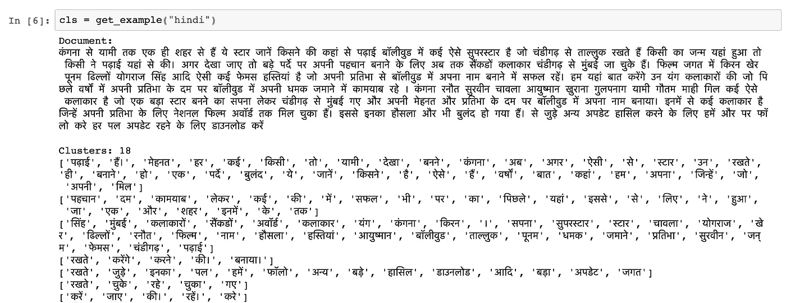

# 独立于语言的文档聚类

> 原文：<https://towardsdatascience.com/language-independent-document-clustering-3907dafb32fd?source=collection_archive---------6----------------------->

我探索了一种新颖的独立于语言的文档聚类方法。关键是，它适用于任何语言的任何文本。数据发生变化时，过程保持不变。

让我用要点来说明这种方法:

1.  从可用数据中构建单词向量。
2.  建立文档词向量的词簇。
3.  找出最能代表文档的聚类。
4.  聚集这些集群(相似的集群聚集在一起)。
5.  具有相似簇的文档放在一起。

现在，我们将浏览流程和代码。我们将从创建单词向量开始。在那之前

> *在自然语言处理(NLP)中，90%的工作是预处理——某研究人员*

因此，请确保您对数据做了所有需要做的预处理。因为这是一个概念验证，所以我排除了进行预处理的部分。

我们将使用 gensim python 包来构建单词向量。下面的函数创建向量，并以二进制格式保存它们。

```
# Create wordvectors
def create_vectors(filename):
    sentences = []
    with bz2.open(filename, 'rt') as df:
        for l in df:
            sentences.append(" ".join(l.split(",")).split())
    model = Word2Vec(sentences, size=25, window=5, min_count=1, workers=4)
    model.save(r"filename.vec") # Line changed refer code on github
    return model
```

一旦单词向量准备好了，我们就可以进入下一步，这是一个非常有趣的步骤。我从博客[这里](https://medium.com/kifi-engineering/from-word2vec-to-doc2vec-an-approach-driven-by-chinese-restaurant-process-93d3602eaa31)偷来的。它非常简单而且有效！

假设我们有一个包含 n 个单词的文档。我们将从第一个单词开始，并在模型中查找该单词的向量(单词向量)，该向量进入一个聚类，然后向前移动，我们以概率 1/(1+n)将该单词分配给预先创建的聚类或新的聚类。如果我们决定分配给一个现有的聚类，我们就把这个词分配给最相似的聚类。这种方法创建的簇或多或少地将单词分成有意义的组，请看。



Language Independent Document Clustering

更多例子在本笔记本[这里](https://github.com/kaustubhn/doc_clust/blob/master/scripts/doc_clust.ipynb)。

以下函数是上述算法的实现，也称为中餐厅流程。

Python Implementation of CRP

我已经把代码放在 github 上了，还有一个附带的笔记本，你可以看看。[https://github.com/kaustubhn/doc_clust](https://github.com/kaustubhn/doc_clust)

## 丰富

对上述算法的几点改进建议。

1.  更多数据
2.  更好的预处理
3.  多维向量(我们使用 25 维)
4.  匹配聚类的更好方法(除了余弦方法)

注意:这是一个非常实验性的方法，到目前为止还有很多不清楚和不明确的地方，我会继续改进和完善这个方法。感谢您的评论。

要取得联系，请发微博给我，地址是 [kaustubhn](https://twitter.com/kaustubhn) 。