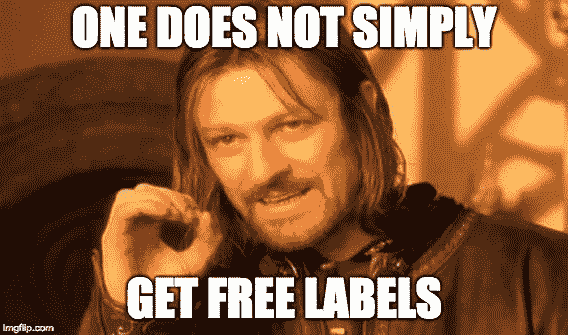
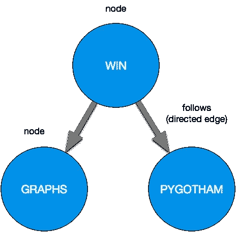
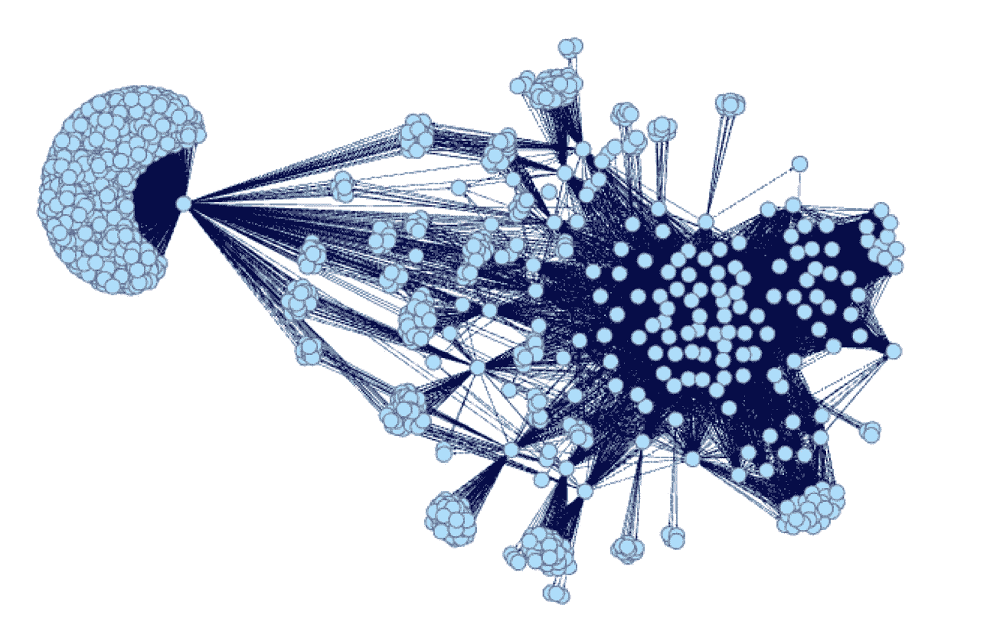
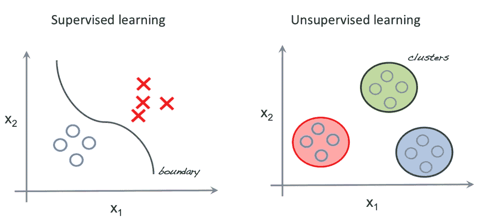
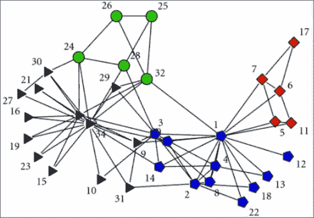
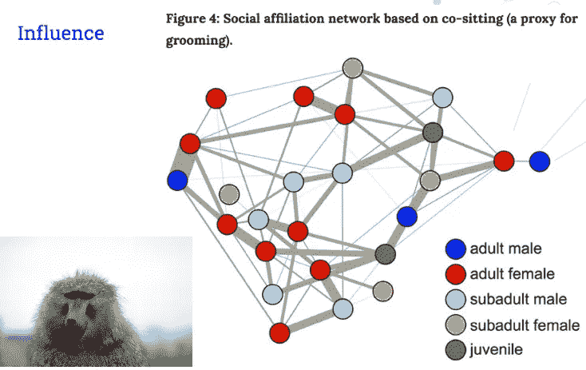
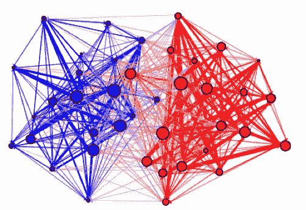

# 使用 Spark 进行大规模图挖掘:第 1 部分

> 原文：<https://towardsdatascience.com/large-scale-graph-mining-with-spark-750995050656?source=collection_archive---------5----------------------->

本教程分为两部分:

**Part 1** **(你来了！)**:无监督学习的图。

[**第二部**](/large-scale-graph-mining-with-spark-part-2-2c3d9ed15bb5) [**(点击此处)**](/large-scale-graph-mining-with-spark-part-2-2c3d9ed15bb5) :如何施展神奇的图形力量。我们将讨论标签传播、火花图框架和结果。回购与样本图和笔记本在这里:[https://github.com/wsuen/pygotham2018_graphmining](https://github.com/wsuen/pygotham2018_graphmining)

我也将在 PyGotham 2018 上就这个话题发表演讲。:)

如果您是一名工程师，您很可能使用过图形数据结构来实现搜索和查找算法。你也用它们来解决机器学习问题吗？

## *你为什么关注图表*？

对于数据科学家来说，图表是一个非常迷人的研究主题。对于机器学习问题来说，标记数据并不总是可用的。图在这些无人监管的环境中非常强大，因为**它们通过利用数据的底层子结构来充分利用你拥有的数据**。

对于一些机器学习问题，图表可以帮助你在没有标签的地方得到标签数据！

我将教你如何在图中找到相关数据点的**簇**，使用一套被称为**社区检测**的方法。我们将使用 Spark GraphFrames 来处理我从 2017 年 9 月的[通用抓取数据集](https://commoncrawl.org/the-data/)中创建的大型 web 图。

Hey Boromir, have you tried community detection?

# 图表 101

*图*是用于表示对象之间成对关系的数据结构。图形由*节点*(也称为*顶点*)和*边*组成。它们也可以是有向的或无向的。例如，Twitter 关注可以是一个有向图；这种关系是单向的。我关注另一个用户，并不意味着他们也关注我！

Example of a directed graph.

我专注于网络图表。网络图捕捉不同网站之间的链接关系。每个网页都是一个节点。如果从一个页面到另一个页面有一个 html 链接，在这两个节点之间画一条边。

当你对越来越多的页面这样做时，你会注意到子结构的出现。在真实的 web 数据上，这些子结构可能非常大和复杂！

这是一个新闻网站下所有页面的样本图。

*   每个淡蓝色的点代表一个单独的网页，或*节点*。
*   每条深蓝色的线代表两页之间的链接，一条*边*。

Subpage structure of a news site, generated by me using Gephi.

即使在这个级别，您也可以看到密集的**集群、**或**社区、**页面。您可以发现具有较高中心度的节点(有大量其他页面链接到它们的页面)。

如果单个网站的连接如此密集，想象一下我们可以从成千上万个网站中挖掘出什么！

# 图表为什么有用？

> 好吧，那个蓝色水母看起来很酷，但是为什么要做这些呢？
> 
> -你呢

有许多机器学习问题，其中*标签*(关于数据点是属于一个类还是另一个类的信息)不可用。**无监督学习**问题依赖于寻找数据点之间的相似性来将数据分类成组或聚类。与监督方法形成对比，在监督方法中，数据用适当的类别进行标注，您的模型学习使用这些标签来区分类别。

Source: [http://beta.cambridgespark.com/courses/jpm/01-module.html](http://beta.cambridgespark.com/courses/jpm/01-module.html)

当你不容易获得更多数据时，无监督学习是非常有用的，因此你可以利用你所拥有的数据的更多价值。标签可能不可用；即使有，也可能太费时或太贵而无法获得。在一个机器学习问题的开始，我们也可能不知道我们到底在寻找多少类对象！

这就是为什么我们希望我们的工具包中有图表:

> 图表让我们在无人监管的环境下从数据中获得更多价值。我们可以从图中得到聚类。

**无监督学习与人类的学习方式并无不同！**你最初是怎么学会分辨狗和猫的？我猜对大多数人来说，没有人会让年轻的自己坐下来，用精确的分类学术语定义什么是狗或猫。你的父母也没有给你一个由数以千计的猫和狗的照片组成的语料库，每张照片都有标签，并要求你画出一个准确划分这两类动物的界限。

如果你的童年和我一样，你可能见过几只猫，见过几只狗。与此同时，你幼小的心灵识别出这两种动物之间的显著差异，以及每种动物的相关共同特征。我们的大脑不可思议地从我们的环境中吸收信息，综合这些数据，并在我们一生中遇到的完全不同的事物之间形成共同点。

集群有很多令人兴奋的**应用。我的工作中出现了一些例子:**

*   **预测没有标签可供学习的数据集的类别标签** 。
*   为**受众细分和分类**生成分组。
*   为相似的网站建立一个推荐者。
*   发现**异常**。
*   使用集群作为**半监督机器学习集合**的一部分。聚类可以帮助您将已知标签扩展到附近的数据点，以增加训练数据的大小，或者如果立即需要标签，可以直接使用聚类，直到辅助系统可以对其进行分类。

关键在于:在无监督学习中，集群就是社区！而社区就是集群！

> 图形社区也是集群！

唯一的区别是，**你没有使用工程化的特性，而是依靠你的图中的底层网络结构来派生集群**。您可以使用图形中的边来度量数据点之间的相似性，而不是使用预定义的距离度量。

我之前提到过他们，所以我应该适当地介绍一下社区。没有一个唯一的定义。一个一般的描述:一个*社区*是一个图的子结构，其中结构内的节点比子结构外的节点彼此连接得更紧密。找到这些社区或集群的过程被称为*社区检测*。

Zachary karate club. Image from: KONECT, April 2017., dataset from original 1977 Zachary study.

扎卡里空手道俱乐部数据集模拟了空手道俱乐部各成员之间的关系。有一次，俱乐部的两名成员发生了冲突，俱乐部最终分裂成多个社区。您可以看到用 4 种颜色表示的社区。

想想无监督聚类算法是如何工作的。您依赖于这样一个事实，即在您选择的特征空间中，一些数据点比其他数据点更接近。数据越接近，越相似。然后，根据选择的距离度量，将数据分配到相似对象的集群中。

图表可以帮助您实现相似的聚类，*而没有像传统聚类那样选择特征的麻烦。*

# 等等，为什么会这样？

我们来深入挖掘一下！我们做了哪些假设，让我们依靠社区检测来找到相关节点？

最重要的一条:

> 节点之间的边不是随机的。

如果你的图形是随机的，这些都不会起作用。然而，现实生活中的大多数图表都不是随机的；这些边缘以某种方式相关联。两种机制有助于解释为什么会出现这种情况:

1.  **影响**。连接的节点倾向于共享或传播特征。想象你的几个朋友学会了使用 Spark 是多么的神奇。从与他们的联系中，你可能也更倾向于开始使用 Spark。“我所有的朋友都在做这件事，所以我也要做。”
2.  **同宗**。*拥有共同特征或某种关系的节点更有可能连接起来。*例如，如果你和我都对 python 和图形感兴趣，我们更有可能在图形上联系在一起。这也叫做*分类混合*。**“物以类聚，人以群分。”**

在现实生活中，这些机制能够并且确实相互作用！

研究人员利用这些现象用图表来模拟有趣的问题。例如，Farine 等人根据动物最强联系的位置预测了狒狒的位置——这是对行为生态学的**影响**的一个很好的应用。

Farine, Damien R., et al. “Both nearest neighbours and long-term affiliates predict individual locations during collective movement in wild baboons.” *Scientific reports* 6 (2016): 27704

**同性**在社交网络研究中被频繁使用。Adamic 和 Glance 在 2004 年大选期间对政治博客做了一项有趣的研究。他们制作了一张图表，展示不同博客之间的相互引用；蓝色节点代表自由派博客，红色节点代表保守派博客。也许不出所料，他们发现博客倾向于引用其他具有相同政治倾向的博客。

Adamic, Lada A., and Natalie Glance. “The political blogosphere and the 2004 US election: divided they blog.” *Proceedings of the 3rd international workshop on Link discovery*. ACM, 2005.

即使在个人层面上，同性恋也是有意义的。你自己的朋友网络很有可能是由和你同龄、住在同一个城镇、有相同爱好或上过同一所学校的人组成的。你是工作中同性恋的活生生的例子。请随意将它添加到您的简历中！

我们已经讨论了图表如何利用数据的底层网络特征来返回聚类。在 web 图中，这些聚类对于推荐系统、受众细分、异常检测等应用非常有用。

在[第 2 部分](/large-scale-graph-mining-with-spark-part-2-2c3d9ed15bb5)(此处发布)中，我们将深入社区检测技术，并学习如何从我们使用公共爬行数据集创建的网络图中获得聚类。

## 承认

感谢 [Yana Volkovich](https://medium.com/u/b0a63e587893?source=post_page-----750995050656--------------------------------) 博士深化了我对图论的学习，是一位伟大的导师。也感谢我的其他同事，他们对我的演讲给予了反馈。

## 参考

亚当，拉达，和娜塔莉·葛拉。"政治博客圈和 2004 年美国大选:分裂他们的博客."第三届链接发现国际研讨会会议录。美国计算机学会，2005 年。

常用抓取数据集(2017 年 9 月)。

Farine，Damien R .等，“最近邻居和长期附属者都预测野生狒狒在集体运动中的个体位置。”*科学报道*6(2016):27704

Fortunato，Santo。“图中的社区检测”物理报告 486.3–5(2010):75–174。格文、米歇尔和马克·EJ·纽曼。"社会和生物网络中的社区结构."美国国家科学院学报 99.12(2002):7821–7826。莱斯科维克、朱雷、阿南德·拉贾拉曼和杰弗里·大卫·厄尔曼。*海量数据集的挖掘*。剑桥大学出版社，2014 年。Raghavan，Usha Nandini，Réka Albert 和 Soundar 鸠摩罗王。"在大规模网络中检测社区结构的近似线性时间算法."*物理审查***E 76.3(2007):036106。

扎卡里空手道俱乐部网络数据集— KONECT，2017 年 4 月。**