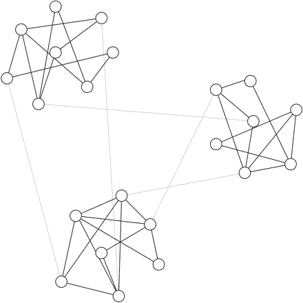
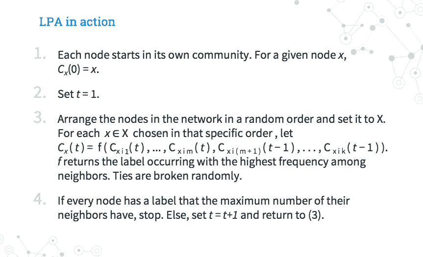
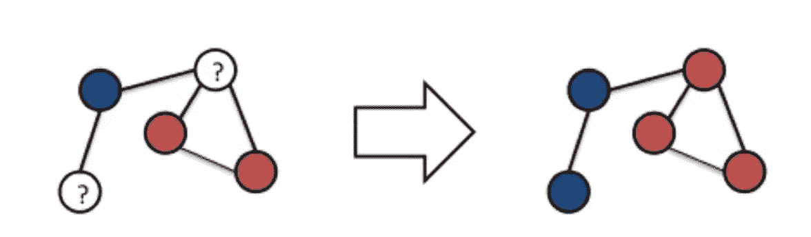
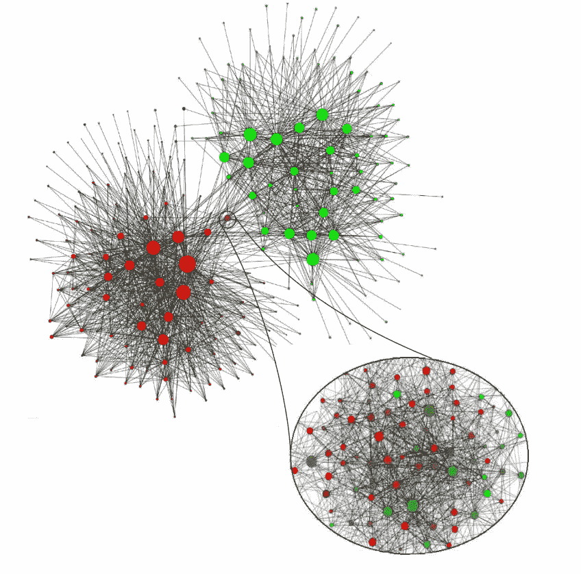
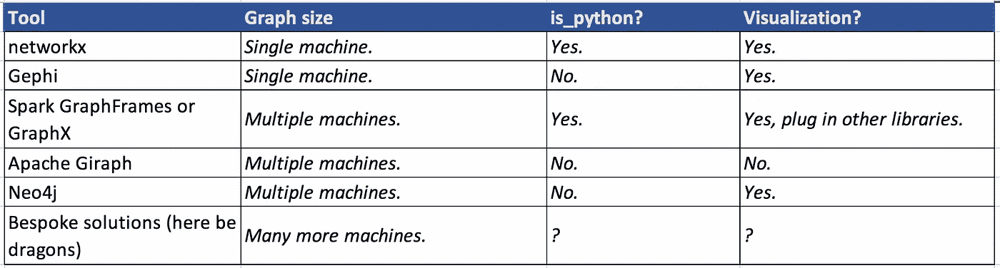
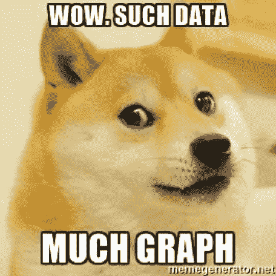
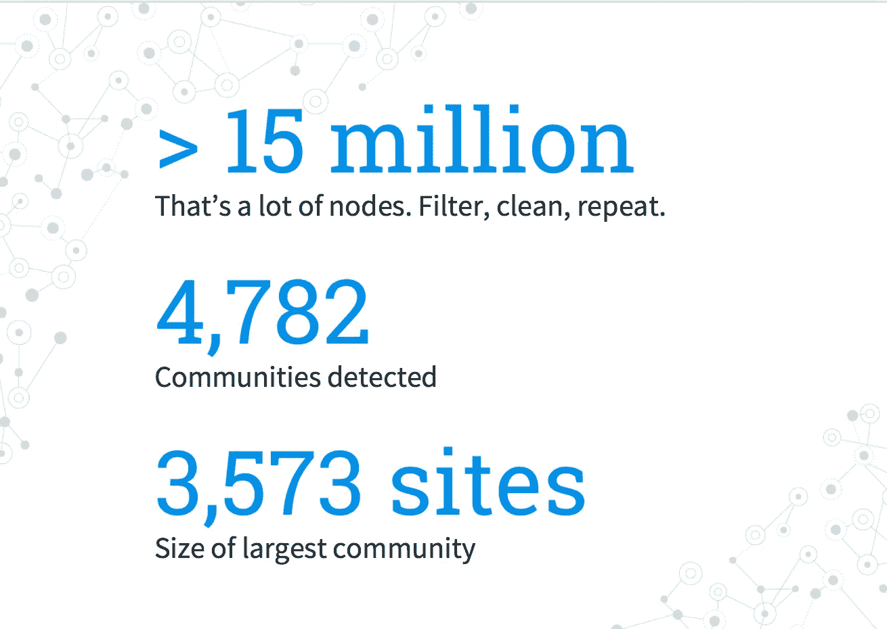
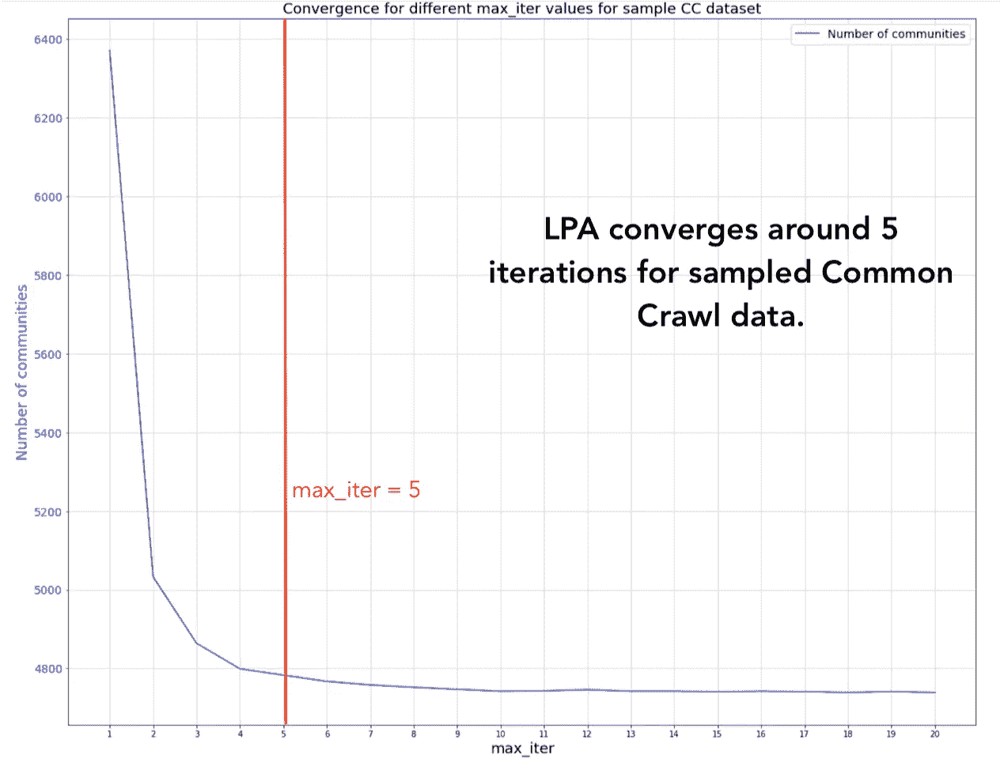
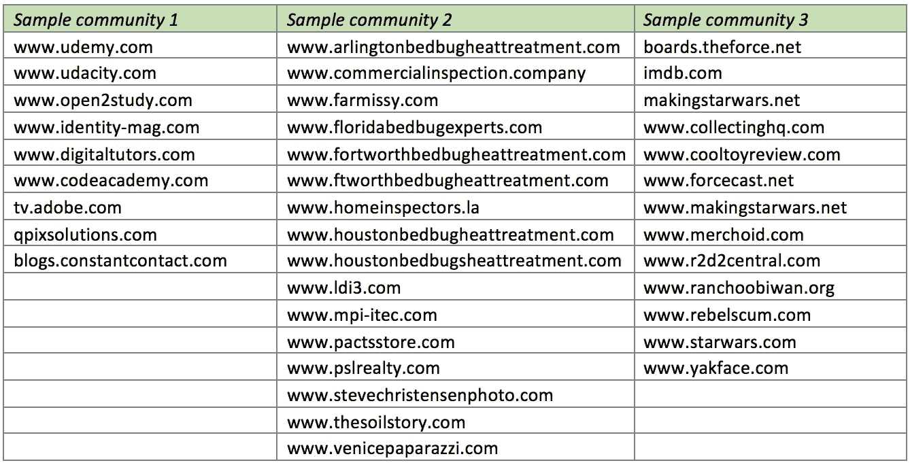

# 使用 Spark 进行大规模图挖掘:第 2 部分

> 原文：<https://towardsdatascience.com/large-scale-graph-mining-with-spark-part-2-2c3d9ed15bb5?source=collection_archive---------1----------------------->

分为两部分的教程:

[**第一部分**](/large-scale-graph-mining-with-spark-750995050656) :无监督学习的图形。

**第二部分(你来了！)**:如何施展神奇的图形力量。我们将讨论标签传播、火花图框架和结果。回购样品图和笔记本在这里:[https://github.com/wsuen/pygotham2018_graphmining](https://github.com/wsuen/pygotham2018_graphmining)

在第 1 部分中([这里是](/large-scale-graph-mining-with-spark-750995050656))，我们看到了如何用图解决无监督的机器学习问题，因为**社区是集群**。我们可以利用节点之间的边作为相似性或关系的指标，就像特征空间中的距离用于其他类型的聚类一样。

在这里，我们深入探讨**社区检测**的方法。我们构建并挖掘了一个大型 web 图，学习如何在 Spark 中实现一种称为标签传播算法(LPA)的社区检测方法。

# 使用标签传播检测社区

虽然有许多社区检测技术，但我只关注一种:**标签传播**。对于其他方法的概述，我推荐 [Santo Fortunato 的“图中社区检测”](https://arxiv.org/pdf/0906.0612.pdf)。



Graph with communities. From Girvan, Michelle, and Mark EJ Newman. “Community structure in social and biological networks.” *Proceedings of the national academy of sciences* 99.12 (2002): 7821–7826.

进入**标签传播算法(LPA)** 由 [Raghavan，Albert，和鸠摩罗王(2007)](https://arxiv.org/pdf/0709.2938.pdf) 提出。LPA 是一种迭代的社区检测解决方案，其中信息基于底层的边结构在图中“流动”。LPA 是这样工作的:



Raghavan, Usha Nandini, Réka Albert, and Soundar Kumara. “Near linear time algorithm to detect community structures in large-scale networks.” *Physical review E* 76.3 (2007): 036106.

1.  开始时，每个节点从自己的社区开始。
2.  对于每次迭代，随机遍历所有节点。对于每个节点，用其大多数邻居的标签更新该节点的社区标签。随意打破任何联系。
3.  如果节点现在用其邻居的多数标签来标记，则该算法已经达到停止标准。如果没有，重复步骤 2。



Image [Source](https://www.slideshare.net/yamaguchiyuto/pakdd15-talk)


Or just, you know, stay home? Image [Source](http://media.iwm.org.uk/iwm/mediaLib//138/media-138601/large.jp).

标签传播有意义**直觉上**。假设有一天在工作中，某人得了*感冒，并“传播”疾病，直到*你工作场所的每个人*都像他们的邻居一样生病。与此同时，街对面的富宝员工感染并传播了 ***流感*** 。你和 FoobarCo 之间联系不多，所以当每个社区的成员都染上了当前的疾病时,“传播”就停止了。实现收敛！不过，抽鼻子和头痛真糟糕。*

# *为什么用 LPA？*

*   ***带标签的数据很好，但不是必需的**。使 LPA 适合我们的无监督机器学习用例。*
*   ***参数调整非常简单**。LPA 使用 max_iterations 参数运行，使用默认值 5 可以得到一些好的结果。Raghavan 和她的合著者用几个标记网络测试了 LPA。他们发现至少 95%的节点在 5 次迭代中被正确分类。*
*   ***聚类的先验数量、聚类大小、不需要的其他度量**。如果你不想假设你的图有一定的结构或层次，这是至关重要的。对于我的网络图的网络结构、我拥有的社区数据的数量或者这些社区的预期规模，我没有先验的假设。*
*   ***接近线性运行时**。LPA 的每一次迭代都是 O(m ),边数是线性的。与一些先前的社区检测解决方案的 O(n log n)或 O(m+n)相比，整个步骤序列以接近线性的时间运行。*
*   ***可解释性**。当有人问，你可以解释为什么一个节点被分组到某个社区。*

**

*Language communities in Belgium mobile network (red = French, green = Dutch). Image from Blondel, Vincent D., et al. “Fast unfolding of communities in large networks.” *Journal of statistical mechanics: theory and experiment* 2008.10 (2008): P10008..*

# *工具选择*

*首先，快速而非详尽地分析一下工具领域。我根据图的大小、库是否能很好地与 Python 配合，以及生成简单可视化的难易程度来划分工具。*

**

*Some common graph-mining tools.*

*工具的非详尽菜单:*

*   *对于适合单台机器的数据，**[**networkx**](https://networkx.github.io/)**Python 包**是易于使用的图形探索的好选择。它实现了最常见的算法(包括标签传播、PageRank、最大团检测等等！).简单的可视化也是可能的。***
*   ***[**Gephi**](https://gephi.org/) 是一个开放的图形分析工具。Gephi 不是一个 Python 包，而是一个独立的工具，具有健壮的 UI 和令人印象深刻的图形可视化功能。如果您正在处理较小的图形，需要强大的可视化，并且更喜欢使用 UI 而不是 Python，请尝试 Gephi。***
*   ***Spark 有 2 个图库，[**【GraphX】**](https://spark.apache.org/docs/latest/graphx-programming-guide.html)和**[**GraphFrames**](https://graphframes.github.io/)。当您的图形数据太大而无法在单台机器上显示时(受限于分配给 Spark 应用程序的资源量)，想要利用并行处理和 Spark 的一些内置容错功能时，Spark 是一个很好的解决方案。spark 的 Python API py Spark 非常适合集成到 scikit-learn、matplotlib 或 networkx 等其他库中。*****
*   *****[**Apache Giraph**](https://giraph.apache.org/) 是 Google 创建的图形处理架构 [Pregel](https://kowshik.github.io/JPregel/pregel_paper.pdf) 的开源实现。与之前的解决方案相比，Giraph 的准入门槛更高。虽然 Giraph 对于大规模图形分析部署来说非常强大，但我选择了同时具有 Scala 和 Python APIs 的更轻量级的工具。*****
*   *******Neo4j** 是一个图形数据库系统。它有一个 Python 客户端，尽管你必须单独安装 Neo4j。因为我的分析只是一个概念验证，所以我想避免维护和部署一个与我现有代码不集成的完全独立的工具。*****
*   *****最后，理论上你可以实现自己的解决方案。对于最初的数据科学探索，我不鼓励这样做。许多定制的图挖掘算法是针对非常具体的用例的(例如，只在图聚类方面超级高效，而不是其他方面)。如果你*确实*需要处理非常非常大的数据集，首先考虑对你的图进行采样，过滤感兴趣的子图，从例子中推断关系，基本上是从现有工具中获得更多收益的任何事情。*****

*****鉴于我正在处理的数据量，我选择了 **Spark GraphFrames** 。*****

> *****记住:对你的项目来说最好的图形库取决于语言、图形大小、你如何存储你的图形数据以及个人偏好！*****

# *****构建通用抓取 Web 图*****

> *****太好了！我完全相信图表有多棒，它们是有史以来最酷的东西！如何开始在真实数据上使用社区检测？*****
> 
> *****-你呢*****

## *****步伐*****

*****1.**获取数据**:[通用抓取数据集](https://commoncrawl.org/the-data/get-started/)是一个开放的网络抓取语料库，非常适合网络图形研究。抓取结果以 [WARC](https://en.wikipedia.org/wiki/Web_ARChive) (网络存档)格式存储。除了页面内容，数据集还包含爬网日期、使用的标题和其他元数据。*****

*****我从 2017 年 9 月的[抓取](https://commoncrawl.org/2017/09/september-2017-crawl-archive-now-available/)中抽取了 100 个文件。文件`warc.paths.gz`包含路径名；使用这些路径名，从 s3 下载相应的文件。*****

**********

*****Indeed.*****

*****2.**解析和清理数据**:作为第一步，我们需要每个页面的 html 内容。对于每个页面，我们收集 URL *和*任何链接的 URL 来创建我们的图表。*****

*****为了从原始的 WARC 文件中提取边缘，我写了一些数据清理代码，这些代码可能永远不会被公之于众。至少它完成了工作，所以我可以专注于更有趣的事情！我的解析代码是用 Scala 写的，但是我的演示是用 pyspark 写的。我使用了 [WarcReaderFactory](https://github.com/kris-sigur/jwat/blob/master/jwat-warc/src/main/java/org/jwat/warc/WarcReaderFactory.java) 和[杰里科解析器](http://jericho.htmlparser.net/docs/index.html)。对于 python 来说，像 warc 这样的库看起来可以满足你的数据管理需求。*****

*****在我将所有的`href`链接从 html 内容中取出后，*****

*   *****我在域名之间画了边，而不是完整的 URL。我没有创建`medium.com/foo/bar`和`medium.com/foobar`，而是只创建了一个节点`medium.com`，它捕获与其他域之间的链接关系。*****
*   *****我过滤掉了**循环**。循环是将节点连接到自身的边，对我的目的没有用。如果`medium.com/foobar`链接到同一个域，比如说`medium.com/placeholderpage`，则不画边。*****
*   *****我删除了许多最流行的**资源链接，**包括流行的 cdn、追踪器和资产。对于我的初步探索，我只想关注人们可能会访问的网页。*****

*****3.**初始化火花上下文**:对于在家跟随的人，请参见[**https://github.com/wsuen/pygotham2018_graphmining**](https://github.com/wsuen/pygotham2018_graphmining)**的演示。这个演示只能在你的本地机器上运行。你不会得到一个分布式集群的所有计算资源，但是你*会*知道如何开始使用 Spark GraphFrames。*******

*****我将使用 Spark 2.3。导入`pyspark`和其他需要的库，包括`graphframes`。然后创建一个 SparkContext，这将允许您运行 pyspark 应用程序。*****

```
*****# add GraphFrames package to spark-submit
import os
os.environ['PYSPARK_SUBMIT_ARGS'] = '--packages graphframes:graphframes:0.6.0-spark2.3-s_2.11 pyspark-shell'import pyspark# create SparkContext and Spark Session
sc = pyspark.SparkContext("local[*]")
spark = SparkSession.builder.appName('notebook').getOrCreate()# import GraphFrames
from graphframes import ******
```

*****4.创建一个图表框架:一旦你有了干净的数据，你就可以把你的顶点和边加载到 Spark 数据框架中。*****

*   *****`vertices`包含每个节点的`id`和节点的`name`，后者表示域。*****
*   *****`edges`包含我的有向边，从源域`src`到源链接到的域`dst`。*****

```
*****# show 10 nodes
vertices.show(10)+--------+----------------+
|      id|            name|
+--------+----------------+
|000db143|         msn.com|
|51a48ea2|tradedoubler.com|
|31312317|   microsoft.com|
|a45016f2|     outlook.com|
|2f5bf4c8|        bing.com|
+--------+----------------+
only showing top 5 rows# show 10 edges
edges.show(10)+--------+--------+
|     src|     dst|
+--------+--------+
|000db143|51a48ea2|
|000db143|31312317|
|000db143|a45016f2|
|000db143|31312317|
|000db143|51a48ea2|
+--------+--------+
only showing top 5 rows*****
```

*****然后你可以用你的顶点和边创建一个`GraphFrame`对象。瞧啊。你有图表！*****

```
*****# create GraphFrame
graph = GraphFrame(vertices, edges)*****
```

*****5.运行 LPA:一行代码可以让你运行 LPA。在这里，我用 5 次迭代运行 LPA(`maxIter`)。*****

```
*****# run LPA with 5 iterations
communities = graph.labelPropagation(maxIter=5)communities.persist().show(10)+--------+--------------------+-------------+
|      id|                name|        label|
+--------+--------------------+-------------+
|407ae1cc|             coop.no| 781684047881|
|1b0357be|  buenacuerdo.com.ar|1245540515843|
|acc8136a|   toptenreviews.com|1537598291986|
|abdd63cd| liberoquotidiano.it| 317827579915|
|db5c0434|          meetme.com| 712964571162|
|0f8dff85|           ameblo.jp| 171798691842|
|b6b04a58|             tlnk.io|1632087572480|
|5bcfd421|         wowhead.com| 429496729618|
|b4d4008d|investingcontrari...| 919123001350|
|ce7a3185|   pokemoncentral.it|1511828488194|
+--------+--------------------+-------------+
only showing top 10 rows*****
```

*****运行`graph.labelPropagation()`返回一个带有节点的数据帧和一个表示该节点属于哪个社区的`label`。您可以使用`label`了解社区规模的分布，并放大感兴趣的区域。例如，发现与`pokemoncentral.it`在同一个社区中的所有其他网站(老实说，谁不想呢？)，过滤所有其他节点，其中`label = 1511828488194`。*****

# *****结果*****

*****当我在我的通用抓取 web 图表样本上运行 LPA 时，发生了什么？*****

**********

*   *****我从超过 1500 万个网站的原始数据开始。这是大量的节点，其中许多包含冗余信息。我描述的清理过程将图形压缩成更少、更有意义的边。*****
*   *****LPA 发现了超过 4700 个社区。然而，一半以上的社区只包含一个或两个节点。*****
*   *****另一方面，最大的社区有超过 3500 个不同的网站！为了给出一个范围的概念，这大约是我的最终图形后过滤的 5%的节点。*****

*****社区规模的极端说明了 LPA 的一个缺点。太多的融合，可能会有太大的集群(由控制密集连接网络的某些标签引起)。融合太少，你可能会得到更多、更小、更没用的社区。我发现最有趣的集群最终处于两个极端之间。*****

## *****收敛和小世界网络效应*****

*****在我的数据集中，LPA**在 5 次迭代**左右收敛。你可以看到社区的数量稳定在 4700 个左右。Raghavan 和她的同事也用他们的标号图证明了这个性质。*****

*****解释这一点的一个可能机制是*小世界网络效应*——图形聚集的趋势，但与节点数量相比，路径长度也较短。换句话说，虽然图有簇，但是你也期望能够在 5-6 次跳跃内从一个朋友旅行到你网络中的另一个朋友。许多真实世界的图形，包括互联网和社交网络，都具有这一特性。你可能也知道这是*六度分离*现象。*****

**********

*****Number of communities levels off after 5 iterations.*****

## *****样本集群*****

*****粗略地看，我们来看一些样本集群。与传统的无监督聚类一样，社区可以是不同站点的混合，尽管没有 LPA 我们不会发现一些感兴趣的主题！从左至右:*****

*   ******电子学习网站*:与电子学习页面相关或链接的网站。我该去找一些新的数据科学 MOOCs 了！*****
*   ******臭虫网站*:与房地产和臭虫相关的网站。所有这些网站都使用相同的模板/图片，只是域名略有不同。我不认为我会知道真相。*****
*   *****星球大战社区:谈论星球大战电影、事件和纪念品的网站经常互相链接。*****

**********

*****值得强调的是，我们在没有文本处理和特征选择、手动标记、域名特征或者甚至不知道要查找多少社区的情况下获得了这个集群**。我们通过**利用网络图的底层网络结构发现了兴趣社区！*********

# ***从这里去哪里***

***我几乎没有触及网络图形社区的表面。未来的研究可以有很多方向。例如:***

*   ***分层并传播**元数据**:如果我们向数据中添加边权重、链接类型或外部标签等信息，我们能在图中多好地传播这些信息？***
*   *****删除/添加节点**并测量对社区的影响:我很好奇添加或删除高边缘中心性的节点如何改变 LPA 的有效性和最终社区的质量。***
*   ***观察 web graph **随时间的演变**:每个月都有一个新的通用抓取数据集！看看随着时间的推移会出现什么样的集群会很有趣。反过来，有哪些社群不变？众所周知，互联网不是静态的。***

***用于演示的[Github repo](https://github.com/wsuen/pygotham2018_graphmining)包含一个 10k 节点的小型样本 web 图。此外，还有使用 Docker 进行设置和运行 pyspark 笔记本的说明。我希望这将有助于启动 web 图数据的实验，并学习 Spark GraphFrames 来解决您自己的数据科学问题。***

***探索愉快！***

******

***We’re pioneers! Graph pioneers. :) Image [Source](http://www.nasa.gov/centers/ames/news/2013/pioneer11-40-years.html).***

## ***承认***

***感谢[博士 Yana Volkovich](https://medium.com/u/b0a63e587893?source=post_page-----2c3d9ed15bb5--------------------------------) 深化了我对图论的学习，是我的良师益友。也感谢我的其他同事，他们对我的演讲给予了反馈。***

## ***参考***

***亚当，拉达，和娜塔莉·葛拉。"政治博客圈和 2004 年美国大选:分裂他们的博客."第三届链接发现国际研讨会会议录。美国计算机学会，2005 年。

常用抓取数据集(2017 年 9 月)。Farine，Damien R .等人，“最近的邻居和长期的附属者都预测野生狒狒在集体运动中的个体位置。”*科学报道*6(2016):27704

Fortunato，Santo。“图中的社区检测”物理报告 486.3–5(2010):75–174。格文、米歇尔和马克·EJ·纽曼。"社会和生物网络中的社区结构."美国国家科学院学报 99.12(2002):7821–7826。莱斯科维克、朱雷、阿南德·拉贾拉曼和杰弗里·大卫·厄尔曼。*挖掘海量数据集*。剑桥大学出版社，2014 年。Raghavan，Usha Nandini，Réka Albert 和 Soundar 鸠摩罗王。"在大规模网络中检测社区结构的近似线性时间算法."*物理审查***E 76.3(2007):036106。

扎卡里空手道俱乐部网络数据集— KONECT，2017 年 4 月。*****