# 使用 Datashader 进行大规模可视化和制图

> 原文：<https://towardsdatascience.com/large-scale-visualizations-and-mapping-with-datashader-d465f5c47fb5?source=collection_archive---------3----------------------->

## 旧金山商业鸟瞰图。

如果你曾经试图用 Matplotlib 或 Seaborn 创建一个超过 100，000 点的群体图或关系图，你会对在加载图时摆弄拇指的场景并不陌生。

当最终绘制该图时，由于点的数量或不同类别绘制的顺序，结果可能不会揭示太多数据。

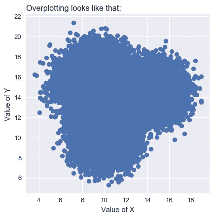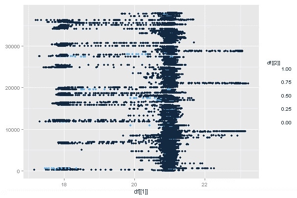

计算效率和过度绘制只是绘制大型数据集的众多问题中的两个。幸运的是， [Datashader](https://github.com/pyviz/datashader) 是一个以有意义的方式快速表示大型数据集的绝佳选择。

据[官方数据显示:](http://datashader.org/)

> *“这个过程中的计算密集型步骤是用 Python 编写的，但使用* [*Numba*](http://numba.pydata.org/) *透明地编译成机器代码，并使用*[*Dask*](http://dask.pydata.org/)*灵活地分布在内核和处理器之间，提供了高度优化的渲染管道，即使在标准硬件上也可以使用极大的数据集。”*

对于那些感兴趣的人，Youtube 上有一个很棒的视频[揭示了传统可视化中的问题以及 Datashader 如何帮助解决这些问题。](https://www.youtube.com/watch?v=fB3cUrwxMVY)

## 数据清理

我们正在使用的数据集来自 T21，包括旧金山所有的纳税企业。

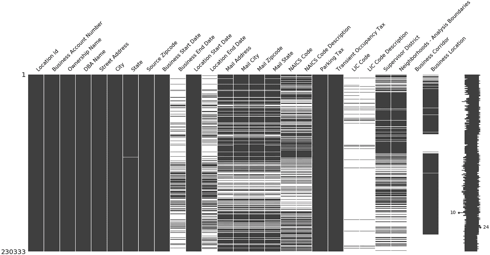

“企业位置”列包含每个企业的位置数据，格式如下:

加利福尼亚州旧金山市汤森路 153 号，邮编:94107 (37.77982，-122.391555)

因此，采取了以下步骤来清理数据:

1.  删除所有没有“商业地点”的条目，因为没有纬度和经度。
2.  删除所有“城市”不在旧金山的条目。
3.  删除所有带有“业务结束日期”的条目。如果该字段不是 NA，则意味着该业务不再有效。
4.  编写助手函数，用 regex 解析出纬度和经度。

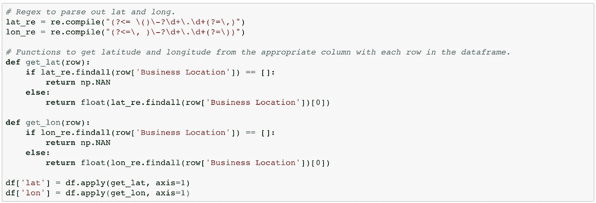

## 地图的 Web 墨卡托坐标

为了在 Datashader 中绘制这些点，我们必须首先将纬度和经度坐标转换为 Web 墨卡托坐标。

web 墨卡托坐标系用于 Web 制图应用程序。它的受欢迎程度可以归因于它被谷歌地图采用。为了用 Datashader 绘图，我们必须将纬度、经度对投影到这个新平面上。Datashader 有一个内置的方法可以帮我们做到这一点:lnglat_to_meters

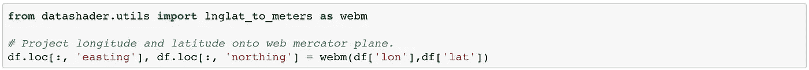

然后，我们将第 1 个和第 99 个百分点作为地图显示的界限。选择这些百分点值是为了在确定地图边界时剔除异常值。这些坐标然后被再次投影到 Web 墨卡托平面。

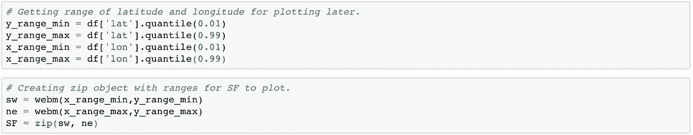

## 地图设置

将坐标投影到新平面后，我们可以开始设置地图。

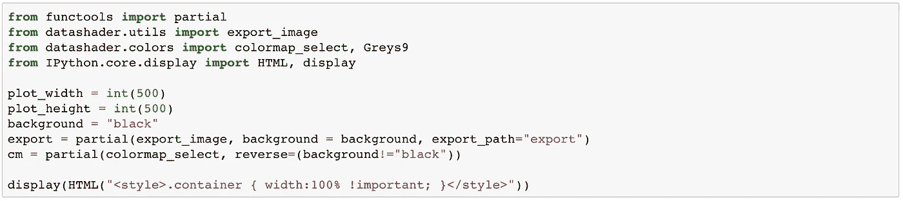

我们设置了部分对象“导出”和“cm”。“导出”有助于将创建的图导出到预定路径，而“cm”有助于颜色映射。

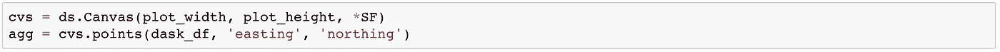

画布对象 ds。Canvas()设置了预定的宽度和高度。包含地图边界的 SF 对象也被传入。

我们之前使用的 pandas 数据帧被转换为 Dask 数据帧，并且使用传入的 x，y 对在画布上生成点(在本例中为东距和北距列)。

## 测绘

现在设置已经完成，我们可以开始用一行代码绘制和导出图，如下所示。[色彩映射图](https://gist.github.com/jcrist/a9dfc6e8f8bce3b4ae30)，标准化都是可以轻易改变的参数。

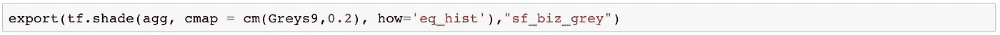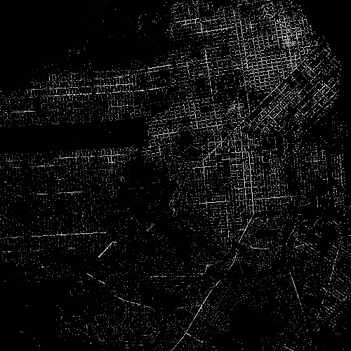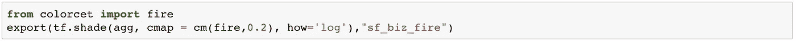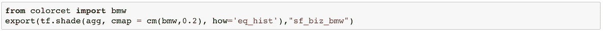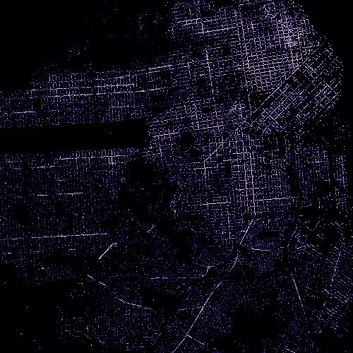

绘制旧金山 10 万家企业，清晰勾勒出这些企业所在的街道。金融区和教会区似乎是商业最集中的地方。

最古老的企业位于哪里？我们可以对商业时代排名前十的企业进行筛选。

Distribution of oldest businesses in SF

不出所料，最古老的企业主要集中在金融区。

不同的业务类别呢？让我们画出餐饮服务企业和房地产企业的分布图。

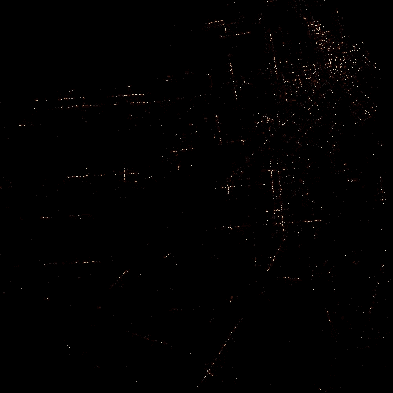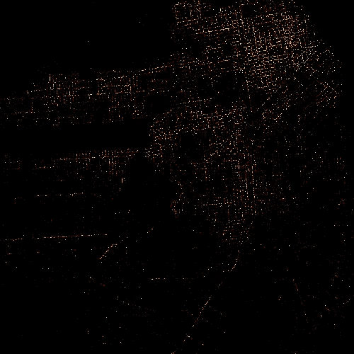

Left: Distribution of Food Service businesses Right: Distribution of Real Estate businesses

里士满和日落区的餐饮服务相对较少。然而，似乎有相当多的房地产企业在这些地区，因为他们是住宅区。

## 在地图数据上叠加点

不过，黑色背景已经够了。你如何在实际地图上覆盖这些点？Datashader 与 Holoviews、Geoviews 和 Bokeh 结合使用使这变得非常容易。

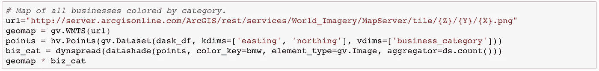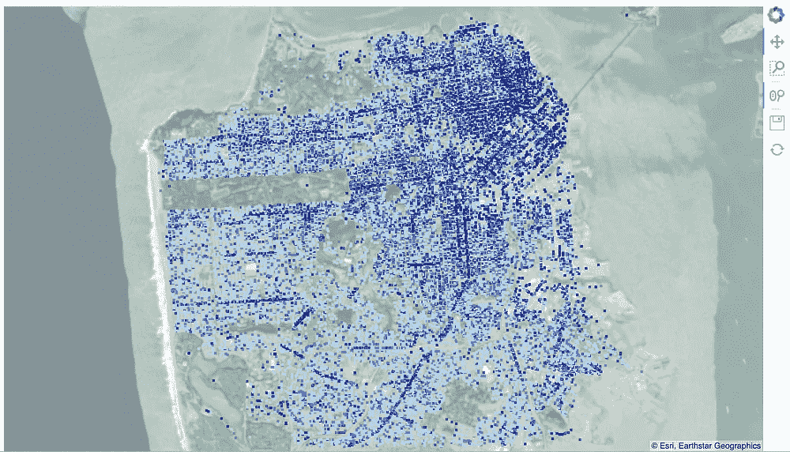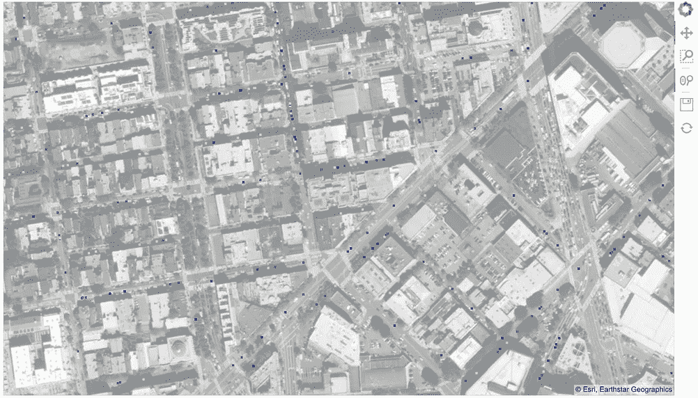

Viewing business positions when zoomed in on the map.

聚合器函数中也可以使用其他列。例如，我们可以使用每个区域的业务年龄平均值来确定点的显示。

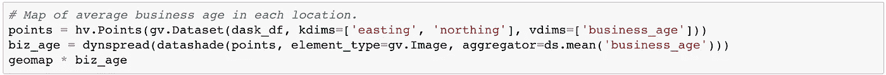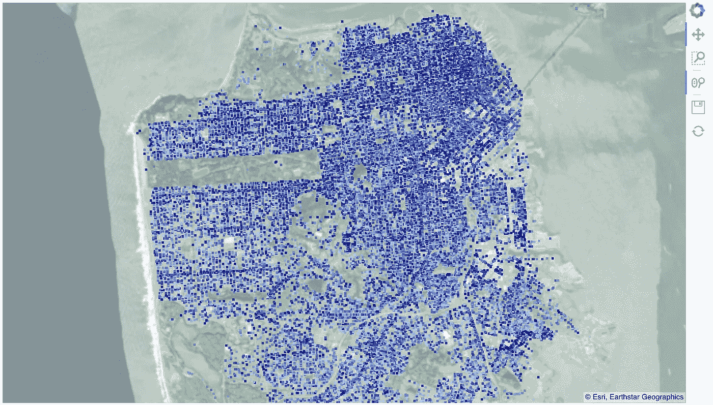

最终的图确实显示了旧金山东北部地区的老企业密度更高(深蓝色点)。

使用 Datashader 还可以做更多的事情，在这个例子中只绘制了 100，000 个点。进一步的定制选项和实际的大数据正在等待使用 Datashader 及其附带包的进一步项目的探索。例如，GPS 数据非常有趣，因为它们通常包含数百万(或数十亿)个点，并且可以追踪和分析路线。

结果代码可以在 [Github](https://github.com/finnqiao/datashader_test) 上找到，也可以在 [LinkedIn](https://www.linkedin.com/in/finnqiao/) 上自由连接！感谢阅读，节日快乐！