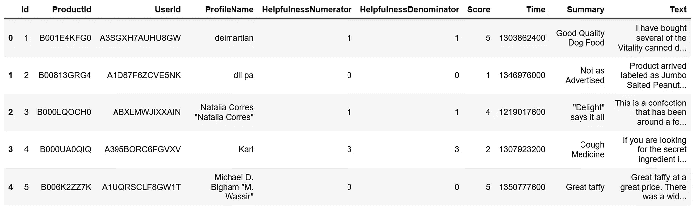
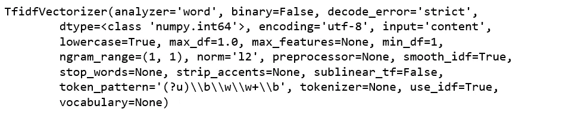
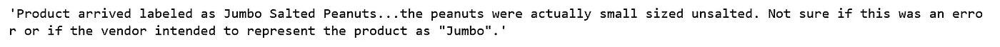
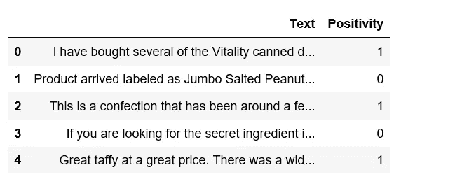
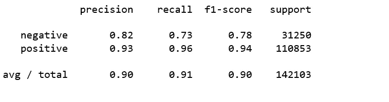
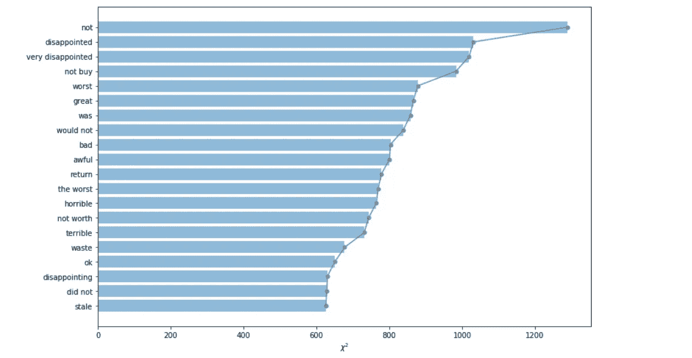

# 基于 Python 的潜在语义分析和情感分类

> 原文：<https://towardsdatascience.com/latent-semantic-analysis-sentiment-classification-with-python-5f657346f6a3?source=collection_archive---------2----------------------->


photo credit: Pexels

## 自然语言处理，LSA，情感分析

[潜在语义分析](https://en.wikipedia.org/wiki/Latent_semantic_analysis) (LSA)是一种通过应用于大型文本语料库的统计计算来提取和表示单词的上下文使用意义的理论和方法。

LSA 是一种信息检索技术，它分析和识别非结构化文本集合中的模式以及它们之间的关系。

LSA 本身是一种在文档集合中发现同义词的不受监督的方式。

首先，我们来看看潜在语义分析是如何在自然语言处理中用于分析一组文档和它们所包含的术语之间的关系的。然后我们进一步对情感进行分析和分类。我们将在此过程中回顾特征选择的[卡方。我们开始吧！](https://nlp.stanford.edu/IR-book/html/htmledition/feature-selectionchi2-feature-selection-1.html)

# 数据

数据集包括超过 50 万条亚马逊美食评论，可以从 [Kaggle](https://www.kaggle.com/snap/amazon-fine-food-reviews) 下载。

```
import pandas as pddf = pd.read_csv('Reviews.csv')
df.head()
```



Figure 1

# **TFIDF**

[TF-IDF](https://en.wikipedia.org/wiki/Tf%E2%80%93idf) 是一种信息检索技术，它衡量术语的频率(TF)及其逆文档频率(IDF)。每个单词都有各自的 TF 和 IDF 得分。一个单词的 TF 和 IDF 得分的乘积被称为该单词的 TFIDF 权重。

简单来说，TFIDF 得分(权重)越高的词越稀有，反之亦然。

```
from sklearn.feature_extraction.text import TfidfVectorizertfidf = TfidfVectorizer()
tfidf.fit(df['Text'])
```



Figure 2

```
X = tfidf.transform(df['Text'])
df['Text'][1]
```



Figure 3

参考上面的句子，我们可以检查这个句子中几个词的 tf-idf 得分。

```
print([X[1, tfidf.vocabulary_['peanuts']]])
```

**T11【0.37995462060339136】**

```
print([X[1, tfidf.vocabulary_['jumbo']]])
```

***【0.530965343023095】***

```
print([X[1, tfidf.vocabulary_['error']]])
```

***【0.2302711360436964】***

在“花生”、“jumbo”、“错误”三个词中，tf-idf 给“jumbo”的权重最高。为什么？这表明“jumbo”是一个比“peanut”和“error”更罕见的词。这就是如何使用 tf-idf 来表明文档集合中单词或术语的重要性。

# 情感分类

为了对情绪进行分类，我们删除了中性分数 3，然后将分数 4 和 5 分组为正(1)，将分数 1 和 2 分组为负(0)。经过简单的清理，这就是我们将要处理的数据。

```
import numpy as npdf.dropna(inplace=True)
df[df['Score'] != 3]
df['Positivity'] = np.where(df['Score'] > 3, 1, 0)
cols = ['Id', 'ProductId', 'UserId', 'ProfileName', 'HelpfulnessNumerator', 'HelpfulnessDenominator', 'Score', 'Time', 'Summary']
df.drop(cols, axis=1, inplace=True)
df.head()
```



Figure 4

## 列车测试分离

```
from sklearn.model_selection import train_test_splitX = df.Text
y = df.Positivity
X_train, X_test, y_train, y_test = train_test_split(X, y, random_state = 0)print("Train set has total {0} entries with {1:.2f}% negative, {2:.2f}% positive".format(len(X_train),
                                                                             (len(X_train[y_train == 0]) / (len(X_train)*1.))*100,
                                                                            (len(X_train[y_train == 1]) / (len(X_train)*1.))*100))
```

***训练集共有 426308 个条目，其中 21.91%为负数，78.09%为正数***

```
print("Test set has total {0} entries with {1:.2f}% negative, {2:.2f}% positive".format(len(X_test),
                                                                             (len(X_test[y_test == 0]) / (len(X_test)*1.))*100,
                                                                            (len(X_test[y_test == 1]) / (len(X_test)*1.))*100))
```

***测试集共有 142103 个条目，其中 21.99%为阴性，78.01%为阳性***

你可能已经注意到我们的班级是不平衡的，负面和正面的比例是 22:78。

对抗不平衡类的策略之一是使用决策树算法，因此，我们使用随机森林分类器来学习不平衡数据并设置`class_weight=balanced`。

首先，定义一个函数来打印出准确度分数。

```
from sklearn.feature_extraction.text import CountVectorizer
from sklearn.ensemble import RandomForestClassifier
from sklearn.pipeline import Pipeline
from sklearn.metrics import accuracy_scoredef accuracy_summary(pipeline, X_train, y_train, X_test, y_test):
    sentiment_fit = pipeline.fit(X_train, y_train)
    y_pred = sentiment_fit.predict(X_test)
    accuracy = accuracy_score(y_test, y_pred)
    print("accuracy score: {0:.2f}%".format(accuracy*100))
    return accuracy
```

为了进行有效的情感分析或解决任何自然语言处理问题，我们需要很多特性。很难计算出所需功能的确切数量。所以我们准备试试，一万到三万。并打印出与特征数量相关的准确度分数。

```
cv = CountVectorizer()
rf = RandomForestClassifier(class_weight="balanced")
n_features = np.arange(10000,30001,10000)def nfeature_accuracy_checker(vectorizer=cv, n_features=n_features, stop_words=None, ngram_range=(1, 1), classifier=rf):
    result = []
    print(classifier)
    print("\n")
    for n in n_features:
        vectorizer.set_params(stop_words=stop_words, max_features=n, ngram_range=ngram_range)
        checker_pipeline = Pipeline([
            ('vectorizer', vectorizer),
            ('classifier', classifier)
        ])
        print("Test result for {} features".format(n))
        nfeature_accuracy = accuracy_summary(checker_pipeline, X_train, y_train, X_test, y_test)
        result.append((n,nfeature_accuracy))
    return resulttfidf = TfidfVectorizer()
print("Result for trigram with stop words (Tfidf)\n")
feature_result_tgt = nfeature_accuracy_checker(vectorizer=tfidf,ngram_range=(1, 3))
```


Figure 5

不错！

在我们完成这里之前，我们应该检查分类报告。

```
from sklearn.metrics import classification_reportcv = CountVectorizer(max_features=30000,ngram_range=(1, 3))
pipeline = Pipeline([
        ('vectorizer', cv),
        ('classifier', rf)
    ])
sentiment_fit = pipeline.fit(X_train, y_train)
y_pred = sentiment_fit.predict(X_test)print(classification_report(y_test, y_pred, target_names=['negative','positive']))
```



Figure 6

## 特征选择的卡方检验

特征选择是机器学习中的一个重要问题。我将向您展示在我们的大规模数据集上进行基于卡方检验的特征选择是多么简单。

我们将计算所有特征的卡方得分，并可视化前 20 名，这里术语或单词或 N-grams 是特征，正面和负面是两个类别。给定一个特征 X，我们可以用卡方检验来评估它区分类的重要性。

```
from sklearn.feature_selection import chi2
import matplotlib.pyplot as plt
%matplotlib inlineplt.figure(figsize=(12,8))
scores = list(zip(tfidf.get_feature_names(), chi2score))
chi2 = sorted(scores, key=lambda x:x[1])
topchi2 = list(zip(*chi2[-20:]))
x = range(len(topchi2[1]))
labels = topchi2[0]
plt.barh(x,topchi2[1], align='center', alpha=0.5)
plt.plot(topchi2[1], x, '-o', markersize=5, alpha=0.8)
plt.yticks(x, labels)
plt.xlabel('$\chi^2$')
plt.show();
```



Figure 7

我们可以观察到，具有高χ2 的特征可以被认为与我们正在分析的情感类别相关。

例如，卡方检验选出的前 5 个最有用的特征是“不”、“失望”、“非常失望”、“不买”和“最差”。我想它们大多来自负面评论。卡方检验选择的下一个最有用的特征是“棒极了”，我假设它主要来自正面评论。

今天到此为止。源代码可以在 [Github](https://github.com/susanli2016/NLP-with-Python/blob/master/Latent%20Semantic%20Analysis_reviews.ipynb) 上找到。我很高兴听到任何问题或反馈。