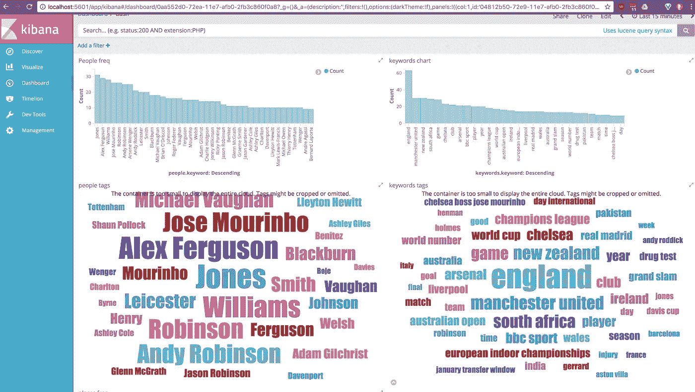

# 在 1 周或更短时间内推出 AI

> 原文：<https://towardsdatascience.com/launch-with-ai-in-1-week-a4f4f45cc177?source=collection_archive---------10----------------------->


[https://www.reddit.com/r/spaceporn/comments/81q31g/twin_engine_atlas_v_with_four_solid_rocket_motors/](https://www.reddit.com/r/spaceporn/comments/81q31g/twin_engine_atlas_v_with_four_solid_rocket_motors/)

无论你是一家新的创业公司还是现有的企业，这里有一种方法可以让人工智能产品或服务在 1 周或更短时间内投入生产。你当然不一定要相信我的话，我会和你分享一些工具，你可以用它们来真正加快速度。

## 第一天

挑一个可以用机器学习解决的问题。这听起来很明显，但是相信我，并不总是这样。我已经写了很多关于机器学习的好的和坏的用例，所以看看这些或者做一些研究，确保你正在处理一些可能的事情。

想想标记产品图片、推荐内容、让数据更容易搜索或对推文进行分类，**而不是**预测股市或制造无人驾驶汽车。

> 对于机器学习和人工智能来说，实际上有很多非常好的用例，关键是要想得简单，随着时间的推移，你可以变得更复杂。

让我们来看看一个新闻聚合网站的想法，它让你的用户可以根据主题、人物和内容进行搜索。


首先，坐下来决定你想让你的用户浏览哪类新闻。也许它们是科学、体育、政治、健康、技术和犯罪。

你可以用第一天剩下的时间收集数据。走出去，在这些类别中尽可能多地抓取文章，并按照类别名称将它们组织到文件夹中。

> 每个类别都有相同数量的例子，这一点很重要。

## 第二天

确保每个类别中有 100-500 篇文章(越多越好)。现在有趣的部分来了。访问 [https://machinebox.io](https://goo.gl/BXfeR7) 下载 Classificationbox。你必须注册你的邮箱，安装 Docker，然后运行一个终端命令。不会超过几分钟。

一旦 Classificationbox 启动并运行，克隆这个开源工具，让你从你电脑上的文本文件中创建一个机器学习模型[。在你的文件夹上运行`textclass`，里面有文章样本。](https://blog.machinebox.io/detect-fake-news-by-building-your-own-classifier-31e516418b1d)

```
/training-data
    /sports
        sports-example1.txt
        sports-example2.txt
        sports-example3.txt
    /politics
        politics-example1.txt
```

几秒钟后，你就会有一个可以自动对新闻文章进行分类的机器学习模型。假设数据集是好的，你的准确率应该在 90%以上。如果不是，考虑稍微清理一下数据集，或者简单地给每个类别增加 100 个左右的样本。

还不到上午 10 点，你就已经有了一个准备投入生产的机器学习模型。但是让我们继续。

下一件你想做的事情是让你的文章变得可搜索，但是当你开始聚集数百万篇文章时，如果你试图索引每一个单词，你会很快碰壁。此外，如果你搜索单词`Radcliffe`,你希望能够返回相关的结果，无论那个人是在搜索丹尼尔·雷德克里夫的地方还是新闻。



再次，[访问机器框](https://goo.gl/BXfeR7)并下载[文本框](https://goo.gl/dMwgfz)。Textbox 是一个关键字和命名实体提取工具，它将为每篇新闻文章提供一点不错的元数据，可以在[弹性搜索](https://www.elastic.co/)中很好地工作。这里有一些关于如何做到这一点的细节，但重点是:

*   按人员、地点、时间等过滤搜索。
*   轻松构建整个数据集的可视化，并查看趋势。
*   以惊人的速度处理和分析数据
*   还有更多…

## 第三天

文章有时附有人物和地点的照片。您可能希望能够标记文章中的人物，标记图像中的事物，以进一步改进搜索和分类。

[机器箱](https://goo.gl/BXfeR7)有两个工具让这变得非常简单；[面框](https://goo.gl/VcSyyN)和[标签框](https://goo.gl/ixHs56)。继续下载这两个。


虽然 [Tagbox 可以使用自定义标签](https://blog.machinebox.io/introducing-tagbox-custom-tags-49c28b4bfdaf)进行教学，但它也预先准备了成千上万个标签，因此它真的很容易开始，无需投入任何工作。当您开始编写应用程序的 web 服务部分时，您可以轻松地将每张照片传递到 Tagbox，并将响应存储在弹性搜索中。你甚至可以选择前两个标签，或者高于某个置信度的标签。

你可能也想开始识别文章中照片上的人。第一步是将每张照片传入 Facebox，然后将[面纹](https://blog.machinebox.io/introducing-facebox-faceprint-d404d11dc46a)存储到数据库中。你可以在这里阅读更多关于面纹是如何工作的[。](https://blog.machinebox.io/introducing-facebox-faceprint-d404d11dc46a)

一旦你建立了一个很好的面部指纹数据集，你就可以在任何时候浏览并教 Facebox 这些人是谁。它不仅会在你给它的新照片中识别你教它的这些人，而且你可以通过简单地更新你数据库中面纹与`name`的关系，将时间上的学习应用到你已经处理过的照片上。

现在你已经准备好了机器学习模型，你可以在第三天下午开始构建 web 应用程序。

## 第 4/5 天

用这两天的时间构建 web 应用程序，汇总新闻故事，决定如何向客户显示信息，集成弹性搜索，也许还要处理客户登录。

然后，为每一个新的文章建立一个流，通过不同的机器盒子，并处理输出。

部署到您最喜欢的托管站点。

## 第二周

现在，你已经有了一个集成了多个机器学习模型的产品，可以做任何事情，从根据文章的写作方式对新闻文章进行自动分类，到使用照片和文章本身的内容来改进搜索。

你还可以做更多的事情。[你可以开始推荐文章](https://blog.machinebox.io/how-to-use-machine-learning-to-solve-personalized-recommendations-in-go-36782aae0964)，人们更有可能根据他们是谁点击，[检测并清除假新闻](/i-trained-fake-news-detection-ai-with-95-accuracy-and-almost-went-crazy-d10589aa57c)，或者[建立自己的语言检测模型](/how-i-trained-a-language-detection-ai-in-20-minutes-with-a-97-accuracy-fdeca0fb7724)来进行自动翻译。

关键是，你应该能够在不到一周的时间内推出一个带有人工智能的产品或服务，即使你是从零开始。

# 什么是机器盒子？


[Machine Box](https://goo.gl/BXfeR7) 将最先进的**机器学习**功能放入 **Docker 容器**中，这样像您这样的开发人员就可以轻松地将自然语言处理、面部检测、对象识别等融入其中。到您自己的应用程序中。

盒子是为规模而建的，所以当你的应用真正起飞时，只需添加更多的盒子