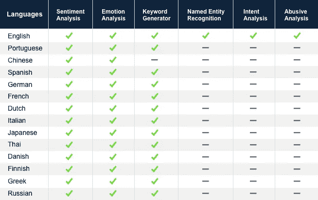
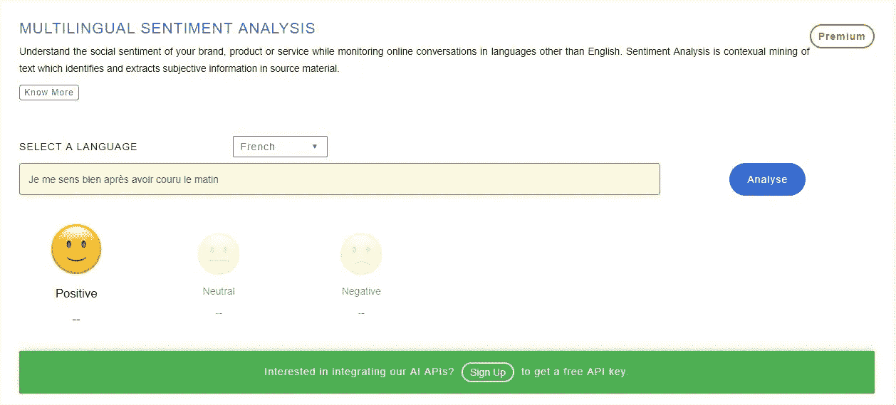

# 以多种语言启动 ParallelDots AI APIs

> 原文：<https://towardsdatascience.com/launching-paralleldots-ai-apis-in-multiple-languages-d786926e72f6?source=collection_archive---------14----------------------->

随着持续数十年的数字化浪潮，数字化形式的文本数据量呈指数级增长。理解和分析这些数据变成了一种练习，就像从消防水管里喝水一样。在 ParallelDots AI APIs，我们旨在让您的生活更简单，并帮助您提供工具，通过几个 API 调用或舒适的 excel 表格中的简短公式来有效地分析这些数据。我们的客户一直敦促我们将我们的服务扩展到多种语言——这正是我们所做的。我们现在为真正的全球客户群提供以下关键 API 语言选项(情感分析、情绪分析和关键字生成器):

# 如何使用我们的多语言 API？

请按照以下步骤使用 API:

*   在此注册一个免费账户[。(如果尚未注册)](https://user.apis.paralleldots.com/signing-up)
*   登录你的仪表板，在这里附上你的信用卡。这是一项高级服务，需要用户升级到标准层。
*   输入您的信用卡详细信息。标准层的计费与使用量相关联，除非您超出了免费使用限额，否则不会向您收取任何费用。
*   点击查看文档[获取代码片段。只需复制代码片段，调整输入文本参数，添加 API 键，更改语言代码，就可以开始使用我们的 API 了。](https://docs.paralleldots.com/)

有问题吗？—请随时联系我们 apis@paralleldots.com 公司

你也可以点击查看演示[。](https://www.paralleldots.com/text-analysis-apis)

# 定价

多语言 API 面向利基市场，作为我们高级 API 的一部分提供。[定价计划](https://www.paralleldots.com/pricing)的详情如下:

*   需要信用卡
*   每月免费 100 次点击
*   每月 100 到 100 万次点击——每 1000 次点击收取 2 美元

# 结论

这一新举措使我们离成为全球客户群首选文本分析解决方案的使命更近了一步。这是对我们最近提高模型准确性的举措的补充，通过新的 API 添加了更多的分析选项，并添加了新的交付选项(通过 Excel 插件)。如果您是一家寻求解决特定文本分析用例的企业，我们将很乐意通过提供定制的解决方案来帮助您。

最后，如果您有任何问题，或者希望我们专门为您选择的任何特定语言提供 API，请联系我们 apis@paralleldots.com。