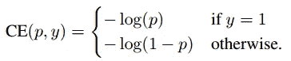
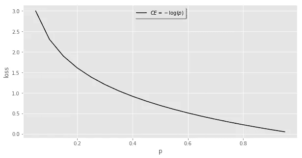
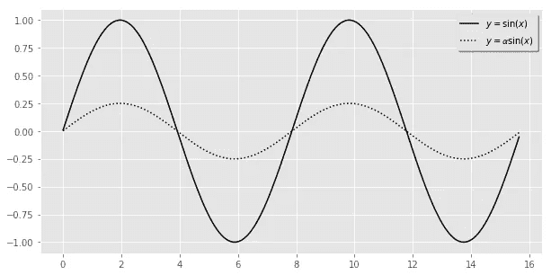
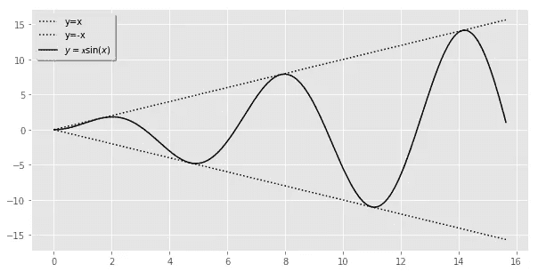
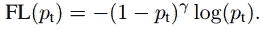
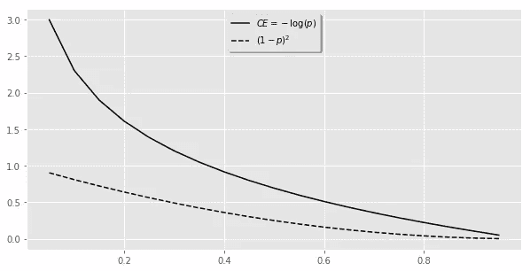
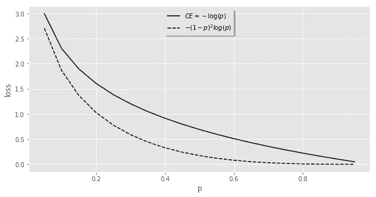

# 惰性神经网络

> 原文：<https://towardsdatascience.com/lazy-neural-networks-8b0de07fd578?source=collection_archive---------11----------------------->

对于困难的问题，神经网络有时可能缺乏鲁棒性，因此它们可能无法对分类不足的例子和边缘情况进行准确的预测。即使选择了合适的架构，这种情况仍然存在。我讨论了如何将注意力从模型架构转移到智能数据选择策略和成本函数设计上，这通常是一个更有用的策略。

在我进入解决方案之前，我认为讨论深度学习的一些首要主题是重要的。

**培训目标**

请记住，当我们创建一个神经网络时，我们实际上是在设计一个实验。我们有数据、模型架构和培训目标。你提供的数据是模型的范围，损失函数基本上是神经网络如何根据这个目标来评估自己。最后一点至关重要。损失函数基本上在训练期间向架构提供反馈，有效地陈述-*是架构内参数的当前状态，做出准确反映我们的训练目标*的预测，数字越低越好。

数据分类是使用深度学习解决的常见问题。无论你试图对猫和狗、路上的汽车还是购买行为进行分类。这种问题的训练目标是简单地最小化错误分类的例子的数量。当前的范例是使用称为交叉熵的损失函数，其训练目标是最小化总输出。在数学上，这表示为:

或者在第一种情况下，可以直观地表示为:

Cross-Entropy Loss (CE)

虽然你们中大多数熟悉深度学习的人可能厌倦了人们解释交叉熵，但我想强调几件事。看上面曲线的形状，试着想象训练时发生了什么。参数被随机初始化，然后随着数据的传递而更新。由于损耗越低越好，如果这些随机初始化的权重导致预测概率 *p* 接近于零，那么损耗输出将会非常高(曲线趋于无穷大)。如果参数是完美的，使得它以 100%的准确度预测训练集中的一切，那么输出是零，不能再低了。如果它在任何中间位置，它将总是试图瞄准这个零值。这是因为我们的训练目标是最小化总损失，并且许多小值的总和优于许多大值的总和。

上面的方法似乎不需要修改。我们有一个连续的函数，告诉神经网络不断尝试改进，直到它完美为止。一会儿我将回到为什么这种方法会有问题。

**神经网络变懒**

数据对于深度学习模型至关重要。但是得出数据越多越好的结论未免过于简单化了。少量高质量的例子对于一个有效的模型来说是绰绰有余的。然而，理解整个训练过程对于拥有一个健壮的模型是很重要的。

神经网络不是用常识初始化的。他们从不知道正在学习什么开始，通过查看数据来逐渐更新参数，然后基于给出最佳总体性能的内容进行评估，标准是我们为其定义的总损失。类别不平衡可能导致网络在不确定的情况下简单地预测主导类别。不确定性本身可能来自于数据的微小变化。

如果您将数据视为模型的世界，大量简单、分类良好的示例可以增强模型的信念，即根本不存在这种类型的变体。例如，一个被训练来识别人的物体检测器可能很难定位一个远处的人，如果它被训练的只是护照照片的话。

即使你的数据集中有一些可变性，大量简单的例子也能强化一个网络对其宇宙的信念。再次考虑交叉熵损失曲线。神经网络可能不会尝试从困难的例子中学习，因为其总损失的风险太高。这样做的不幸后果可能是一个网络说“什么也不做”、“站着不动”或“不知道”。在另一种情况下，想象你正试图训练一个网络玩石头、剪子、布。它可能会知道大多数人总是玩摇滚，然后不断地输出纸张，而实际上你想让它学习更复杂的关系。这就是为什么简单地添加更多的数据并不总是理想的，因为这个概念可能会进一步加强。

一个更有用的方法是问这个问题*我的神经网络哪里不好*，并使这些情况在你的数据集中得到更多的体现。这种想法被称为*自举*或*硬负挖掘*。历史上，计算机视觉使用这种方法处理懒惰模型的问题。在对象检测问题中，背景和前景类可能在 1000:1 的比例上占主导地位，并且从未学会将学习集中在对象本身上。关键思想是通过选择检测器触发错误警报的那些例子来逐渐增加或引导背景例子集。这种策略导致迭代训练算法，该算法在给定当前样本集的情况下更新检测模型，然后使用更新的模型来寻找新的误报以添加到受限制的训练集中之间交替。该过程通常从一个训练集开始，该训练集包括所有对象示例和一个小的随机背景示例集[1]。

这里的要点是，更多的数据可能是有用的，但不要简单地将其扔在你的网络上，并期待更好的结果。

**数学直觉**

我不认为要成为一名优秀的机器学习实践者，你需要广泛的数学技能，当然不是与编程或一般问题解决技能相比。我甚至不认为你不能阅读论文，除非你理解了正在被证明的东西背后的神秘的数学解释。然而，我想说的是，能够在深度学习中可视化重复出现的数学概念确实为你提供了另一种工具，用于理解为什么神经网络最终可能不健壮，以及是否有改进的空间。

当你阅读报纸时，很难直观地理解正在发生的事情。了解一些数学函数可视化的基本技巧可以让它变得更简单。

让我们暂时忘记深度学习功能，只想象一个简单的正弦曲线。最简单的修改是将它乘以一个常数，在这种情况下，这个常数小于 1。效果是相同的形状，但值被缩放。

Effect of scaling by a constant

接下来想象我们的正弦曲线乘以一个变化的函数，在这种情况下是一条简单的线( *y = x* )。正弦波通常在–1 和 1 之间振荡。通过将其乘以另一个函数，它现在被迫在该函数的正值和负值之间振荡，在这种情况下为 *-x* 和 *x* 。

Effect of scaling by another function

**焦损**

鉴于这种认识，让我们回到交叉熵损失曲线:

Cross-Entropy Loss (CE)

如果我们记得我们正在做一个由数据、架构和损失函数组成的三个组件的实验；除了另外两个为什么不改变损失函数？如果我们不想让自己的神经网络变懒，如何改变这个功能？更具体地说，我们如何减少大量简单例子的贡献，这样参数就不会在这些例子中被细化？我们怎样才能迫使它发现更复杂的关系，这些关系只存在于更难描述的例子中？通过将两个函数相乘(如正弦函数所示),应该可以按照我们想要的方式正确地计算示例的成本，从而对交叉熵损失进行整形。

这就是焦点损失函数所实现的。在论文*中首次介绍了密集物体的焦点损失* *检测* (2017)，以解决计算机视觉中的类别不平衡问题，作为硬负挖掘和多阶段模型的更简单替代方案。基本上，目标是识别图像中的对象，相对于人们试图预测的对象类别，背景和前景类别之间存在巨大的类别不平衡。基本上，很难让网络尝试对对象进行分类，因为神经网络认为丢失的风险太高。

焦点损失只是将交叉熵损失乘以一个比例因子，该比例因子随着正确类别的置信度增加而衰减到零[2]。

如果我们分别表示交叉熵损失和比例因子:

Cross-Entropy Loss and the scaling factor for case when gamma is 2

现在我们一起来比较一下未缩放的版本:

Comparison between Focal Loss and Cross-Entropy Loss

您可以直观地看到，无论概率是 0.7 还是 0.99，靠近曲线下端的分类良好的示例都将返回相似的值。换句话说，对于这个范围内的例子，它不会尝试改进它的参数，但当它不在这个范围内时，它会这样做。因此，它将迫使网络学习更复杂的关系，这些关系只出现在困难的例子中——使它不懒惰。

有趣的是，这个看似简单的变化直到 2017 年才引入深度学习社区。理论上，任何人都需要意识到这是如何缩放函数背后的一点数学直觉(如所展示的),以及意识到损失函数与数据和架构相比起着重要的作用。

**总结**

*   训练神经网络包括选择数据、合适的结构和损失函数。
*   神经网络会变得懒惰并强化它们的信念
*   不要盲目地添加更多的数据，而是使用谨慎的策略，如硬负挖掘。
*   当试图生成更鲁棒的网络时，不要忽略损失函数。
*   焦点丢失是一种让网络专注于更难的例子和学习更复杂的关系的策略。

**参考文献**

*   [1]使用在线硬示例挖掘训练基于区域的对象检测器(Abhinav Shrivastava 等人)(2016 年)
*   [2]密集物体探测的焦点损失(宗-林逸等人)(2017 年)