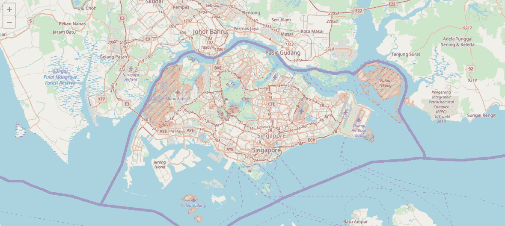
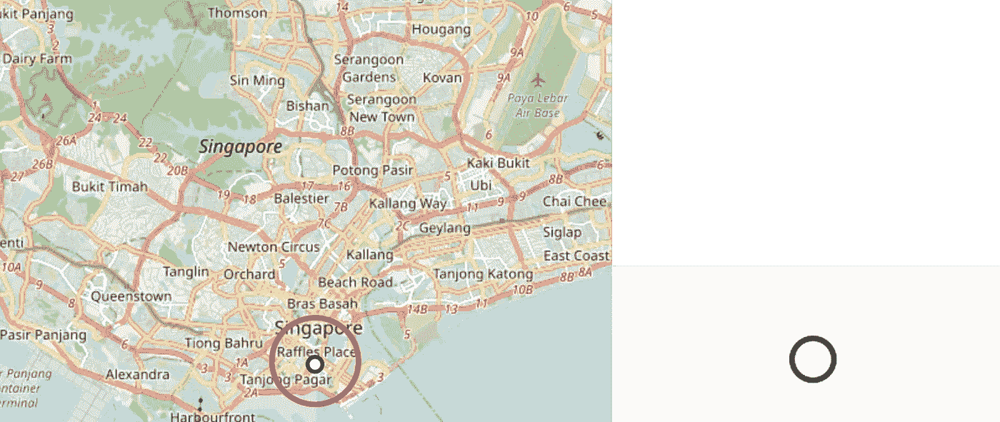
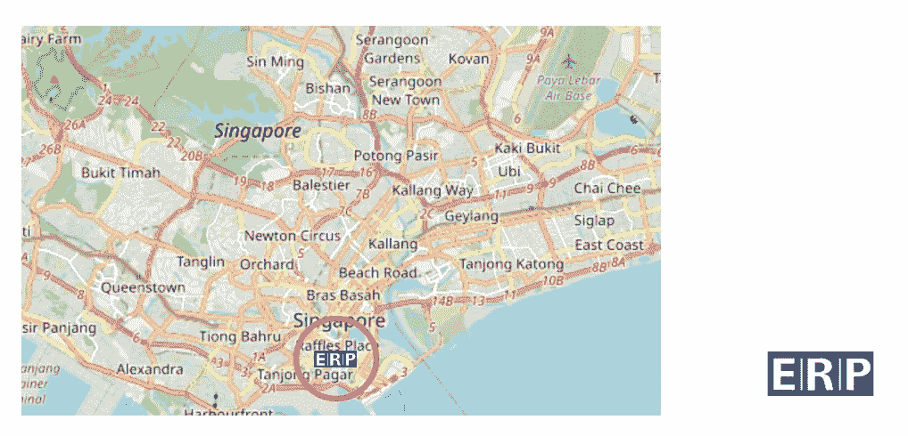
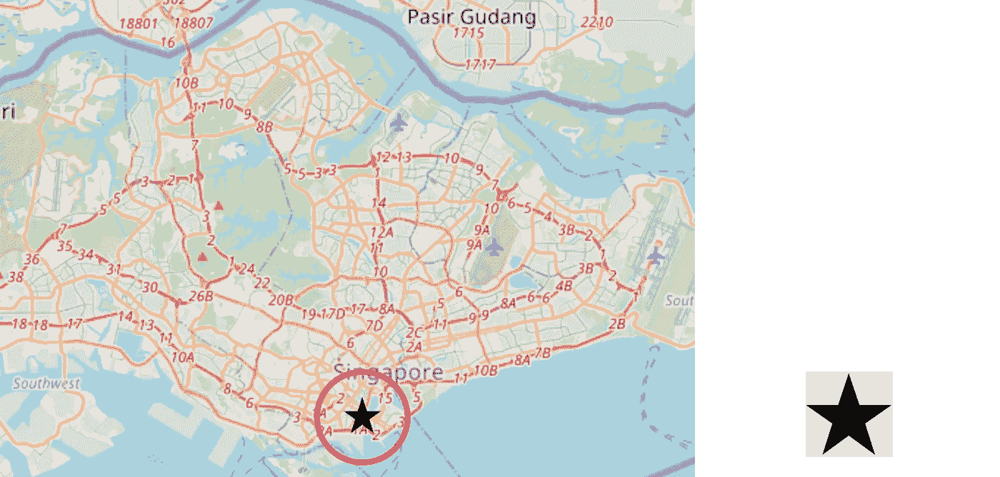

# 传单 Javascript 库点坐标样式和设计

> 原文：<https://towardsdatascience.com/leaflet-javascript-library-point-coordinate-styling-and-design-9c2be3383a7f?source=collection_archive---------5----------------------->

## 传单上高度可定制的地图标记

在我们软件开发旅程中的某个时刻，我们大多数参与地理空间技术的人都遇到过被称为“传单”的开源库。

这只是一个简单的文章来解释它的默认标记转换成你喜欢的图像，图标等。希望在这篇文章结束时，改变这一点:


Default leaflet marker

将触手可及。不要再谷歌**“如何定制传单标记”**只是为了得到一堆复杂但不可用的回复。

对于初学者来说，你需要包括在基本传单库，可以在这里找到:【http://leafletjs.com/download.html】T2，并初始化一个基本的地图和标记。在本例中，我将使用可从 http://cdn.leafletjs.com/leaflet/v1.2.0/leaflet.zip[下载的传单 v1.2.0，并在一个简单的 html 页面上包含 fleet . CSS、fleet . js 和 images 文件夹:](http://cdn.leafletjs.com/leaflet/v1.2.0/leaflet.zip)

在这种情况下，上面的代码转换成下面的新加坡地图视图:



Image by Author | A rendered map view of Singapore by leaflet.js

# **默认图标:**

这行代码:

```
L.marker([1.2800945, 103.85094909999998]).addTo(map);
```

在地图上创建默认标记，如下所示:

# **I 型标记器。圆形标记器**

要将其转换为活页中的简单圆，代码的变化如下:



Image by Author | Note: The method **pointToLayer** is used and for simplicity, the marker is given a white fill with a black border.

此外，你可以改变上述标记的半径、颜色或不透明度，但这不是本演示的重点(没有双关语)。

# 标记类型 II。图像图标

虽然圆形点作为标记在某些地图可视化中可能是理想的，但有时更具体的图标/图像可能更合适。在这种情况下，应该使用下面的方法，而不是上面提到的方法:



Image by Author | (**left**) The image icon is rendered in the map above | (**right**) Preview of image file “ERP.png” stated in the code snippet

# 标记类型 III。编码图像(base64)图标

更进一步，我尝试使用 base64 作为 iconUrl 参数的替代，猜猜会发生什么？它也工作得非常好！


Image by Author | (**left**) The image icon is rendered in the map above as a base64 encoded string | (**right**) Preview of encoded image file stated in the code snippet

就个人而言，当使用的标记是一次性的，并且开发人员发现没有必要在项目中包含实际的图像文件时，我建议使用 base64 字符串来替代图像路径。我推荐的一个 base64 图像编码器工具是:[https://www.base64-image.de/](https://www.base64-image.de/)

# 标记类型 IV。类名和字体图标

最后，如果你是使用字体图标的大多数开发者之一(例如，字体-awesome)，那么在这种情况下使用 L.divIcon 将是最合适的:



Image by Author | Note that for the font icon above to render correctly, the class name “fa fa-star” in font-awesome.css has to be included

当你发现默认的传单图标不适合你的视觉化时，这些是你可以使用的一些图标定制风格。希望这篇文章对你正在进行的网络地理空间可视化之旅有所帮助！

感谢阅读。

[](https://geek-cc.medium.com/membership) [## 通过我的推荐链接加入灵媒——李思欣·崔

### 获得李思欣·崔和其他作家在媒体上的所有帖子！😃您的会员费直接…

geek-cc.medium.com](https://geek-cc.medium.com/membership)