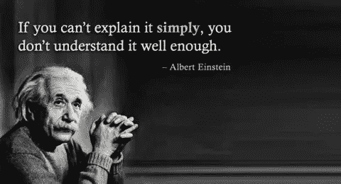

# 通过分享来学习

> 原文：<https://towardsdatascience.com/learn-by-sharing-4461cc93f8c1?source=collection_archive---------4----------------------->

为什么我要离开图书馆去写一个数据科学博客

传统教育很简单:坐下，闭嘴，听老师讲课。课后去图书馆反复阅读同样的单词，试图理出我们日常生活中意义不大的抽象话题。即使作为一名研究生，我仍然被例行公事地讲课，并被期望在课外花大部分时间独自思考我的研究。虽然这可能对需要简单的考试信息回流的科目(查看你的历史)很有效，但它完全不适合现代技术科目，如数据科学。

考虑到这一点，这里有一个激进的建议:当你想理解一个概念时，不要去看书，你应该去你的博客，试着向别人解释清楚。这个想法很简单:如果你不能把一个话题教给别人，那么你自己也不会明白。

Well said

当我开始研究生课程时，我决定采取一种新的教育方法。我不再被动地坐在课堂上，而是打算每次演讲至少问一个问题。这个小小的调整对我的课堂参与产生了深远的影响。我把我的问题集中在如何实现我们所涉及的概念上，这些概念经常在没有任何实际例子的情况下出现。这种积极的参与让我在课堂上更容易集中注意力，也更容易将话题应用到我的研究和作业中的问题上。

课外，我花更少的时间独自学习，花更多的时间在实验室实施数据科学技术。我还努力与其他学生就课堂内容展开对话。在这个过程中，我不是通过死记硬背，而是通过向他人解释来理解这些主题。通过这些讨论，我的同事和我会尝试使用这些技术来解决我们的问题。无论我们是失败还是成功，我们都会回来进行更多的辩论，形成一个富有成效的反馈循环。幸运的是，我在一个实验室里，有比我聪明的学生和教授——永远不要成为房间里最聪明的人是一个好主意——每天我都通过看到实践来学习新的东西。

这学期有更多的数据科学和人工智能(AI)研究生课程，我需要加强我的分享游戏。我的目标是每周至少写一篇博文，解释课堂上涉及的一个话题。我没有太多的时间去开发一些很酷的应用程序，比如股票探索工具(T0)或 T2 体重追踪工具(T3)Python 工具，但是我可以把平时花在复习课程材料上的时间用来写我所学到的东西。这既是为了测试我是否真正理解了材料，也是为了让其他人受益！

当信息——至少是无害的信息——被自由分享时，社区得到了最好的服务。有些人认为，因为他们努力学习他们所知道的，其他人也必须这样做，他们拒绝透露任何会使其他人学习更容易的事情。我强烈反对这种观点:仅仅因为我们为教育支付了几万美元并不意味着我们应该保密。相反，我相信教育的民主化，相信帮助别人从我的(许多)错误和(有限但不断增长的)经验中吸取教训。在技术领域，特别是数据科学，互联网扩大了获取信息的渠道，现在任何人都有可能学习和实践尖端技术。正规机构不再垄断知识，我想在降低这些令人兴奋的新领域的壁垒方面发挥一小部分作用。

Libraries may own books, but nobody owns knowledge

试图解释概念有助于我们自己更好地理解它们。为普通观众翻译一个主题需要真正的理解，而不是死记硬背。我们都经历过这样的情况:我们详尽地研究了一个主题，并认为我们完全理解了这个想法，但当我们必须在一个基本的情况下应用它时，却完全空白了。此外，一个领域中最成功的人往往不是最聪明的，而是那些能够最好地交流发现并展示其相关性的人。尼尔·德格拉斯·泰森是世界上最著名的物理学家，不是因为他发表了最杰出的论文，而是因为他为广大读者解释了艰难的概念。[清晰的书面和口头交流](https://medium.com/@williamkoehrsen/real-life-superpowers-c69d66b51ed4)技能是课堂上无法教授的一大优势！

这些每周一次的帖子通常是关于数据科学和机器学习的，重点是现实世界的例子和隐喻。我的目标的一个很好的指示器是这个[相关性对因果关系帖子](/correlation-vs-causation-a-real-world-example-9e939c85581e)。虽然隐喻可能会过度简化概念，但我的意图是为学习这些概念提供一个高层次的框架。在深入细节之前，先记下基本的想法是很有用的。具体的细节可以通过应用它们来解决问题来填充(或者如果你喜欢这种方式，可以写在一本书里)。如果你等不及我的帖子，我建议看看[数据怀疑论播客](https://dataskeptic.com/podcast/)，它为普通观众提供了大量数据科学话题。更好的是，开始你自己的博客！写作是思考你的想法的最好方式，分享知识对社区中的每个人都有好处。

一如既往，我欢迎反馈和建设性的批评。我可以在推特上通过 [@koehrsen_will](https://twitter.com/koehrsen_will) 联系到我。