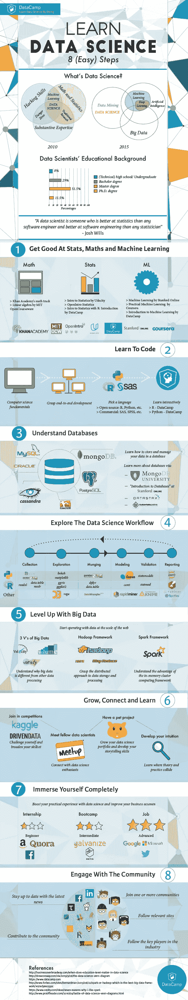

# 学习数据科学—信息图

> 原文：<https://towardsdatascience.com/learn-data-science-infographic-7a472063feb?source=collection_archive---------0----------------------->

在 2012 年被《哈佛商业评论》评为“21 世纪最性感的工作”后，Glassdoor 将其评为 2016 年“年度最佳工作”。

然而，在这四年中，对数据科学家的态度发生了很大变化:2012 年，大多数文章都集中在试图解释什么是数据科学家以及他们具体做什么。当时，在谷歌上简短搜索“如何成为数据科学家”几个字，就会发现这个概念对不同的人有不同的含义。2016 年，这个搜索仍然给你各种各样的文章和广泛的观点。然而，尽管数据科学家曾经是一个实际存在的人，但现在越来越多的文章专注于解释为什么数据科学家是独角兽。

因为尽管数据科学家的定义并不固定，但还没有多少人达到设定的高期望值。招聘信息显示，公司正在寻找拥有沟通技能、创造力、聪明、好奇心、技术专长……这些能力有时被描述的方式让人们看起来不可能成为数据科学家。

随着需求取代供应，数据科学团队而非数据科学家的趋势正在上升，随之而来的是对数据科学是什么和如何的重新强烈关注。然而，就像数据科学家的定义一样，数据科学的定义是多方面的，对于那些想学习数据科学的人来说，有很多建议。然而，这些信息可能依赖于行业和环境，也可能是个人的。

数据科学 8 步指南
为了指导你通过这一信息和建议的丛林，DataCamp 修改了它的“8 步成为数据科学家”信息图:它现在提供了你学习数据科学需要通过的 8 个步骤的更新视图。这八个步骤中的一些对某些人来说会比其他人容易，这取决于背景和个人经历等因素。

然而，我们的目标仍然是让这成为对学习数据科学感兴趣的每个人或者已经成为数据科学家或数据科学团队成员但希望获得更多资源以进一步完善的每个人的可视化指南。

Learn Data Science

(点击[这里](https://www.datacamp.com/community/tutorials/learn-data-science-infographic)下载完整信息图)

如果你正在考虑学习数据科学，或者刚刚开始学习，不要被信息图中呈现的八个步骤吓到。

数据科学是一场马拉松，而不是短跑。

学习数据科学需要时间和个人投资，但这个过程一点也不枯燥！

别忘了，有很多[课程](http://datacamp.com/courses)和[其他资源](https://www.datacamp.com/community/tutorials/learn-data-science-resources-for-python-r)可以帮助你走上正确的道路。