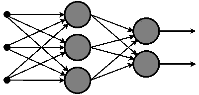
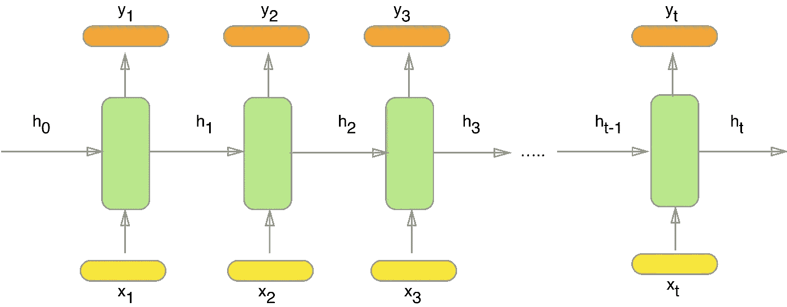

# 递归神经网络如何工作

> 原文：<https://towardsdatascience.com/learn-how-recurrent-neural-networks-work-84e975feaaf7?source=collection_archive---------0----------------------->

[https://pixabay.com](https://pixabay.com)

你肯定遇到过翻译自然语言的软件(Google Translate)或者把你的语音转换成文本的软件(Apple Siri ),可能一开始你很好奇它是如何工作的。

在过去的几年里，这些系统背后的科学已经有了相当大的进步。例如，在 2016 年末，谷歌[在他们的谷歌翻译背后引入了一个新系统](https://research.googleblog.com/2016/09/a-neural-network-for-machine.html)，该系统使用了最先进的机器学习技术。改进是显著的，你可以[亲自测试一下](https://translate.google.com/)。

另一个惊人的例子是[百度最近的文本转语音](http://research.baidu.com/deep-voice-production-quality-text-speech-system-constructed-entirely-deep-neural-networks/):

Credits to Dhruv Pathasarathy for the amazing demo.

那么以上都有什么共同点呢？他们处理**序列数据**来做出预测。好吧，但是这和众所周知的猫图像识别器有什么不同呢？

想象一下你想说如果照片里有只猫。你可以使用多张有猫和没有猫的照片来训练一个**前馈神经网络**(典型的是 CNN-卷积神经网络)。

> 在这个网络中，信息只在一个方向上移动，即从输入节点向前，通过隐藏节点(如果有的话)到达输出节点。网络中没有循环或环路。— [维基百科](https://en.wikipedia.org/wiki/Feedforward_neural_network)

这些网络主要用于模式识别，如下所示:

Feedforward neural network

相反，为了成功处理序列数据，你需要使用**递归(反馈)神经网络**。它能够“记忆”部分输入，并使用它们进行准确的预测。这些网络是语音识别、翻译等的核心。因此，让我们深入进行更详细的解释。

## 什么是递归神经网络？

训练典型的神经网络包括以下步骤:

1.  从数据集中输入一个示例。
2.  该网络将采用该示例，并使用随机初始化的变量(称为权重和偏差)对其进行一些复杂的计算。
3.  将产生一个预测结果。
4.  将该结果与预期值进行比较会给我们一个错误。
5.  通过相同的路径将误差传播回来将调整变量。
6.  重复步骤 1-5，直到我们有信心说我们的变量是定义良好的。
7.  预测是通过将这些变量应用到一个新的看不见的输入中来实现的。

当然，这是对神经网络的一个非常天真的解释，但是，至少，给出了一个很好的概述，并且可能对这个领域的新手有用。

递归神经网络的工作方式类似，但为了清楚地了解这种差异，我们将通过最简单的模型，使用基于前一个单词预测序列中的下一个单词的任务。

首先，我们需要使用大型数据集来训练网络。出于目的，我们可以选择任何大型文本(列夫·托尔斯泰的《战争与和平》是一个不错的选择)。当完成训练后，我们可以输入句子“拿破仑是……的皇帝”，并期望根据书中的知识做出合理的预测。

那么，我们如何开始？如上所述，我们一次输入一个例子，产生一个结果，这两个结果都是单词。前馈网络的不同之处在于，在评估结果之前，我们还需要了解以前的输入。因此，您可以将 RNNs 视为多个前馈神经网络，从一个网络向另一个网络传递信息。

让我们检查以下模式:

Recurrent neural network

这里 *x_1，x_2，x_3，…，x_t* 表示来自文本的输入单词， *y_1，y_2，y_3，…，y_t* 表示预测的下一个单词， *h_0，h_1，h_2，h_3，…，h_t* 保存前一个输入单词的信息。

由于纯文本不能用于神经网络，我们需要将单词编码成向量。最好的方法是使用**单词嵌入** ( [word2vec](https://www.tensorflow.org/tutorials/word2vec) 或 [GloVe](https://nlp.stanford.edu/projects/glove/) )但是出于本文的目的，我们将使用独热编码向量。这些是( *V，1)* 向量( *V* 是我们词汇表中的字数)，其中所有的值都是 0，除了在第 *i 个*位置的那个。例如，如果我们的词汇是*苹果、杏、香蕉、…、国王、…斑马*，单词是*香蕉*，那么向量就是*【0，0，1，…，0，…，0】*。

通常，词汇表包含所有英语单词。这就是为什么有必要使用单词嵌入。

让我们定义训练所需的等式:

*   1)—保存序列中前面单词的信息。可以看到， *h_t* 是用之前的 *h_(t-1)* 向量和当前的词向量 *x_t* 计算出来的。我们还将非线性激活函数 *f* (通常为 [tanh](https://theclevermachine.wordpress.com/tag/tanh-function/) 或 [sigmoid](https://ipfs.io/ipfs/QmXoypizjW3WknFiJnKLwHCnL72vedxjQkDDP1mXWo6uco/wiki/Sigmoid_function.html) )应用于最终求和。假设 *h_0* 是一个零向量是可以接受的。
*   2) —计算给定时间步长 *t* 的预测字向量。我们使用 [softmax 函数](https://www.youtube.com/watch?v=mlaLLQofmR8)产生一个 *(V，1)* 向量，所有元素的总和为 1。这种概率分布为我们提供了词汇表中最有可能的下一个单词的索引。
*   3)-在每个时间步 *t* 使用[交叉熵](https://www.youtube.com/watch?v=tRsSi_sqXjI)损失函数来计算预测字和实际字之间的误差。

如果你想知道这些 *W 的*是什么，它们中的每一个都代表了网络在某一阶段的权重。如上所述，权重是用随机元素初始化的矩阵，使用来自损失函数的误差进行调整。我们使用更新权重的反向传播算法来进行这种调整。我将在以后的文章中解释这个过程，但是，如果你对它是如何工作的感到好奇，迈克尔·尼尔森的书是必读的。

一旦我们获得了正确的权重，预测句子“拿破仑是……的皇帝”中的下一个单词就非常简单了。在 RNN 的不同时间步长插入每个字将产生*h1、H2、H3、H4*。我们可以利用 *h_4* 和*x _ 5*(“of”这个词的向量)推导出 *y_5* 。如果我们的训练是成功的，我们应该期望在 *y_5* 中最大数字的索引与我们的词汇表中单词“France”的索引相同。

## 标准 RNN 的问题

不幸的是，如果你实现了上面的步骤，你不会对结果感到高兴。这是因为最简单的 RNN 模型有一个主要缺点，称为**消失梯度问题，**这使得它不精确。

简而言之，问题来自于这样一个事实，即在训练期间的每个时间步，我们都使用相同的权重来计算 *y_t* 。该乘法也在反向传播期间完成。我们越往后退，误差信号就变得越大或越小。这意味着**网络在记忆序列**中距离较远的单词时会遇到困难，并且只根据最近的单词做出预测。

这就是为什么更强大的型号像 T4 LSTM T5 和 T6 GRU T7 会出现。解决了上述问题，它们已经成为实现递归神经网络的公认方法。

## 奖金

最后，我想与所有让我更好地了解 RNNs 的资源分享我的列表:

热身:

*   [Paperspace 博客—递归神经网络](https://blog.paperspace.com/recurrent-neural-networks-part-1-2/)
*   [野生 ML—RNNs 简介](http://www.wildml.com/2015/09/recurrent-neural-networks-tutorial-part-1-introduction-to-rnns/)

更深入:

*   [Andrej Karpathy 博客——递归神经网络的不合理有效性](http://karpathy.github.io/2015/05/21/rnn-effectiveness/)
*   [斯坦福 CS224n —第八讲:递归神经网络和语言模型](https://www.youtube.com/watch?v=Keqep_PKrY8&t=1080s)(建议贯穿整个[课程+练习](http://web.stanford.edu/class/cs224n/))

高级(抓住细节):

*   [Tensorflow —递归神经网络](https://www.tensorflow.org/tutorials/recurrent)
*   [arXiv 论文——对用于序列学习的递归神经网络的评论](https://arxiv.org/pdf/1506.00019.pdf)

我希望这篇文章能让你对递归神经网络有一个很好的理解，并能对你激动人心的深度学习之旅有所贡献。

> 还有哪些 AI 内容？[在 LinkedIn 上关注我](https://www.linkedin.com/in/simeonkostadinov/)获取每日更新。

## 感谢您的阅读。如果你喜欢这篇文章，给它一些掌声👏。希望你有一个伟大的一天！