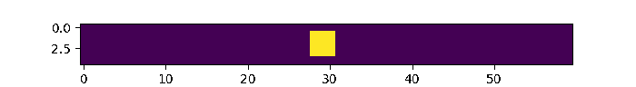
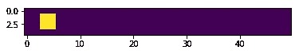
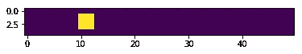
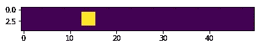
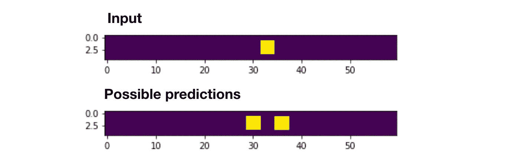
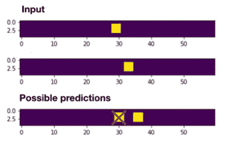
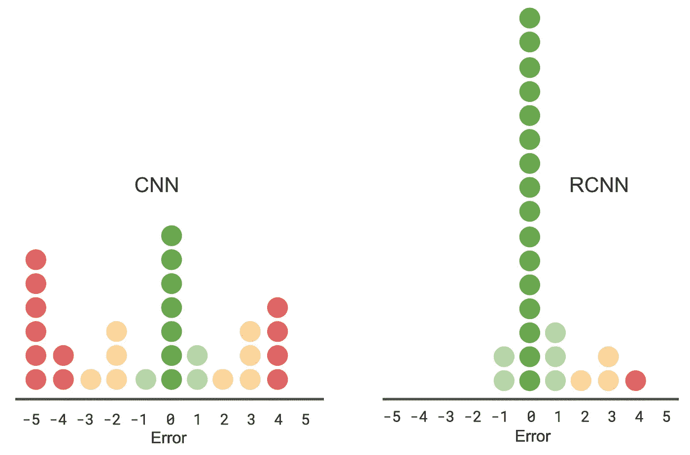
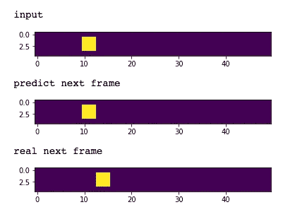
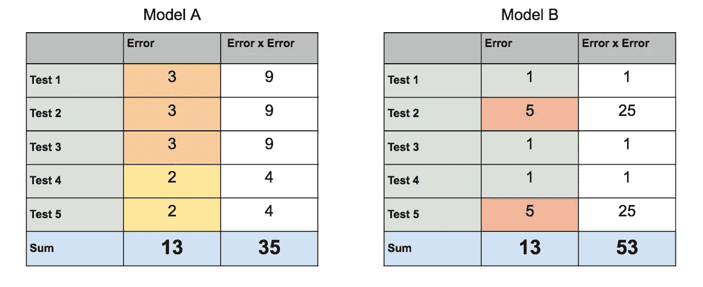
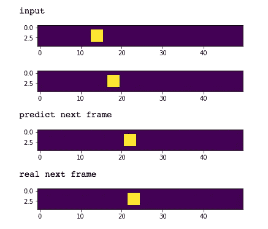

# 用这个玩具数据集学习 RCNNs

> 原文：<https://towardsdatascience.com/learn-rcnns-with-this-toy-dataset-be19dce380ec?source=collection_archive---------6----------------------->

这里有一个数据集，旨在帮助展示递归卷积神经网络(RCNN)何时会优于非递归卷积神经网络(CNN)。

# 一点入门知识

**递归模型**是专门设计用于使用一系列数据进行预测的模型(例如，使用过去 3 天的一系列数据点的股票市场预测器)。

**卷积模型**是专为处理图像数据而设计的模型。

因此，**递归卷积模型**是一种专门设计用于使用一系列图像(通常也称为视频)进行预测的模型。

# 数据集

The aptly named `Sliding Square` toy dataset

[从 Kaggle](https://www.kaggle.com/zackakil/sliding-square-rcnn-toy-dataset) 这里下载，也可以在 [my Github](https://github.com/ZackAkil/understanding-recurrent-convolutional-neural-networks) 上找到。

# 任务

预测方块的下一个位置！

# 输入

作为一个 **CNN** 你只能得到一个单一的帧作为输入:

Input to CNN (single image)

作为一个 **RCNN** 你得到**多个**帧作为输入:

Input to RCNN (multiple sequencial images)

# 直觉

**为什么 CNN 会在这个数据集上表现不佳？**

看看上面 CNN 的输入(单帧)。你能自信地预测滑动方块的下一个位置是什么吗？我假设你的回答是“不”。这是因为它是完全模糊的，也就是说，它可能向左或向右移动，没有办法根据一张图片就知道。

Ambiguity in trying to predict the next position based on a single frame.

**为什么 RCNN 应该在这个数据集上表现良好？**

尝试使用上面的 RCNN 输入(两帧)预测下一个位置。现在很容易了吧？正方形移动的方向现在不再模糊。

Showing how using multiple frames disambiguates the next position.

# CNN 与 RCNN 的性能测试

查看[这本笔记本](https://github.com/ZackAkil/understanding-recurrent-convolutional-neural-networks/blob/master/Testing%20CNN%20vs%20RCNN%20using%20synthetic%20data.ipynb)，看看在这个数据集上构建和训练简单 CNN 和 RCNN (Keras 模型)的代码。

为了评估性能，我们使用来自数据集的随机帧样本，并让每个模型尝试预测正方形的下一个位置。

下面是每个模型预测误差的频率表。例如，你可以看到，对于 7 次测试，CNN 得到了完全正确的正方形位置(零误差)。

frequency chart of prediction errors for a sample of test data

CNN 错误分数是怎么回事？

你可能会注意到 CNN 犯了很多+/- 4 的错误。当我们考察其中一个预测时，一切都揭晓了:

CNN prediction (always predicts it to be the same position as the input)

CNN 似乎总是预测这个正方形与它在输入图像中的位置相同。你可能觉得这很奇怪，因为方块的下一个位置只能是左边或者右边。为什么它会预测它会在一个它根本不会在的地方！？一个字… **一致性！**一般来说，对于机器学习模型来说，最好总是有点错误，而不是有时非常错误。在大多数学习算法中，这种偏好是通过平方误差来实现的，如下所示:

How consistent errors are encouraged by squaring the original error. See how both models have the same Sum(Error) but Model B has a significantly higher Sum(Error x Error)

CNN 已经学会猜测与输入相同的位置，因为这样它总是离正确答案最多+/-5。如果它总是猜测方块向右移动:一半的时间它是完全正确的，但另一半的预测会相差 10 %!(这不太一致)

**自然 RCNN 是在其元素**

从误差图中可以看出，RCNN 的误差远不及 CNN。这是因为它在计算正方形移动的方向上没有问题。

RCNN not having any trouble in predicting the next position of the square.

希望这给了你更多关于何时使用 RCNNs 而不是标准 CNN 的直觉。

所有用于生成玩具数据集的代码以及测试模型的代码都可以在我的 Github 上找到:

 [## ZackAkil/理解递归卷积神经网络

### 理解-递归卷积神经网络-使用合成生成的视频数据来学习如何/何时…

github.com](https://github.com/ZackAkil/understanding-recurrent-convolutional-neural-networks)