# 学习构建机器学习服务，原型化真实的应用程序，并将您的工作部署给用户

> 原文：<https://towardsdatascience.com/learn-to-build-machine-learning-services-prototype-real-applications-and-deploy-your-work-to-aa97b2b09e0c?source=collection_archive---------2----------------------->


在这篇文章中，我将向读者展示如何将他们的机器学习模型公开为 RESTful web *服务*，*原型*真实的应用程序，方法是为这些服务附加一个前端，并使用容器部署他们的应用程序。

我认为这三个方面代表了数据科学家为了使他们的工作有意义和有影响力而应该具备的关键技能。

我将在本教程中介绍的 **3 个工具**是:

1.  **Jupyter 笔记本(在 JupyterLab 中)带内核网关**(把机器学习工作流变成 web 服务)；
2.  [**Azle**](https://azlejs.com/) (快速前端原型库)；
3.  **Docker** (在隔离的、可移植的容器内部署应用)；

**为什么数据科学家要把他们的机器学习变成 web 服务？**

定期创建机器学习代码的端点迫使我们思考抽象。我们需要不断地向团队的其他成员公开我们的工作。这是让我们的工作流程对产品问题负责，并邀请非从业者参与机器学习对话的原因。

**数据科学家为什么要做前端应用的原型？**

我们不是为数据科学家做机器学习，而是为产品的最终用户做机器学习。这意味着我们需要认识到我们的模型将如何被*消费*，而不仅仅是被创造出来。将我们的数据管道连接到前端，可以让团队中的其他人了解机器学习的能力，并让我们的机器学习受益于非技术反馈。

为什么数据科学家要将他们的工作隔离在容器中？

容器化使得应用程序*便携*和*可复制*。可移植性对于任何应用程序都是一个挑战，但是机器学习软件特别容易受到依赖性问题的影响。多亏了一系列用定制代码拼凑起来的开源库，数据科学才成为可能。如果没有容器，当我们改变环境时，很难保证事情会一致地运行。这有助于我们更有效地协作，并允许我们更无缝地在组织内外共享应用程序。

让我们开始吧…

****挑战**:比方说我开了一家专门做鲜花的公司。我定期雇人进货，并在进货前给花贴上标签。虽然大多数鲜花都是从批发商那里贴上标签的，但这足以证明我需要培训员工如何识别鲜花。培训员工既费时又费钱。**

****解决方案:**我将创建一个应用程序，帮助快速培训我的员工。由于[的研究](https://www.ncbi.nlm.nih.gov/pmc/articles/PMC4554955/)显示竞争导致更好的学习，我的应用程序将允许新员工在基于照片和测量识别花朵方面与人工智能竞争。**

****模型:**低保真度模型帮助我们探索想法，而不会将自己局限于特定的工程实践或协议。在本教程中，我将使用虹膜数据集创建一个应用程序，帮助用户训练识别鸢尾花，并与做同样事情的“人工智能”竞争。**

**我们的应用程序将包含 3 个部分。我们的**第一部分**将允许用户在测量时看到随机的鸢尾花。这将是他们的**培训**区域，用于练习将花卉尺寸与他们的标签联系起来。**

**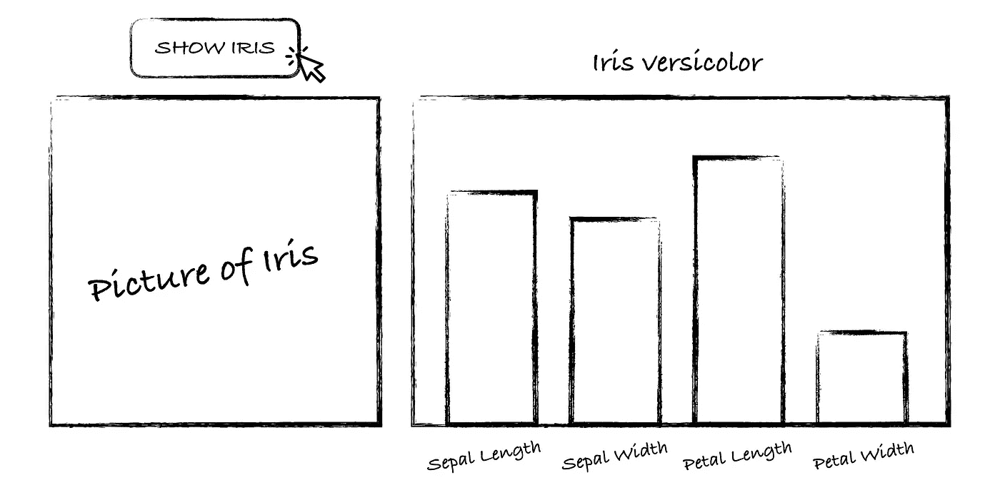**

**我们的**第二部分**将允许用户**挑战**我们的 AI，看谁(或什么)能得到更多正确的猜测。**

**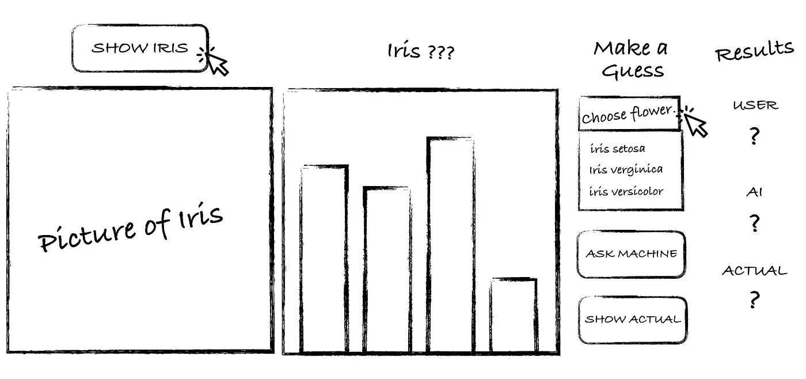**

**我们的**第三部分**将显示当前的**记分牌**，其中包含基于我的学员和 AI 表现的实时分数。我将与新员工一起审查这些报告，以评估他们的培训情况。**

****

**构建整个应用程序超出了本文的范围。我们将专注于构建第一部分，剩下的代码留给您自己去探索。**

**到本文结束时，我们将已经构建了以下机器学习应用程序的前端和后端:**

**Machine Learning Application Built Using [**Azle**](https://azlejs.com) and[**JupyterLab**](https://jupyterlab.readthedocs.io/en/stable/)**

****后端对前端****

**我们既需要后端进行处理，也需要前端为用户提供交互。我们的后端将包括我们在 Jupyter 笔记本中原型化的机器学习，而前端将是使用 [Azle](https://azlejs.com/) 构建的 web 应用程序。**

**由于我们正在构建一个识别鸢尾花的应用程序，因此编写一个数据管道来收集和验证鸢尾花数据，训练和验证一个能够对鸢尾花进行分类的模型，并将该模型部署为前端消费的服务是有意义的。因为快速原型是我的目标，所以我将利用现有的机器学习管道来坐在我的 Jupyter 笔记本中。Google 的 Tensorflow [教程](https://www.tensorflow.org/get_started/eager)有一个使用**深度学习**对鸢尾花进行分类的端到端例子。由于虹膜数据集很小，而且我的应用程序不需要可解释性，深度学习应该可以正常工作。**

****安装 JupyterLab****

**我们将使用 [JupyterLab](https://blog.jupyter.org/jupyterlab-is-ready-for-users-5a6f039b8906) 作为我们的开发环境。JupyterLab 允许我们在浏览器中使用 IDE，这在进行*机器学习工作和 web 应用程序开发时非常方便。***

****

**[T5 下载和**安装** JupyterLab](https://jupyterlab.readthedocs.io/en/stable/getting_started/installation.html)**

**安装完成后，**在桌面(或者任何你喜欢的位置)创建一个新文件夹**，命名为 flower_power。打开终端，进入新的 flower_power 目录。进入后，运行以下命令打开 JupyterLab:**

```
jupyter lab
```

**这将在您的默认浏览器中自动打开 JupyterLab 作为一个新选项卡:**

****

**在启动器中选择一个**新的 Python 3 笔记本**。重命名笔记本 *flower_power.ipynb***

**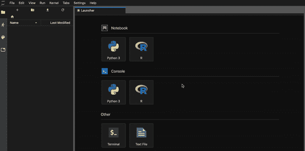**

**如果你是机器学习的新手，请花时间跟随 Tensorflow 的[教程](https://www.tensorflow.org/tutorials/eager/custom_training_walkthrough)，将它的代码添加到 flower_power 笔记本的连续单元格中。这是对机器学习中常见任务的一个很好的概述。如果您已经知道该练习，只需将代码添加到每个单元格中，并在笔记本上单击以确保满足所有依赖关系。或者你可以简单的 [**在 GitHub**](https://stackoverflow.com/a/45645081/1639594) **[这里](https://github.com/sean-mcclure/flower_power/blob/master/flower_power.ipynb)下载**Jupyter 的完整笔记本。只需使用 Jupyter 的上传工具来加载文件。**

**现在，我们的 JupyterLab 已经可以使用 flower_power.ipynb 笔记本了:**

****

**The **flower_power.ipynb** Jupyter Notebook**

# **学习将 Jupyter 细胞作为 REST 终点**

**除了在浏览器中实现数据科学，Jupyter 还可以将我们的机器学习变成一种 web 服务。通过添加 [Jupyter 内核网关](https://github.com/jupyter/kernel_gateway)，我们可以将笔记本中的任何单元格作为*端点*公开。请将端点视为笔记本电脑和任何需要使用其输出的应用程序之间的网关。创建端点意味着我们在机器学习中所做的工作可以向应用程序及其开发者公开。**

****安装 Jupyter 内核网关****

**在您的终端中运行以下命令:**

```
pip install jupyter_kernel_gateway
```

**我们将很快看到如何使用网关。此时，我们希望**选择笔记本中的单元格作为端点**。这很简单，只需在单元格的开头添加以下注释:**

```
# GET /my_path
```

**我们将用端点的名称替换“my_path”。首先，让我们创建一个**函数**，它从 flower_power.ipynb 笔记本中的测试数据集中返回一朵随机的鸢尾花:**

**这个函数从 3 个可能的选项中随机选择一个花的名称，选择随机选择的 URL，并检索与花相关的数据。**

**我们将使用一个端点调用这个函数，这样我们的应用程序就可以获取一个随机的花**名称、**它的图像 **URL** 和与它的 4 个测量值相关联的**数据**。**

**我通过进入[维基百科的虹膜数据集页面](https://en.m.wikipedia.org/wiki/Iris_flower_data_set)并简单地在*数据集*部分右键单击适当的图像，将图像 URL 添加到上述函数中。我选择了 C *opy 图像地址*并将 url 粘贴到上面的函数中，分别为 **url_1** 、 **url_2** 和 **url_3** 。**

**我们希望*将这个函数变成一个端点*，使它可以在浏览器中从我们的 web 应用程序中调用。如上所示，我们通过在代码周围包装以下内容来使用**内核网关**:**

*   **一个**得到** **注释**的单元格的第一行；**
*   **输出 JSON 的**打印** **命令**。**

**现在，当我们启动内核网关(稍后)时，这段代码将通过将浏览器指向以下 URL 来执行:**

****localhost:9090/get _ random _ flower****

**先不要担心 9090 端口，稍后我将展示如何设置它。这个端点将运行上面创建的 **show_random_iris** ()函数，并将结果添加到名为 **res** 的字典中(因为我们使用的是 JSON，所以请确保将 *import json* 添加到笔记本的顶部单元格中)。我们得到的是一个看起来像这样的 *JSON 响应* :**

**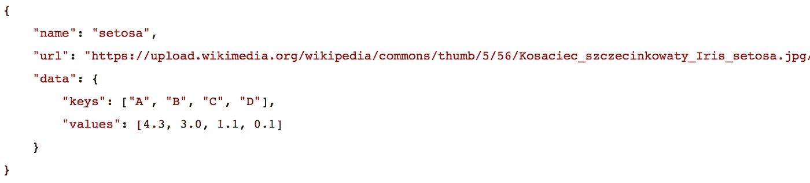**

> **您*必须*将 GET 注释添加到您想要作为端点的 Jupyter 单元格的第一行。如果您在 GET 行上放置任何注释或代码，该单元格将失败。**

**为了检查我们的端点，让**设置 Jupyter 内核网关**。因为我们已经安装了 Jupyter gateway，所以我们只需要在包含 flower_power.ipynb 笔记本的 s *ame 目录*中的终端中输入以下命令:**

```
jupyter kernelgateway --KernelGatewayApp.api='kernel_gateway.notebook_http' --KernelGatewayApp.ip=0.0.0.0 --KernelGatewayApp.port=9090 --KernelGatewayApp.seed_uri=flower_power.ipynb --KernelGatewayApp.allow_origin='*'
```

**该命令执行以下操作:**

*   ****启动** Jupyter 网关；**
*   ****设置**基础 URL 为 localhost(0 . 0 . 0 . 0)；**
*   ****向浏览器公开**端口 9090(你可以把这个改成任何可用的端口)；**
*   ****将**flower _ power . ipynb 笔记本分配给网关；**
*   ****允许**来自任何地方的输入流量(记住，我们只是在做原型)**

**运行该命令将产生与 Tensorflow(忽略)和我们注册的资源(端点)相关的输出。最后一行应为:**

```
Jupyter Kernel Gateway at [http://0.0.0.0:9090](http://0.0.0.0:9090)
```

**在浏览器中打开一个新标签，指向:**

****localhost:9090/get _ random _ flower****

**您应该会看到返回的数据。**持续点击刷新**查看终端输出，每次返回不同的花朵。我们现在调用 python 代码，放在 Jupyter 笔记本里，全部通过我们的浏览器。您现在已经构建了一个*服务*。因为我们的机器学习将用 Python 编写，所以创建一个*机器学习服务*也没什么不同。我们只需通过浏览器选择我们希望调用的功能。**

**为了检查我们的端点，我们应该使用开发人员常用的工具来做同样的事情。一个这样的工具是 [Swagger](https://swagger.io) 。Swagger 是一款帮助开发人员设计、构建、记录和使用 RESTful Web 服务的软件。将服务端点传递给团队中的开发人员是一种常见的方式。Jupyter 内核网关的一个很棒的特性是它自动生成一个 **swagger.json** 端点，我们可以使用 [**SwaggerUI**](https://swagger.io/swagger-ui/) 来访问它。**

**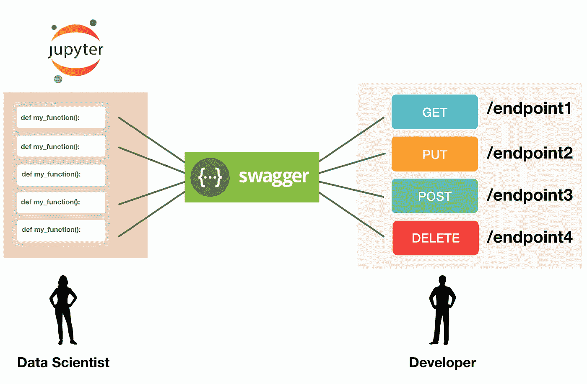**

**这使得开发人员可以使用不同的 API 端点来“混搭”应用程序。作为数据科学家，我们希望我们的模型成为混搭的一部分，这样我们的组织就可以看到机器学习为他们的产品带来的价值。您组织内的开发人员可能会安装他们自己的 Swagger UI(或类似的东西)，因此您可以简单地将您的 Swagger 端点交给他们。**

**对于我们自己的检查，让我们从 Dockerhub 下载 Swagger UI 并运行 UI 应用程序，检查我们刚刚用内核网关创建的端点。如果没有安装 Docker， [**下载****先安装** Docker](https://docs.docker.com/install/) 。安装并运行 Docker 后，在终端中打开一个新标签，运行 **Docker pull 命令**下载 DockerUI:**

```
docker pull swaggerapi/swagger-ui
```

**在您的控制台中键入 *docker images* 以查看以下内容:**

****

**这显示了我们新图像的名称，swaggerapi/swagger-ui。我们现在可以使用这个名称来运行它的容器:**

```
docker run -p 80:8080 swaggerapi/swagger-ui
```

**…然后**在我们的浏览器 80 端口上打开 swagger-ui** 。**

**在浏览器的新选项卡中，导航到以下 URL:**

```
[http://localhost](http://localhost):80
```

**在屏幕的顶部是*探索栏*，在这里我们添加到我们的 **swagger.json 文件**的路径；我们的 Jupyter 内核网关暴露的那个。将以下内容添加到此栏中(确保 URL 中包含 http://):**

```
[http://localhost:9090/_api/spec/swagger.json](http://localhost:9090/_api/spec/swagger.json)
```

**因为我们只是点击我们创建的服务中的现有端点，所以端口仍然是 9090。按回车键，看看会发生什么。您应该会在屏幕上看到以下内容:**

**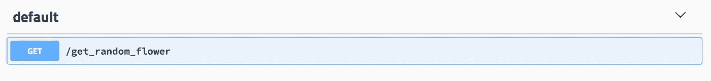**

**这是我们在 Swagger 内部公开的 GET 端点。点击**获取**按钮，然后在**上*试出*** *，*然后在**上执行**:**

**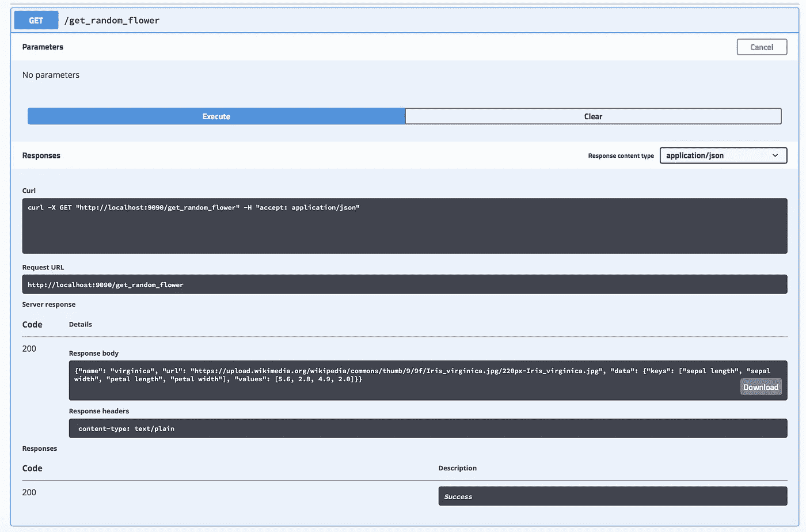**

**这些信息对你的开发者很有用。他们可以看到如何通过终端中的 **curl** 命令访问我们的 API，看到完整的**请求 URL** ，看到**响应主体**，以及与该响应相关的任何**头**。我们还可以看到**成功代码** 200，显示我们的端点按预期工作。**

**因为我们没有在端点上设置任何参数，所以没有什么可查询的。通常，开发人员会运行查询来决定如何最好地将我们的机器学习引入应用程序。我们将在稍后构建 Flower Power 应用程序时展示如何设置和传递参数。**

**我们现在对数据科学家如何在他们的 Jupyter 笔记本中为任何代码创建 web 服务有所了解。虽然我们在这里只使用了一个简单的例子，但这种方法向我们团队内外的利益相关者公开了所有类型的机器学习功能。**

**我们现在准备开始原型化一个真正的应用程序。虽然这通常属于开发人员的权限范围，但有充分的理由让数据科学家自己去做。真正的应用程序给了我们的机器学习“腿”，并消除了机器学习如何为组织的产品做出贡献的许多模糊性。**

**当然，数据科学家已经有足够多的工作要做，不用深入研究 HTML、CSS 和 JavaScript，更不用说为工程大规模 web 应用程序定制框架了。我们需要的是一个*快速*前端原型库，基于直观的语法，可以轻松连接到 API 端点。**

> **一些机器学习从业者会争辩说他们的专业排除了学习前端开发的时间/需要；我发现这通常源于对学习如何开发软件的恐惧，而不是真正相信他们不需要这样做。重要的是要认识到原型软件和开发产品软件是不同的艺术形式。有了正确的高级库，原型软件对领域专家来说是非常有益的。在当今信息驱动的经济中，没有什么比快速将他们的愿景转化为人们可以使用的现实工具的能力更能赋予专业人员权力。**

# **学习用 Azle 构建应用程序原型**

****

**太多时候，数据科学家孤立地致力于改进他们的机器学习模型，只在对模型满意后才把结果扔出围栏。这增加了项目投资回报率低的风险，因为真空中的机器学习永远不会受益于现实世界的反馈。应用程序的前端是真正的用户对学习算法产生的输出的唯一接触点。数据科学家需要*根据人们对产品的触摸和感受来通知他们的管道*。**

**[Azle](https://azlejs.com/) 是一个前端原型库，专门为快速制作应用程序而设计。它似乎在灵活性和易用性之间找到了合适的抽象层次。它使用函数来*添加*和*样式* *内容*，*绑定事件*，并与 API *端点*交互，从而更容易构建全功能、数据驱动的应用程序。**

**所有的 web 应用程序都是从一个 html 模板开始的，这个模板最终会包含使应用程序前端成为可能的元素。我们的第一步是使用 Azle 提供的模板。您可以**将以下内容复制并粘贴到名为 index.html**的文件中:**

**HTML template for Azle.**

**我们所有的 Azle 函数都可以添加到底部的**

**Azle 是一种直观的语言，我们根据*正在做的事情编写代码。Azle 预装了极简风格，所以我们不必花太多时间让我们的应用程序看起来更现代。它还使用了**布局**，使得在屏幕上排列内容变得容易。***

**我们来看看 Azle 中一些常见的**函数**。点击任何一个**按钮**来玩实际代码:**

## **添加内容**

```
az.**add_button**(target_class, target_instance, {
    "this_class" : "my_button",
    "text" : "CLICK ME"
})
```

**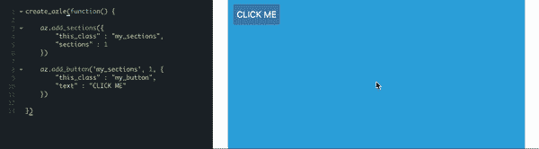**

**[拨弄](https://jsfiddle.net/CyberneticSean/72d4yqoc/8/)**

```
az.**add_dropdown**(target_class, target_instance, {
    "this_class" : "my_dropdown",
    "options" : ["option A", "option B", "option C", "option D"],
    "title" : "choose option..."
})
```

**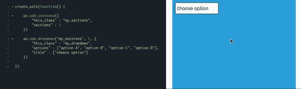**

**[拨弄](https://jsfiddle.net/CyberneticSean/72d4yqoc/17/)**

```
az.**add_slider**("target_class", 1, {
    "this_class" : "my_slider",
    "default_value" : 4,
    "min_value" : 0,
    "max_value" : 10
})
```

**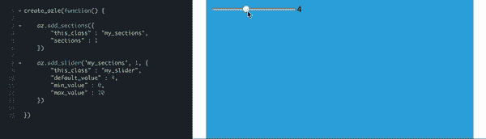**

**[小提琴](https://jsfiddle.net/CyberneticSean/72d4yqoc/10/)**

**注意，每个函数使用一个**目标类**和**目标实例**作为前两个参数。这告诉 Azle 在哪里放置内容，或者我们希望样式化哪些内容。例如，在上面的滑块中，我们首先创建一个部分来存放我们的应用程序，然后将滑块添加到第一个部分:**

```
az.add_slider(**"my_sections", 1,** {}) 
```

**第三个参数是一个包含我们希望传递的属性的**对象**。在我们的第一个 slider 示例中，我们传入了一个类名(“this_class”)和默认值。每个内容和样式都有其预期的属性，可以在 Azle 的[文档](https://azlejs.com/)中找到。**

## **样式内容**

**我们也可以**样式**我们添加的任何内容。如上所述，通过使用 target_class 和 target instance，并将样式属性作为第三个参数传递给一个**样式对象**来完成样式化。例如，上面的按钮样式:**

```
az.**style_button**('my_button', 1, {
    "background" : "hotpink",
    "border-radius" : "6px",
    "width" : "200px",
    "color" : "black",
    "cursor" : "wait"
})
```

****

**[拨弄](https://jsfiddle.net/CyberneticSean/72d4yqoc/12/)**

> **请注意，Azle 样式遵循标准的 CSS 样式化文档的方法。**

## **添加事件**

**我们可以将事件绑定到我们的 UI 元素上。事件是像点击、悬停和选择这样的事情。这里我们使用 Azle 的 **add_event** 函数向按钮添加一个点击事件:**

```
az.**add_event**("my_button", 1, {
    "type" : "click",
    "function" : "alert('you clicked me')"
})
```

****

**[瞎搞](https://jsfiddle.net/CyberneticSean/72d4yqoc/14/)**

**要查看 Azle 中所有可用的事件，请参见[这里](https://jsfiddle.net/CyberneticSean/a90bjest/68/)。**

## **抓取值**

**通常，我们希望在调用事件之前从输入或下拉列表中获取一个值。这是使用 Azle 的 **grab_value** ()函数完成的:**

```
az.**grab_value**("my_dropdown", 1)
```

**例如，我们可以添加一个按钮，其文本来自下拉菜单中的选择:**

```
az.**add_button**("my_sections", 1, {
    "this_class" : "my_button",
    "text" : **az.grab_value**("my_dropdown", 1)
})
```

**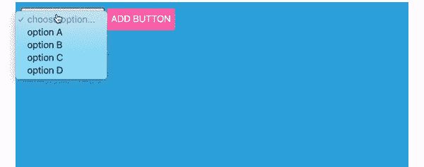**

**[拨弄](https://jsfiddle.net/CyberneticSean/72d4yqoc/24/)**

## **呼叫端点**

**调用端点是我们**从 REST APIs 发送和获取数据**的方式。Azle 的 **call_api** ()函数要求提供**基 url** ，我们需要传递的任何**参数**，以及一旦收到响应就调用的**函数**:**

**[拨弄](https://jsfiddle.net/qj4gL7ks/)**

## **添加视觉效果**

**Azle 与 D3.js 配合得很好，正如我在这里讨论的。还可以查看一下 [**azle_d3 示例应用**](https://collaboratescience.com/azle_d3/) 。**

**下面是**预览视频**，展示了如何使用 Azle 将 D3 视觉效果绑定到应用程序中的 UI 元素:**

**我们对 Azle 的简短访问向我们展示了创建更完整的应用程序所需的部分，包括前端内容、样式、事件和视觉效果，以及调用端点的能力。请务必查看[文档](https://azlejs.com)，其中包含入门教程。**

**让我们开始创建我们的应用程序。**

## **创造花的力量**

**在开始时创建模拟的整个应用程序超出了本文的范围。我们将只构建应用程序的第一部分*然后看看其他部分需要考虑什么。GitHub 项目包含完整的代码。***

**下面是我们在开头看到的视频，展示了完整的应用程序:**

**为了开始原型化我们的应用程序，我们像往常一样从前面显示的 html 模板开始，在底部的**

**最快的开始方式是简单地*将 html 模板保存到您的桌面*并右键单击该文件，选择*打开方式，然后*选择您的浏览器，如下所示:**

**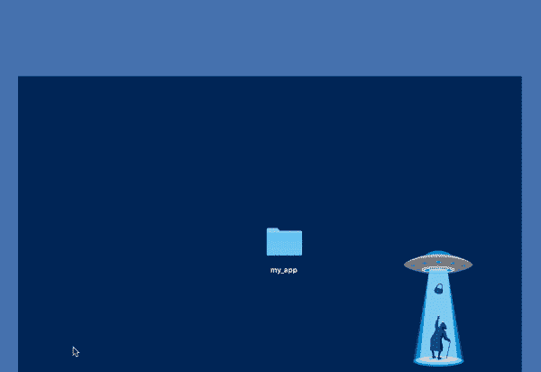**

**然而，将所有文件放在我们的 ide 中会更方便，对我们来说 IDE 就是 JupyterLab。这样我们可以根据需要打开终端，安装库，对我们的 flower_power.ipynb 进行修改，重启我们的机器学习服务，原型化我们的前端；所有这些都在一个浏览器屏幕上。当构建真实世界的软件时，这是非常有益的。我们将使用这种方法。**

**如果您从一开始就已经在名为 flower power 的文件夹中启动并运行了 JupyterLab，并且将 flower_power.ipynb 选项卡作为您的第一个 JupyterLab 文件打开。**

**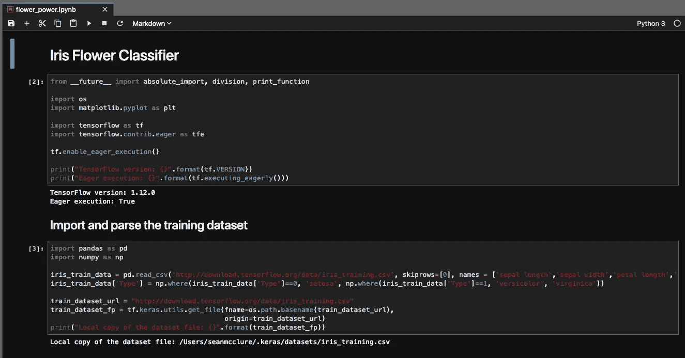**

**让我们打开其他选项卡，这样我们就有了一个**完整的原型开发环境**。点击*新启动器*图标，选择*其他*选项下的*终端*，让**打开一个终端**:**

**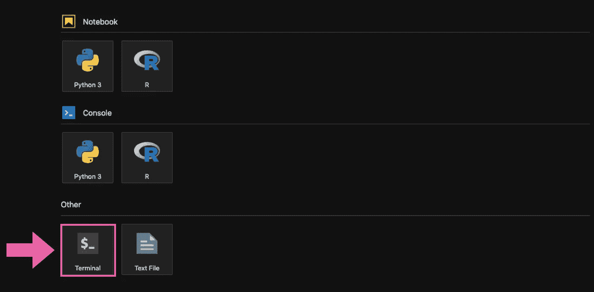**

****这样做两次**，这样我们就有 *2 个终端*打开。让我们也为我们的 Azle 应用程序创建一个 index.html 文件。点击*其他*下的*文本文件*…**

**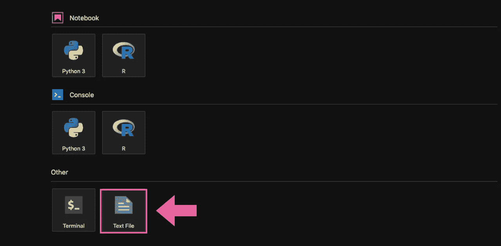**

**…并将文件**重命名为**index.html。将此文件作为 JupyterLab 环境中的第 4 个选项卡打开。**

**让我们**在主目录中创建两个文件夹**，一个叫做 **d3_visuals** ，另一个叫做 **scripts** 。我们在 JupyterLab 中通过单击“新建文件夹”按钮来创建文件夹:**

****

**…然后右键单击新创建的文件夹，并将其重命名。您现在应该有一个如下所示的**目录结构**:**

```
**flower_power** ├── **scripts** ├── **d3_visuals**
├── flower_power.ipynb
├── index.html
```

**您还应该为您的原型开发环境打开 **4 个选项卡**:**

**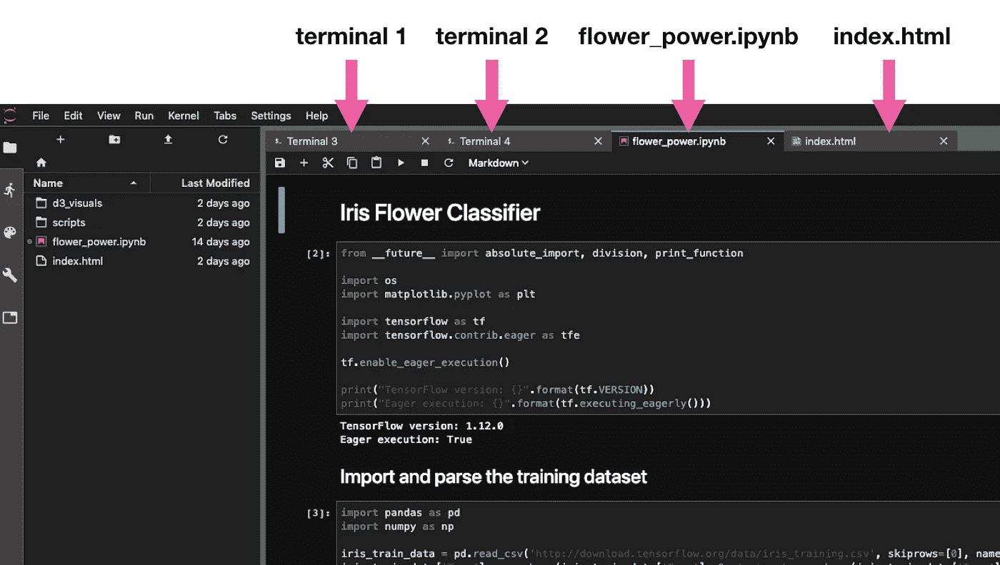**

**A **prototyping environment** for building machine learning applications.**

**我们稍后将添加 2 个额外的文件到 d3_visuals 和 scripts 文件夹中，但是现在让我们开始构建我们的应用程序。**

**我们需要在另一个浏览器选项卡中查看我们的应用程序，这意味着我们需要“启动 web 服务器”通过在 JupyterLab 中打开我们的第一个终端选项卡并运行以下命令，我们可以很容易地做到这一点:**

```
python3 -m http.server
```

**这将显示…**

**`Serving HTTP on 0.0.0.0 port 8000 …`**

**由于我们在与 index.html 文件相同的目录中运行这个命令，这意味着我们可以通过打开一个新的浏览器选项卡并导航到 [http://localhost:8000/](http://localhost:8000/) 来查看我们的应用程序。**

> ****注**:关于使用不同于 8000 的端口，请参见最后的附加部分。**

**当然，我们还没有添加任何东西到我们的 index.html 文件中，所以没有什么可展示的。让我们添加一些 Azle 函数。**

**我们从应用程序主体的基本样式开始。我们将添加一个极简的**字体**(任何来自[谷歌字体](https://fonts.google.com/))，一个“滚动到顶部”**按钮**，并设置我们的应用程序的**宽度**:**

**Azle 应用程序也需要**部分**。章节就像它们听起来一样；显示特定上下文的应用程序的不同部分。让我们为“花的力量”创建 4 个部分；1 个用于顶部导航/标题栏，另外 3 个用于我们在开始时创建的 3 个样机设计。**

**由于我们的应用程序中有一些部分我们现在有东西要看，所以我们可以**在新的浏览器标签中打开**[**http://localhost:8000/**](http://localhost:8000/)来查看我们的应用程序。我们目前有一个由 4 部分组成的应用程序，如下所示:**

****

**让我们设置我们的部分的高度，以符合我们的样机。我们将把第一部分的高度设置得更短，这样它就可以作为我们的导航/标题栏:**

**花之力量的顶端现在看起来像这样:**

****

**在我们的导航栏中，我们将需要一个**徽标**，一个**标题**，以及几个**按钮**，允许用户滚动到特定部分。每当我们想在屏幕上安排内容时，我们就使用 Azle 的**布局**。让我们**在第一部分**中添加一个布局，然后添加图像、文本和按钮:**

**我不会在本文中详细介绍每个 Azle 函数，但是，鉴于 Azle 的高度直观的语法，您应该能够理解哪个函数在做什么。记住，你使用 Azle 越多，你就能越快地对如何快速组装应用程序有一个直觉。**

**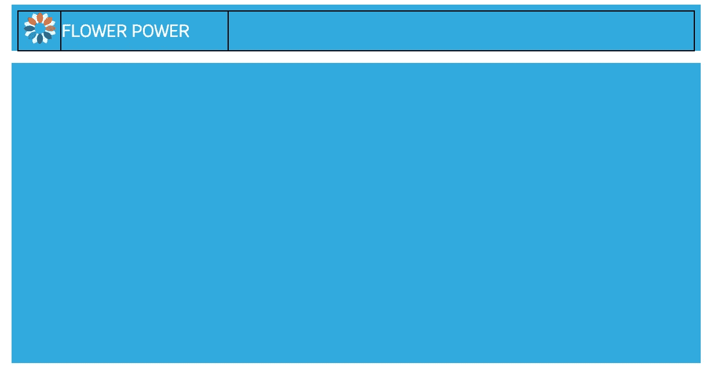**

**让我们也**添加我们的按钮**到我们布局中的第三个单元格:**

**虽然上面的可能看起来有点吓人，但它非常简单。我们首先将按钮标题存储在 Azle 的 **hold_value** 对象中。然后我们使用 Azle 的 **call_multiple** 函数在一组函数上迭代 3 次。反勾号内的函数(在 JavaScript 中称为“模板字符串”)是我们添加按钮、样式化按钮和添加滚动事件的地方。**

****

**让我们将第三个单元格的内容向右对齐:**

**最后，每当我们完成向布局添加内容时，我们应该**将布局的边框设置为 0** 以移除边框。返回之前在“banner_layout”目标类上使用的 style_layout 函数，并删除边框:**

**我们的顶部横幅现在看起来像这样:**

****

**对于剩余的部分，我不会遍历所有代码，而是简单地指出重要的 Azle 函数，因为它们与调用我们的机器学习服务有关。完整的源代码可以看 [GitHub 项目](https://github.com/sean-mcclure/flower_power)。你可以*复制并粘贴*必要的代码到你的 index.html 文件中，或者简单的*克隆*整个项目并继续这样做。**

**为了构建 section 2，我们添加并样式化一个布局，添加文本、按钮、图像和可视化。第 2 部分如下所示:**

**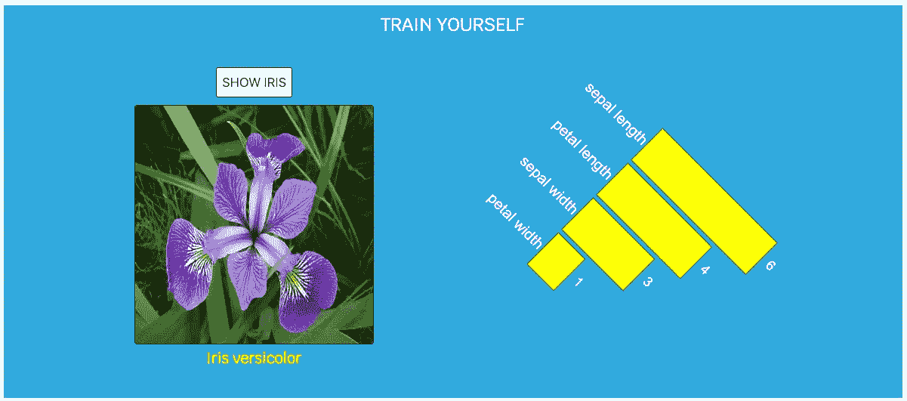**

> **注意:我们的应用程序部分不需要精确地跟随模型(这就是为什么它们被称为低保真度模型)。快速原型制作的美妙之处在于，我们可以快速调整设计以适应不断变化的需求。**

**如果你刷新你的 index.html 页面，你将看不到任何花或可视化。为此，我们需要**调用我们之前创建的第一个端点**，因为该端点返回了 Iris URL 及其数据。我们还需要**添加一个新的脚本**到脚本文件夹，和一个 **D3 视觉**到 d3 _ 视觉文件夹。**

**如果您从 GitHub 克隆了 flower_power 项目，那么您已经拥有了所有必需的文件夹和文件。如果没有，查看 GitHub 上的项目文件，并将必要的文件夹和文件添加到您的 JupyterLab 项目中。您的完整目录结构应该如下所示:**

```
**flower_power** ├── **scripts** └── wrapped_functions.js
├── **d3_visuals** └── barchart.html
├── flower_power.ipynb
├── index.html
```

**现在我们只需要启动并运行我们的 REST 服务。在第二个终端选项卡中，运行我们之前看到的用于启动内核网关的命令:**

```
jupyter kernelgateway --KernelGatewayApp.api='kernel_gateway.notebook_http' --KernelGatewayApp.ip=0.0.0.0 --KernelGatewayApp.port=9090 --KernelGatewayApp.seed_uri=flower_power.ipynb --KernelGatewayApp.allow_origin='*'
```

**现在点击 index.html 页面上的**刷新**。第一部分应该返回一个随机虹膜图像及其数据可视化成一个有角度的条形图。**

**至此，JupyterLab 中的**原型环境**已经完成并正在运行。你有:**

*   ****终端 1** :运行网络服务器托管 index.html**
*   ****终端 2** :运行 Jupyter 内核网关，将笔记本电池暴露为 REST 端点**
*   ****flower_power.ipynb** :一个 Jupyter 笔记本，里面装着你的 Python 或者 R 代码**
*   ****index.html**:用 Azle 构建的 web 应用**

> **你可以使用同样的设置将你的机器学习变成真正的软件原型。由于大多数数据科学家和其他机器学习实践者使用 Jupyter 环境，这种设置使您能够快速将全功能前端附加到您的 Python 和/或 R 代码。**

**第 2 部分中的一个重要功能是当用户单击 SHOW IRIS 按钮时调用 REST 端点的能力。我们已经知道如何添加事件，因为我们之前在回顾 Azle 函数时已经看过了。我们添加按钮，然后附加一个点击事件:**

**此时，我们需要添加当用户单击按钮时调用的函数(上面只显示了一个空字符串)。之前我们看了 Azle 的 **call_api** ()函数。我们用它来调用我们创建的任何端点。您可以在 wrapped_functions.js 的 scripts 文件夹中找到这个函数。**

**在 Azle 中，每当我们想要将许多函数组合成一个单独的命名函数时，我们就使用**包装函数**。例如，如果我们想创建一个名为“fetch_random_iris”的包装函数，它应该是这样的:**

**通过这种方式，我们可以将多个函数组合在上面的花括号中，并通过调用`fetch_random_iris()`来调用它们。**

**首先，让我们看看当用户点击我们的 SHOW IRIS 按钮时我们想要调用的函数组，然后我们将这些函数添加到我们的包装函数中。**

**下面这组函数做 3 件事:**

*   **调用我们当前由 Jupyter 内核网关公开的第一个端点；**
*   **当数据返回时，调用“call_function ”;**
*   **用户点击后旋转按钮。**

**让我们**将这些**添加到我们的包装函数 **fetch_random_iris** 中:**

**注意，我们在 fetch_random_iris 包装函数中添加了一个“call_function”参数。您可以将任意数量和类型的参数传递到包装的函数中。这里，我们传递一个“回调”，这是一个一旦 API 返回数据就会被调用的函数。**

**在 Azle 中，我们这样调用包装函数:**

```
az.call_wrapped_function.fetch_random_iris()
```

**因此，我们可以将它添加到上面的 click 事件中，这样当用户单击 SHOW IRIS 按钮时，它将运行 fetch_random_iris()。**

**注意，我们仍然需要在上面的 fetch_random_iris 调用中添加回调函数作为参数。我们还有一个 D3 可视化的条形图，一旦数据返回，就会绘制出来。这由回调函数处理，回调函数是另一个包装函数。如前所述，我不会遍历本文中的所有代码。我鼓励你浏览一下 [GitHub 项目](https://github.com/sean-mcclure/flower_power)，看看完整的代码。**

**上面我也提到了 Azle 和 D3。看看我的文章关于如何使用 Azle 给你的应用程序添加 D3 视觉效果。**

**应用程序的其余部分遵循相同的方法。我们检查低保真度模型，添加布局和 UI 元素，根据需要绑定事件，将函数分组为包装函数，并使用 call_api 函数发送和接收来自我们的机器学习服务的数据。**

**下面是**第三节**:**

**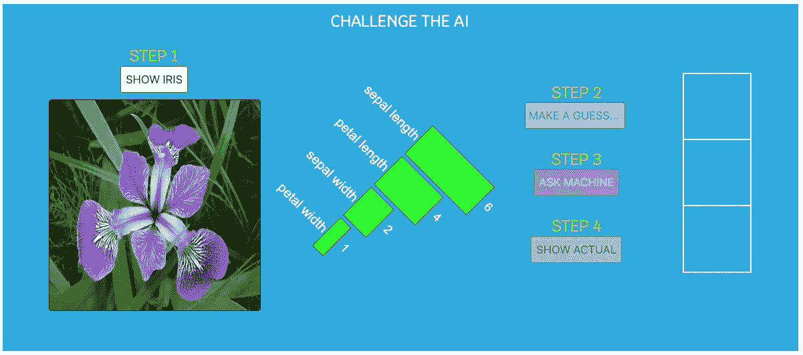**

**和**第 4 节**:**

**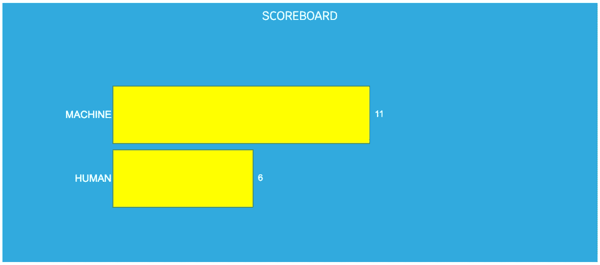**

**正如我们在开始时看到的，这里是**最终结果**:**

**有了真正的应用在手，就该出货了！**

# **学习对你的机器学习应用进行分类**

****

**当我们“发布”一个应用程序时，我们将所有东西打包并放在服务器上。这允许其他人访问该应用程序，而不是让它只驻留在我们的本地机器上。将一个应用程序安装到远程服务器上有其自身的技术挑战。仅仅因为我们的应用程序在我们的笔记本电脑上运行良好并不意味着它在其他地方也能运行良好。人们使用不同的运行时环境、不同版本的库、不同版本的编程语言等。**

**为了让这变得更容易，Docker 把一种叫做集装箱化的技术变成了一种易于使用的产品。Docker 允许我们获取本地环境的快照，并将其精确配置传送到任何服务器上。这意味着我们可以使用 Docker 来封装我们的 Flower Power 应用程序所依赖的不同东西:**

*   **Python 3**
*   **像熊猫和 Numpy 这样的图书馆**
*   **张量流**
*   **Jupyter 内核网关**

**决定使用本文前面描述的 SwaggerUI 的读者已经接触过 Docker。如果您还没有， [**下载****安装** Docker](https://docs.docker.com/install/) 然后再进行下一步。**

**安装 Docker 后，我们准备好**编写** **一个 Docker 文件**。Docker 文件是一个告诉 Docker 如何构建“映像”的文件图像指定如何构建容器。图像的实例是一个容器。Docker 中的一个关键概念是所谓的*基础图像*。基础映像允许我们使用已经打包好的语言和库来启动我们的容器。换句话说，如果它们包含在我们的基本映像中，我们不需要在 docerkfile 中明确列出所有的依赖项。我们将使用 jupyter/datascience-notebook 作为我们的基础映像，因为许多机器学习库都包含在这个映像中。**

**让我们写下我们的 **Dockerfile** :**

**你可以参考 Docker 的教程来了解为什么 Docker 文件看起来是这样的。这里我们将只指出几个要点:**

*   **从允许我们带来我们的基本形象；**
*   **RUN 允许我们安装额外的依赖项；**
*   **CMD 是我们可以运行终端命令的地方。在这里，我们只是运行我们之前运行的用于启动内核网关的相同命令。**

**有了 Dockerfile 在手，我们现在可以**建立我们的形象**:**

```
docker build -t flower_power .
```

**我们只是运行 docker build 命令，并将我们的图像命名为 flower power。**

**我们确保通过运行以下命令构建了我们的映像:**

```
docker images
```

**这应该会在终端中显示:**

**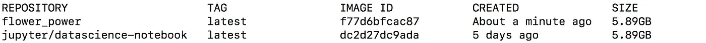**

**然后我们**运行集装箱**:**

```
docker run -p 9090:8888 flower_power
```

**在这里，我们将端口 9090 暴露给外部世界。虽然终端会发出一条消息说“Jupyter Kernel Gateway at[http://0 . 0 . 0 . 0:8888](http://0.0.0.0:8888)”，但这是来自容器内部的。我们的访问实际上是通过端口 9090。**

**我们可以通过在终端中键入以下命令来确保我们的映像正在运行:**

```
docker ps
```

**我们现在有了一个运行的容器。部署可以非常简单，只需将 Dockerfile 转移到另一个服务器上，并在那里运行构建和运行命令。Docker 将提取所有必要的依赖项，并通过我们指定的端点公开我们的机器学习。我们的前端应用程序可以在我们部署机器学习的同一台服务器上，也可以在更高的另一台服务器上。这就是*创建一个机器学习服务*的意义，该服务可以部署到服务器上，并由其他应用程序使用。想想这些可能性。**

**设置远程服务器非常简单。您可以使用像 [DigitalOcean](https://www.digitalocean.com/products/droplets/?_campaign=G%7CSEARCH%7CB%7CCORE&_adgroup=CORE%7CDigitalOcean&_keyword=digital%20ocean&_device=c&_copytype=20_optimized&_adposition=1t1&_medium=brand_sem&_source=google&_dkitrig=&gclid=EAIaIQobChMIvNjJ2fnV2gIVAspkCh16eQTOEAAYASAAEgKX9_D_BwE) 这样的服务来创建一个 droplet，然后使用传输协议(例如 scp 或 sftp)将您的 docker 文件传输到该 droplet。**

**需要注意的一点是，我们需要更改 Azle 的 *call_api()* 函数使用的 URL，因为它将在一个新的 IP 地址上调用我们部署的机器学习服务，而不是本地主机。**

**当然，部署可以比这复杂得多，但基本思想是相同的。无论是持续集成和部署、集成测试、微服务，还是任何其他相关概念，都可以归结为将打包的代码推送到服务器上并消费端点。**

**就是这样！在本文中，我们设置了一个具有机器学习管道的 Jupyter 笔记本，使用 Jupyter 的内核网关公开了端点，使用 SwaggerUI 查看了这些端点，使用 Azle 创建了一个前端应用程序来使用我们的端点，并将我们的机器学习打包到一个可以部署到服务器的容器中。这是对数据科学在现实项目中如何发生的更现实的审视。**

**因此，去构建和部署你的机器学习服务，并创建有趣的应用程序来使用它们。这些技能造就了全面发展的数据科学家，他们知道如何将自己的工作带入生活。**

****附言****

**如果你在这些步骤中有任何问题，请在评论区提问。**

# **奖金票据**

## **使用 Azle 实现原生 Python/R 可视化**

**数据科学家经常依赖 Python 的 **Matplotlib** 或 R 的 **ggplot2** 产生的视觉效果。当这些视觉效果被暴露为数据 URIs 时，Azle 可以使用它们。数据 URIs 是图像嵌入 web 应用程序的方式，而不是指向源 URL。例如，下面是我们通常如何用 matplotlib 生成一个图:**

```
import numpy as np
import matplotlib.pyplot as pltt = np.arange(0., 5., 0.2)plt.plot(t, t, 'r--', t, t**2, 'bs', t, t**3, 'g^')
plt.savefig('lines.png')
```

**产生了这个:**

**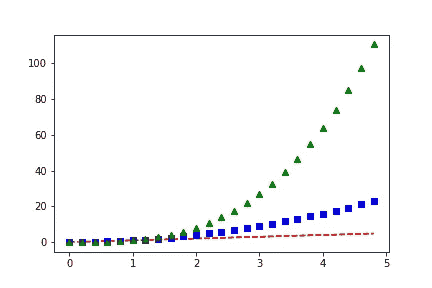**

**为了让 Azle 使用这个图，我们只需**将我们的 matplotlib 图转换成数据 URI** ，并使用内核网关公开序列化的输出。**

**下面是一个例子，我们使用 Azle 的 call_api 函数获取我们的编码图，然后使用 add_image 函数绘制该图:**

**为了在 Docker 容器中工作，我们需要通过挂载一个卷来创建一个数据文件夹。为此，我们可以在主文件夹中创建数据目录，并将这一行添加到 Docker run 命令中:**

```
sudo docker run -p 9191:9191 -it -v /path_to_dockerfile/data:/data testing
```

**同样的方法也可以用在 **R 中。**下面是我们如何使用 knitr 库在 R 中对图形进行编码:**

```
library(knitr)file_name = 'lines.png'
uri=image_uri(file_name)
cat(uri)
```

## **构建更完整的应用程序**

**我们只展示了笔记本使用 GET 响应来自 Azle 的请求的基本方式。根据应用程序的复杂程度，Jupyter 的内核网关支持所有的 CRUD 操作。查看[这里](https://github.com/jupyter/kernel_gateway/blob/master/etc/api_examples/api_intro.ipynb)关于如何更全面地定义你的 web api 的更多细节。**

## **C 构建 URL**

**有两种方法[可以构造一个 URL 来调用 REST API:](https://stackoverflow.com/questions/4024271/rest-api-best-practices-where-to-put-parameters)**

1.  ****作为 URL 路径的一部分**(即`/api/resource/parametervalue`)**
2.  ****作为查询参数**(即`/api/resource?parameter=value`)**

**与基于 SOAP 的 web 服务不同，RESTful web APIs 没有“官方”标准。[14]这是因为 REST 是一种 ***的架构风格*** *，而不像 SOAP 是一种* ***的协议*** *。***

## **A 使冲突端口无效**

*   **如果你同时运行 Jupyter 笔记本和内核网关，你可以*指定你的笔记本端口*以避免冲突(或者只是设置你的内核网关端口为 Jupyter 默认的 8888 以外的端口)。例如，您可以使用以下命令将任何笔记本设置为端口 8889:**

```
jupyter notebook --port=8889
```

## **M 取端点在 R**

**如果在 Jupyter 中使用 R 内核而不是 Python，可以如下处理请求:**

```
# GET /my_pathreq <- fromJSON(REQUEST)
args <- req$argsparameter_name = args$parameter_name# do something with parameter_nameprint(toJSON(parameter_name))
```

**确保将 jsonlite 库添加到笔记本的顶部。**

```
library(jsonlite)
```

## **快乐大厦！**

****如果你喜欢这篇文章，你可能也会喜欢:****

**[](/combining-d3-with-kedion-graduating-from-toy-visuals-to-real-applications-92bf7c3cc713) [## 用 D3.js 从玩具视觉过渡到真实应用

### 我们经常孤立地学习技术和方法，与数据科学的真正目标脱节；至…

towardsdatascience.com](/combining-d3-with-kedion-graduating-from-toy-visuals-to-real-applications-92bf7c3cc713) [](/gui-fying-the-machine-learning-workflow-towards-rapid-discovery-of-viable-pipelines-cab2552c909f) [## 机器学习工作流的 GUI 化:快速发现可行的流水线

### 前言

towardsdatascience.com](/gui-fying-the-machine-learning-workflow-towards-rapid-discovery-of-viable-pipelines-cab2552c909f) [](/step-by-step-guide-to-creating-r-and-python-libraries-e81bbea87911) [## 创建 R 和 Python 库的分步指南(在 JupyterLab 中)

### r 和 Python 是当今机器学习语言的支柱。r 提供了强大的统计数据和快速…

towardsdatascience.com](/step-by-step-guide-to-creating-r-and-python-libraries-e81bbea87911)**