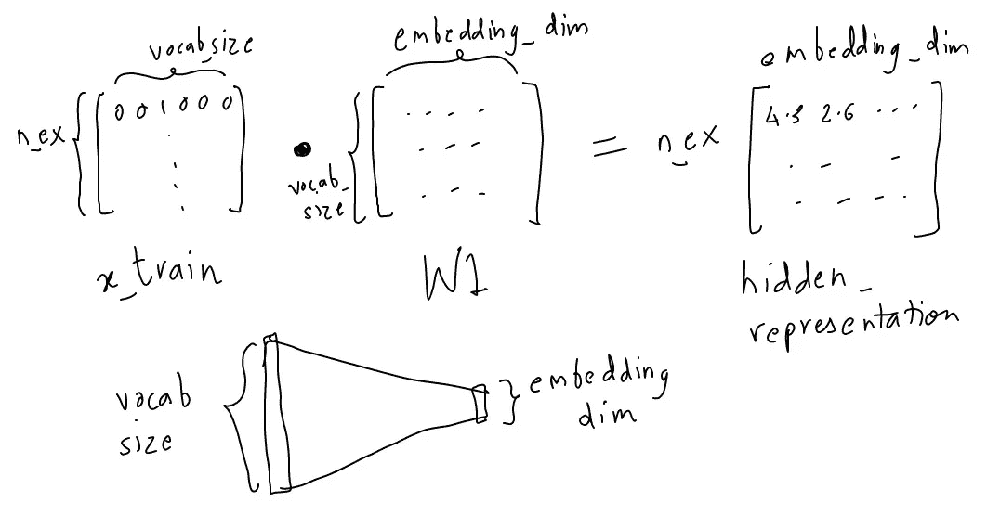
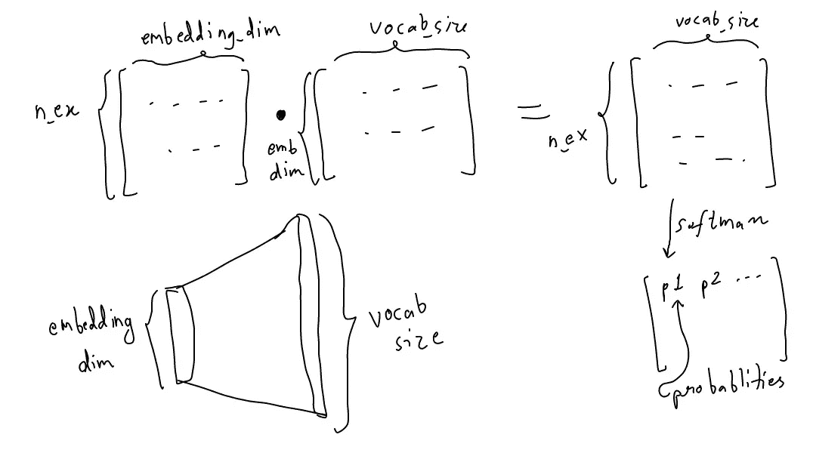
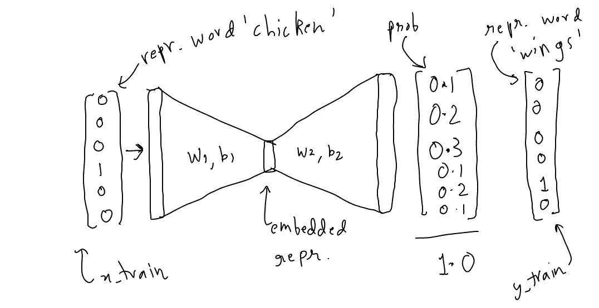
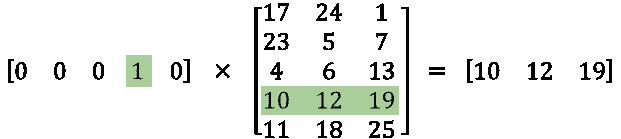
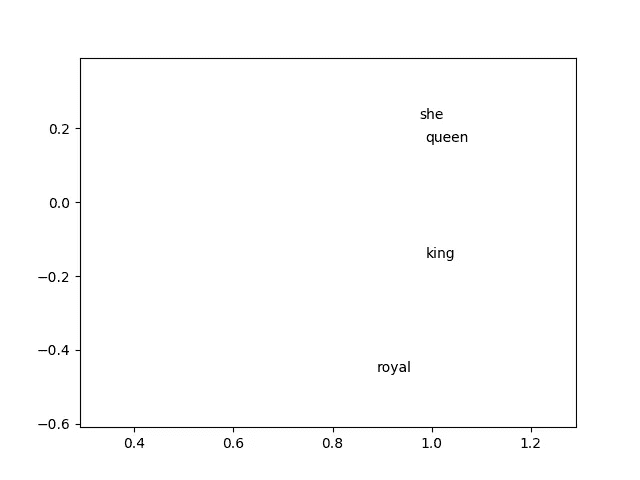

# 通过在 tensorflow 中实现来学习 Word2Vec

> 原文：<https://towardsdatascience.com/learn-word2vec-by-implementing-it-in-tensorflow-45641adaf2ac?source=collection_archive---------0----------------------->


嗨！

我觉得理解一个算法最好的方法就是实现它。因此，在这篇文章中，我将通过在张量流*中实现来教你单词嵌入。*

*这篇文章背后的想法是避免所有的介绍和通常与 word embeddeds/word 2 vec 相关的闲聊，直接进入事情的实质。因此，许多国王-男人-女人-王后的例子将被跳过。*

# 我们如何进行这些嵌入？

有许多获得单词嵌入的技术，我们将讨论一种已经很出名的技术，唯一的一种，word2vec。与普遍的看法相反，word2vec 不是一个*深*的网络，它只有 3 层！

注意:word2vec 有很多技术细节，为了更容易理解，我将跳过这些细节。

# word2vec 的工作原理:

word2vec 背后的想法是:

1.  以一个 3 层神经网络为例。(1 个输入层+ 1 个隐藏层+ 1 个输出层)
2.  给它一个单词，训练它预测它的相邻单词。
3.  移除最后一层(输出层)，保留输入层和隐藏层。
4.  现在，从词汇表中输入一个单词。隐藏层给出的输出是输入单词的*‘单词嵌入’*。

就是这样！仅仅做这个简单的任务就能让我们的网络学习有趣的单词表达。

让我们开始实现它来充实这种理解。

(完整代码可在[这里](https://gist.github.com/aneesh-joshi/c8a451502958fa367d84bf038081ee4b)获得。我建议您理解这篇文章中的内容，然后使用其中的代码。)

这是我们将要处理的原始文本:

(*为了简化，我故意把句号隔开，并在最后避开了它们。一旦你理解了，就可以随意使用记号赋予器*

```
import numpy as np
import tensorflow as tfcorpus_raw = 'He is the king . The king is royal . She is the royal  queen '# convert to lower case
corpus_raw = corpus_raw.lower()
```

我们需要将它转换成一个输入输出对，这样如果我们输入一个单词，它应该预测相邻的单词:它前后的 n 个单词，其中 n 是参数，这里有一个例子，来自 Chris McCormick 在 word2vec 上发表的一篇令人惊叹的文章。


A training sample generation with a window size of 2.

*注意:如果单词在句子的开头或结尾，窗口将忽略外面的单词。*

在此之前，我们将创建一个字典，将单词翻译成整数，将整数翻译成单词。这个以后会派上用场的。

```
words = []for word in corpus_raw.split():
    if word != '.': # because we don't want to treat . as a word
        words.append(word)words = set(words) # so that all duplicate words are removedword2int = {}
int2word = {}vocab_size = len(words) # gives the total number of unique wordsfor i,word in enumerate(words):
    word2int[word] = i
    int2word[i] = word
```

这些字典允许我们做的是:

```
print(word2int['queen'])
-> 42 (say)print(int2word[42])
-> 'queen'
```

现在，我们想要一个句子列表作为单词列表:

```
# raw sentences is a list of sentences.
raw_sentences = corpus_raw.split('.')sentences = []for sentence in raw_sentences:
    sentences.append(sentence.split())
```

这会给我们一个句子列表，每个句子都是一个单词列表。

```
print(sentences)
-> [['he', 'is', 'the', 'king'], ['the', 'king', 'is', 'royal'], ['she', 'is', 'the', 'royal', 'queen']]
```

现在，我们将生成我们的训练数据:

*(这可能会变得难以阅读。参考代码链接)*

```
data = []WINDOW_SIZE = 2for sentence in sentences:
    for word_index, word in enumerate(sentence):
        for nb_word in sentence[max(word_index - WINDOW_SIZE, 0) : min(word_index + WINDOW_SIZE, len(sentence)) + 1] : 
            if nb_word != word:
                data.append([word, nb_word])
```

这基本上给出了一个单词列表，单词对。*(我们考虑窗口大小为 2)*

```
print(data)[['he', 'is'],
 ['he', 'the'], ['is', 'he'],
 ['is', 'the'],
 ['is', 'king'], ['the', 'he'],
 ['the', 'is'],
 ['the', 'king'],.
.
.
]
```

我们有训练数据。但是它需要用计算机能理解的方式来表达，比如用数字。这就是我们的格言派上用场的地方。

让我们更进一步，把这些数字转换成一个热矢量。

```
i.e., 
say we have a vocabulary of 3 words : pen, pineapple, apple
where 
word2int['pen'] -> 0 -> [1 0 0]
word2int['pineapple'] -> 1 -> [0 1 0]
word2int['apple'] -> 2 -> [0 0 1]
```

**为什么是一个热点载体？:稍后告知**

```
# function to convert numbers to one hot vectors
def to_one_hot(data_point_index, vocab_size):
    temp = np.zeros(vocab_size)
    temp[data_point_index] = 1
    return tempx_train = [] # input word
y_train = [] # output wordfor data_word in data:
    x_train.append(to_one_hot(word2int[ data_word[0] ], vocab_size))
    y_train.append(to_one_hot(word2int[ data_word[1] ], vocab_size))# convert them to numpy arrays
x_train = np.asarray(x_train)
y_train = np.asarray(y_train)
```

所以现在我们有 x_train 和 y_train:

```
print(x_train)
->
[[ 0\.  0\.  0\.  0\.  0\.  0\.  1.]
 [ 0\.  0\.  0\.  0\.  0\.  0\.  1.]
 [ 0\.  0\.  0\.  0\.  0\.  1\.  0.]
 [ 0\.  0\.  0\.  0\.  0\.  1\.  0.]
 [ 0\.  0\.  0\.  0\.  0\.  1\.  0.]
 [ 0\.  0\.  0\.  0\.  1\.  0\.  0.]
 [ 0\.  0\.  0\.  0\.  1\.  0\.  0.]
 [ 0\.  0\.  0\.  0\.  1\.  0\.  0.]
 [ 0\.  0\.  0\.  1\.  0\.  0\.  0.]
 [ 0\.  0\.  0\.  1\.  0\.  0\.  0.]
 [ 0\.  0\.  0\.  0\.  1\.  0\.  0.]
 [ 0\.  0\.  0\.  0\.  1\.  0\.  0.]
 [ 0\.  0\.  0\.  1\.  0\.  0\.  0.]
 [ 0\.  0\.  0\.  1\.  0\.  0\.  0.]
 [ 0\.  0\.  0\.  1\.  0\.  0\.  0.]
 [ 0\.  0\.  0\.  0\.  0\.  1\.  0.]
 [ 0\.  0\.  0\.  0\.  0\.  1\.  0.]
 [ 0\.  0\.  0\.  0\.  0\.  1\.  0.]
 [ 0\.  1\.  0\.  0\.  0\.  0\.  0.]
 [ 0\.  1\.  0\.  0\.  0\.  0\.  0.]
 [ 0\.  0\.  1\.  0\.  0\.  0\.  0.]
 [ 0\.  0\.  1\.  0\.  0\.  0\.  0.]
 [ 0\.  0\.  0\.  0\.  0\.  1\.  0.]
 [ 0\.  0\.  0\.  0\.  0\.  1\.  0.]
 [ 0\.  0\.  0\.  0\.  0\.  1\.  0.]
 [ 0\.  0\.  0\.  0\.  1\.  0\.  0.]
 [ 0\.  0\.  0\.  0\.  1\.  0\.  0.]
 [ 0\.  0\.  0\.  0\.  1\.  0\.  0.]
 [ 0\.  0\.  0\.  0\.  1\.  0\.  0.]
 [ 0\.  1\.  0\.  0\.  0\.  0\.  0.]
 [ 0\.  1\.  0\.  0\.  0\.  0\.  0.]
 [ 0\.  1\.  0\.  0\.  0\.  0\.  0.]
 [ 1\.  0\.  0\.  0\.  0\.  0\.  0.]
 [ 1\.  0\.  0\.  0\.  0\.  0\.  0.]]
```

两者都有形状:

```
print(x_train.shape, y_train.shape)
->
(34, 7) (34, 7)# meaning 34 training points, where each point has 7 dimensions
```

# 制作张量流模型

```
# making placeholders for x_train and y_trainx = tf.placeholder(tf.float32, shape=(None, vocab_size))
y_label = tf.placeholder(tf.float32, shape=(None, vocab_size))
```



从上图中可以看出，我们将训练数据转换成嵌入式表示。

```
EMBEDDING_DIM = 5 # you can choose your own numberW1 = tf.Variable(tf.random_normal([vocab_size, EMBEDDING_DIM]))b1 = tf.Variable(tf.random_normal([EMBEDDING_DIM])) #biashidden_representation = tf.add(tf.matmul(x,W1), b1)
```

接下来，我们利用嵌入维度中的信息，对邻居进行预测。为了进行预测，我们使用 softmax。



```
W2 = tf.Variable(tf.random_normal([EMBEDDING_DIM, vocab_size]))b2 = tf.Variable(tf.random_normal([vocab_size]))prediction = tf.nn.softmax(tf.add( tf.matmul(hidden_representation, W2), b2))
```

总结一下:



```
input_one_hot  --->  embedded repr. ---> predicted_neighbour_probpredicted_prob will be compared against a one hot vector to correct it.
```

现在，剩下的就是训练它:

```
sess = tf.Session()init = tf.global_variables_initializer()sess.run(init) #make sure you do this!# define the loss function:
cross_entropy_loss = tf.reduce_mean(-tf.reduce_sum(y_label * tf.log(prediction), reduction_indices=[1]))# define the training step:
train_step = tf.train.GradientDescentOptimizer(0.1).minimize(cross_entropy_loss)n_iters = 10000# train for n_iter iterationsfor _ in range(n_iters):
    sess.run(train_step, feed_dict={x: x_train, y_label: y_train}) print('loss is : ', sess.run(cross_entropy_loss, feed_dict={x: x_train, y_label: y_train}))
```

在训练中，你会得到损失的显示:

```
loss is :  2.73213
loss is :  2.30519
loss is :  2.11106
loss is :  1.9916
loss is :  1.90923
loss is :  1.84837
loss is :  1.80133
loss is :  1.76381
loss is :  1.73312
loss is :  1.70745
loss is :  1.68556
loss is :  1.66654
loss is :  1.64975
loss is :  1.63472
loss is :  1.62112
loss is :  1.6087
loss is :  1.59725
loss is :  1.58664
loss is :  1.57676
loss is :  1.56751
loss is :  1.55882
loss is :  1.55064
loss is :  1.54291
loss is :  1.53559
loss is :  1.52865
loss is :  1.52206
loss is :  1.51578
loss is :  1.50979
loss is :  1.50408
loss is :  1.49861
.
.
.
```

它最终在持续亏损的基础上稳定下来。即使不能得到高精度，我们也不在乎。我们感兴趣的只是 W1 和 b1，也就是隐藏的表示。

让我们来看看它们:

```
print(sess.run(W1))
print('----------')
print(sess.run(b1))
print('----------')->[[-0.85421133  1.70487809  0.481848   -0.40843448 -0.02236851]
 [-0.47163373  0.34260952 -2.06743765 -1.43854153 -0.14699034]
 [-1.06858993 -1.10739779  0.52600187  0.24079895 -0.46390489]
 [ 0.84426647  0.16476244 -0.72731972 -0.31994426 -0.33553854]
 [ 0.21508843 -1.21030915 -0.13006891 -0.24056002 -0.30445012]
 [ 0.17842589  2.08979321 -0.34172744 -1.8842833  -1.14538431]
 [ 1.61166084 -1.17404735 -0.26805425  0.74437028 -0.81183684]]
----------[ 0.57727528 -0.83760375  0.19156453 -0.42394346  1.45631313]----------
```

# 为什么是一个热点载体？



again from Chris McCormick’s article (do read it)

当我们将 one hot vectors 乘以`W1`时，我们基本上可以访问`W1`的行，它实际上是由输入 one hot vector 表示的单词的嵌入式表示。所以`W1`本质上是作为一个查找表。

在我们的例子中，我们还包括了一个偏见术语`b1`，所以你必须添加它。

```
vectors = sess.run(W1 + b1) # if you work it out, you will see that it has the same effect as running the node hidden representationprint(vectors)
->
[[-0.74829113 -0.48964909  0.54267412  2.34831429 -2.03110814]
 [-0.92472583 -1.50792813 -1.61014366 -0.88273793 -2.12359881]
 [-0.69424796 -1.67628145  3.07313657 -1.14802659 -1.2207377 ]
 [-1.7077738  -0.60641652  2.25586247  1.34536338 -0.83848488]
 [-0.10080346 -0.90931684  2.8825531  -0.58769202 -1.19922316]
 [ 1.49428082 -2.55578995  2.01545811  0.31536022  1.52662396]
 [-1.02735448  0.72176981 -0.03772151 -0.60208392  1.53156447]]
```

如果我们想要“女王”的代表，我们要做的就是:

```
print(vectors[ word2int['queen'] ])# say here word2int['queen'] is 2-> 
[-0.69424796 -1.67628145  3.07313657 -1.14802659 -1.2207377 ]
```

# 那么我们能用这些美丽的载体做什么呢？

这里有一个快速函数，可以找到与给定向量最近的向量。请注意，这是一个肮脏的实现。

```
def euclidean_dist(vec1, vec2):
    return np.sqrt(np.sum((vec1-vec2)**2)) def find_closest(word_index, vectors):
    min_dist = 10000 # to act like positive infinity
    min_index = -1 query_vector = vectors[word_index] for index, vector in enumerate(vectors): if euclidean_dist(vector, query_vector) < min_dist and not np.array_equal(vector, query_vector): min_dist = euclidean_dist(vector, query_vector)
            min_index = index return min_index
```

我们现在将使用“king”、“queen”和“royal”查询这些向量

```
print(int2word[find_closest(word2int['king'], vectors)])
print(int2word[find_closest(word2int['queen'], vectors)])
print(int2word[find_closest(word2int['royal'], vectors)])->queen
king
he
```

有趣的是，我们的嵌入了解到

```
king is closest to queen
queen is closest to king
royal is closest to he
```

第三个是由于我们的语料库(还是蛮不错的)。更大的语料库将导致更好的结果。(*注意:由于权重的随机初始化，您可能会得到不同的结果。如果需要，运行几次*

让我们画出它们的向量！

首先，让我们用我们最喜欢的降维技术将维数从 5 减少到 2:tSNE(tee SNE！)

```
from sklearn.manifold import TSNEmodel = TSNE(n_components=2, random_state=0)
np.set_printoptions(suppress=True)
vectors = model.fit_transform(vectors)
```

然后，我们需要对结果进行规范化，以便在 matplotlib 中更方便地查看它们

```
from sklearn import preprocessingnormalizer = preprocessing.Normalizer()
vectors =  normalizer.fit_transform(vectors, 'l2')
```

最后，我们将绘制 2D 归一化向量

```
import matplotlib.pyplot as pltfig, ax = plt.subplots()for word in words:
    print(word, vectors[word2int[word]][1])
    ax.annotate(word, (vectors[word2int[word]][0],vectors[word2int[word]][1] ))plt.show()
```



哇！`she`离`queen`近而`king`离`royal`和`queen`等距离我们需要一个更大的语料库来看一些更复杂的关系。

*注意:在发表这篇文章后，我意识到这个例子是不正确的，因为要得到有意义的向量收敛，我们需要一个非常大的语料库。数据量小，容易受到突然的“冲击”。然而，出于教学目的，我将保持这种写作的完整性。为了有效地实现 word2vec，请尝试使用一些类似于*[*text 8*](https://gist.github.com/robotcator/1fb0cdc1437515f5662d33368554f4c8)*的语料库* [*gensim*](https://radimrehurek.com/gensim/models/word2vec.html) *。*

# 为什么会这样？

我们给了神经网络预测邻居的任务。但是我们还没有具体说明网络应该如何预测它。因此，神经网络计算出单词的隐藏表示形式，以帮助它完成预测相邻单词的任务。预测相邻单词本身并不是一项有趣的任务。我们关心这个隐藏的表示。

为了形成这些表示，网络使用上下文/邻居。在我们的语料库中，`king`和`royal`作为邻居出现，`royal`和`queen`作为邻居出现。

# 为什么预测邻居是一项任务？

嗯，其他任务也设法形成一个好的表示。预测这个单词是否是一个有效的 n-gram，如这里的[所示](http://colah.github.io/posts/2014-07-NLP-RNNs-Representations/)也可以得到好的向量！

我们试图预测给定单词的相邻单词。这就是所谓的跳过克模型。我们可以使用中间词的相邻词作为输入，并要求网络预测中间词。这就是所谓的连续词汇袋模型。

# 延伸阅读:

这绝不是对 word2vec 的完整理解。w2v 的部分魅力在于它对我刚刚谈到的内容做了两处修改。这些是:

*   负采样
*   分级 Softmax

**负采样:**它表明，不是反向传播正确输出向量中的所有 0(对于 10 密耳的 vocab 大小，有 10 密耳减去 1 个零)，而是我们只反向传播它们中的一些(比如 14 个)

**分级 Softmax:** 计算 10mill 的 vocab 的 Softmax 非常耗时且计算量大。分级 Softmax 提出了一种使用霍夫曼树的更快的计算方法

为了保持这篇文章的简洁，我避免了过多的探究。我绝对推荐多读点进去。

# 结束语:

*   单词向量超级酷
*   不要把这个 tensorflow 代码用于实际使用。只是为了理解。使用像 [gensim](https://radimrehurek.com/gensim/models/word2vec.html) 这样的库

我希望这能帮助人们更好地理解这些美景。如果是的话，让我知道！

如果我犯了错误，**请**告诉我。

我很乐意通过[推特](https://twitter.com/aneesh_joshi)、 [linkedin](https://www.linkedin.com/in/aneesh-joshi-594602135/) 或/和[电子邮件](mailto:aneeshyjoshi@gmail.com)与你联系。

再见！