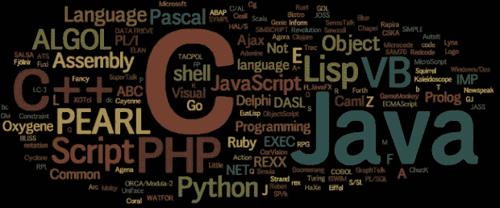

# 学习新的数据科学语言

> 原文：<https://towardsdatascience.com/learning-a-new-data-science-language-aa7656be730a?source=collection_archive---------2----------------------->



Source: Wikimedia Commons

在不断变化的数据科学工具生态系统中，您经常发现自己需要学习一门新语言，以便跟上最新的方法或更有效地与同事协作。我做 R 程序员已经有几年了，但是想要[过渡到 Python](/data-science-for-startups-r-python-2ca2cd149c5c) 以便充分利用深度学习库和工具，比如 PySpark。此外，我加入了 Zynga 的数据科学团队，在那里 Python 是首选语言。虽然只有几个星期，但是我已经开始掌握使用这种新语言进行探索性数据分析和预测性建模的诀窍了。这不是我第一次尝试快速掌握一门新的数据科学语言，但却是最成功的一次。我想分享一些我作为一名数据科学家开始使用新编程语言的指导方针。

**关注结果，而不是语义** 虽然在深入研究编程之前了解编程语言的基础很有用，但我发现在掌握这门语言之前只需要简单介绍一下。在用 Python 编码之前，我从头开始通读了[数据科学的第二章](https://www.amazon.com/Data-Science-Scratch-Principles-Python/dp/149190142X)，它提供了 Python 的速成课程。我的下一步是整理出我希望能够用 Python 完成的任务列表，包括:

*   读取和写入 CSV 文件中的数据
*   对数据帧执行基本操作，例如显示数据类型
*   绘制直方图和折线图
*   连接到数据库并将数据拉入数据帧
*   创建逻辑回归模型
*   评估模型的度量，例如准确性和提升

我不再关注语言的语义，比如理解 Python 中列表和元组的区别，而是开始着手执行日常的数据科学任务。我知道如何在 R 中完成这些任务，并且需要学习如何将这些技能翻译成一种新的语言。比如我了解到 R 中的 *summary()* 类似于熊猫 dataframes 的 *describe()* 。

我很快发现，在 Python 中执行数据科学任务通常需要利用许多不同的库。当使用 [Pandas](https://pandas.pydata.org/) 和 [SciKit-Learn](http://scikit-learn.org/stable/index.html) 库时，上述任务更容易执行。这引出了我在学习 Python 时学到的下一课。

**学习生态系统，而不是语言** 像 [Tidyverse](https://www.tidyverse.org/) 这样的工具让 R 比基础语言多得多，其他数据科学语言也有类似的库，为语言提供了有用的扩展。我没有只专注于学习基础语言，而是将学习库作为我最初学习 Python 过程的一部分。作为起点，我探索了下面的库。

1.  [**熊猫**](https://pandas.pydata.org/) :提供类似 r 的 dataframe 功能。
2.  [**框架查询**](https://pypi.org/project/framequery/) **:** 支持在数据框架上使用 SQL。
3.  [**SciKit-Learn**](http://scikit-learn.org/stable/index.html) :为 ML 模型提供标准接口。
4.  [**Pandas-gbq**](https://github.com/pydata/pandas-gbq):Python 的 BigQuery 接口。

使用这些库可以更容易地完成我已经熟悉的其他语言的任务。像 framequery 这样的库在学习一门新语言时很有用，因为在熟悉 Pandas 处理数据帧的方式之前，您可以使用 SQL 处理数据帧。我发现它很容易使用，因为它类似于我已经在 r 中使用的 sqldf 库。

使用跨语言库通过在一种新的语言中重新应用你已经知道的库来引导你的学习过程是很棒的。我在学习过程的早期探索的一个库是 Keras deep learning 库，我以前在 R 中使用过这个库。下面是用这些语言建立 Keras 模型的一个例子:

```
**# Creating a Keras model in R** model <- keras_model_sequential() %>%
  layer_dense(units = 64, activation = "relu",
              input_shape = 10) %>%
  layer_dense(units = 64, activation = "relu") %>%
  layer_dense(units = 1)**# Creating the same Keras model in Python** model = models.Sequential()
model.add(layers.Dense(64, activation='relu', 
          input_shape=10))
model.add(layers.Dense(64, activation='relu'))
model.add(layers.Dense(1))
```

能够在我已经熟悉的库的基础上构建有助于加快我的学习过程。 [Plotly](https://plot.ly/) 是另一个我以前在 R 中使用过的库，现在我正在 Python 中使用它。

**使用真实世界的数据** 样本数据集，例如 sklearn 中的[糖尿病数据集](http://scikit-learn.org/stable/modules/generated/sklearn.datasets.load_diabetes.html)，对于开始使用一门新语言或一个新的库来说是非常棒的，但是直到你需要将这些方法应用于一个新问题时，你才会真正了解你正在做的事情的细节。例如，您可能需要执行多类分类，而不是从示例数据集中重新应用二元分类。在学习一门新语言时，尽早应用来自组织的数据集是很有帮助的。

使用真实世界的数据非常有用，原因有很多，例如:

1.  **规模:**训练数据集通常很小，使用真实世界的数据往往涉及大得多的数据集，需要采样等方法。
2.  **表示:**使用来自您组织的数据意味着您需要定义如何为建模标记实例和编码特征。
3.  **管理:**您需要将数据放入内存并执行数据管理任务，比如处理缺失值。
4.  **评估:**使用来自您组织的现有数据集意味着您可以将新语言中的结果与其他实现中的先前结果进行比较，例如将 R 的 *glm* 与 *sklearn.linear_model* 进行比较。

这条指导方针与第一条相似，它有助于获得真实世界的数据并专注于产生结果。

**如果可能的话，从本地开始** 学习分布式计算语言时，比如 Spark 的 scala，让一个环境启动并运行起来通常是很困难的。我的建议是，如果没有必要，不要把分布式系统或虚拟化作为出发点。例如，使用 Spark，您可以在本地设置一个机器实例，并使用类似于 [Zeppelin](https://zeppelin.apache.org/) 的工具来提供一个交互式前端。当你学习一门新语言时，你不应该担心部署问题，比如将代码推送到服务器。在本地运行代码通常意味着有更多的调试工具可用。

对于 Python 入门，我也有同样的建议。Jupyter 笔记本使使用 Python 变得容易，但是一旦你熟悉了这种语言，它会更有用。首先，我推荐使用 IDE，比如 [PyCharm](https://www.jetbrains.com/pycharm/) 。一旦你准备好开始与队友合作，像 [JupyterLab](https://blog.jupyter.org/jupyterlab-is-ready-for-users-5a6f039b8906) 这样的工具会提供很好的环境。

**早动手** 学习一门新语言的时候，不去尝试，你不会知道自己不懂的东西。这与我的第一条指导方针有关，它有助于及早发现你在知识方面的差距。在学习 Python 时，我发现将阅读和编程结合起来会更有效，而不是将一堆阅读内容放在前面。一旦我进入代码，我就确定了我需要学习的新领域，比如发现 Pandas 是我需要使用的第一个库之一。

在学习一门新的语言或库时，有几种不同的方法可以让你亲自动手。我和 R 在读[深度学习的时候，用提供的笔记本开始做样题。此外，一些公司提供 Jupyter 笔记本电脑，新员工可以在入职过程中使用。我通常采用的方法是使用现有的数据集，同时用一种新语言重新实现一个模型。](https://www.amazon.com/Deep-Learning-R-Francois-Chollet/dp/161729554X)

**推动您的知识**
一旦您学习了该语言的一些基础知识，并了解了如何执行常见的数据科学任务，尝试该语言的一些新功能将非常有用。例如，当我第一次学习 R 时，我编写了使用函数作为参数和在数据帧上使用 apply 的基本示例。我对函数式编程比较陌生，这些例子帮助我了解了新的编程习惯。应用是一个非常有用的功能，我现在可以在熊猫上利用它了。

这一点我会留到以后的学习过程中去做，因为这对于掌握一门新的语言来说并不是必需的，但对于掌握一门语言来说却是必不可少的。如果你已经熟悉了几种编程语言，这是你可以更早开始的一步。

**寻求反馈** 拥有反馈渠道非常好，无论是您组织中的另一位数据科学家还是在线论坛。你可能会学到你还没有发现的新的库或语言特性。当你在一家小公司或从事独立项目时，这更具挑战性。在我的上一份工作中，当我在一家初创公司担任唯一的数据科学家时，我发现 [rstats](https://www.reddit.com/r/rstats/) subreddit 是一个征求反馈的有用地方。也有不同语言的编程社区，这是学习的好地方。我参加了[用户！](https://user2018.r-project.org/)2016 年的会议，这对于使用 R. Python 与科学家和实践者交流来说是一件非常棒的事情。Python 也有类似的会议，但我还没有参加过。

**结论** 学习一门新的数据科学语言需要时间，但它有助于你制定一个如何利用时间的计划。我的总体建议是深入研究，用真实数据对应用问题进行编码。你会发现自己的差距，并以此来指导你的学习过程。

本·韦伯是 Zynga 的首席数据科学家。我们正在[招聘](https://www.zynga.com/careers/positions/categories/data-analytics-user-research)！