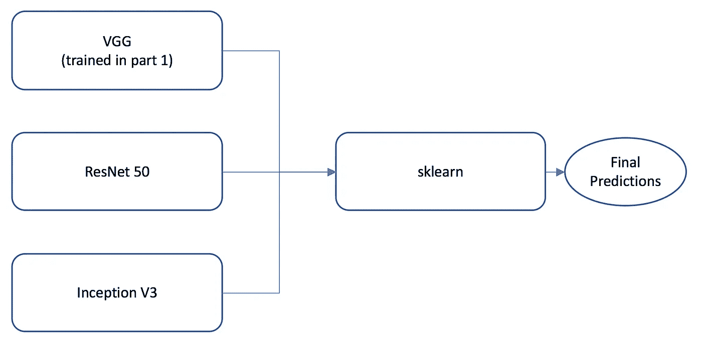
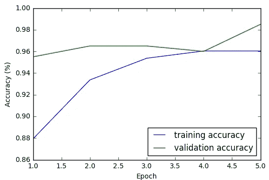
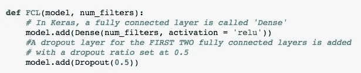
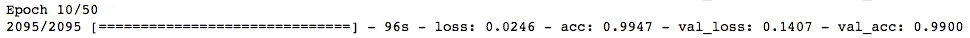
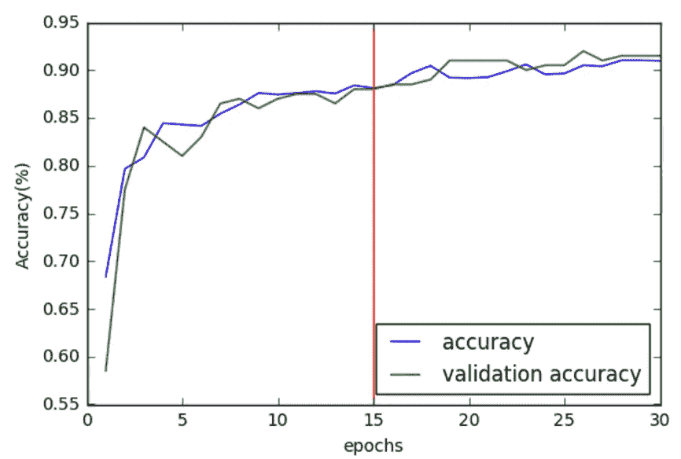
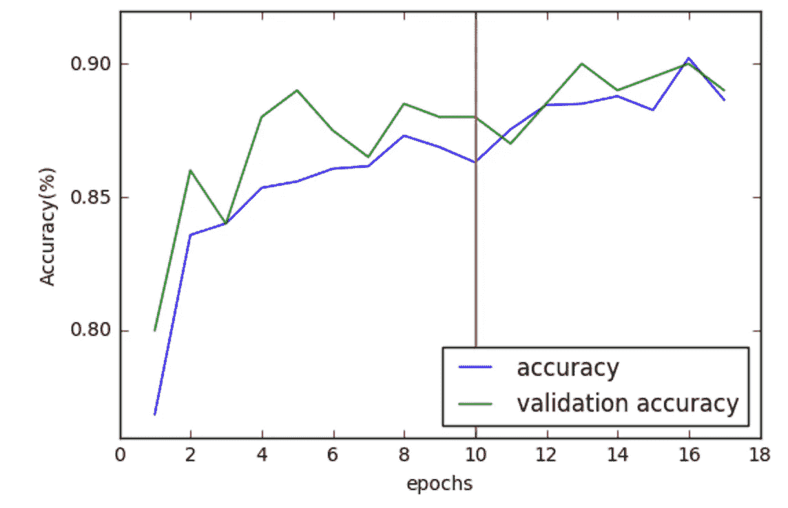
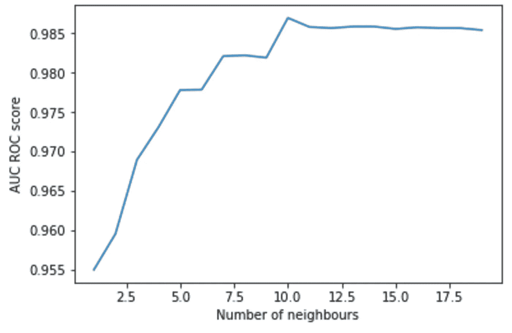

# 了解数据科学—构建图像分类器(第 2 部分)

> 原文：<https://towardsdatascience.com/learning-about-data-science-building-an-image-classifier-part-2-a7bcc6d5e825?source=collection_archive---------1----------------------->

注意:这篇文章也可以叫做“我在哪里做得很快。ai 的[第三课](http://course.fast.ai/lessons/lesson3.html)并意识到有很多东西我可以添加到我的模型中”。

第一部分，我建立了一个 VGG 模型:

 [## 了解数据科学—构建图像分类器

### 嗨！我叫 Gabi，正在学习数据科学。我计划写下我正在学习的东西，以帮助我组织…

medium.com](https://medium.com/@gabrieltseng/learning-about-data-science-building-an-image-classifier-3f8252952329) 

**我在这篇文章中创建的模型概要:**

I trained the ResNet and Inception V3 models, and used their outputs (and the output of the VGG model trained in part 1) as inputs for a classifier, which I then used to combine the three models and output my final predictions.

**内容:**

1.  我对自己创建的第一个 VGG 网络实施了丢弃和批量归一化，但这最终对网络的改进作用不大
2.  **训练 ResNet50 和 Inception V3** 我使用 Keras 的应用程序来创建和加载预训练的 ResNet 50 和 Inception V3 网络，并对它们进行微调。
3.  **优化 sklearn 算法** 把 3 个模型结合起来，我用的是 sklearn。

我注意到我的验证准确性高于我的训练准确性:

A comparison of the training and validation accuracies for the first 5 epochs when training my model. This is the final model I trained, including the data augmentation and training all the way to the first convolutional layer.

这表明拟合不足，即模型过于受限，无法正确拟合训练数据。这可能是因为在完全连接的块中添加了一个层:

From part 1: A fully connected block, adding a fully connected layer followed by a dropout layer

丢弃层通过将一半的权重随机设置为 0 来防止过度拟合(在训练时，这不会发生在验证集上)。一种矫正方法是去除脱落层。

1.  **去除漏层和批量标准化**

定义和动机:

**Dropout** 随机将某个权重比率设置为 0。这样做的后果是，它会导致欠拟合，因为我的模型正在训练的一半重量被忽略了。

**批处理规范化**类似于我在第 1 部分中添加的均值预处理层，除了批处理规范化不只是在开始时规范化数据集，而是在层之间进行。这很有用，因为在模型中，值可能会变得非常大，从而扭曲权重。批量标准化可以避免这种情况，从而防止过度拟合。

我编写了以下方法来实现丢弃和批处理规范化:

vgg_bn returns a VGG model with a defined dropout, and (optionally) with batch normalization. Lines 24–26 adjust the weights, multiplying them by 0.5/(1-dropout). Adding batch normalization doesn’t increase the number of layers in the model, so the weights can be directly copied over by enumerating over both models’ layers using zip()

我使用它能得到的最好结果是批量标准化和 0.5 的丢弃率(事实证明，删除丢弃率会导致显著的过度拟合，并显著降低验证的准确性)。

这就是说，改进是微不足道的(99%对 98.5%的验证准确率只代表多了一张正确分类的图像)，并且没有反映在 Kaggle 中，表明该模型没有显著改进。

The best result so far!

幸运的是，我还有一招！

**2。与 ResNet 组装**

如果我训练不同的模型，它们可能会拾取稍微不同的东西，因此在它们之间，可能所有的图像都被正确分类。因此，我可以训练多个模型，然后组合它们的输出；这被称为集合。

具体来说，我要训练 ResNet50，它在 2015 年赢得了 ImageNet 比赛(VGG 在 2014 年获胜)。

**2.a.i .实施 ResNet**

[ResNet-50](https://arxiv.org/abs/1512.03385) 在映像网 2015 年的比赛中胜出(VGG 在 2014 年的比赛中胜出)。我的希望是，这两个模型中的差异将允许它们相互补偿，并最终产生更强的结果。

ResNet50 是一个 **res** idual **net** 的作品，它远比卷积网络(107 层到 VGG 的 38 层)更深入。形象化 ResNet 的一个好方法是卷积块的集合(回想一下，集合是不同模型的输出组合)。

Keras 实际上已经预装了一些模型(包括重量)，作为其[应用](https://keras.io/applications/)的一部分；我想构建自己的 ResNet 模型，这样我就可以包含一个预处理层(使用 [fast.ai weights](http://files.fast.ai/models/) )，但我也将从这里开始绘制。

The definition for the Lambda layer is a little different than for the VGG model, see why [here](https://github.com/fchollet/keras/issues/6442).

**2.a.ii 培训结果网**

为了训练 ResNet，我使用了与 VGG 相同的图像数据生成器。我分两个阶段训练 ResNet，首先训练(随机初始化的)最后一层，然后也训练最后一个卷积块。

The vertical red line marks where I allow more layers to be trained.

在学习率下降的情况下，对更多的时期(另外 40 个时期)训练 ResNet，将验证准确率提高到 97%。

**2.b .盗梦空间 V3**

在尝试让 ResNet 模型工作了很长时间之后，我意识到 lambda 层对它的性能没有什么帮助。因此，我添加了 Inception V3 模型，它也是由 Keras 预加载的，并根据 ImageNet 数据进行了训练:

然后，我将这个 V3 模型与数据进行拟合:

A plot of accuracy against epochs when training the Inception V3 model. The red line marks where I allowed more layers to be trained.

**2.b .组合模型**

我打算使用 Keras 合并层来合并这两个模型。然而，有一个问题:VGG 模型是顺序模型，而 ResNet 和 V3 模型是功能模型。我在 ResNet 和 VGG 中引入的 lambda 层可以自动预处理图像，这意味着 Keras 不想将模型从顺序模型更改为功能模型(否则，它[应该能够](https://keras.io/models/about-keras-models/))，所以我要做的是使用 [Scikit-learn](http://scikit-learn.org/stable/) 来组合模型。

为此，我将使用 VGG 和雷斯内特的输出作为我的线性回归的输入:

This method takes the outputs of the models in the input array ‘model’, and turns them into X data- features- with which a scikit learn linear regression can be trained. The classes of the batches — the true Y values — is also returned. The shape of X is printed to make sure everything is going okay; the number of rows should increase by 1 for every model trained, and the number of columns should stay constant.

我使用 make_xy 制作了以下几对特征:

X_train 和 Y_train，基于训练数据。

基于验证数据的 X_valid 和 Y_valid。

然后，我用 k 近邻、支持向量机和逻辑回归算法进行了实验。

具有 10 个邻居的 k 个最近邻居产生最高的 AUC-ROC 得分(0.9866)。

The AUC-ROC of the knn algorithm when ensembled from the X and Y data.

**结论，我学到了什么**

我从集合中最大的收获是，许多差的模型不能弥补一个强的模型；当 ResNet 和 V3 达到大约 90%的准确率时，我开始尝试组合这些模型，这降低了我的最终分数，而不是提高了它。

我的第二个观点是模特需要很长的训练时间！我在训练我的 VGG 模型时使用了[提前停止回调](https://keras.io/callbacks/)，但没有在 Inception V3 的 ResNet 中使用它，因为这些模型并不总是具有不断增加的准确性，提前停止通常会缩短它们的训练。不使用早期停止意味着我没有为大约 20 个时期训练我的模型，而是最终为接近 50 或 60 个时期训练它们。

我也有过快降低学习速度的倾向，并假设模型已经收敛；实验(和耐心)让我大大提高了模型的能力。

最后，我认识到这个过程可能会令人沮丧！我花了很多时间在最终没有改善我的最终结果的路径上，但是最终得到一个更强的模型是非常棒的。