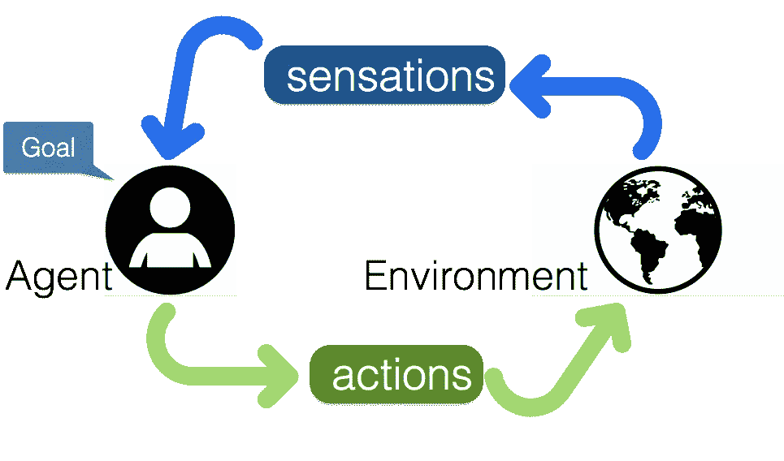
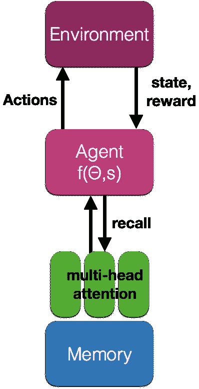

# 在现实世界中学习和表演

> 原文：<https://towardsdatascience.com/learning-and-performing-in-the-real-world-7e53eb46d9c3?source=collection_archive---------3----------------------->

## 又名强化学习

为了与复杂的环境互动，生物实体需要产生一个“正确”的*动作序列*，以实现延迟的未来*回报*。这些生命实体，或者说*角色*，能够感知环境，并对环境和代理先前历史的一系列状态做出反应。见图:

The reinforcement learning loop: an agent performs actions in an environment, and gets rewards. Learning has to occur through sparse rewards

我们想要学习执行一些任务的场景是:

*   环境中的演员
*   演员有他/她想要实现的目标
*   循环:演员感知自身和环境
*   循环:演员动作影响自身和环境
*   延迟奖励或惩罚——我们达到目标了吗？
*   学习:如何最大化奖励和最小化惩罚

这些动作促使演员更接近多个目标，即使实现一个目标也可能需要不确定的步骤。代理需要学习模型*状态*和行动的正确顺序，通过与世界互动和执行在线学习来获得延迟的奖励。

人工智能(AI)的最新工作使用强化学习算法，利用稀疏和零星的奖励对代理的行为进行建模。该领域的最新进展允许训练智能体在复杂的人工环境中执行，甚至在相同的背景下超越人类的能力[Mnih2013，-2016]。该领域一些令人兴奋的最新成果是在执行强化学习任务的同时学习语言——见[这里](https://arxiv.org/abs/1706.07230)。

# 形式主义

为了学习在现实世界中表演，给定一系列状态 *s* 我们想要获得一系列动作 a，以最大化奖励或获胜概率。

基本需求(假设我们不知道游戏规则，只知道我们可以执行的一系列可能的操作):

*   需要能够**评估**一个状态——我们是赢了，还是输了，离奖励有多远？
*   需要能够**从状态、行动 *{s，a}* 对预测**结果——假设我们决定采取行动 *a* ，我们期望什么回报或结果？玩心理游戏
*   需要记住一系列可以延续很长时间的配对

在棋盘游戏中，如国际象棋、围棋等，整个游戏是完全可观察的，而在现实世界中，如自动驾驶机器人汽车，只有一部分环境是可见的，这两种游戏有很大的不同。

# 完全可观测的

AlphaZero 的论文展示了一种完全可观察游戏的优雅方法。

**[**alpha zero**](https://arxiv.org/abs/1712.01815)**:****

****One (AZ1):** a 函数 *f* (神经网络)基于参数*θ*输出动作概率 *a* 和动作值 *v* (对出招值的预测)。**

> ***a，v = f(θ，s)***

****二(AZ2):** 一个预测模型，可以评估不同走法和自我玩法(脑子里的玩法场景)的结果。AlphaZero 中的蒙特卡罗树搜索。这些游戏结果、移动概率 *a* 和值 *v* 然后被用于更新函数 *f* 。**

**这两种成分为学习玩这些桌上游戏提供了一种非常简单和优雅的方式，并且在相对较短的时间内在没有人类支持的情况下学习。**

# **部分可观察的**

**但是非完全可观察博弈呢？比如第一人称射击游戏(Doom)？还是学习驾驶的自动驾驶汽车？**

**只有环境的一部分是可见的，因此预测行动的结果和下一个状态是一个困难得多的问题。**

**有太多可能的选项需要搜索。搜索树太大了。我们可以使用 AZ2，但我们需要聪明和快速地评估哪些选项，因为有太多的选项，而我们只有有限的时间来决定下一步的行动！**

**可能没有其他玩家可以与之竞争。这里的代理人必须与自己竞争，或者与自己的预测竞争，从其预见事件的能力或不预见事件的能力中获得中间报酬。**

> **我们如何做到这一点？**

# **建议**

**不幸的是，尽管近年来做出了努力，RL 算法仅在小的人工场景中工作，而没有扩展到更复杂或真实生活的环境中。原因是，目前这些系统的大部分参数都是基于过于稀疏的奖励，用耗时的强化学习来训练的。在现实世界的场景中，模型变得非常大(有许多参数),几乎不可能在短时间内进行训练。**

**我们需要的是能够训练一个*模型大脑*熟悉环境，并且能够预测行动和事件组合。有了这个预先训练好的*模型大脑*，用于实现特定目标的强化学习分类器，以及一小组可训练的参数，使用稀疏奖励来训练要容易得多。我们需要一个预先训练好的神经网络，至少可以处理视觉输入。它需要在视频序列上进行训练，并且需要能够提供输入的未来表示的预测。**

**为了超越这些限制，我们正在研究一种具有以下特征的合成模型大脑:**

*   **活跃在环境中，能够感知和行动**
*   **感觉序列、动作和奖励的记忆**
*   **注意:只关注重要的数据**
*   **预测:预测演员和环境的未来状态，这样我们就可以进行在线学习——通过预测，我们可以了解我们知道或不知道什么，并在我们需要学习时有一个“惊喜”信号([见这个](https://medium.com/towards-data-science/a-new-kind-of-deep-neural-networks-749bcde19108)和[这个](https://medium.com/towards-data-science/memory-attention-sequences-37456d271992))。预测也不需要监督信号，因为它们可以针对实际的未来事件及其结果进行误差测试。**

> **关键是能够预测结果——函数 f (AZ1)需要有预测能力，换句话说，它需要有预见未来的能力。**

****

**A proposal for a neural network that can understand the world and act in it. This network uses video and can predict future representation based on a combination of the state s and its own associative memory. A multi-head attention can recall memories and combine them with state s to predict the best action to take.**

**在左边，你可以看到一个可以理解世界并在其中行动的神经网络的提案。该网络使用视频，并且可以基于状态 s 和它自己的关联存储器的组合来预测未来的表示。多头注意力可以回忆起记忆，并将它们与状态结合起来，以预测要采取的最佳行动。**

**该模型能够在多种条件下运行良好:**

*   **持续学习:我们需要这个模型能够同时学习多项任务，并且学习时不会忘记，所以旧的任务不会被忘记**
*   **一次性学习和迁移学习:我们需要这个模型能够从真实的和合成的例子中学习**
*   **虚拟重放:该模型是可预测的，即使在事件被目睹后也能预测不同的结果。它可以在脑海中播放和回放可能的动作，并选择最好的一个。关联存储器充当搜索树。**

**我们如何训练这个合成大脑？**

*   **大部分是无人监督的，或者自我监督的**
*   **这里或那里几乎没有监督，但不能保证什么时候**

> **但是设计和训练预测神经网络是人工智能领域当前的挑战。**

**我们在过去争论过一种[的新型神经网络](/a-new-kind-of-deep-neural-networks-749bcde19108)，它已经被证明在学习 RL 任务中更加有效。**

**我们还喜欢[胶囊](https://arxiv.org/abs/1710.09829)的预测能力，它不需要地面实况表示，但能够根据前一层预测下一层输出。**

****注 1:** 这是一篇[的好文章](http://A great summary of DL work and success or lack thereof https://www.alexirpan.com/2018/02/14/rl-hard.html)，讲述了为什么 RL 工作得好或者不好，以及与之相关的问题。我同意现在很多学习效率很低，也没有迁移学习的成功案例。这就是为什么我们应该推行预训练网络、课程学习和将任务分解成许多更简单的任务，每个任务都有简单的奖励的方法。如果你的搜索空间如此之大，一个解决所有问题的方法是很难的！**

# **关于作者**

**我在硬件和软件方面都有将近 20 年的神经网络经验(一个罕见的组合)。在这里看关于我:[传媒](https://medium.com/@culurciello/)、[网页](https://e-lab.github.io/html/contact-eugenio-culurciello.html)、[学者](https://scholar.google.com/citations?user=SeGmqkIAAAAJ)、 [LinkedIn](https://www.linkedin.com/in/eugenioculurciello/) 等等…**