# 向杰弗里·辛顿学习反向传播

> 原文：<https://towardsdatascience.com/learning-backpropagation-from-geoffrey-hinton-619027613f0?source=collection_archive---------6----------------------->

Image from this [website](https://gph.is/28YKpua)

机器学习掌握的所有路径都要经过反向传播。

自从开始我的[机器学习](https://medium.com/@rgotesman1/learning-machine-learning-part-0-the-setup-7ad1fc053d8f)之旅以来，我最近第一次发现自己被难住了。我一直在稳步完成吴恩达广受欢迎的 ML 课程。

线性回归。检查。逻辑回归。检查。梯度下降。检查检查检查。

然后我们到了神经网络和用来训练它们的算法:反向传播。尽管安德鲁尽了最大努力，我还是不明白这项技术是如何工作的。尽管 Andrew 向我们保证这没什么，你可以在没有更深入理解的情况下使用神经网络，而且他自己也这样做了很多年，但我决心更好地理解这个概念。

为了做到这一点，我求助于大师 Geoffrey Hinton 和他合著的 1986 年《自然》[论文](http://www.iro.umontreal.ca/~pift6266/A06/refs/backprop_old.pdf),其中首次提出了反向传播(几乎 15000 次引用！).我会鼓励每个人读报纸。它很短，只有 4 页，在详细研究之后，我对反向传播有了更好的理解，现在我将试着传授给大家。

> 本质上，反向传播只是链式法则的巧妙应用。

链式法则是任何本科课程中教授的导数的一个基本性质。它指出，如果你有 3 个函数 *f* 、 *g* 和 *h* ，其中 *f* 是 *g* 的函数，而 *g* 是 *h* 的函数，那么 *f* 关于 *h* 的导数等于 *f* 关于的导数的乘积

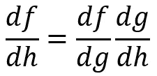

The chain rule

现在让我们用这个来弄清楚反向传播是如何工作的。

假设我们正在使用下面的简单神经网络。这个网络有三层:蓝色的输入层，绿色的隐藏层和红色的输出层。前一层中的每个单元都连接到下一层中的每个单元。每个连接都有一个权重，每当一个单元向另一个单元发送信息时，该信息就会乘以该连接的权重。一个单元从上一层获得与其连接的所有输入的总和，对该总和执行逻辑函数，并将该值向前传递。

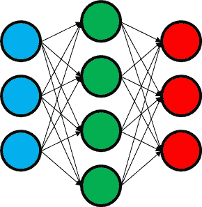

A 3–4–3 Neural Network

让我们想象我们被给予了 *m* 个训练的例子:

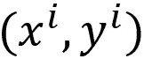

i-th input output pair

其中 *x* 和 *y* 为三维向量， *i* 为第 I 个训练样本。对于输入 *x* ，我们将我们的神经网络的预测/输出称为 *g* ，它也是一个三维向量，每个向量元素对应一个输出单元。因此，对于每个培训示例，我们都有:

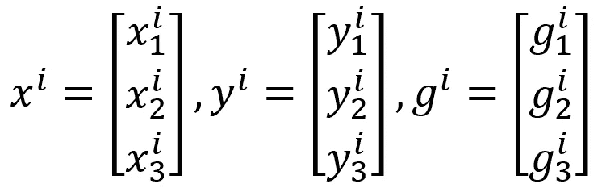

Vector form of training Input, output and neural network prediction

给定输入 *x* ，我们希望找到导致 *g* 等于(或至少非常相似)y 的权重值。

为此，我们将使用一个误差函数，我们定义为:

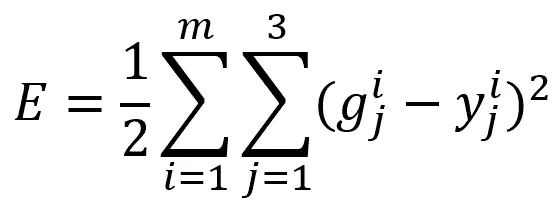

Total error for the Neural Network above

为了计算总误差，我们采用训练集中的每个案例 *i* ，并针对红色输出层中的每个单元，计算该单元的预测和真实输出之间的平方误差。如果我们对每种情况都这样做，我们将得到总误差。

由于网络预测的值 *g* 依赖于网络的权重，我们可以看到误差会随着权重的变化而变化，我们希望找到使 *E* 最小的权重。

我们可以使用梯度下降来实现。但是梯度下降要求我们找到 *E* 相对于每个权重的导数。这就是反向传播让我们实现的目标。

我们现在将考虑单一情况，而不是 3 个输出单元，假设我们有任意数量的输出单元 *n* 。对于这种情况，我们的错误现在变成了:

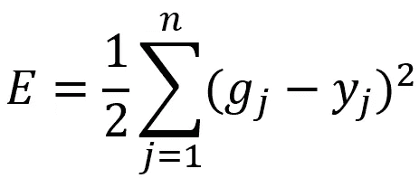

Error for a single case

为了方便起见，我们去掉了下标，因为它是常数。

我们现在可以问自己，当一个输出单位的预测变化时，这个误差是如何变化的。这是简单的导数:

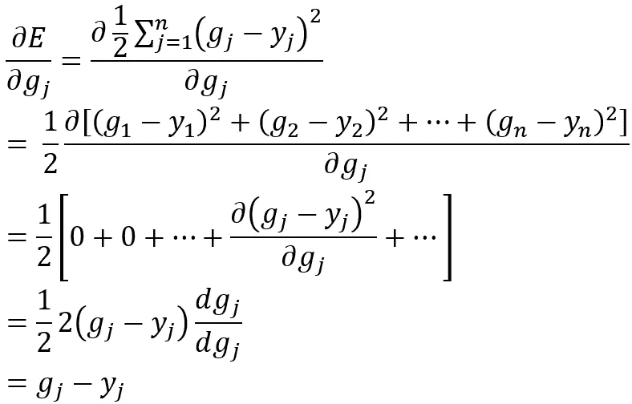

The derivative of the total error with respect to each output unit (Note that we used the chain rule to the derivative of the squared term.)

有趣的是，似乎随着一个输出单位的预测值的变化，误差将以等于预测值和真实值之间的“误差”或差异的速率变化。酷！

现在，我们可能会问自己，当这些输出单元的总输入发生变化时，误差会如何变化。同样，这只是一个导数。让我们用 *z* 来表示一个输出单元的总输入。那么我们有兴趣发现:

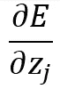

Derivative of E with respect to the total input for output unit j

但是由于 *g* 是 *z* 的函数，通过应用链式法则，我们可以将其重写为:

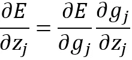

Applying the chain rule!!

还记得我们说过，每个单元在传递输入之前，都将逻辑函数应用于它的输入。这意味着 *g* 是一个逻辑函数， *z* 是它的输入，所以我们可以写:

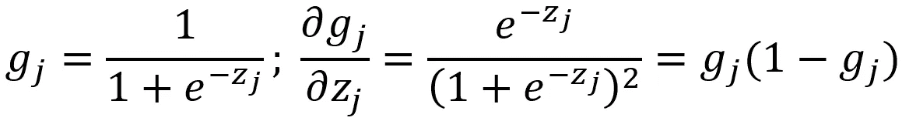

Logistic function and it’s derivative

所以现在我们可以说:

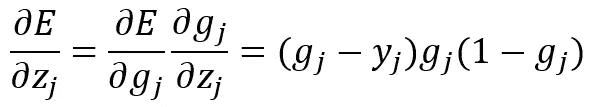

The derivative of the total error with respect to the total input to an output unit

我们已经计算出，当一个输出单元的总输入发生变化时，误差是如何变化的。太神奇了！

我们现在可以找到误差对某些重量的导数。这就是我们梯度下降所需要的。

让我们将绿色单元的预测/输出称为*g’*，并且我们将绿色层中的单元 *k* 和红色/输出层中的单元 *j* 之间的连接的权重称为:

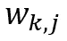

Weight of connection between unit k in green and unit j in red layers

考虑下面黄色输出单元的总输入 *z* 。我们可以通过计算每个绿色单元的输出，乘以连接绿色单元和黄色单元的红色箭头的重量，然后将它们相加来计算输入。

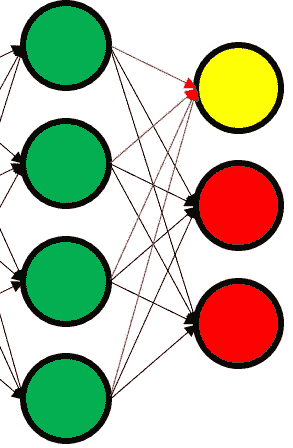

The red arrows represent the connections that are added up to get the total input of the yellow unit

而不是 4，如果我们有任意数量的绿色单元 *n* (这个 *n* 与我们之前定义的不同)我们就可以说:

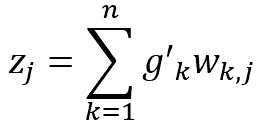

Total input to output j

因此，我们似乎可以将 *z* 写成连接到它的重量的函数和连接到它的单元的输出的函数。

链式法则的时间到了。

我们自问，当连接到输出单元的砝码发生变化时，误差会如何变化。这可以写成:

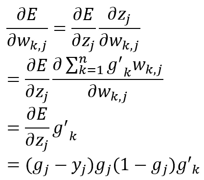

The derivative of the total error with respect to weights connecting to an output unit

我们刚刚算出了误差相对于连接到输出层的权重的导数。这正是我们需要让梯度下降工作。

但是我们还没完。我们仍然需要计算出误差相对于连接第一层和第二层的权重的导数。

谢天谢地，链式法则也还没有完成。

我们计算当第 k 个绿色单元的输出变化时，误差如何变化:

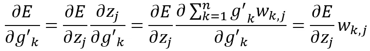

The derivative of error with respect to the output of unit k in the green layer

由于有来自单位 *k* 的 *j* 重量，我们认为:

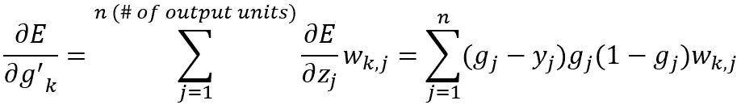

The derivative of total error with respect to the output of unit k in the green layer

如果你仔细想想，我们又回到了起点。我们得到了误差对某个单位输出的导数。我们现在可以完全忽略红色输出层，将绿色层视为网络的最后一层，并重复上述所有步骤来计算 *E* 相对于传入权重的导数。

Image from this [website](https://unsplash.com/photos/PuZeaoMB2A8)

你会注意到我们计算的一阶导数等于预测值和真实输出值之间的“误差”。同样，最后一个导数也有这个误差项，乘以一些其他的项。该算法被称为反向传播，因为这种误差的一种形式从最后一层反向传播到第一层，并用于计算 *E* 相对于网络中每个权重的导数。

一旦计算出这些导数，我们就可以在梯度下降中使用它们来最小化 *E* 并训练我们的神经网络。

希望这篇文章能让你更好地理解反向传播是如何工作的。如果你有任何问题，请告诉我，我会尽力回答你。谢谢！