# 学习计算机视觉

> 原文：<https://towardsdatascience.com/learning-computer-vision-41398ad9941f?source=collection_archive---------5----------------------->

最近我读了很多关于计算机视觉的书并做了很多实验，这里介绍了在这个领域中学习和使用什么是有趣的。

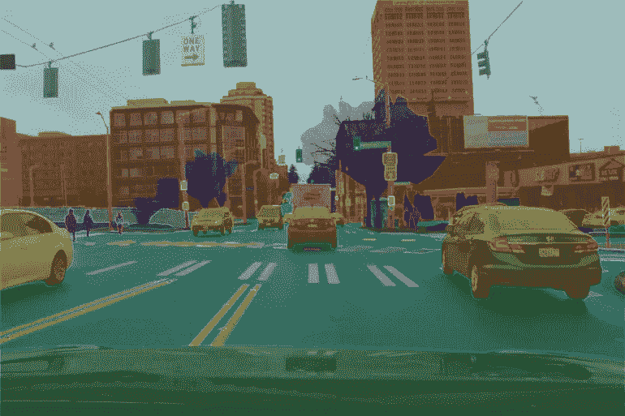

Image segmentation for autonomous driving

近年来，计算机视觉取得了很大进步。这些是我将在此提及的主题:

技术:

*   人脸检测:Haar，HOG，MTCNN，Mobilenet
*   人脸识别:CNN，Facenet
*   物体识别:alexnet，inceptionnet，resnet
*   迁移学习:在一个新的主题上用很少的资源重新训练大的神经网络
*   图像分割:rcnn
*   开始
*   计算机视觉硬件:选什么，GPU 重要
*   集成视觉的 UI 应用程序:ownphotos

应用:

*   个人照片组织
*   自动驾驶汽车
*   自主无人机
*   求解验证码/ OCR
*   为基于图片的网站/应用程序过滤图片
*   为应用程序自动标记图片
*   从视频(电视节目、电影)中提取信息
*   视觉问答
*   艺术

关注的人:

*   重要的深度学习创始人:andrew ng、yann lecun、bengio yoshua、hinton joffrey
*   亚当·盖特基[https://medium.com/@ageitgey](https://medium.com/@ageitgey)有很多关于视觉的有趣文章，比如[https://medium . com/@ ageitgey/machine-learning-is-fun-part-4-modern-face-recognition-with-deep-learning-C3 cffc 121d 78](https://medium.com/@ageitgey/machine-learning-is-fun-part-4-modern-face-recognition-with-deep-learning-c3cffc121d78)有完整的人脸检测/对齐/识别管道

课程:

*   深度学习@ coursera
*   机器学习@ coursera

相关字段:

*   深度强化学习:参见以 cnn 为输入层的 ppo 和 dqn
*   与 nlp 的互动:lstm 2 cnn

# 人脸检测

Face detection is about placing boxes around faces

人脸检测就是检测人脸的任务。有几种算法可以做到这一点。

【https://github.com/nodefluxio/face-detector-benchmark】提供了这些方法的速度基准，并带有易于重用的实现代码。

## 哈尔分类器

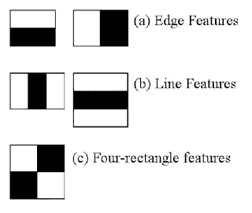

haar features

它们是自 2000 年以来出现在 opencv 中的旧的计算机视觉方法。本文介绍了[http://wearables . cc . gatech . edu/paper _ of _ week/viola 01 rapid . pdf](http://wearables.cc.gatech.edu/paper_of_week/viola01rapid.pdf)。

它是一个机器学习模型，具有专门为对象检测选择的特征。Haar 分类器速度快，但准确率低。

在[https://docs . opencv . org/3 . 4 . 3/D7/d8b/tutorial _ py _ face _ detection . html](https://docs.opencv.org/3.4.3/d7/d8b/tutorial_py_face_detection.html)中查看更长的解释和如何使用它的示例

## HOG:方向梯度直方图

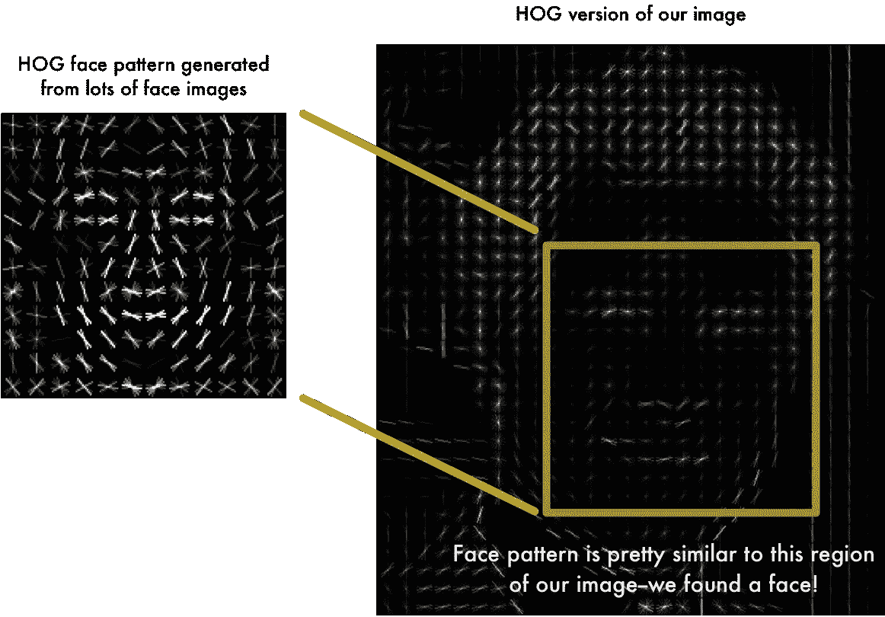

Histogram of oriented gradients

HOG 是一种较新的生成目标检测特征的方法:从 2005 年开始使用。它是基于计算图像像素的梯度。这些特征然后被馈送到机器学习算法，例如 SVM。它比 haar 分类器有更好的精度。

它的一个实现在 dlib 中。它在人脸识别([https://github.com/ageitgey/face_recognition](https://github.com/ageitgey/face_recognition))库中。

## MTCNN

一种利用细胞神经网络变异检测图像的新方法。精度更高，但速度稍慢。参见[https://KP Zhang 93 . github . io/mt CNN _ face _ detection _ alignment/index . html](https://kpzhang93.github.io/MTCNN_face_detection_alignment/index.html)

## MobileNet

目前最好最快的人脸检测方法。基于通用移动网络架构。参见 https://arxiv.org/abs/1704.04861 的

# 目标检测

Object detection on many kind of objects

可以使用类似于面部检测的方法来实现对象检测。

这里有两篇文章介绍了实现这一目标的最新方法。这些方法有时甚至还提供对象的类别(实现对象识别) :

*   [https://towards data science . com/review-r-fcn-positive-sensitive-score-maps-object-detection-91cd 2389345 c](/review-r-fcn-positive-sensitive-score-maps-object-detection-91cd2389345c)r-fcn
*   [https://towards data science . com/r-CNN-fast-r-CNN-faster-r-CNN-yolo-object-detection-algorithms-36d 53571365 e](/r-cnn-fast-r-cnn-faster-r-cnn-yolo-object-detection-algorithms-36d53571365e)r-CNN、fast r-cnn、faster r-cnn 和 yolo 的对比

# 卷积神经网络

深度学习的最新进展已经看到新的架构取得了很大的成功。

使用许多卷积层的神经网络就是其中之一。卷积层利用图像的 2D 结构在神经网络的下一层中生成有用的信息。关于什么是卷积的详细解释，请参见[https://towards data science . com/intuitive-understanding-convolutions-for-deep-learning-1 F6 f 42 faee 1](/intuitively-understanding-convolutions-for-deep-learning-1f6f42faee1)。

A convolution layer

# 物体识别

物体识别是将物体分类的一般问题(如猫、狗等)

基于卷积深度神经网络已经被用于在这个任务上获得很好的结果。

ILSVR 大会已经在 ImageNet([http://www.image-net.org/](http://www.image-net.org/)上举办了比赛，ImageNet 是一个数据库，里面有许多带有诸如猫、狗、..)

越成功的神经网络已经使用越来越多的层。

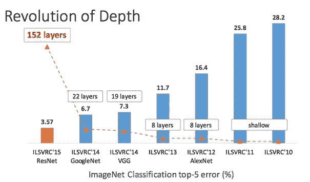

ResNet 架构是迄今为止最好的对象分类架构。

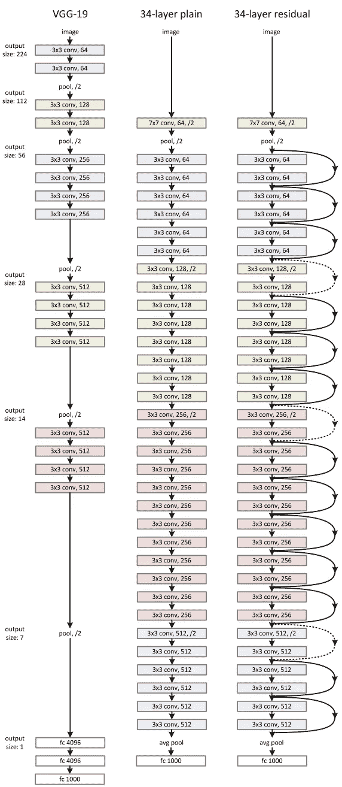

Resnet architecture

要对它进行适当的训练，需要使用数百万张图像，即使使用几十块昂贵的 GPU 也要花费大量时间。

这就是为什么在如此大的数据集上不需要每次都重新训练的方法非常有用的原因。迁移学习和嵌入就是这样的方法。

resnet 的预训练模型在[https://github . com/tensor flow/tensor 2 tensor # image-class ification](https://github.com/tensorflow/tensor2tensor#image-classification)中提供

# 人脸识别

人脸识别就是要弄清楚谁是 T2，谁是 T3。

## 历史方法

解决该任务的传统方法是应用标准机器学习(例如 svm)的特征工程，或者应用深度学习方法进行对象识别。

这些方法的问题是它们需要每个人的大量数据。实际上，这些数据并不总是可用的。

## Facenet

谷歌研究人员于 2015 年在 https://arxiv.org/abs/1503.03832[推出了 Facenet。提出了一种不需要为每个人准备大量人脸样本的人脸识别方法。](https://arxiv.org/abs/1503.03832)

它的工作方式是通过拍摄大量人脸的照片数据集(比如 http://vis-www.cs.umass.edu/lfw/的照片)。

然后采用现有的计算机视觉架构，如 inception(或 resnet ),然后用计算人脸嵌入的层来替换对象识别 NN 的最后一层。

对于数据集中的每个人，(阴性样本、阳性样本、第二个阳性样本)选择(使用试探法)三个一组的面部，并馈送给神经网络。这产生了 3 个嵌入。在这 3 个嵌入中，计算三元组损失，这最小化正样本和任何其它正样本之间的距离，并且最大化位置样本和任何其它负样本之间的距离。

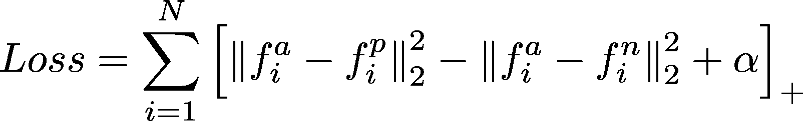

Triplet loss

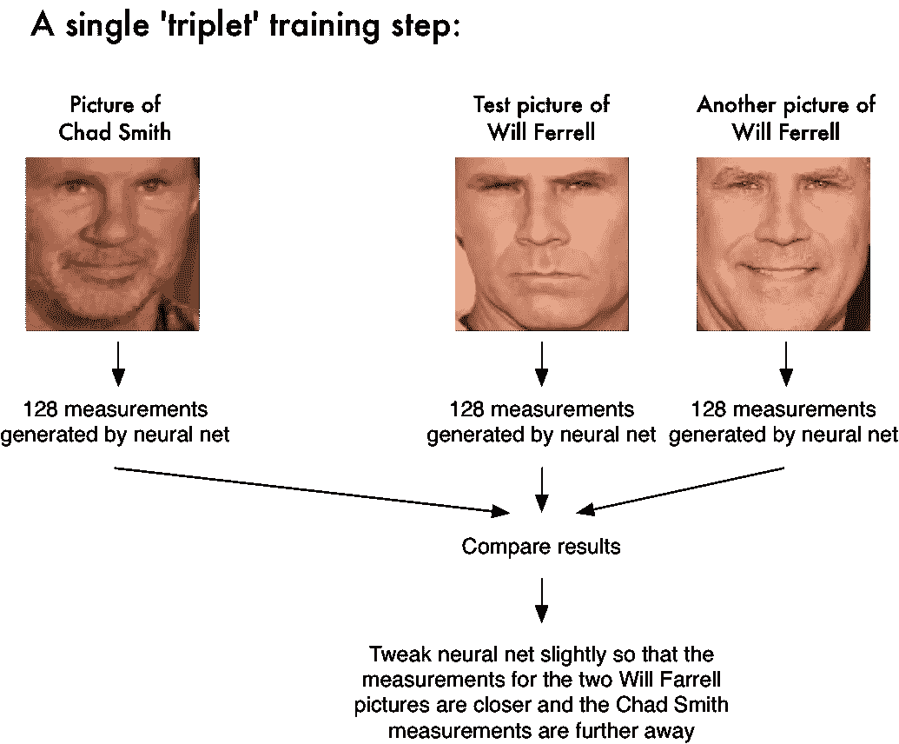

最终结果是，每个人脸(甚至是不存在于原始训练集中的人脸)现在都可以被表示为一个嵌入(128 个数的向量),它与其他人的人脸的嵌入有很大的距离。

然后，这些嵌入可以用于任何机器学习模型(即使是像 knn 这样简单的模型)来识别人。

关于 facenet 和 face embeddings 非常有趣的一点是，使用它，你可以只通过一些人的照片，甚至是一张照片来识别他们。

查看实现它的库:[https://github.com/ageitgey/face_recognition](https://github.com/ageitgey/face_recognition)

这是它的张量流实现:[https://github.com/davidsandberg/facenet](https://github.com/davidsandberg/facenet)

这是人脸识别管道背后的想法的一个很酷的应用，而不是识别熊的脸:[https://hypractive . github . io/2017/01/21/face net-for-bears . html](https://hypraptive.github.io/2017/01/21/facenet-for-bears.html)

# 迁移学习

Retrain quickly an accurate neural network on a custom dataset

训练像 resnet 这样的非常深度的神经网络是非常耗费资源的，需要大量的数据。

计算机视觉是高度计算密集型的(在多个 gpu 上进行数周的训练)，需要大量数据。为了解决这个问题，我们已经讨论过计算人脸的一般嵌入。另一种方法是利用现有网络，在另一个数据集上只重新训练它的几个 it 层。

下面是它的教程: [codelab 教程](https://codelabs.developers.google.com/codelabs/tensorflow-for-poets/#0)。它建议你重新训练一个初始模型来训练未知的花类。

[https://medium . com/@ 14 Prakash/transfer-learning-using-keras-d 804 b 2e 04 ef 8](https://medium.com/@14prakash/transfer-learning-using-keras-d804b2e04ef8)提出了在进行迁移学习时，应该重新训练哪一层的良好指南。

# 图象分割法

Image segmentation for autonomous driving

图像分割是一个令人印象深刻的新任务，近年来已经成为可能。它包括识别图像的每个像素。

该任务与目标检测相关。实现它的一种算法是 mask r-cnn，更多详情参见本文[https://medium . com/@ Jonathan _ hui/image-segmentation-with-mask-r-CNN-ebe6d 793272](https://medium.com/@jonathan_hui/image-segmentation-with-mask-r-cnn-ebe6d793272)

# 开始

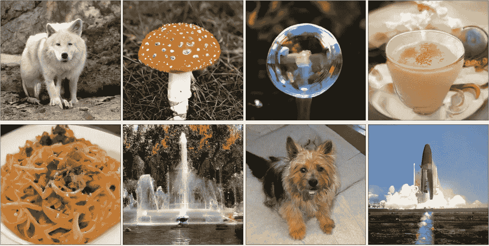

[Large scale GAN](https://arxiv.org/abs/1809.11096)

由 ian goodfellow 介绍的生成式广告网络[是一个由两部分组成的神经网络体系结构:一个鉴别器和一个生成器。](https://arxiv.org/abs/1406.2661)

*   鉴别器检测一张图片是否是一个类，它通常已经在一个对象分类数据集上进行过预训练。
*   生成器为给定的类生成图像

生成器的权重在学习期间被调整，以便产生鉴别器不能从该类的真实图像中区分的图像。

这是迄今为止最大的氮化镓制作的图像的例子[https://arxiv.org/abs/1809.11096](https://arxiv.org/abs/1809.11096)

参见[https://github.com/eriklindernoren/Keras-GAN](https://github.com/eriklindernoren/Keras-GAN)的 keras 中 GAN 的实现

# 计算机视觉硬件

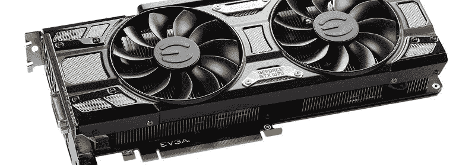

训练大模型，需要大量的资源。有两种方法可以实现这一点。首先是使用云服务，比如 google cloud 或者 aws。第二种方式是自己搭建一台带 GPU 的电脑。

只要 1000 美元，就有可能建造一台像样的机器来训练深度学习模型。

在[https://hypractive . github . io/2017/02/13/dl-computer-build . html](https://hypraptive.github.io/2017/02/13/dl-computer-build.html)中阅读更多详细信息

# UI 中的视觉

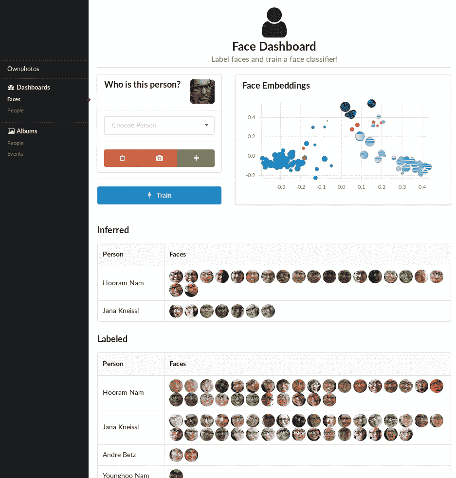

Face dashboard of ownphotos

[Ownphotos](https://github.com/hooram/ownphotos) 是一个令人惊叹的用户界面，允许你导入照片，自动计算人脸嵌入，进行物体识别和人脸识别。

它使用:

*   人脸识别:[人脸识别](https://github.com/ageitgey/face_recognition)
*   物体检测: [densecap](https://github.com/jcjohnson/densecap) ， [places365](http://places.csail.mit.edu/)

# 应用程序

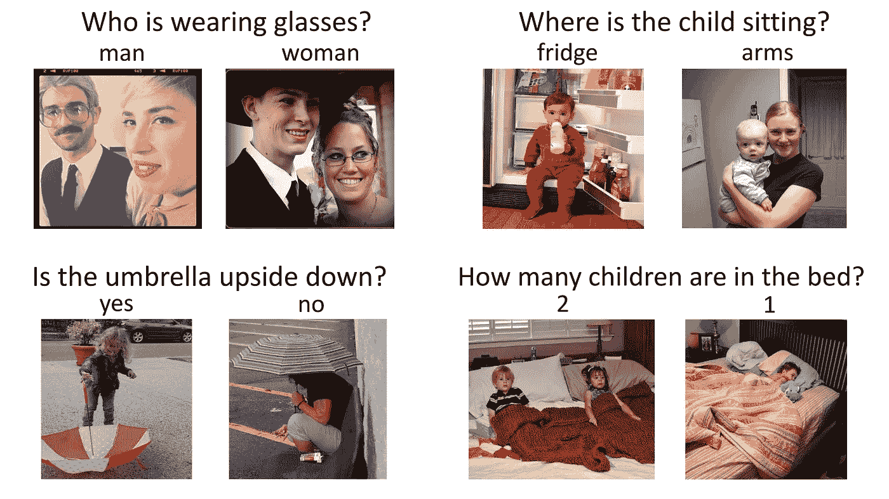

[Visual question answering](http://www.visualqa.org/)

计算机视觉有许多应用:

*   个人照片组织
*   自动驾驶汽车
*   自主无人机
*   求解验证码/ OCR
*   为基于图片的网站/应用程序过滤图片
*   为应用程序自动标记图片
*   从视频(电视节目、电影)中提取信息
*   视觉问答:结合自然语言处理和计算机视觉
*   艺术:甘

# 结论

正如我们在这里看到的，有许多新的有趣的方法和应用的成功。

我认为人工智能中最有趣的是学习可以重复使用的算法，能够将这些方法应用到越来越多的任务中，而不需要太多的处理能力和数据:

*   迁移学习:它使得重新利用预先训练好的大型神经网络成为可能
*   嵌入(例如 facenet):无需对这些类进行训练就可以识别许多类