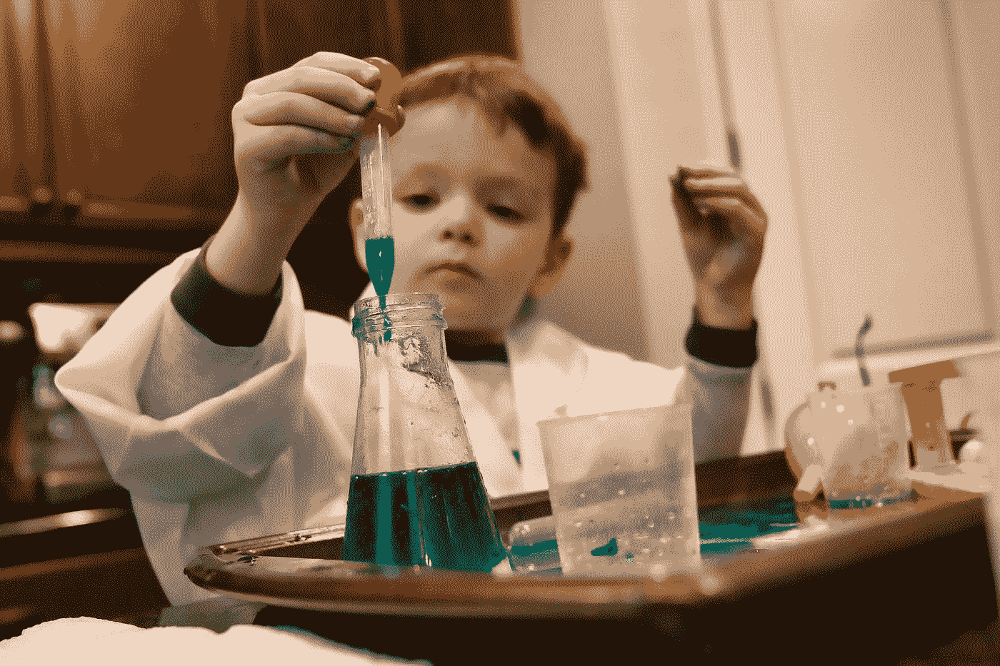
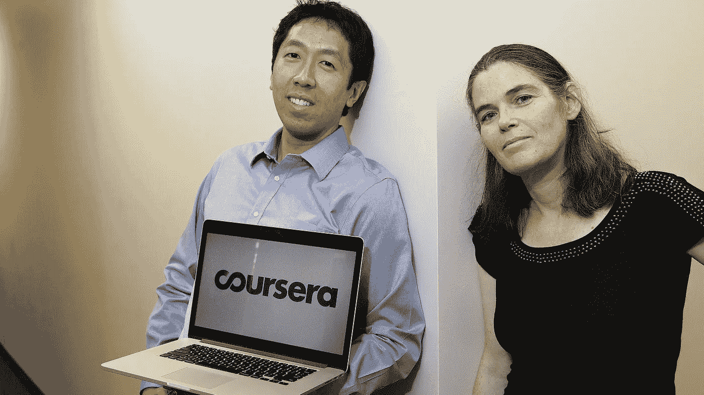
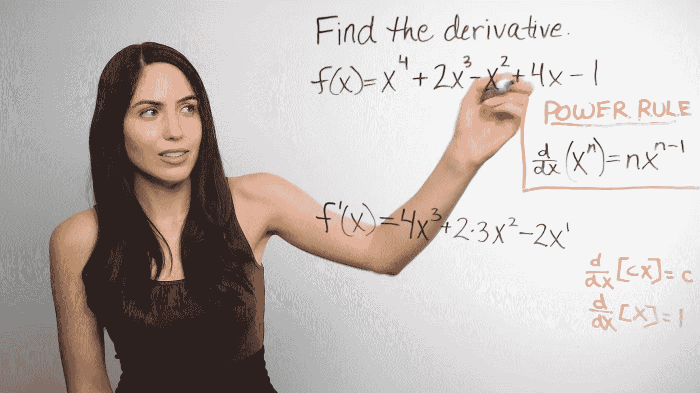
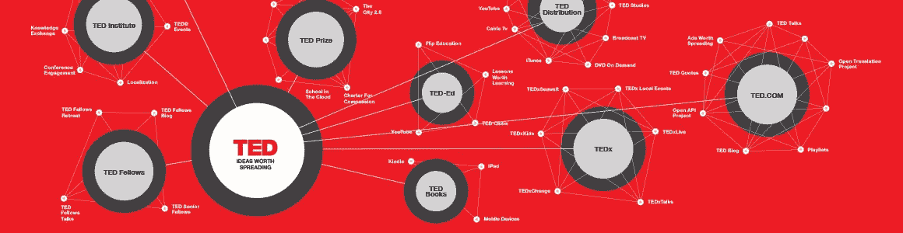

# 学习数据科学—第 1 部分:MOOC、Youtube、Ted

> 原文：<https://towardsdatascience.com/learning-data-science-part-1-mooc-youtube-ted-20617dbb7f4b?source=collection_archive---------5----------------------->

Photo by [Clint Patterson](https://unsplash.com/@cbpsc1?utm_source=medium&utm_medium=referral) on [Unsplash](https://unsplash.com?utm_source=medium&utm_medium=referral)

我最近开始学习数据科学，大约两个月前。我没有统计学、数学、数据科学、工程学、经济学或任何类似的学位。说实话，学生时代数学和统计学不是我的强项。我更擅长语言。说有些人语言能力强于数学能力可能是一个神话，反之亦然，但这就是我的感受。

我在文学院学的是管理，在文学院学的是策展。我写了我的论文，但它更侧重于文献综述，而不是应用定量研究方法。我在时尚界做过跟单员和采购员。所以在我的整个教育和经历中，我对数学和统计并不是那么了解。

那我为什么还要学习数据科学呢？我对“从数据中获得洞察力”的概念很感兴趣。如此感兴趣，以至于我甚至决定克服我对数学和统计的长期恐惧。考虑到[我们仅用两天](https://techcrunch.com/2010/08/04/schmidt-data/)(到目前为止甚至可能需要 10 分钟)就创建了与 2003 年相同数量的数据，而[只有 1%的数据被分析](https://www.theguardian.com/news/datablog/2012/dec/19/big-data-study-digital-universe-global-volume)，这个领域充满了各种可能性。“我需要成为它的一部分”，这就是我当时的想法，并且仍然相信它。

# MOOC (Coursera 课程)

Coursera founders Andrew Ng and Daphne Koller

微积分一(我在数学课上没怎么注意，我确实需要复习。)
[基础统计学](https://www.coursera.org/learn/basic-statistics)(我听说过一两次，但不能说我什么都知道)
[机器学习](https://www.coursera.org/learn/machine-learning)(这是吴恩达的著名课程，但在第 6 周左右，我意识到我真的需要更多关于编程、数学、统计的基础知识，所以我把它搁置了)
[Python 适合所有人](https://www.coursera.org/specializations/python)(这是一个强烈推荐的专业(5 门课程)，如果你和我一样，来自非技术背景

# Youtube 频道

有不同的类别，你可能会发现有用的。

第一种是“教程”型。
**机器学习**

*   Siraj Raval (众说纷纭，但我仍然认为这是一道不错的开胃菜)
*   [Harrison Kinsley](https://www.youtube.com/user/sentdex) (也可能是褒贬不一)
    总的来说，它们对于起步来说是不错的，但我觉得这类 Youtube 教程可能在他们如何解决问题、如何处理问题上有点偏见。
*   [韦尔奇实验室](https://www.youtube.com/user/Taylorns34)(他们有很好的教程关于“[学习看](https://www.youtube.com/watch?v=i8D90DkCLhI&list=PLiaHhY2iBX9ihLasvE8BKnS2Xg8AhY6iV)”、“[神经网络揭秘](https://www.youtube.com/watch?v=bxe2T-V8XRs&list=PLiaHhY2iBX9hdHaRr6b7XevZtgZRa1PoU)”。教程是针对初学者的，所以我发现这些视频对掌握概念的基本原理非常有帮助。即使他们没有很多可用的视频，也绝对值得一去)

**统计**

*   [布兰登·福尔茨的统计 101](https://www.youtube.com/channel/UCFrjdcImgcQVyFbK04MBEhA)
*   [可汗学院统计播放列表](https://www.youtube.com/watch?v=uhxtUt_-GyM&list=PL1328115D3D8A2566)

**数学**

*   [mathbff](https://www.youtube.com/channel/UCy5ev9EE-u5Iwbt2NHrcayw) (当你遇到不熟悉的数学术语，或者记不住的数学规则时，这是一个很好的来源。三角测量法、导数、链式法则等..)

I find her videos strangely therapeutic

**巨蟒**巨蟒
巨蟒[查克为大家遣散巨蟒](https://www.youtube.com/user/csev)

第二种是“会议”型。对于初学者来说，有些材料可能不容易消化，但看看即将出现的东西、最近的发展以及数据科学中的主题也无妨。

*   [PyData](https://www.youtube.com/user/PyDataTV)
*   [开放数据科学](https://www.youtube.com/channel/UCDS20hpBFiv_Kdp5Ibh0vew)
*   [数据科学节](https://www.youtube.com/channel/UCB02fDSj9GR4rhb1APMNclw/feed)
*   [Scipy:使用 Python 进行科学计算](https://www.youtube.com/user/EnthoughtMedia/playlists)
*   奥莱利
*   [转到](https://www.youtube.com/user/GotoConferences)
*   [谷歌开发者](https://www.youtube.com/channel/UC_x5XG1OV2P6uZZ5FSM9Ttw)
*   [KDD 2016](https://www.youtube.com/channel/UCPsUUDUlcTJuP-fRa7z85aQ) ， [KDD 2017](https://www.youtube.com/channel/UC_sfvZvvPUbOQhDs_cqlx_A) (个人感兴趣的领域:时尚遇上机器学习)

第三个是数据科学学校/训练营自己的 Youtube 频道

*   [总装配](https://www.youtube.com/user/gnrlassembly)
*   [数据科学道场](https://www.youtube.com/user/DataScienceDojo)

最后是 Ted 演讲。我太喜欢 Ted 演讲了。所以我把它和普通的会议类型分开。
各种主题的伟大演讲者，我总能发现新的东西，认识到我不知道的东西，受到鼓舞，受到激励，这让我想成为一个更好的人。它可能不会教你如何构建一个算法，但它可以告诉你为什么和为了什么。
顺便说一下，Ted Talks 有两个不同的名字。“TED Talks”和“Tedx Talks”。我谷歌了一下才知道区别。

Ted’s programs and initiatives

> [TED 和 TEDx 活动的不同之处在于，前者更多地采用全球化的方式，而后者通常专注于关注本地声音的本地社区。“官方上，TEDx 中的‘x’代表独立组织的 TED 活动——但它更多的是一个 TED 倍增。是这股力量带着 TED 穿越了这个星球，播种了所有这些社区。](https://www.forbes.com/sites/markfidelman/2012/06/19/heres-why-ted-and-tedx-are-so-incredibly-appealing-infographic/#74a8af413b0e)

如果你在 Youtube 上搜索“ted”，你会得到的第一个条目是“TED Talks”Youtube 页面。 [https://www.youtube.com/user/TEDtalksDirector](https://www.youtube.com/user/TEDtalksDirector)
拥有 790 万订阅用户，2488 个视频(01/10/2017)
在搜索结果的第 17 个条目上，有“TEDx Talks”页面。
[https://www.youtube.com/user/TEDxTalks](https://www.youtube.com/user/TEDxTalks)
拥有 890 万用户和 99031 个视频(2017 年 1 月 10 日)

无论如何，下面是一些我非常喜欢的演讲。

*   [我们都是数据科学家| Rebecca Nugent | TEDxCMU](https://youtu.be/YMnqPTLoj7o)
*   [数据科学家最重要的技能|何塞·米格尔·坎萨多| tedxiemardri](https://youtu.be/qrhRfPY4F4w)
*   [给我看数据——成为自己的专家| Talithia Williams | TEDxClaremontColleges](https://youtu.be/TDCYJ3_gx2w)(不是专门关于数据科学的，但它教会了如何像统计学家一样思考。随着时间的推移收集你的身体数据的概念听起来像是一个有趣的挑战)
*   [通过讲故事让数据更有意义| Ben Wellington | TEDxBroadway](https://youtu.be/6xsvGYIxJok) (数据讲故事者，如何用数据构建有意义的故事)
*   [数据的重量| Jer Thorp | TEDxVancouver](https://youtu.be/Q9wcvFkWpsM) (这是一位数据艺术家非常有趣的演讲，如何在人类的背景下看待数据)——他也有一个中等账户 [blprnt](https://medium.com/u/d744cc1261ac?source=post_page-----20617dbb7f4b--------------------------------)

我计划更新这个列表，因为我找到了更多有用的资源。我希望它能对任何一个和我处境相似的人有所帮助。对于第 2 部分，我将列出播客和博客作为学习数据科学的来源。